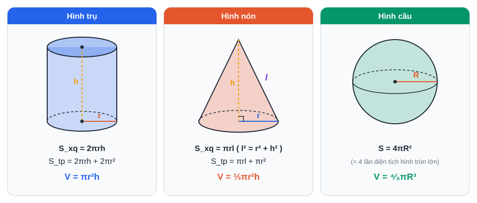
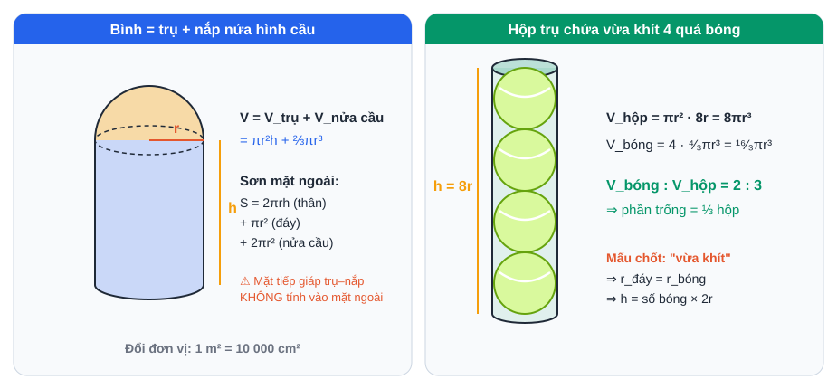
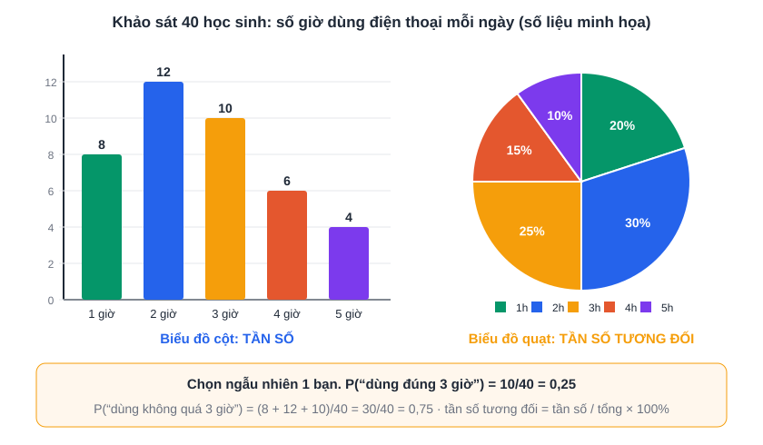
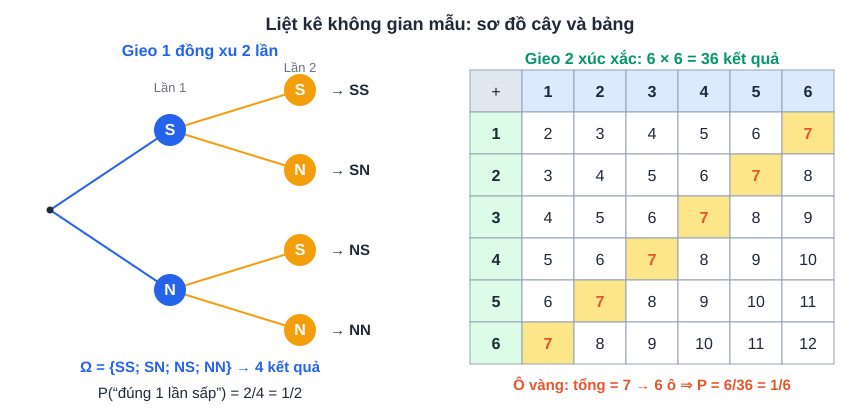

# Tuần 20 (15/02 – 21/02/2027): Multiple-choice cloze · Giới từ đi kèm · Hình khối, xác suất

> ⬅️ [Tuần 19](Tuan-19-Ke-Hoach-Hoc-Tap.md) · [Danh mục](Danh-Muc-Ke-Hoach-Tuan.md) · ➡️ [Tuần 21](Tuan-21-Ke-Hoach-Hoc-Tap.md)
> Mỗi tối thứ 2 – thứ 6, **18:30 – 19:15**: làm bài tập trên lớp. Cách dùng và mẫu sổ: xem [Tuần 1](Tuan-01-Ke-Hoach-Hoc-Tap.md).

## Mục tiêu

1. **Multiple-choice cloze** (chọn đáp án điền vào đoạn văn).
2. **Giới từ đi kèm** tính từ, động từ, danh từ: thuộc ~60 cụm.
3. **Từ vựng *Arts & Music***: 75 từ/cụm.
4. **Toán:** hình trụ, hình nón, hình cầu; thống kê và xác suất.
5. **Văn:** hoàn thiện **kho dẫn chứng** ≥ 30 dẫn chứng.

## Lịch học

| Ngày | Giờ | Môn | Việc cụ thể | Xong |
|---|---|---|---|---|
| **T2 15/02** | 19:30 – 20:30 | Toán | **Hình trụ, hình nón, hình cầu** (phần D): 10 bài, có bài thực tế | [ ] |
| | 20:45 – 21:15 | Anh | 15 từ *Arts & Music* + Anki | [ ] |
| | 21:15 – 21:30 | Anh chuyên | 5 câu transformation | [ ] |
| **T3 16/02** | 19:30 – 20:30 | Anh chuyên | **Giới từ đi kèm – tính từ** (phần C, cột 1): học + 30 câu | [ ] |
| | 20:45 – 21:15 | Văn | Kho dẫn chứng: thêm 10 dẫn chứng | [ ] |
| | 21:15 – 21:30 | Anh | Anki + 15 từ | [ ] |
| **T4 17/02** | 19:30 – 20:30 | Anh chuyên | **Multiple-choice cloze** (phần B): 4 đoạn | [ ] |
| | 20:45 – 21:15 | Anh | Đọc 1 bài (~400 từ) về nghệ thuật | [ ] |
| | 21:15 – 21:30 | Anh | Anki + 15 từ | [ ] |
| **T5 18/02** | 19:30 – 20:30 | Toán | **Thống kê và xác suất** (phần E): 12 bài | [ ] |
| | 20:45 – 21:05 | Anh | Nghe 1 tập | [ ] |
| | 21:05 – 21:30 | Anh | Anki + 15 từ | [ ] |
| **T6 19/02** | 19:30 – 20:00 | Anh chuyên | **Giới từ đi kèm – động từ, danh từ** (phần C, cột 2–3): 30 câu | [ ] |
| | 20:00 – 20:30 | Văn | Kho dẫn chứng: thêm 10 dẫn chứng (đạt ≥ 30) | [ ] |
| | 20:45 – 21:15 | Tổng kết | Sổ lỗi sai | [ ] |
| **T7 20/02** | 08:00 – 10:30 | Anh chuyên | **1 đề Anh chuyên đầy đủ**, bấm giờ | [ ] |
| | 10:45 – 11:45 | Chữa | Chấm, chữa | [ ] |
| | 14:30 – 15:15 | Anh chuyên | Bài luận ~220 từ: *"Should art and music be compulsory subjects at school?"* | [ ] |
| **CN 21/02** | 08:30 – 10:30 | Toán | 1 **đề Toán TS10 TP.HCM**, bấm giờ + chữa | [ ] |
| | 16:00 – 16:15 | Anki | Ôn thẻ | [ ] |
| | 20:00 – 20:30 | Tổng kết | Tự đánh giá tuần | [ ] |

## Tài liệu

### A. Từ vựng *Arts & Music* (30 từ khởi đầu)

| Từ/cụm | Nghĩa | Từ/cụm | Nghĩa |
|---|---|---|---|
| artist | nghệ sĩ (artistic, artwork) | masterpiece | kiệt tác |
| exhibition | triển lãm (exhibit) | gallery | phòng tranh |
| sculpture | điêu khắc (sculptor) | portrait | chân dung |
| landscape | phong cảnh | abstract | trừu tượng |
| perform | biểu diễn (performance, performer) | audience | khán giả |
| composer | nhà soạn nhạc (compose, composition) | lyrics | lời bài hát |
| melody | giai điệu | rhythm | nhịp điệu |
| musical instrument | nhạc cụ | orchestra | dàn nhạc |
| talent | tài năng (talented) | creativity | sự sáng tạo |
| imagination | trí tưởng tượng (imaginative) | inspire | truyền cảm hứng (inspiration) |
| express | bày tỏ (expression, expressive) | appreciate | trân trọng (appreciation) |
| classical / contemporary | cổ điển / đương đại | traditional art | nghệ thuật truyền thống |
| folk music | nhạc dân gian | release | phát hành |
| critic | nhà phê bình (criticize, criticism) | review | bài đánh giá |
| on display | được trưng bày | be moved **by** | xúc động bởi |

### B. Multiple-choice cloze: cách làm

Bốn đáp án thường "na ná" nhau. Mỗi chỗ trống thường kiểm tra **một** trong các điều sau:

| Kiểm tra gì | Ví dụ |
|---|---|
| **Collocation** | ___ attention: **pay** / give / make / take |
| **Giới từ đi sau** | She is interested ___: **in** / on / at / of |
| **Nghĩa gần giống** | The ___ of living: **cost** / price / value / fee |
| **Liên từ / từ nối** | ___ it rained, they went out: **Although** / Despite / However / Because |
| **Phrasal verb** | They had to ___ the meeting: **call off** / call on / call up / call in |
| **Cấu trúc ngữ pháp** | He avoided ___: **answering** / to answer / answer / answered |

**Cách làm:** đọc **cả câu chứa chỗ trống và câu sau**; loại đáp án sai ngữ pháp trước, sau đó so nghĩa và collocation.

### C. Giới từ đi kèm

| Tính từ + giới từ | Động từ + giới từ | Danh từ + giới từ |
|---|---|---|
| good / bad **at** | apologize **for** | reason **for** |
| interested **in** | approve **of** | demand **for** |
| keen **on** | belong **to** | solution **to** |
| fond **of** | consist **of** | key **to** |
| proud **of** | depend / rely **on** | access **to** |
| afraid / scared **of** | concentrate **on** | increase / decrease **in** |
| aware **of** | insist **on** | effect / impact / influence **on** |
| capable **of** | succeed **in** | attitude **to / towards** |
| famous **for** | participate **in** | advantage **of** |
| responsible **for** | believe **in** | cause **of** |
| similar **to** | complain **about** | damage **to** |
| different **from** | recover **from** | difficulty **in / with** |
| familiar **with** | suffer **from** | experience **of / in** |
| satisfied **with** | prevent sb **from** | lack **of** |
| addicted **to** | accuse sb **of** | relationship **with / between** |
| harmful **to** | congratulate sb **on** | respect **for** |
| married **to** | object **to** | threat **to** |
| sensitive **to** | contribute **to** | room **for** (improvement) |
| full **of** | result **in** (gây ra) / **from** (do) | in favour **of** |
| tired **of** (chán) | take part **in** | on purpose |

### D. Hình trụ, hình nón, hình cầu

| Hình | Diện tích xung quanh | Thể tích |
|---|---|---|
| Hình trụ (bán kính đáy r, chiều cao h) | S_xq = 2πrh; S_tp = 2πrh + 2πr² | V = πr²h |
| Hình nón (đường sinh l) | S_xq = πrl; l² = r² + h² | V = ⅓πr²h |
| Hình cầu (bán kính R) | S = 4πR² | V = ⁴⁄₃πR³ |

> **Đề 2025** hỏi hộp trụ chứa vừa khít bóng tennis; **đề 2026** hỏi bình trụ có nắp nửa hình cầu (thể tích + chi phí sơn). Luyện dạng **vật thể ghép** ở [CĐ12](../PTNK/ChuyenDe/CD12-Toan-Hinh-Hoc-Thuc-Te-Do-Luong.md), mục 3 và 6.

### E. Thống kê và xác suất

| Nội dung | Cần nhớ |
|---|---|
| Tần số | Số lần một giá trị xuất hiện |
| Tần số tương đối | = tần số / tổng số dữ liệu (thường viết dạng %) |
| Bảng, biểu đồ | Đọc và lập bảng tần số, biểu đồ cột, biểu đồ hình quạt tròn |
| Phép thử, không gian mẫu | Liệt kê **đầy đủ** các kết quả có thể (dùng bảng hoặc sơ đồ cây) |
| Xác suất của biến cố A | P(A) = số kết quả thuận lợi cho A / số kết quả có thể (khi các kết quả **đồng khả năng**) |
| **Mẫu số liệu ghép nhóm** | Nhóm [a; b) gồm a, không gồm b; tần số, tần số tương đối ghép nhóm; biểu đồ có các cột **sát nhau** |

> Bài tập đủ dạng (kể cả dạng **khảo sát thời gian dùng điện thoại** của đề 2026) và đáp án: [CĐ11 Thống kê và xác suất](../PTNK/ChuyenDe/CD11-Toan-Thong-Ke-Xac-Suat.md).

## Tự đánh giá

| Câu hỏi | Trả lời |
|---|---|
| Số buổi đúng kế hoạch (/7) · Số ngày Anki (/7) | |
| Đề Anh chuyên: ... · Đề Toán: ... | |
| Số dẫn chứng trong kho: ... | |
| Số đêm ngủ đủ (/7) · Tâm trạng (1–5) | |

## 📝 Luyện đề tuần này (3 môn)

| Môn | Đề / dạng câu |
|---|---|
| Toán | Toán Sở minh họa 2025 (cả đề, Chủ nhật) |
| Văn | Bài NLXH 4 đ |
| Anh | **PTNK 2022 Anh chuyên** (thay đề Thứ 7) |

> Dùng cho các buổi luyện đề **đã có** trong lịch tuần. Sau mỗi đề: điền [phiếu phân tích đề](../LuyenDe/Phieu-Phan-Tich-De.md). Cấu trúc đề: [xem tại đây](../LuyenDe/Cau-Truc-De-Thi.md).

## 🔷 Phổ thông Năng khiếu (ôn song song)

| Ngày | Giờ | Môn | Việc cụ thể | Xong |
|---|---|---|---|---|
| T7 20/02 | 08:00 – 10:30 | Anh chuyên | **Thay** đề Anh chuyên Thứ 7 bằng **1 đề Anh chuyên PTNK năm cũ** (không tăng giờ học) | [ ] |

> Kỹ năng và ngân hàng đề PTNK: xem [kế hoạch PTNK](../PTNK/PTNK-Ke-Hoach-Song-Song.md).

➡️ [Tuần 21](Tuan-21-Ke-Hoach-Hoc-Tap.md)
