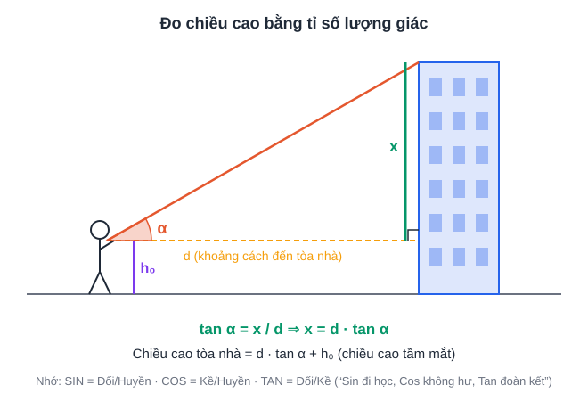

# Tuần 21 (22/02 – 28/02/2027): Idioms · Bài luận 250 từ · Bài toán thực tế · Tổng kết tháng 2

> ⬅️ [Tuần 20](Tuan-20-Ke-Hoach-Hoc-Tap.md) · [Danh mục](Danh-Muc-Ke-Hoach-Tuan.md) · ➡️ [Tuần 22](Tuan-22-Ke-Hoach-Hoc-Tap.md)
> Mỗi tối thứ 2 – thứ 6, **18:30 – 19:15**: làm bài tập trên lớp. Cách dùng và mẫu sổ: xem [Tuần 1](Tuan-01-Ke-Hoach-Hoc-Tap.md).

> **Đây là tuần cuối của giai đoạn học kiến thức.** Từ tuần 22 chuyển sang **luyện đề**. Bố mẹ theo dõi **thông báo tuyển sinh chính thức** (thường ra trong tháng 2–4) và cập nhật mục 2 của [lộ trình tổng quan](Le-Hong-Phong-Thi-Vao-Lop-10.md).

## Mục tiêu

1. **Idioms thông dụng**: 40 thành ngữ.
2. **Bài luận 200–250 từ** đủ 4 dạng (opinion, discussion, advantages – disadvantages, problem – solution).
3. **Từ vựng *Energy & Natural Disasters***: 60 từ/cụm.
4. **Toán:** **bài toán thực tế** tổng hợp (dạng đặc trưng của đề TP.HCM).
5. **Văn:** **đề Văn hoàn chỉnh** trong 120 phút.
6. **Tổng kết tháng 2** và **kết thúc giai đoạn kiến thức**.

## Lịch học

| Ngày | Giờ | Môn | Việc cụ thể | Xong |
|---|---|---|---|---|
| **T2 22/02** | 19:30 – 20:30 | Toán | **Bài toán thực tế** (phần D): giảm giá, lãi suất, tiền điện/nước bậc thang, chuyển động. 8 bài | [ ] |
| | 20:45 – 21:15 | Anh | 15 từ *Energy & Natural Disasters* + Anki | [ ] |
| | 21:15 – 21:30 | Anh chuyên | Idioms 1–10 (phần B) | [ ] |
| **T3 23/02** | 19:30 – 20:30 | Anh chuyên | **Dàn ý 4 dạng bài luận** (phần C): lập dàn ý cho 4 đề, mỗi đề 10 phút; viết hoàn chỉnh 1 bài *discussion* | [ ] |
| | 20:45 – 21:15 | Anh chuyên | Idioms 11–20 | [ ] |
| | 21:15 – 21:30 | Anh | Anki + 15 từ | [ ] |
| **T4 24/02** | 19:30 – 20:30 | Toán | Bài toán thực tế: hình học thực tế (thể tích bồn nước, diện tích, chiều cao bằng lượng giác). 6 bài | [ ] |
| | 20:45 – 21:15 | Anh chuyên | Idioms 21–30 | [ ] |
| | 21:15 – 21:30 | Anh | Anki + 15 từ | [ ] |
| **T5 25/02** | 19:30 – 20:30 | Anh chuyên | Bài luận ~250 từ dạng *problem – solution*: *"What can be done to reduce the damage caused by natural disasters?"* | [ ] |
| | 20:45 – 21:15 | Anh chuyên | Idioms 31–40; làm 30 câu trắc nghiệm idioms | [ ] |
| | 21:15 – 21:30 | Anh | Anki + 15 từ | [ ] |
| **T6 26/02** | 19:30 – 20:30 | Anh | 1 **đề Anh chung** TS10, bấm giờ + chữa | [ ] |
| | 20:45 – 21:15 | Tổng kết | Sổ lỗi sai | [ ] |
| **T7 27/02** | 08:00 – 10:00 | Văn | **1 đề Văn TS10 TP.HCM hoàn chỉnh**, bấm giờ 120 phút | [ ] |
| | 10:15 – 12:15 | Toán | **1 đề Toán TS10 TP.HCM**, bấm giờ | [ ] |
| | 14:30 – 15:30 | Chữa | Chữa Toán; nộp bài Văn cho thầy cô | [ ] |
| **CN 28/02** | 08:30 – 09:30 | Anh chuyên | Phần trắc nghiệm của 1 đề Anh chuyên | [ ] |
| | 19:30 – 20:30 | **Tổng kết tháng 2 + giai đoạn kiến thức** | Cùng bố mẹ (bảng cuối trang) | [ ] |

## Tài liệu

### A. Từ vựng *Energy & Natural Disasters* (30 từ khởi đầu)

| Từ/cụm | Nghĩa | Từ/cụm | Nghĩa |
|---|---|---|---|
| renewable energy | năng lượng tái tạo | solar power | năng lượng mặt trời |
| wind turbine | tua-bin gió | hydropower | thủy điện |
| nuclear power | năng lượng hạt nhân | fossil fuels | nhiên liệu hóa thạch |
| consume | tiêu thụ (consumption, consumer) | conserve energy | tiết kiệm năng lượng |
| energy-efficient | tiết kiệm năng lượng | alternative | thay thế |
| exhaust | làm cạn kiệt (exhaustible ↔ inexhaustible) | generate | tạo ra (generation, generator) |
| natural disaster | thiên tai | earthquake | động đất |
| tsunami | sóng thần | volcanic eruption | núi lửa phun (erupt) |
| typhoon / hurricane | bão nhiệt đới | landslide | sạt lở đất |
| drought | hạn hán | flood | lũ lụt |
| wildfire | cháy rừng | storm | bão |
| evacuate | sơ tán (evacuation) | victim | nạn nhân |
| rescue | cứu hộ | relief | cứu trợ (relief aid) |
| shelter | nơi trú ẩn | warning system | hệ thống cảnh báo |
| devastating | tàn phá nặng nề (devastate) | strike / hit | (thiên tai) xảy ra, ập đến |

### B. 40 idioms thông dụng

| # | Idiom | Nghĩa | # | Idiom | Nghĩa |
|---|---|---|---|---|---|
| 1 | a piece of cake | rất dễ | 21 | hit the books | học chăm chỉ |
| 2 | break the ice | phá vỡ không khí ngại ngùng | 22 | learn by heart | học thuộc lòng |
| 3 | once in a blue moon | hiếm khi | 23 | pass with flying colours | đỗ với điểm cao |
| 4 | under the weather | không khỏe | 24 | burn the midnight oil | thức khuya làm việc/học |
| 5 | hit the nail on the head | nói đúng trọng tâm | 25 | keep an eye on | để mắt tới |
| 6 | a blessing in disguise | trong cái rủi có cái may | 26 | on the tip of my tongue | sắp nhớ ra |
| 7 | cost an arm and a leg | rất đắt | 27 | over the moon | rất vui sướng |
| 8 | the last straw | giọt nước tràn ly | 28 | down in the dumps | buồn bã |
| 9 | let the cat out of the bag | để lộ bí mật | 29 | get cold feet | mất can đảm vào phút chót |
| 10 | in the same boat | cùng cảnh ngộ | 30 | see eye to eye | đồng quan điểm |
| 11 | a drop in the ocean | muối bỏ bể | 31 | make ends meet | xoay xở đủ sống |
| 12 | beat around the bush | nói vòng vo | 32 | in the long run | về lâu dài |
| 13 | call it a day | dừng làm việc | 33 | at the drop of a hat | ngay lập tức |
| 14 | easier said than done | nói dễ hơn làm | 34 | on cloud nine | cực kỳ hạnh phúc |
| 15 | get the hang of | nắm được cách làm | 35 | take sth for granted | coi là đương nhiên |
| 16 | keep your fingers crossed | cầu may | 36 | lend sb a hand | giúp ai |
| 17 | rain cats and dogs | mưa rất to | 37 | go the extra mile | nỗ lực hơn mức cần |
| 18 | be in hot water | gặp rắc rối | 38 | by the skin of your teeth | suýt soát |
| 19 | the ball is in your court | đến lượt bạn quyết định | 39 | out of the blue | bất ngờ |
| 20 | when pigs fly | không đời nào | 40 | a far cry from | khác xa với |

### C. Dàn ý 4 dạng bài luận (200–250 từ)

| Dạng | Mở bài | Thân bài 1 | Thân bài 2 | Kết bài |
|---|---|---|---|---|
| **Opinion** (agree / disagree) | Paraphrase đề + **nêu rõ quan điểm** | Lý do 1 + ví dụ | Lý do 2 + ví dụ | Nhắc lại quan điểm |
| **Discussion** (discuss both views + your opinion) | Paraphrase + giới thiệu 2 quan điểm + quan điểm của em | Quan điểm A + lý do | Quan điểm B + lý do (thường là quan điểm em ủng hộ) | Tóm tắt + quan điểm của em |
| **Advantages – disadvantages** | Paraphrase + giới thiệu | Ưu điểm (2 ý) | Nhược điểm (2 ý) | Đánh giá chung (lợi nhiều hơn hay hại nhiều hơn, nếu đề hỏi) |
| **Problem – solution / Cause – effect** | Paraphrase + giới thiệu | Nguyên nhân / vấn đề | Giải pháp / hệ quả | Tóm tắt, đề xuất |

**Câu mở đầu, từ nối hữu ích:**
- *It is often argued that... / There is an ongoing debate about whether...*
- *Firstly, ... Furthermore, ... In addition, ...*
- *On the one hand, ... On the other hand, ...*
- *For instance, ... A case in point is ...*
- *As a result, ... Consequently, ...*
- *In conclusion, ... All things considered, ...*

### D. Bài toán thực tế: các dạng hay gặp trong đề TP.HCM

| Dạng | Lưu ý |
|---|---|
| Giảm giá, khuyến mãi | Giảm a% liên tiếp hai lần ≠ giảm 2a%; giá sau giảm = giá gốc × (1 − a%) |
| Lãi suất | Lãi kép: số tiền sau n kỳ = A(1 + r)ⁿ |
| Tiền điện, nước bậc thang | Tính **lần lượt từng bậc**, cộng lại; chú ý thuế VAT nếu có |
| Hàm số bậc nhất thực tế | Lập công thức y = ax + b từ 2 dữ kiện, rồi tính giá trị |
| Chuyển động | Đổi đơn vị (km/h ↔ m/s, phút ↔ giờ) |
| Hình học thực tế | Thể tích bể, cốc; diện tích; chiều cao bằng tỉ số lượng giác |
| Nồng độ dung dịch, hỗn hợp | Lập phương trình theo khối lượng chất tan |

> Luôn **ghi đơn vị**, **làm tròn đúng yêu cầu**, và **trả lời bằng câu** ở cuối bài.

> Bài hình học thực tế (thứ Tư) lấy từ [CĐ12](../PTNK/ChuyenDe/CD12-Toan-Hinh-Hoc-Thuc-Te-Do-Luong.md), mục 7.

## Tổng kết tháng 2 và giai đoạn kiến thức (10/2026 – 2/2027)

| Nội dung | Đầu vào (10/2026) | 01/2027 | 02/2027 | Mục tiêu 3/2027 (mục 1.3 kế hoạch chi tiết) |
|---|---|---|---|---|
| Đề Anh chuyên | | | | ≥ 6.5/10 |
| Đề Anh chung | | | | ≥ 9.0 |
| Đề Toán | | | | |
| Đề Văn | | | | |
| Tổng số từ vựng | | | | ~5.000 (tính cả vốn cũ) |

| Câu hỏi cùng bố mẹ | Trả lời |
|---|---|
| Đã có thông báo tuyển sinh chính thức chưa? Có gì thay đổi? | |
| Cấu trúc đề Anh chuyên năm nay có khác dự kiến không? | |
| Chuyên đề nào cần ôn lại trước khi luyện đề? | |
| Có tham gia kỳ thi thử nào trong tháng 3–5 không? (đăng ký sớm) | |
| Tâm trạng chung (1–5) | |

## 📝 Luyện đề tuần này (3 môn)

| Môn | Đề / dạng câu |
|---|---|
| Toán | 1 đề thi thử Toán mẫu mới (Thứ 7) |
| Văn | **PTNK 2022 Văn** (thay đề Thứ 7) |
| Anh | Anh Sở 2020 (cả đề, Thứ 6) |

> Dùng cho các buổi luyện đề **đã có** trong lịch tuần. Sau mỗi đề: điền [phiếu phân tích đề](../LuyenDe/Phieu-Phan-Tich-De.md). Cấu trúc đề: [xem tại đây](../LuyenDe/Cau-Truc-De-Thi.md).

## 🔷 Phổ thông Năng khiếu (ôn song song)

| Ngày | Giờ | Môn | Việc cụ thể | Xong |
|---|---|---|---|---|
| T7 27/02 | 08:00 – 10:00 | Văn | **Thay** đề Văn Thứ 7 bằng **1 đề Văn PTNK năm cũ** | [ ] |
| Trong tuần | — | Bố mẹ | Theo dõi thông báo tuyển sinh PTNK 2027; cập nhật mục 1 của kế hoạch PTNK | [ ] |

> Kỹ năng và ngân hàng đề PTNK: xem [kế hoạch PTNK](../PTNK/PTNK-Ke-Hoach-Song-Song.md).

➡️ [Tuần 22](Tuan-22-Ke-Hoach-Hoc-Tap.md)
