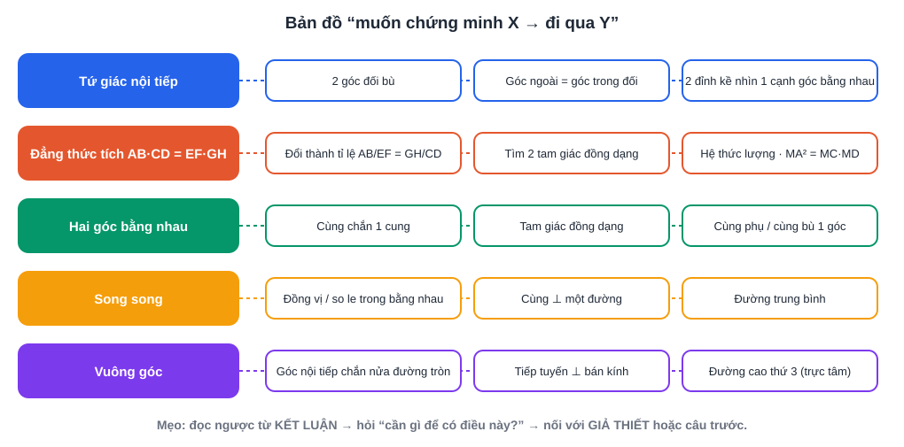
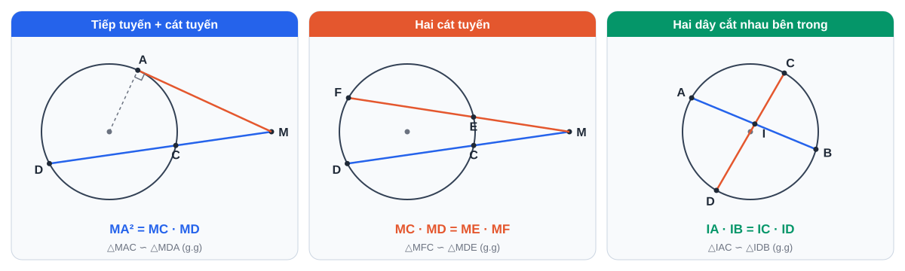
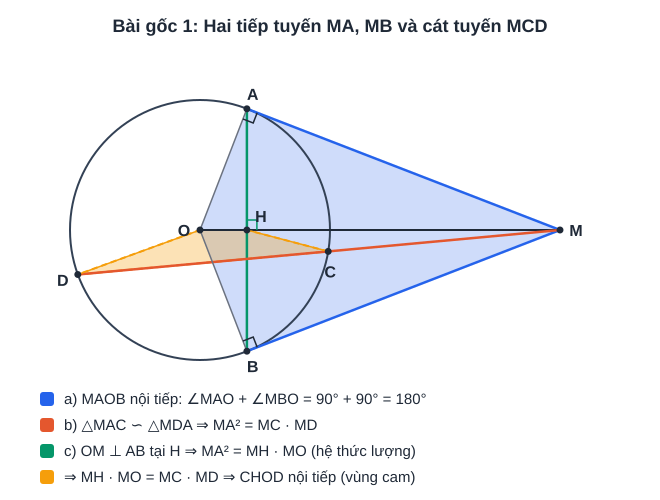
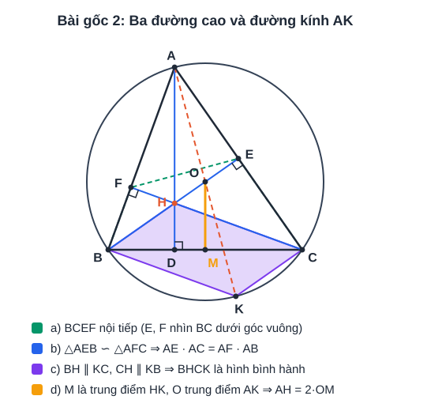

# Chuyên đề 6: Hình học chứng minh nhiều bước

> [Danh mục chuyên đề](Danh-Muc-Chuyen-De.md) · Mức ★★ · Học sau [tuần 16](../../LHP/Tuan-16-Ke-Hoach-Hoc-Tap.md) (đã học tứ giác nội tiếp), luyện qua đề ở tuần 22 – 25 · Thời lượng: 3 buổi × 90 phút

## Mục tiêu

- Có **bản đồ phương pháp**: muốn chứng minh X thì thường đi qua Y.
- Làm thành thạo 2 "bài gốc" mà rất nhiều đề thi phát triển từ đó.
- Dùng kết quả câu trước để làm câu sau.

---

## 1. Bản đồ phương pháp

> Chưa vững góc nội tiếp, tứ giác nội tiếp? Học trước [CĐ13 Hình học trực quan](CD13-Toan-Hinh-Hoc-Truc-Quan-Duong-Tron.md) (có hình tô màu cho từng định lý).

| Cần chứng minh | Hướng đi thường dùng |
|---|---|
| **Tứ giác nội tiếp** | Tổng 2 góc đối = 180° · 2 đỉnh kề cùng nhìn 1 cạnh dưới góc bằng nhau (đặc biệt góc vuông) · góc ngoài = góc trong đối |
| **Đẳng thức tích** (AB·CD = EF·GH) | Đưa về tỉ lệ thức AB/EF = GH/CD → tìm **2 tam giác đồng dạng** chứa 4 đoạn đó |
| **Hai góc bằng nhau** | Cùng chắn 1 cung (trong 1 đường tròn hoặc tứ giác nội tiếp) · tam giác đồng dạng · cùng phụ / bù với 1 góc |
| **Song song** | 2 góc đồng vị / so le trong bằng nhau · cùng vuông góc với 1 đường |
| **Vuông góc** | Góc nội tiếp chắn nửa đường tròn · đường kính ⊥ dây · tiếp tuyến ⊥ bán kính · tính chất 3 đường cao |
| **Thẳng hàng** (A, B, C) | Góc ABC = 180° · AB và BC cùng song song (hoặc cùng vuông góc) với 1 đường |
| **Tiếp tuyến** | Chứng minh vuông góc với bán kính tại tiếp điểm |
| **Trung điểm** | Đường trung bình · tính chất hình bình hành (2 đường chéo cắt nhau tại trung điểm mỗi đường) |

**Hệ thức tích trong đường tròn (cần thuộc):** từ M ngoài (O), cát tuyến MCD, tiếp tuyến MA: **MA² = MC·MD**. Hai cát tuyến MCD, MEF: **MC·MD = ME·MF**.

---

## 2. Bài gốc 1: Hai tiếp tuyến và một cát tuyến

> Từ điểm M nằm ngoài (O), vẽ hai tiếp tuyến MA, MB (A, B là tiếp điểm) và cát tuyến MCD (C nằm giữa M và D). Gọi H là giao điểm của OM và AB.
> a) Chứng minh tứ giác MAOB nội tiếp.
> b) Chứng minh MA² = MC·MD.
> c) Chứng minh MH·MO = MC·MD, từ đó suy ra tứ giác CHOD nội tiếp.

**Lời giải.**

a) ∠MAO = ∠MBO = 90° (tính chất tiếp tuyến) ⇒ ∠MAO + ∠MBO = 180° ⇒ **MAOB nội tiếp**.

b) Xét △MAC và △MDA: ∠M chung; ∠MAC = ∠MDA (góc tạo bởi tiếp tuyến và dây cung AC bằng góc nội tiếp chắn cung AC).
⇒ △MAC ∽ △MDA (g.g) ⇒ MA/MD = MC/MA ⇒ **MA² = MC·MD**.

c) MA = MB (tính chất 2 tiếp tuyến cắt nhau), OA = OB ⇒ OM là trung trực của AB ⇒ OM ⊥ AB tại H.
△MAO vuông tại A, đường cao AH ⇒ MA² = MH·MO (hệ thức lượng).
Kết hợp câu b: **MH·MO = MC·MD** ⇒ MC/MO = MH/MD.
Xét △MCH và △MOD: ∠M chung, MC/MO = MH/MD ⇒ △MCH ∽ △MOD (c.g.c) ⇒ ∠MHC = ∠MDO.
∠MHC là góc ngoài tại đỉnh H của tứ giác CHOD, bằng góc trong ∠CDO ở đỉnh đối diện ⇒ **CHOD nội tiếp**.

> **Bài học:** câu c dùng **kết quả câu b + hệ thức lượng**. Hai đẳng thức tích có chung một vế ⇒ ghép lại ⇒ tam giác đồng dạng ⇒ tứ giác nội tiếp.

---

## 3. Bài gốc 2: Tam giác và trực tâm

> Cho △ABC nhọn (AB < AC) nội tiếp (O), ba đường cao AD, BE, CF cắt nhau tại H.
> a) Chứng minh tứ giác BCEF nội tiếp.
> b) Chứng minh AE·AC = AF·AB.
> c) Kẻ đường kính AK của (O). Chứng minh tứ giác BHCK là hình bình hành.
> d) Gọi M là trung điểm BC. Chứng minh AH = 2OM.

**Lời giải.**

a) ∠BEC = ∠BFC = 90° ⇒ E, F cùng nhìn BC dưới góc vuông ⇒ **BCEF nội tiếp** (đường tròn đường kính BC).

b) △AEB và △AFC: ∠A chung, ∠AEB = ∠AFC = 90° ⇒ △AEB ∽ △AFC ⇒ AE/AF = AB/AC ⇒ **AE·AC = AF·AB**.

c) ∠ACK = 90° (góc nội tiếp chắn nửa đường tròn) ⇒ KC ⊥ AC. Mà BH ⊥ AC ⇒ BH ∥ KC.
Tương tự ∠ABK = 90° ⇒ KB ⊥ AB, mà CH ⊥ AB ⇒ CH ∥ KB.
⇒ **BHCK là hình bình hành**.

d) BHCK là hình bình hành ⇒ trung điểm M của BC cũng là trung điểm của HK.
Trong △AHK: O là trung điểm AK, M là trung điểm HK ⇒ OM là đường trung bình ⇒ **AH = 2OM**.

> **Bài học:** đường kính AK là "đường phụ" kinh điển. Khi đề cho trực tâm H và đường tròn ngoại tiếp, hãy nghĩ tới việc kẻ đường kính qua một đỉnh.

---

## 4. Bài tự luyện

**Bài 1.** Cho △ABC vuông tại A, đường cao AH. Đường tròn đường kính AH cắt AB, AC lần lượt tại E, F.
a) Chứng minh AEHF là hình chữ nhật.
b) Chứng minh AE·AB = AF·AC.
c) Chứng minh tứ giác BEFC nội tiếp.

**Bài 2.** Cho nửa đường tròn tâm O đường kính AB, điểm C thuộc nửa đường tròn, H là hình chiếu của C trên AB.
a) Chứng minh CH² = AH·HB.
b) Tiếp tuyến tại C cắt tiếp tuyến tại A và B lần lượt ở M, N. Chứng minh ∠MON = 90° và AM·BN = R² (R là bán kính).

**Bài 3.** Làm lại **Bài gốc 1** và **Bài gốc 2** mà không nhìn lời giải, sau 3 ngày và sau 1 tuần.

<b>Gợi ý</b>

**Bài 1.**
a) ∠AEH = ∠AFH = 90° (góc nội tiếp chắn nửa đường tròn đường kính AH), ∠EAF = 90° ⇒ hình chữ nhật.
b) △AHB vuông tại H, đường cao HE ⇒ AH² = AE·AB. Tương tự AH² = AF·AC ⇒ AE·AB = AF·AC.
c) Từ b: AE/AC = AF/AB, ∠A chung ⇒ △AEF ∽ △ACB ⇒ ∠AEF = ∠ACB ⇒ góc ngoài tại E của tứ giác BEFC bằng góc trong tại C ⇒ nội tiếp.

**Bài 2.**
a) ∠ACB = 90° (góc nội tiếp chắn nửa đường tròn), CH là đường cao ⇒ CH² = AH·HB.
b) OM là phân giác ∠AOC, ON là phân giác ∠COB (tính chất 2 tiếp tuyến cắt nhau); ∠AOC + ∠COB = 180° ⇒ ∠MON = 90°. △MON vuông tại O, OC là đường cao ⇒ OC² = MC·CN = MA·NB (vì MC = MA, NC = NB) ⇒ AM·BN = R².

---

## 5. Kỹ năng làm bài hình

1. **Vẽ hình to, đúng tỉ lệ**, không vẽ trường hợp đặc biệt (tam giác cân, vuông...) nếu đề không cho.
2. Viết **giả thiết – kết luận** gọn ở góc giấy nháp.
3. Câu sau thường dùng **kết quả câu trước**: đọc lại các câu đã chứng minh trước khi làm câu mới.
4. Không làm được câu b vẫn được **dùng kết quả câu b** để làm câu c.
5. Mỗi bước ghi **lý do** trong ngoặc: (cùng chắn cung AC), (g.g), (tính chất tiếp tuyến)...
6. **Tô màu theo câu** như hai hình bài gốc: câu a một màu, câu b một màu... Nhìn hình là thấy câu sau "mượn" gì từ câu trước.
