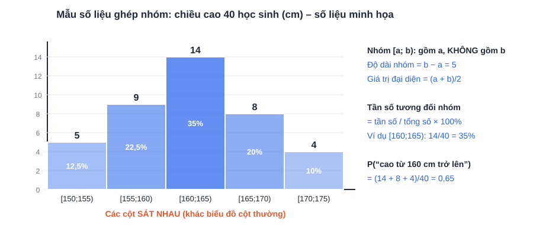

# Chuyên đề 11: Thống kê và xác suất (câu 3 đề Sở, 1,5 điểm)

> [Danh mục chuyên đề](Danh-Muc-Chuyen-De.md) · Mức ★ (đề Sở) – ★★ (đề PTNK) · Học sớm ở [tuần 7](../../LHP/Tuan-07-Ke-Hoach-Hoc-Tap.md), học đủ ở [tuần 20](../../LHP/Tuan-20-Ke-Hoach-Hoc-Tap.md), ôn lại ở tuần 19 và các đề thi thử · Thời lượng: 2 buổi × 60 phút

## Vì sao phải học kỹ chuyên đề này?

| Năm | Câu 3 đề Toán Sở TP.HCM | Bối cảnh |
|---|---|---|
| 2025 | Thống kê – xác suất, **1,5 điểm** (lần đầu theo GDPT 2018) | Bài toán thực tế |
| 2026 | Thống kê – xác suất thực nghiệm, **1,5 điểm** | Khảo sát **số giờ dùng điện thoại mỗi ngày** của học sinh lớp 9: tính số học sinh được khảo sát, xác suất "dùng đúng 3 giờ", xác suất "thực hiện đúng khuyến cáo của nhà trường" |

> **Nhận xét:** câu này **dễ lấy trọn điểm** nếu đọc bảng/biểu đồ cẩn thận. Đây là 1,5 điểm "phải ăn chắc", ngang câu 1 (đồ thị). Bối cảnh thường là đời sống học sinh: điện thoại, mạng xã hội, giờ ngủ, thể thao, môi trường.

## Mục tiêu

- Đọc đúng **bảng tần số, biểu đồ cột, biểu đồ quạt, biểu đồ ghép nhóm**.
- Liệt kê đầy đủ **không gian mẫu** bằng sơ đồ cây hoặc bảng.
- Tính xác suất trong **dưới 8 phút** cho cả câu 3.

---

## 1. Thống kê: đọc và lập bảng, biểu đồ

| Khái niệm | Cách hiểu nhanh | Ví dụ (hình trên) |
|---|---|---|
| **Tần số** | Đếm: giá trị đó xuất hiện mấy lần | "3 giờ" có tần số 10 |
| **Cỡ mẫu** n | Tổng các tần số | 8 + 12 + 10 + 6 + 4 = **40** |
| **Tần số tương đối** | Tần số ÷ n (viết dạng %) | 10 ÷ 40 = **25%** |
| **Biểu đồ cột** | Chiều cao cột = tần số | |
| **Biểu đồ quạt tròn** | Mỗi hình quạt = tần số tương đối; **góc ở tâm = % × 360°** | 25% → 90° |

### Mẫu số liệu ghép nhóm (chương trình lớp 9 mới)

- Nhóm **[a; b)** gồm các giá trị **từ a đến dưới b**: 155 thuộc nhóm [155; 160), **không** thuộc [150; 155).
- Biểu đồ tần số ghép nhóm: các cột **sát nhau** (khác biểu đồ cột thường, các cột cách nhau).
- Nhóm có cột cao nhất là nhóm có **tần số lớn nhất**.

> **Mẹo nhớ:** "Tần số là **đếm**, tần số tương đối là **chia**, biểu đồ quạt là **nhân 360°**."

---

## 2. Xác suất

### 2.1. Ba bước giải mọi câu xác suất

| Bước | Việc làm | Ghi vào bài |
|---|---|---|
| 1 | Xác định **phép thử** và liệt kê **không gian mẫu Ω** | "Không gian mẫu Ω = {…}, có n(Ω) = … phần tử" |
| 2 | Kiểm tra các kết quả **đồng khả năng** (chọn ngẫu nhiên, đồng xu cân đối...) | "Các kết quả là đồng khả năng" |
| 3 | Đếm số kết quả **thuận lợi** cho biến cố A | P(A) = n(A) / n(Ω) |

| Phép thử có | Liệt kê bằng |
|---|---|
| **2 – 3 bước nối tiếp** (gieo xu 2 – 3 lần, chọn lần lượt) | **Sơ đồ cây**: mỗi tầng là một bước |
| **2 bước, mỗi bước nhiều khả năng** (gieo 2 xúc xắc, rút 2 thẻ có hoàn lại) | **Bảng** hàng × cột |
| **Chọn cùng lúc 2 vật** (lấy 2 bi, chọn 2 bạn) | Liệt kê **cặp không thứ tự**, viết theo thứ tự cố định để không trùng: AB, AC, AD, BC, BD, CD |

### 2.2. Xác suất từ bảng thống kê (dạng đề 2026)

Khi đề cho **bảng khảo sát** rồi hỏi "chọn ngẫu nhiên 1 bạn trong số được khảo sát":

> **P(A) = (số bạn có tính chất A) / (tổng số bạn được khảo sát)** = tần số tương đối của A.

Khi đề nói "**dựa vào kết quả khảo sát, ước lượng**..." (xác suất thực nghiệm): P(A) ≈ số lần A xảy ra / tổng số lần thử. Từ đó **dự đoán**: số lần A xảy ra trong N lần ≈ N × P(A).

---

## 3. Ví dụ giải mẫu

**Ví dụ 1 (mô phỏng dạng đề 2026).** Khảo sát số giờ dùng điện thoại mỗi ngày của một nhóm học sinh lớp 9, được bảng:

| Số giờ | 1 | 2 | 3 | 4 | 5 |
|---|---|---|---|---|---|
| Số học sinh | 8 | 12 | 10 | 6 | 4 |

a) Có bao nhiêu học sinh được khảo sát?
b) Chọn ngẫu nhiên 1 học sinh. Tính xác suất của biến cố A: "Học sinh đó dùng điện thoại đúng 3 giờ mỗi ngày".
c) Nhà trường khuyến cáo dùng điện thoại **không quá 3 giờ** mỗi ngày. Tính xác suất của biến cố B: "Học sinh được chọn thực hiện đúng khuyến cáo".

**Lời giải.**
a) n = 8 + 12 + 10 + 6 + 4 = **40** học sinh.
b) Có 10 học sinh dùng đúng 3 giờ ⇒ P(A) = 10/40 = **0,25**.
c) "Không quá 3 giờ" gồm 1, 2, **và** 3 giờ ⇒ 8 + 12 + 10 = 30 học sinh ⇒ P(B) = 30/40 = **0,75**.

> **Bẫy:** "không quá 3" = "≤ 3" (**có** 3). "Ít hơn 3" = "< 3" (**không có** 3). Gạch chân cụm này trong đề.

**Ví dụ 2 (chọn cùng lúc).** Một hộp có 3 bi đỏ Đ₁, Đ₂, Đ₃ và 2 bi xanh X₁, X₂. Lấy ngẫu nhiên **cùng lúc** 2 bi.
a) Liệt kê không gian mẫu.
b) Tính xác suất: A "hai bi cùng màu"; B "có ít nhất một bi xanh".

**Lời giải.**
a) Ω = {Đ₁Đ₂; Đ₁Đ₃; Đ₂Đ₃; Đ₁X₁; Đ₁X₂; Đ₂X₁; Đ₂X₂; Đ₃X₁; Đ₃X₂; X₁X₂}, n(Ω) = **10**.
b) A = {Đ₁Đ₂; Đ₁Đ₃; Đ₂Đ₃; X₁X₂} ⇒ P(A) = 4/10 = **0,4**.
B: các cặp có X: Đ₁X₁; Đ₁X₂; Đ₂X₁; Đ₂X₂; Đ₃X₁; Đ₃X₂; X₁X₂ ⇒ 7 kết quả ⇒ P(B) = **0,7**.
(Kiểm tra nhanh: "không có bi xanh" = 3 cặp đỏ – đỏ ⇒ 1 − 3/10 = 0,7 ✓)

**Ví dụ 3 (xác suất thực nghiệm).** Một cửa hàng ghi nhận 200 lượt khách, có 46 lượt thanh toán bằng ví điện tử.
a) Ước lượng xác suất một khách thanh toán bằng ví điện tử. b) Trong 1 500 lượt khách tiếp theo, dự đoán khoảng bao nhiêu lượt dùng ví điện tử?

**Lời giải.** a) P ≈ 46/200 = **0,23**. b) 1 500 × 0,23 = **345** lượt (khoảng).

---

## 4. Bài tự luyện (bấm giờ 30 phút)

**Bài 1.** Gieo 2 con xúc xắc cân đối. Tính xác suất: a) tổng hai mặt bằng 7; b) hai mặt giống nhau; c) tích hai số chấm là số chẵn.

**Bài 2.** Chọn ngẫu nhiên một số tự nhiên có hai chữ số. Tính xác suất: a) số đó chia hết cho 5; b) số đó là số chính phương.

**Bài 3.** Gieo một đồng xu cân đối 3 lần. Vẽ sơ đồ cây và tính xác suất "có ít nhất 2 lần xuất hiện mặt sấp".

**Bài 4.** Điểm kiểm tra của 40 học sinh:

| Điểm | 5 | 6 | 7 | 8 | 9 | 10 |
|---|---|---|---|---|---|---|
| Số học sinh | 2 | 6 | 10 | 12 | 6 | 4 |

a) Lập bảng tần số tương đối. b) Vẽ biểu đồ quạt: tính góc ở tâm mỗi hình quạt. c) Chọn ngẫu nhiên 1 học sinh, tính xác suất học sinh đó đạt từ 8 điểm trở lên.

**Bài 5.** Lớp chọn ngẫu nhiên 2 bạn trong 4 bạn An, Bình (nam), Chi, Dung (nữ) đi dự hội thảo về AI. Tính xác suất: a) An được chọn; b) chọn được 1 nam và 1 nữ.

**Bài 6.** Dùng biểu đồ ghép nhóm ở mục 1. Chọn ngẫu nhiên 1 học sinh. Tính xác suất học sinh đó cao **dưới** 160 cm; nhóm nào có tần số tương đối lớn nhất?

<b>Đáp án</b>

**Bài 1.** n(Ω) = 36. a) 6 ô ⇒ 1/6. b) (1;1)…(6;6): 6 ô ⇒ 1/6. c) Tích lẻ khi cả hai số lẻ: 3 × 3 = 9 ô ⇒ tích chẵn: 36 − 9 = 27 ⇒ **3/4**.

**Bài 2.** Có 90 số (10 → 99). a) 10, 15, …, 95: 18 số ⇒ 18/90 = **0,2**. b) 16, 25, 36, 49, 64, 81: 6 số ⇒ 6/90 = **1/15**.

**Bài 3.** 8 kết quả: SSS, SSN, SNS, SNN, NSS, NSN, NNS, NNN. Ít nhất 2 sấp: SSS, SSN, SNS, NSS ⇒ 4/8 = **1/2**.

**Bài 4.** a) 5%, 15%, 25%, 30%, 15%, 10%. b) 18°, 54°, 90°, 108°, 54°, 36° (tổng 360° ✓). c) (12 + 6 + 4)/40 = 22/40 = **0,55**.

**Bài 5.** Ω = {AB; AC; AD; BC; BD; CD} (A = An, B = Bình, C = Chi, D = Dung), n(Ω) = 6. a) AB, AC, AD ⇒ 3/6 = **1/2**. b) AC, AD, BC, BD ⇒ 4/6 = **2/3**.

**Bài 6.** Dưới 160 cm: (5 + 9)/40 = 14/40 = **0,35**. Nhóm [160; 165) có tần số tương đối lớn nhất (35%).

---

## 5. Lỗi hay gặp

| Lỗi | Cách tránh |
|---|---|
| Quên một kết quả khi liệt kê Ω | Dùng sơ đồ cây hoặc bảng; đếm lại bằng quy tắc nhân (2 × 2 × 2 = 8) |
| Đếm trùng khi chọn **cùng lúc** (AB và BA) | Chọn cùng lúc ⇒ cặp **không thứ tự**; viết theo thứ tự chữ cái |
| Nhầm "không quá", "ít nhất", "nhiều hơn" | Viết lại thành ký hiệu ≤, ≥, > ngay trên đề |
| Cộng sai cỡ mẫu | Cộng hai lần, theo hai chiều |
| Không ghi kết luận | Câu cuối luôn là "Vậy P(A) = …" |
| Quên đổi % khi vẽ biểu đồ quạt | Góc = tần số tương đối × 360° |
