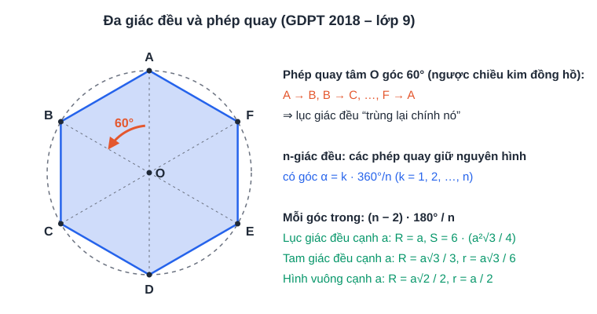

# Chuyên đề 12: Hình học thực tế và đo lường (câu 5 đề Sở)

> [Danh mục chuyên đề](Danh-Muc-Chuyen-De.md) · Mức ★ · Học cùng [tuần 19](../../LHP/Tuan-19-Ke-Hoach-Hoc-Tap.md) (cung, hình quạt), [tuần 20](../../LHP/Tuan-20-Ke-Hoach-Hoc-Tap.md) (hình khối), [tuần 21](../../LHP/Tuan-21-Ke-Hoach-Hoc-Tap.md) (toán thực tế) · Thời lượng: 2 buổi × 60 phút

## Vì sao phải học kỹ chuyên đề này?

| Năm | Đề Toán Sở TP.HCM | Vật thể trong đề |
|---|---|---|
| 2025 | Câu hình thực tế | **Hộp hình trụ chứa vừa khít 4 quả bóng tennis** (hình cầu) |
| 2026 | Câu hình thực tế | **Bình inox**: thân hình trụ (cao 20 cm, bán kính đáy 4 cm) + nắp **nửa hình cầu**; tính thể tích bên trong và **chi phí sơn** mặt ngoài theo giá mỗi m² |

> **Xu hướng:** đề không hỏi một hình riêng lẻ mà hỏi **vật thể ghép** (trụ + cầu, trụ + nón...) và nối với **tiền, đổi đơn vị**. Ba lỗi mất điểm nhiều nhất: **tính thừa/thiếu mặt**, **đổi đơn vị sai**, **làm tròn sai**.

## Mục tiêu

- Thuộc **9 công thức** (bảng ở mục 1, 2) và **hình dung** được từng mặt của vật thể.
- Tách vật thể ghép thành các khối cơ bản.
- Đổi đơn vị đúng: cm² ↔ m², cm³ ↔ lít.

---

## 1. Hình trụ, hình nón, hình cầu

| Hình | Diện tích xung quanh | Diện tích toàn phần | Thể tích |
|---|---|---|---|
| Trụ (r, h) | 2πrh | 2πrh + 2πr² | πr²h |
| Nón (r, h, đường sinh l) | πrl, với l² = r² + h² | πrl + πr² | ⅓πr²h |
| Cầu (R) | 4πR² | — | ⁴⁄₃πR³ |
| **Nửa cầu** | 2πR² (phần cong) | 2πR² + πR² = 3πR² (nếu tính cả mặt phẳng) | ⅔πR³ |

> **Mẹo nhớ:**
> - Nón = **⅓ trụ** cùng đáy, cùng chiều cao. Đổ 3 nón nước thì đầy 1 trụ.
> - Cầu "**4 – 4/3**": diện tích **4**πR², thể tích **4/3**πR³.
> - Diện tích xung quanh trụ = **cuộn tờ giấy chữ nhật**: chiều dài 2πr (chu vi đáy) × chiều rộng h.

---

## 2. Đường tròn: cung, quạt, viên phân, vành khăn

| Đại lượng | Công thức | Bối cảnh hay gặp |
|---|---|---|
| Chu vi | C = 2πR | Bánh xe lăn **1 vòng** đi được 2πR |
| Độ dài cung n° | l = πRn/180 | Đầu kim đồng hồ, đường chạy cong |
| Hình quạt n° | S = πR²n/360 = lR/2 | Miếng bánh, vùng tưới của vòi phun xoay |
| Hình viên phân | S = S_quạt − S_tam giác | Phần cửa sổ vòm |
| Hình vành khăn | S = π(R² − r²) | Lối đi quanh bồn hoa, mặt cắt ống nước |

---

## 3. Vật thể ghép: dạng của đề 2025 – 2026

**Quy trình 4 bước:**

1. **Tách** vật thể thành các khối cơ bản; vẽ phác hình, ghi r, h lên hình.
2. **Thể tích** = cộng (hoặc trừ, nếu bị khoét) thể tích các khối.
3. **Diện tích mặt ngoài**: liệt kê **từng mặt nhìn thấy được**; mặt tiếp giáp giữa hai khối **không** tính.
4. **Đổi đơn vị** rồi mới nhân giá tiền; làm tròn **ở bước cuối**.

| Đổi đơn vị (thuộc lòng) |
|---|
| 1 m = 100 cm · **1 m² = 10 000 cm²** · **1 m³ = 1 000 000 cm³** |
| **1 lít = 1 dm³ = 1 000 cm³** · 1 m³ = 1 000 lít |

---

## 4. Lượng giác trong thực tế

- **Góc nâng**: nhìn lên từ phương ngang. **Góc hạ**: nhìn xuống từ phương ngang.
- Luôn **cộng chiều cao tầm mắt** nếu đề cho người đứng đo.
- Bấm máy tính ở chế độ **độ (D)**, không phải radian (R).

## 5. Đa giác đều và phép quay (nội dung mới của chương trình lớp 9)

- Phép quay tâm O góc α biến n-giác đều thành chính nó khi **α = k · 360°/n**.
- Hay gặp trong thực tế: **bánh xe đu quay, quạt trần, hoa văn, logo, gạch lát**: "quay bao nhiêu độ thì trùng lại?"

---

## 6. Ví dụ giải mẫu

**Ví dụ 1 (dạng đề 2026, số liệu khác).** Một bình gồm thân hình trụ cao 18 cm, bán kính đáy 5 cm, nắp là nửa hình cầu bán kính 5 cm.
a) Tính thể tích bình (lấy π ≈ 3,14, làm tròn đến cm³).
b) Sơn mặt ngoài bình (thân, đáy, nắp) với giá 200 000 đồng/m². Tính chi phí.

**Lời giải.**
a) V = πr²h + ⅔πr³ = π·25·18 + ⅔·π·125 = 450π + 250π/3 = 1 600π/3 ≈ **1 675 cm³** (≈ 1,7 lít).
b) S = 2πrh + πr² + 2πr² = 180π + 25π + 50π = 255π ≈ 800,7 cm² ≈ 0,08007 m².
Chi phí ≈ 0,08007 × 200 000 ≈ **16 014 đồng**.

> Đề có thể chỉ hỏi "thân và nắp" (không sơn đáy). **Đọc kỹ** các mặt cần tính.

**Ví dụ 2 (dạng đề 2025).** Hộp hình trụ chứa vừa khít 3 quả bóng tennis đường kính 6,5 cm. Tính thể tích phần không gian trống trong hộp.

**Lời giải.** "Vừa khít" ⇒ r = 3,25 cm; h = 3 × 6,5 = 19,5 cm.
V_hộp = π·3,25²·19,5 ≈ 205,97π. V_bóng = 3 · ⁴⁄₃π·3,25³ ≈ 137,31π.
V_trống ≈ 68,66π ≈ **215,7 cm³**. (Đúng bằng ⅓ thể tích hộp.)

**Ví dụ 3 (lượng giác).** Bạn Minh đứng cách chân tòa nhà 40 m, nhìn đỉnh tòa nhà với góc nâng 35°; mắt bạn cách mặt đất 1,6 m. Tính chiều cao tòa nhà.

**Lời giải.** x = 40 · tan 35° ≈ 40 · 0,7002 ≈ 28,0 m. Chiều cao ≈ 28,0 + 1,6 = **29,6 m**.

**Ví dụ 4 (vành khăn).** Bồn hoa hình tròn bán kính 3 m, xung quanh có lối đi rộng 1 m. Lát gạch lối đi giá 150 000 đ/m². Tính chi phí.

**Lời giải.** S = π(4² − 3²) = 7π ≈ 21,99 m². Chi phí ≈ 21,99 × 150 000 ≈ **3 298 500 đồng**.

---

## 7. Bài tự luyện (bấm giờ 35 phút)

**Bài 1.** Bồn nước inox hình trụ đứng, đường kính đáy 1,2 m, cao 1,5 m. a) Bồn chứa được bao nhiêu lít? b) Gia đình dùng 250 lít/ngày. Bồn đầy dùng được bao nhiêu ngày trọn?

**Bài 2.** Một cây kem ốc quế: phần bánh hình nón cao 12 cm, bán kính 3 cm; phần kem phía trên là nửa hình cầu bán kính 3 cm. Tính thể tích kem nếu kem lấp đầy cả bánh.

**Bài 3.** Từ khúc gỗ hình trụ (r = 10 cm, h = 30 cm), người ta tiện thành hình nón có cùng đáy và chiều cao. Tính thể tích phần gỗ bị bỏ đi.

**Bài 4.** Chiếc nón lá có đường kính vành 40 cm, chiều cao 15 cm. Tính diện tích lá cần để phủ mặt nón.

**Bài 5.** Kim phút của đồng hồ dài 10 cm. Trong 20 phút, đầu kim đi được quãng đường bao nhiêu? Kim quét được diện tích bao nhiêu?

**Bài 6.** Thang dài 5 m dựa vào tường, chân thang tạo với mặt đất góc 65°. Đầu thang cao bao nhiêu mét so với mặt đất?

**Bài 7.** a) Lục giác đều ABCDEF tâm O. Phép quay tâm O góc bao nhiêu độ (ngược chiều kim đồng hồ) biến A thành C? b) Liệt kê các góc quay (0° < α ≤ 360°) biến ngũ giác đều thành chính nó.

<b>Đáp án</b>

**Bài 1.** a) V = π·0,6²·1,5 = 0,54π ≈ 1,696 m³ ≈ **1 696 lít**. b) 1 696 : 250 ≈ 6,8 ⇒ **6 ngày** trọn.

**Bài 2.** V = ⅓π·9·12 + ⅔π·27 = 36π + 18π = 54π ≈ **169,6 cm³**.

**Bài 3.** Bỏ đi = V_trụ − V_nón = ⅔ · π·100·30 = 2 000π ≈ **6 283 cm³**.

**Bài 4.** r = 20, h = 15 ⇒ l = √(400 + 225) = 25. S_xq = π·20·25 = 500π ≈ **1 571 cm²**.

**Bài 5.** 20 phút ⇒ 120°. l = π·10·120/180 = 20π/3 ≈ **20,9 cm**. S = π·100·120/360 = 100π/3 ≈ **104,7 cm²**.

**Bài 6.** h = 5 · sin 65° ≈ 5 · 0,9063 ≈ **4,53 m**.

**Bài 7.** a) A → C qua 2 cạnh ⇒ 2 × 60° = **120°**. b) 72°, 144°, 216°, 288°, 360°.

---

## 8. Lỗi hay gặp

| Lỗi | Cách tránh |
|---|---|
| Dùng **đường kính** thay cho bán kính | Gạch chân "đường kính", chia 2 ngay |
| Tính cả mặt tiếp giáp giữa hai khối | Tự hỏi: "sờ tay vào được mặt này không?" |
| Quên đổi cm² → m² trước khi nhân giá | Chia cho 10 000 |
| Làm tròn từ bước giữa | Giữ π hoặc giữ nhiều chữ số đến bước cuối |
| Nhầm h (chiều cao) và l (đường sinh) của nón | Vẽ tam giác vuông r – h – l |
| Máy tính ở chế độ radian | Kiểm tra chữ **D** trên màn hình trước khi thi |
