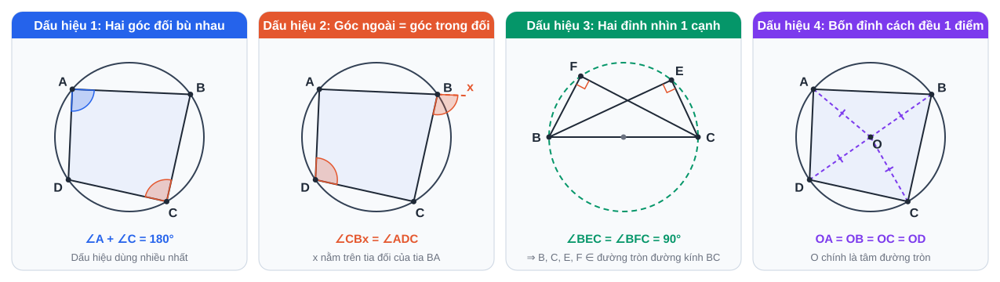

# Chuyên đề 13: Hình học trực quan – góc, đường tròn, tứ giác nội tiếp

> [Danh mục chuyên đề](Danh-Muc-Chuyen-De.md) · Mức ★ – ★★ · Học cùng [tuần 14](../../LHP/Tuan-14-Ke-Hoach-Hoc-Tap.md), [15](../../LHP/Tuan-15-Ke-Hoach-Hoc-Tap.md), [16](../../LHP/Tuan-16-Ke-Hoach-Hoc-Tap.md); là **bước chuẩn bị** cho [CĐ6 Hình học nhiều bước](CD06-Toan-Hinh-Hoc-Nhieu-Buoc.md) · Thời lượng: 3 buổi × 45 phút

## Vì sao cần chuyên đề này?

Câu 7 đề Sở (**3 điểm**) và bài hình đề PTNK đều xoay quanh **đường tròn**. Học sinh thường mất điểm không phải vì thiếu công thức mà vì **không "nhìn ra"** hai góc bằng nhau hay bốn điểm cùng thuộc một đường tròn. Chuyên đề này luyện **mắt nhìn hình**: mỗi định lý đi kèm một hình tô màu, một câu thần chú, và một bài tập 5 phút.

## Mục tiêu

- Nhìn hình là **chỉ ra được** các cặp góc bằng nhau (cùng chắn một cung).
- Thuộc **4 dấu hiệu tứ giác nội tiếp** và biết dấu hiệu nào hợp với hình nào.
- Thuộc **3 hệ thức tích** trong đường tròn.
- Vẽ hình **đúng, to, sạch** trong 2 phút.

---

## 1. Bốn loại góc với đường tròn

| # | Loại góc | Số đo | Câu thần chú |
|---|---|---|---|
| 1 | Góc ở tâm | = sđ cung bị chắn | "**Tâm** thì **trọn**" |
| 2 | Góc nội tiếp | = ½ sđ cung bị chắn | "**Nội tiếp** thì **nửa**" |
| 3 | Góc nội tiếp chắn nửa đường tròn | = 90° | "**Đường kính** ⇒ **góc vuông**" |
| 4 | Góc tạo bởi tiếp tuyến và dây | = ½ sđ cung bị chắn = góc nội tiếp cùng chắn cung đó | "Tiếp tuyến là **góc nội tiếp bị kéo dẹt**" |

> **Cách nhìn ra góc bằng nhau:** tô **cùng một màu** cho cung và mọi góc "đứng trên" cung đó (như hình 2: ∠ACB và ∠ADB cùng màu với cung AB). Góc nào cùng màu thì bằng nhau.

---

## 2. Bốn dấu hiệu tứ giác nội tiếp

| Dấu hiệu | Dùng khi đề có | Ví dụ điển hình |
|---|---|---|
| 1. Hai góc đối bù nhau | **Hai góc vuông ở hai đỉnh đối** (tiếp tuyến, đường cao) | MAOB với MA, MB là tiếp tuyến |
| 2. Góc ngoài = góc trong đối | Đã có **cặp góc bằng nhau** từ tam giác đồng dạng | CHOD trong [bài gốc 1](CD06-Toan-Hinh-Hoc-Nhieu-Buoc.md) |
| 3. Hai đỉnh kề nhìn một cạnh dưới góc bằng nhau | **Hai góc vuông ở hai đỉnh kề** (hai đường cao) | BCEF: E, F nhìn BC dưới góc 90° |
| 4. Bốn đỉnh cách đều một điểm | Hình chữ nhật, hình thang cân, có sẵn tâm | Ít dùng trong đề |

> **Phản xạ cần có:** thấy **2 góc vuông** ⇒ hỏi ngay "chúng ở 2 đỉnh **đối** hay 2 đỉnh **kề**?" Đối ⇒ dấu hiệu 1. Kề ⇒ dấu hiệu 3.

---

## 3. Ba hệ thức tích

| Hình | Hệ thức | Chứng minh bằng |
|---|---|---|
| Tiếp tuyến MA, cát tuyến MCD | **MA² = MC · MD** | △MAC ∽ △MDA (g.g) |
| Hai cát tuyến MCD, MEF | **MC · MD = ME · MF** | △MFC ∽ △MDE (g.g) |
| Hai dây AB, CD cắt nhau tại I | **IA · IB = IC · ID** | △IAC ∽ △IDB (g.g) |

> Các hệ thức này **không phải định lý trong SGK lớp 9**, nên khi làm bài cần **chứng minh lại cặp tam giác đồng dạng** (2 – 3 dòng) rồi mới suy ra hệ thức; viết thẳng kết quả dễ bị trừ điểm.

---

## 4. Bản đồ phương pháp

Chép bản đồ này vào trang đầu của vở hình. Mỗi lần bí, nhìn kết luận cần chứng minh, tìm hàng tương ứng, thử lần lượt 3 hướng.

---

## 5. Học bằng hình động (GeoGebra)

Hình động giúp **thấy** định lý đúng thay vì chỉ thuộc. Dùng [GeoGebra Classic](https://www.geogebra.org/classic) (miễn phí, chạy trên trình duyệt):

| Thí nghiệm (10 phút) | Cách làm | Điều con sẽ thấy |
|---|---|---|
| Góc nội tiếp không đổi | Vẽ đường tròn, 3 điểm A, B, C trên đường tròn; đo ∠ACB; **kéo C** chạy trên cung lớn | Số đo ∠ACB **không đổi** |
| Góc chắn nửa đường tròn | Cho AB là đường kính, kéo C | ∠ACB luôn = 90° |
| Tứ giác nội tiếp | 4 điểm trên đường tròn, đo ∠A + ∠C | Luôn = 180°, dù kéo điểm nào |
| Hệ thức tích | M ngoài đường tròn, cát tuyến MCD; tính MC·MD; xoay cát tuyến | Tích **không đổi** = MA² |

> Sau mỗi thí nghiệm, con **tự nói thành lời** định lý vừa thấy (kỹ thuật Feynman), rồi mới làm bài tập.

---

## 6. Bài tập 5 phút (làm ngay sau mỗi mục)

**Bài 1.** Cho (O) đường kính AB, C thuộc đường tròn. Tiếp tuyến tại A cắt tia BC tại D. Chứng minh AC ⊥ BD và AD² = DC · DB.

**Bài 2.** Từ M ngoài (O) kẻ hai tiếp tuyến MA, MB. Biết ∠AMB = 60°. Tính số đo cung nhỏ AB và ∠ACB với C thuộc cung lớn AB.

**Bài 3.** △ABC nhọn có hai đường cao BE, CF cắt nhau tại H. Chứng minh: a) AEHF nội tiếp; b) ∠AEF = ∠ABC.

**Bài 4.** Hai dây AB, CD của (O) cắt nhau tại I. Biết IA = 4 cm, IB = 6 cm, IC = 3 cm. Tính ID.

**Bài 5.** Từ M ngoài (O) kẻ tiếp tuyến MA (A là tiếp điểm) và cát tuyến MCD. Biết MA = 12 cm, MC = 8 cm. Tính CD.

<b>Đáp án</b>

**Bài 1.** ∠ACB = 90° (chắn nửa đường tròn) ⇒ AC ⊥ BD. △DAB vuông tại A (tiếp tuyến ⊥ bán kính), AC là đường cao ⇒ AD² = DC · DB (hệ thức lượng).

**Bài 2.** MAOB nội tiếp ⇒ ∠AOB = 180° − 60° = 120° ⇒ sđ cung nhỏ AB = **120°**; ∠ACB = ½ · 120° = **60°**.

**Bài 3.** a) ∠AEH + ∠AFH = 90° + 90° = 180° ⇒ AEHF nội tiếp (dấu hiệu 1). b) E, F nhìn BC dưới góc vuông ⇒ BCEF nội tiếp (dấu hiệu 3) ⇒ góc ngoài tại E bằng góc trong đối: ∠AEF = ∠FBC = ∠ABC.

**Bài 4.** IA · IB = IC · ID ⇒ 24 = 3 · ID ⇒ ID = **8 cm**.

**Bài 5.** MA² = MC · MD ⇒ 144 = 8 · MD ⇒ MD = 18 ⇒ CD = 18 − 8 = **10 cm**.

---

## 7. Quy trình vẽ hình 2 phút

1. Đọc **hết đề** trước khi vẽ (để biết hình sẽ có gì, chọn kích thước).
2. Đường tròn **bán kính 3 – 4 cm** (to hơn con nghĩ), dùng compa.
3. Tam giác **không cân, không vuông** nếu đề không nói (tránh "thấy" tính chất sai).
4. Vẽ **bút chì** trước; đường phụ (kéo dài, đường kính phụ) vẽ **nét đứt**.
5. Tô **bút màu**: các góc bằng nhau cùng màu; tứ giác cần chứng minh nội tiếp tô nền nhạt.
