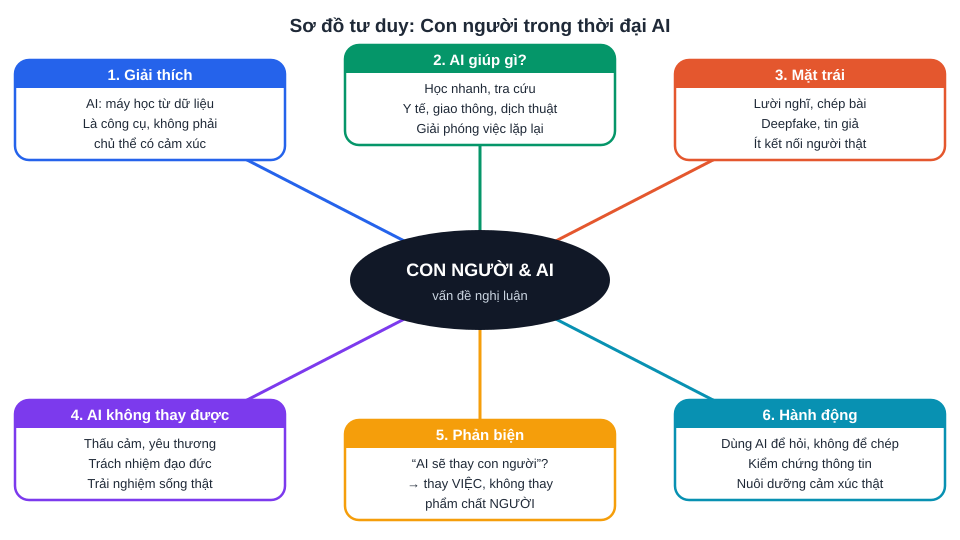

# Chuyên đề 14: Ngữ văn thời đại AI – con người, cảm xúc và công nghệ

> [Danh mục chuyên đề](Danh-Muc-Chuyen-De.md) · Mức ★★ · Dùng cho **cả hai** đề (Sở: bài NLXH 4 đ, đoạn văn NLVH 2 đ, đọc hiểu văn bản thông tin; PTNK: NLXH đề mở) · Học ở [tuần 12](../../LHP/Tuan-12-Ke-Hoach-Hoc-Tap.md) (kho dẫn chứng) và [tuần 19](../../LHP/Tuan-19-Ke-Hoach-Hoc-Tap.md) (văn bản thông tin), ôn lại trước mỗi đề thi thử · Thời lượng: 3 buổi × 60 phút

## 1. Đề Văn Sở TP.HCM 3 năm gần đây nói gì?

| Năm | Ngữ liệu / đề NLXH | Chủ đề lõi |
|---|---|---|
| 2024 | NLXH về lời khuyên **"biết nghĩ bằng con tim"**; chủ đề xuyên suốt "nhịp trái tim không chỉ dành cho riêng mình" | Sự thấu cảm, sống vì người khác |
| 2025 | NLXH: **"biết đọc"** – biết nhận ra những giá trị tốt đẹp đang bị che lấp – là một biểu hiện của sự trưởng thành | Cái nhìn sâu, trưởng thành |
| 2026 | Đọc hiểu truyện **"Chú robot tưởng mình là người"** (Lê Anh Vinh): robot tên **Biết Điều**, so sánh robot và con người về **cảm xúc**; bài NLXH xoay quanh **cảm xúc / thấu hiểu cảm xúc** ⚠️ *đối chiếu đề gốc* | Điều gì làm nên **con người** khi máy móc ngày càng giống người |

> **Quy luật rút ra:** đề Sở không hỏi "AI tốt hay xấu" một cách khô khan. Đề hỏi về **phẩm chất người**: trái tim, cảm xúc, sự thấu hiểu, cái nhìn tinh tế; và năm 2026 lần đầu đặt phẩm chất đó **cạnh máy móc**. Năm 2027 nên chuẩn bị cụm chủ đề **"con người trong thế giới số"** ở cả hai hướng đề: **trình bày quan điểm** và **đề xuất giải pháp**.

Đề Anh Sở 2026 cũng dùng nhiều ngữ liệu về **AI, deepfake, robot dọn nhà, đồng hồ thông minh, nghe nhạc trực tuyến** (xem [CĐ15](CD15-Anh-Chu-De-AI-Cong-Nghe.md)), nên vốn hiểu biết về chủ đề này giúp **cả hai môn**.

---

## 2. Sơ đồ tư duy cho mọi đề "con người và AI"

Chép sơ đồ vào vở. Gặp đề nào thuộc cụm này, **chọn 4 – 5 nhánh** phù hợp làm luận điểm.

---

## 3. Mười đề dự đoán (chia theo 2 hướng của đề Sở)

| # | Đề | Hướng |
|---|---|---|
| 1 | Trong thời đại AI, điều gì làm nên giá trị riêng của con người? | Quan điểm |
| 2 | Ý kiến: "Máy móc càng thông minh, con người càng cần sống bằng trái tim." | Quan điểm |
| 3 | Có người cho rằng dùng AI làm bài tập là "học thông minh". Em có đồng tình? | Quan điểm (phản biện) |
| 4 | Thấu hiểu cảm xúc của người khác trong thời đại nhắn tin thay cho trò chuyện | Quan điểm |
| 5 | Tin giả, ảnh giả (deepfake): "Thấy chưa chắc đã tin" | Quan điểm |
| 6 | Đề xuất giải pháp để học sinh **dùng AI có trách nhiệm** trong học tập | Giải pháp |
| 7 | Đề xuất giải pháp giúp học sinh **giảm thời gian dùng điện thoại** | Giải pháp |
| 8 | Đề xuất giải pháp để người trẻ **không bị cô đơn** giữa thế giới kết nối | Giải pháp |
| 9 | Sự tò mò và khả năng đặt câu hỏi khi "mọi câu trả lời đều có sẵn" | Quan điểm |
| 10 | Sáng tạo thật sự và sao chép trong thời đại AI tạo sinh | Quan điểm (PTNK) |

---

## 4. Hai dàn ý mẫu

### 4.1. Hướng quan điểm – Đề 1: "Trong thời đại AI, điều gì làm nên giá trị riêng của con người?"

| Phần | Nội dung |
|---|---|
| **Mở bài** | Dẫn từ hiện tượng: AI viết văn, vẽ tranh, trả lời mọi câu hỏi → câu hỏi đặt ra: con người còn gì là riêng? Nêu quan điểm: giá trị riêng nằm ở **trái tim biết rung cảm, khả năng chịu trách nhiệm và trải nghiệm sống thật**. |
| **Giải thích** | AI: hệ thống máy học từ dữ liệu, mô phỏng một số khả năng trí tuệ. "Giá trị riêng": điều con người có mà máy không thể có, dù mô phỏng giỏi đến đâu. |
| **Luận điểm 1** | AI mô phỏng được câu chữ về cảm xúc, nhưng **không trải nghiệm** cảm xúc. Lời an ủi của người bạn có giá trị vì người đó **đã dành thời gian và tấm lòng**. (Liên hệ: robot Biết Điều trong đề 2026 "biết điều" nhưng chưa biết **thương**.) |
| **Luận điểm 2** | Con người **chịu trách nhiệm đạo đức** cho lựa chọn của mình; máy không chịu trách nhiệm. Vì vậy quyết định quan trọng (y tế, tòa án, giáo dục) vẫn cần con người. |
| **Luận điểm 3** | Con người biết **đặt câu hỏi đáng hỏi**: AI giỏi trả lời, nhưng câu hỏi hay xuất phát từ tò mò, trăn trở, nỗi đau và ước mơ của người thật. |
| **Phản biện** | "AI sẽ thay thế con người?" → AI thay **một số công việc**, không thay **phẩm chất người**. Ngược lại, người **không rèn** cảm xúc và tư duy mới thật sự dễ bị thay thế. |
| **Bài học, hành động** | Dùng AI như công cụ để **hỏi và kiểm chứng**, không để nghĩ hộ; dành thời gian cho trò chuyện thật, đọc sách, trải nghiệm thật; nuôi dưỡng lòng trắc ẩn. |
| **Kết bài** | Khẳng định: máy càng giống người, con người càng phải **sống người hơn**. |

### 4.2. Hướng giải pháp – Đề 6: "Đề xuất giải pháp để học sinh dùng AI có trách nhiệm trong học tập"

| Phần | Nội dung |
|---|---|
| **Nêu vấn đề** | Thực trạng: nhiều học sinh dùng chatbot để làm bài hộ, chép nguyên văn; hậu quả: mất khả năng tự nghĩ, điểm số không phản ánh năng lực, dễ tin thông tin sai do AI "bịa". |
| **Nguyên nhân** | Áp lực bài tập; AI tiện và nhanh; chưa có hướng dẫn dùng AI đúng cách; tâm lý "miễn có kết quả". |
| **Giải pháp 1 – Bản thân** | Quy tắc **"tự nghĩ 15 phút trước khi hỏi"**; hỏi AI **gợi ý, giải thích lỗi**, không xin đáp án; tự viết lại bằng lời của mình. |
| **Giải pháp 2 – Kiểm chứng** | Đối chiếu thông tin AI đưa ra với sách giáo khoa, nguồn chính thống; ghi nguồn khi dùng. |
| **Giải pháp 3 – Nhà trường, gia đình** | Thầy cô ra bài yêu cầu **trình bày quá trình** (vì sao, như thế nào); bố mẹ cùng đặt quy định giờ dùng thiết bị. |
| **Tính khả thi** | Mỗi giải pháp nêu **ai làm, làm khi nào, đo kết quả thế nào** (ví dụ: mỗi tuần tự giải 10 bài không dùng AI rồi so kết quả). |
| **Kết** | AI là "người trợ giảng" tốt nếu con người giữ vai trò **người học**. |

> **Điểm khác của bài giải pháp:** giám khảo chấm **tính cụ thể và khả thi**. Mỗi giải pháp phải trả lời được: *ai – làm gì – khi nào – vì sao hiệu quả*.

---

## 5. Kho dẫn chứng (đã kiểm chứng, dùng an toàn)

| Dẫn chứng | Dùng cho ý |
|---|---|
| 1997: siêu máy tính **Deep Blue** (IBM) thắng nhà vô địch cờ vua **Garry Kasparov** | Máy vượt người ở một kỹ năng hẹp |
| 2016: **AlphaGo** (DeepMind) thắng kỳ thủ cờ vây **Lee Sedol** 4 – 1 | AI học được những điều tưởng chỉ người làm được |
| 2024: **Giải Nobel Hóa học** trao cho David Baker, **Demis Hassabis** và **John Jumper**; hai người sau được vinh danh vì **AlphaFold** – AI dự đoán cấu trúc protein | AI phục vụ khoa học, y học khi con người làm chủ |
| Cuối 2022: **ChatGPT** ra mắt và có hàng trăm triệu người dùng chỉ sau thời gian ngắn | Tốc độ bùng nổ của AI tạo sinh |
| Đầu 2024: một nhân viên công ty ở **Hồng Kông** bị lừa chuyển khoảng **25 triệu USD** sau cuộc họp video mà các "đồng nghiệp" đều là **deepfake** | Mặt trái, tin giả, cần tư duy phản biện |
| 2024: **Liên minh châu Âu** thông qua **Đạo luật AI** (EU AI Act), luật toàn diện đầu tiên về AI | Con người đặt giới hạn, trách nhiệm cho AI |
| Việt Nam: **Chiến lược quốc gia về nghiên cứu, phát triển và ứng dụng trí tuệ nhân tạo đến năm 2030** (Quyết định 127/QĐ-TTg, 2021) | AI là xu thế, cần chuẩn bị năng lực |
| *Hoàng tử bé* (Saint-Exupéry): "Người ta chỉ nhìn thấy thật rõ bằng trái tim. Cái cốt yếu thì mắt thường không thấy được." | Giá trị của trái tim, cảm xúc (rất hợp đề 2024 – 2026) |
| Truyện "Chú robot tưởng mình là người" (Lê Anh Vinh) – ngữ liệu đề 2026 | Robot "biết điều" khác con người "biết thương" |

> **Nguyên tắc dùng dẫn chứng:** mỗi bài **2 – 3 dẫn chứng**, mỗi dẫn chứng **phân tích 2 câu** (nó chứng minh điều gì), không kể lể. **Không bịa số liệu**: nếu không nhớ chính xác, viết "hàng triệu", "gần đây" thay vì một con số sai.

---

## 6. Đọc hiểu: nhân vật robot, đồ vật biết nói và văn bản thông tin về công nghệ

### 6.1. Truyện có nhân vật **phi nhân** (robot, đồ vật, con vật) – dạng phần 1 đề 2026

| Câu hỏi hay gặp | Cách trả lời |
|---|---|
| Nhân vật robot **giống / khác** con người ở điểm nào? | Lập bảng 2 cột từ **chi tiết trong văn bản** (hành động, lời nói, suy nghĩ) |
| Ý nghĩa **tên nhân vật** (ví dụ "Biết Điều") | Nghĩa đen → nghĩa hàm ẩn → thái độ của tác giả |
| Tác dụng của **nhân hóa / điểm nhìn** của robot | Giúp nhìn con người **từ bên ngoài**, tạo sự lạ hóa, làm nổi bật điều con người hay quên |
| Thông điệp của truyện | Thường là: điều làm nên con người là **cảm xúc, tình thương**, không phải sự hoàn hảo |

**Đoạn văn NLVH 2 điểm (~200 chữ) về truyện có nhân vật robot – khung 5 câu:**
1. Câu chủ đề: nêu nhận xét về nhân vật / chủ đề.
2. – 3. Hai chi tiết tiêu biểu + phân tích.
4. Nghệ thuật: điểm nhìn, nhân hóa, giọng kể, kết thúc.
5. Đánh giá + liên hệ ngắn (con người trong thời đại máy móc).

### 6.2. Văn bản thông tin về công nghệ (phần 2, câu 1 – 1 điểm)

| Câu hỏi | Gợi ý |
|---|---|
| Mục đích của văn bản | Cung cấp thông tin / cảnh báo / hướng dẫn |
| Cách trình bày thông tin | Theo trình tự thời gian, nguyên nhân – kết quả, so sánh, phân loại |
| Tác dụng của **phương tiện phi ngôn ngữ** (số liệu, biểu đồ, hình ảnh) | Trực quan, tăng độ tin cậy, dễ so sánh |
| Thái độ của người viết | Tìm từ ngữ đánh giá: "đáng lo ngại", "cơ hội", "cần thận trọng" |

---

## 7. Bài luyện

| # | Bài | Thời gian | Xong |
|---|---|---|---|
| 1 | Lập dàn ý đề 2 và đề 5 (theo sơ đồ tư duy) | 2 × 15' | [ ] |
| 2 | Viết **bài hoàn chỉnh** đề 1 hoặc đề 3 (≈ 600 chữ), nhờ thầy cô chấm | 45' | [ ] |
| 3 | Viết **bài giải pháp** đề 7 (mỗi giải pháp đủ *ai – làm gì – khi nào – vì sao*) | 45' | [ ] |
| 4 | Đọc lại truyện ngữ liệu đề 2026, viết đoạn văn 200 chữ về nhân vật Biết Điều | 25' | [ ] |
| 5 | Mỗi tuần chọn 1 bài báo về công nghệ, ghi **1 dẫn chứng** vào kho (tên – năm – ý nghĩa) | 10'/tuần | [ ] |

---

## 8. Lỗi hay gặp

| Lỗi | Cách sửa |
|---|---|
| Bài viết thành **bài thuyết minh về AI** (kể công dụng) | Luôn quay về **con người**: phẩm chất, lựa chọn, trách nhiệm |
| Một chiều: "AI rất nguy hiểm" hoặc "AI rất tốt" | Có đoạn **phản biện** và quan điểm cân bằng |
| Dẫn chứng chung chung ("nhiều người dùng AI") | Có tên, năm, sự kiện cụ thể (mục 5) |
| Giải pháp sáo rỗng ("cần nâng cao ý thức") | Giải pháp phải **làm được ngay**, đo được |
| Dùng thuật ngữ sai (deepfake, thuật toán) | Giải thích ngắn bằng lời dễ hiểu, hoặc không dùng |
