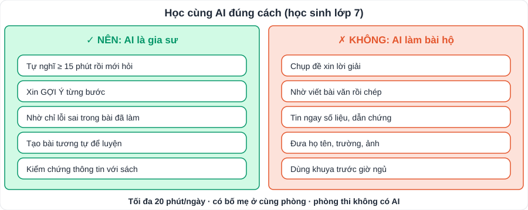

# Học cùng AI đúng cách (dành cho học sinh lớp 7)

> **Dành cho:** con (quy tắc, câu lệnh mẫu) và bố mẹ (giám sát, đặt giới hạn).
> [README](README.md) · [Lộ trình tổng quan](LoTrinh/Lo-Trinh-Tong-Quan.md) · [Kiến thức các môn](KienThuc/README.md)

Phòng thi **không có AI**. Dùng AI chỉ có một mục tiêu: giúp con **tự làm được** bài. Cách dùng nào khiến con **ít phải suy nghĩ hơn** là cách dùng sai.

> **Lưu ý về độ tuổi:** nhiều chatbot AI quy định độ tuổi tối thiểu (thường 13 tuổi trở lên, hoặc cần cha mẹ đồng ý). Học sinh lớp 7 (12 – 13 tuổi) nên dùng **tài khoản của bố mẹ, khi có bố mẹ ở cùng phòng**.

---

## 1. Năm quy tắc vàng

| # | Quy tắc | Vì sao |
|---|---|---|
| 1 | **Tự nghĩ ít nhất 15 phút** trước khi hỏi AI | Lúc "vật lộn" với bài chính là lúc não học |
| 2 | Xin **gợi ý từng bước**, không xin **đáp án** | Đọc đáp án có sẵn dễ tưởng mình đã hiểu, nhưng vào thi lại không làm được |
| 3 | **Kiểm chứng** thông tin với SGK, thầy cô | AI có thể **bịa** năm, tên người, số liệu rất thuyết phục |
| 4 | **Viết bằng lời của mình** | Bài văn chép từ AI dễ bị nhận ra và không có cảm xúc thật |
| 5 | Không đưa **thông tin cá nhân** (họ tên, trường, ảnh, địa chỉ) | An toàn trên mạng (liên hệ Tin học 7, GDCD 7) |

---

## 2. Năm cách dùng hiệu quả (câu lệnh mẫu)

| Việc | Câu lệnh mẫu (chép và sửa) | Môn |
|---|---|---|
| **Chỉ lỗi sai** (sau khi đã tự chữa) | *"Đây là bài giải của em: [dán]. Đáp án đúng là [ ]. Đừng giải lại, chỉ ra em sai ở bước nào và vì sao."* | Toán, KHTN |
| **Gợi ý từng bước** | *"Em đang làm bài hình này: [dán đề]. Em đã làm được câu a. Cho em MỘT gợi ý nhỏ cho câu b, chưa giải."* | Toán |
| **Tạo bài tương tự** | *"Tạo 5 bài tìm x tương tự bài này cho học sinh lớp 7, độ khó tăng dần, đáp án để riêng ở cuối."* | Toán, Anh |
| **Hỏi đố kiểu thầy giáo** | *"Hãy hỏi em 10 câu về các triều đại Lý, Trần (Lịch sử 7), mỗi lần 1 câu, chấm sau khi em trả lời."* | Sử, Địa, KHTN |
| **Nhận xét bài viết** | *"Nhận xét đoạn văn của em theo 4 tiêu chí: đúng yêu cầu, ý, dẫn chứng, diễn đạt. Chỉ ra 3 câu cần sửa, KHÔNG viết lại."* | Văn, Anh |

> Nhận xét của AI về bài văn **chỉ để tham khảo**. Lời chấm của **thầy cô** mới là chuẩn.

---

## 3. Năm việc KHÔNG làm

| ✗ | Việc | Thay bằng |
|---|---|---|
| 1 | Chụp đề, xin lời giải | Tự làm → hỏi gợi ý |
| 2 | Nhờ AI viết bài văn rồi chép | Tự lập dàn ý → nhờ AI hỏi vặn dàn ý |
| 3 | Dùng dẫn chứng, số liệu AI đưa mà không kiểm tra | Đối chiếu SGK, báo chính thống |
| 4 | Dùng AI để làm bài tập về nhà "cho nhanh" | Làm bài tự lực; AI chỉ dùng khi chữa |
| 5 | Dùng AI sau 20:15 | Giữ giờ ngủ 21:30 |

---

## 4. Lồng vào lịch học (không thêm giờ)

| Buổi trong lịch tuần | Cách dùng AI | Tối đa |
|---|---|---|
| Sáng thứ 7 (Toán) | Sau khi đã chữa theo đáp án: hỏi AI về **câu vẫn chưa hiểu** | 15 phút |
| Chiều thứ 7 (Văn) | Nhờ nhận xét đoạn văn theo 4 tiêu chí, rồi **tự sửa** | 10 phút |
| Chủ nhật (Sử – Địa) | Nhờ AI hỏi đố 10 câu thay bố mẹ (khi bố mẹ bận) | 10 phút |

> **Tổng thời gian dùng AI: ≤ 20 phút/ngày.** Cuối tuần, bố mẹ cùng con xem lại lịch sử trò chuyện, giống như xem sổ lỗi sai.

---

## 5. Dấu hiệu đang dùng AI sai

- Bài tập về nhà điểm cao nhưng **bài kiểm tra trên lớp** điểm thấp hơn hẳn.
- Không **giải thích lại** được bằng lời bài mình vừa "làm".
- Mở chatbot **trước** khi đọc hết đề.

Gặp 2 dấu hiệu trở lên: **tạm dừng dùng AI 2 tuần**, quay lại quy tắc 1 – 2.
