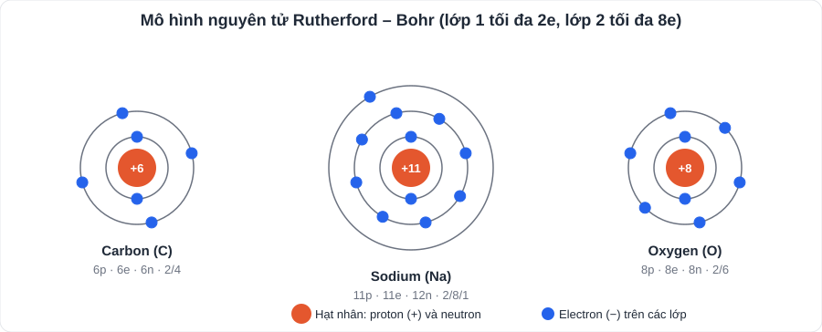
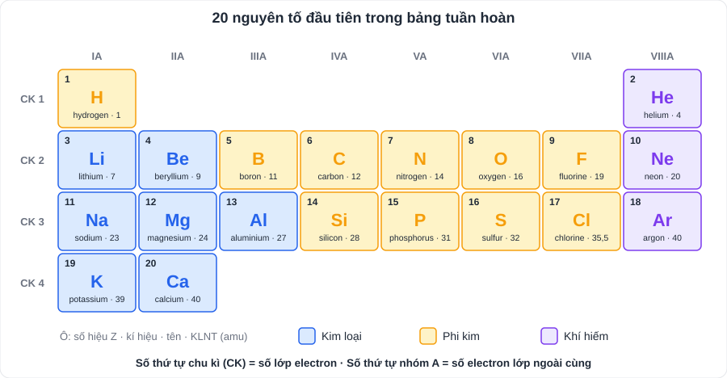

# KHTN 1: Nguyên tử – Nguyên tố hóa học – Sơ lược bảng tuần hoàn

> [Danh mục kiến thức](../README.md) · Học ở [tuần 1](../../LoTrinh/Tuan-01-Ke-Hoach-Hoc-Tap.md) – [tuần 2](../../LoTrinh/Tuan-02-Ke-Hoach-Hoc-Tap.md) · Ôn lại tuần 5 và tuần 10

## Mục tiêu

- Mô tả cấu tạo nguyên tử theo mô hình **Rutherford – Bohr**.
- Thuộc **kí hiệu, số hiệu, khối lượng nguyên tử** của 20 nguyên tố đầu.
- Đọc được **ô nguyên tố, chu kì, nhóm** trong bảng tuần hoàn.

---

## 1. Nguyên tử

| Thành phần | Vị trí | Điện tích | Khối lượng (amu) |
|---|---|---|---|
| **Proton (p)** | Hạt nhân | **+1** | ≈ 1 |
| **Neutron (n)** | Hạt nhân | 0 (không mang điện) | ≈ 1 |
| **Electron (e)** | Lớp vỏ, chuyển động quanh hạt nhân theo **từng lớp** | **−1** | ≈ 0,00055 (rất nhỏ) |

- Nguyên tử **trung hòa về điện**: **số p = số e**.
- **Khối lượng nguyên tử ≈ số p + số n** (amu), vì khối lượng electron rất nhỏ.
- Lớp electron: lớp 1 tối đa **2e**; lớp 2 tối đa **8e**; lớp 3 (với 20 nguyên tố đầu) chứa tối đa 8e.
  - Ví dụ: Na (11e): **2 / 8 / 1**; Cl (17e): **2 / 8 / 7**; O (8e): **2 / 6**.
- 1 **amu** (đơn vị khối lượng nguyên tử) ≈ 1,6605 · 10⁻²⁴ g.

## 2. Nguyên tố hóa học

- Nguyên tố hóa học là tập hợp những nguyên tử **cùng số proton** trong hạt nhân.
- **Số proton = số hiệu nguyên tử** (đặc trưng cho nguyên tố).
- **Kí hiệu hóa học**: 1 hoặc 2 chữ cái, chữ đầu **viết hoa**, chữ sau viết thường (Ca, **không** viết CA hay ca).
- Tên gọi theo **IUPAC** (SGK mới dùng): sodium (natri), potassium (kali), iron (sắt), copper (đồng), sulfur (lưu huỳnh), nitrogen (nitơ)…

### 20 nguyên tố đầu tiên (cần thuộc)

| Z | Kí hiệu | Tên (IUPAC – tiếng Việt) | KLNT (amu) | | Z | Kí hiệu | Tên | KLNT |
|---|---|---|---|---|---|---|---|---|
| 1 | **H** | hydrogen | 1 | | 11 | **Na** | sodium (natri) | 23 |
| 2 | **He** | helium | 4 | | 12 | **Mg** | magnesium | 24 |
| 3 | **Li** | lithium | 7 | | 13 | **Al** | aluminium (nhôm) | 27 |
| 4 | **Be** | beryllium | 9 | | 14 | **Si** | silicon | 28 |
| 5 | **B** | boron | 11 | | 15 | **P** | phosphorus | 31 |
| 6 | **C** | carbon | 12 | | 16 | **S** | sulfur (lưu huỳnh) | 32 |
| 7 | **N** | nitrogen | 14 | | 17 | **Cl** | chlorine | 35,5 |
| 8 | **O** | oxygen | 16 | | 18 | **Ar** | argon | 40 |
| 9 | **F** | fluorine | 19 | | 19 | **K** | potassium (kali) | 39 |
| 10 | **Ne** | neon | 20 | | 20 | **Ca** | calcium | 40 |

**Thêm vài nguyên tố hay gặp:** Fe (iron – sắt) 56; Cu (copper – đồng) 64; Zn (zinc – kẽm) 65; Ag (silver – bạc) 108; Ba (barium) 137.

> **Mẹo nhớ:** chia thành 4 cụm 5 nguyên tố (H He Li Be B · C N O F Ne · Na Mg Al Si P · S Cl Ar K Ca). Với mỗi cụm, con **tự đặt một câu vui** bằng các chữ cái đầu. Câu tự đặt nhớ lâu hơn câu có sẵn. Mỗi tối đọc to một lượt trong 1 tuần.

## 3. Sơ lược bảng tuần hoàn

| Khái niệm | Nội dung |
|---|---|
| **Nguyên tắc sắp xếp** | Theo chiều **tăng dần điện tích hạt nhân (số hiệu Z)**; cùng số lớp e → cùng hàng; cùng số e lớp ngoài cùng → cùng cột |
| **Ô nguyên tố** | Cho biết: số hiệu nguyên tử, kí hiệu, tên, khối lượng nguyên tử |
| **Chu kì** (hàng ngang) | 7 chu kì. **Số thứ tự chu kì = số lớp electron** |
| **Nhóm** (cột dọc) | Các nguyên tố có **tính chất hóa học tương tự**. Nhóm A: **số thứ tự nhóm = số e lớp ngoài cùng** |
| **Kim loại / phi kim / khí hiếm** | **Kim loại**: phần lớn, bên trái (Na, Mg, Al, K, Ca); **phi kim**: phía trên bên phải (C, N, O, S, Cl); **khí hiếm**: nhóm VIIIA, cột cuối (He, Ne, Ar) |

**Ví dụ:** Mg (Z = 12): 2 / 8 / 2 → **3 lớp e ⇒ chu kì 3**; **2e lớp ngoài ⇒ nhóm IIA**; kim loại.

---

## 4. Lỗi hay gặp

- Viết sai kí hiệu: CL, co (đúng: **Cl**, **Co** – coban, khác **CO** – carbon monoxide).
- Quên lớp 1 chỉ chứa tối đa 2e.
- Nhầm số hiệu nguyên tử (số p) với khối lượng nguyên tử (p + n).

---

## 5. Bài tập tự luyện

1. Nguyên tử X có 8 proton, 8 neutron. a) Số electron? b) Khối lượng nguyên tử? c) X là nguyên tố nào? d) Vẽ sơ đồ cấu tạo nguyên tử.
2. Nguyên tử Al có 13 proton, 14 neutron. Tính khối lượng nguyên tử; viết sự phân bố electron theo lớp.
3. Viết kí hiệu hóa học: nitrogen, potassium, iron, chlorine, calcium.
4. Nguyên tố Y ở **chu kì 3, nhóm VIIA**. Y có mấy lớp e, mấy e lớp ngoài cùng? Y là nguyên tố nào? Kim loại hay phi kim?
5. ★ Tổng số hạt (p, n, e) trong một nguyên tử là 34, trong đó số hạt mang điện nhiều hơn số hạt không mang điện là 10. Tìm số p, n, e và tên nguyên tố.

👉 Bấm để xem đáp án

1. a) **8e**; b) 8 + 8 = **16 amu**; c) **oxygen (O)**; d) hạt nhân 8+, lớp 1: 2e, lớp 2: 6e.
2. 13 + 14 = **27 amu**; phân bố **2 / 8 / 3**.
3. **N, K, Fe, Cl, Ca**.
4. **3 lớp e**, **7e** lớp ngoài cùng ⇒ 2 / 8 / 7 ⇒ Z = 17 ⇒ **chlorine (Cl)**, **phi kim**.
5. p = e. Ta có 2p + n = 34 và 2p − n = 10 ⇒ 4p = 44 ⇒ **p = e = 11**, **n = 12** ⇒ **sodium (Na)**.

