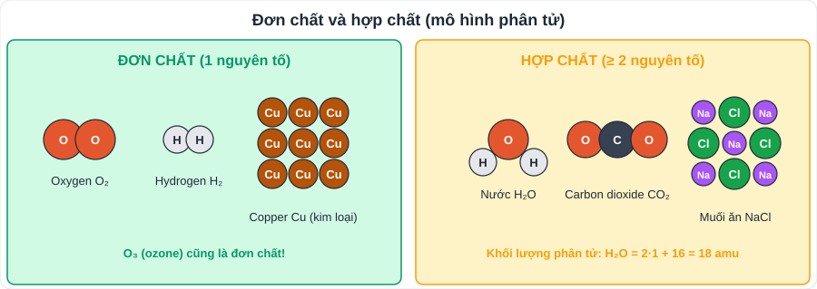
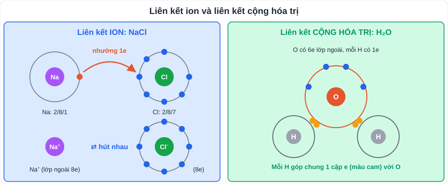

# KHTN 2: Phân tử – Liên kết hóa học – Hóa trị và công thức hóa học

> [Danh mục kiến thức](../README.md) · Học ở [tuần 3](../../LoTrinh/Tuan-03-Ke-Hoach-Hoc-Tap.md) – [tuần 4](../../LoTrinh/Tuan-04-Ke-Hoach-Hoc-Tap.md) · Ôn lại tuần 5 và tuần 10 · **Nền tảng của toàn bộ Hóa học lớp 8 – 9**

## Mục tiêu

- Phân biệt **đơn chất – hợp chất**, tính **khối lượng phân tử**.
- Mô tả **liên kết ion** và **liên kết cộng hóa trị**.
- Lập **công thức hóa học** theo hóa trị; tính **phần trăm khối lượng** nguyên tố.

---

## 1. Phân tử, đơn chất, hợp chất

| Khái niệm | Định nghĩa | Ví dụ |
|---|---|---|
| **Phân tử** | Hạt đại diện cho chất, gồm một số nguyên tử liên kết với nhau, thể hiện đầy đủ tính chất hóa học của chất | H₂O, O₂, CO₂ |
| **Đơn chất** | Chất tạo nên từ **một** nguyên tố hóa học | O₂, H₂, N₂, Fe, Cu, C |
| **Hợp chất** | Chất tạo nên từ **hai trở lên** nguyên tố | H₂O, NaCl, CO₂, CaCO₃ |

- **Khối lượng phân tử** = tổng khối lượng các nguyên tử trong phân tử (amu).
  - H₂O = 2·1 + 16 = **18 amu**; CO₂ = 12 + 2·16 = **44 amu**; CaCO₃ = 40 + 12 + 3·16 = **100 amu**.

## 2. Liên kết hóa học

- **Khí hiếm** (He, Ne, Ar) có lớp electron ngoài cùng **bền vững** (8e, riêng He 2e) nên **khó** tham gia phản ứng. Các nguyên tử khác liên kết với nhau để đạt lớp vỏ **giống khí hiếm**.

| | **Liên kết ion** | **Liên kết cộng hóa trị** |
|---|---|---|
| Hình thành | Kim loại **nhường** e → ion dương; phi kim **nhận** e → ion âm; hai ion **hút nhau** | Các nguyên tử phi kim **dùng chung** cặp electron |
| Ví dụ | **NaCl**: Na → Na⁺ + 1e; Cl + 1e → Cl⁻ | **H₂, Cl₂, H₂O, CO₂, CH₄** |
| Chất tạo thành | Chất ion: thường **rắn**, nhiệt độ nóng chảy cao, dung dịch **dẫn điện** | Chất cộng hóa trị: có thể rắn, lỏng, khí |

## 3. Hóa trị và công thức hóa học

### 3.1. Hóa trị

- Hóa trị là con số biểu thị **khả năng liên kết** của nguyên tử nguyên tố này với nguyên tử nguyên tố khác. Lấy hóa trị của **H là I**, của **O là II** làm đơn vị.

| Hóa trị | Nguyên tố / nhóm nguyên tử |
|---|---|
| **I** | H, Na, K, Cl (với H, kim loại), Ag; nhóm **OH**, **NO₃** |
| **II** | O, Mg, Ca, Zn, Ba, Cu (thường gặp); nhóm **SO₄**, **CO₃** |
| **III** | Al; nhóm **PO₄** |
| Nhiều hóa trị | **Fe** (II, III); **C** (II, IV); **S** (II, IV, VI); **N** (I – V); **P** (III, V) |

> **Bài ca hóa trị** (đoạn đầu): *"Kali (K), iốt (I), hiđro (H) / Natri (Na) với bạc (Ag), clo (Cl) một loài / Có hóa trị I em ơi / Nhớ ghi cho kĩ kẻo hoài phân vân. / Magie (Mg), chì (Pb), kẽm (Zn), thủy ngân (Hg) / Canxi (Ca), đồng (Cu) ấy cũng gần bari (Ba) / Cuối cùng thêm chú oxi (O) / Hóa trị II ấy có gì khó khăn."*

### 3.2. Quy tắc hóa trị và lập công thức

**Quy tắc:** trong công thức AₓBᵧ (A hóa trị a, B hóa trị b): **x · a = y · b**.

**Cách lập nhanh ("chéo hóa trị"):** x = b, y = a, rồi **rút gọn** nếu được.

| Hợp chất của | Hóa trị | Công thức |
|---|---|---|
| Al và O | III, II | **Al₂O₃** |
| Ca và Cl | II, I | **CaCl₂** |
| Mg và O | II, II | 2 và 2 → rút gọn **MgO** |
| Fe(III) và nhóm OH | III, I | **Fe(OH)₃** |
| Na và nhóm SO₄ | I, II | **Na₂SO₄** |
| C(IV) và O | IV, II | 2 và 4 → rút gọn **CO₂** |

**Tìm hóa trị:** trong Fe₂O₃: x · a = y · b ⇒ 2 · a = 3 · II ⇒ **Fe hóa trị III**.

### 3.3. Ý nghĩa công thức hóa học và phần trăm khối lượng

Công thức hóa học cho biết: các **nguyên tố** tạo nên chất, **số nguyên tử** mỗi nguyên tố trong một phân tử, **khối lượng phân tử**.

> **%A = (khối lượng của A trong phân tử / khối lượng phân tử) × 100%**

**Ví dụ:** trong CO₂ (44 amu): %C = 12/44 · 100% ≈ **27,3%**; %O ≈ **72,7%**.

---

## 4. Lỗi hay gặp

- Viết CO2, H2O không có chỉ số dưới (đúng: CO**₂**, H**₂**O).
- Quên **rút gọn** (viết Mg₂O₂ thay vì MgO).
- Quên **ngoặc** cho nhóm nguyên tử có chỉ số > 1: Ca(OH)₂, **không** viết CaOH₂.
- Nhầm đơn chất với hợp chất khi phân tử có **nhiều nguyên tử cùng loại** (O₃ vẫn là **đơn chất**).

---

## 5. Bài tập tự luyện

1. Chất nào là đơn chất, hợp chất: O₃, NaCl, Cu, H₂SO₄, N₂, CH₄?
2. Tính khối lượng phân tử: NaCl, H₂SO₄, Al₂O₃, Ca(OH)₂.
3. Lập công thức hóa học: a) K và O; b) Al và Cl; c) Ba và nhóm NO₃; d) Fe(II) và nhóm SO₄.
4. Tìm hóa trị của: a) N trong NH₃; b) S trong SO₃; c) Cu trong CuO.
5. Tính phần trăm khối lượng các nguyên tố trong Fe₂O₃.
6. Vì sao muối ăn (NaCl) ở thể rắn, còn nước (H₂O) ở thể lỏng ở nhiệt độ phòng? (Gợi ý: loại liên kết.)

👉 Bấm để xem đáp án

1. Đơn chất: **O₃, Cu, N₂**. Hợp chất: **NaCl, H₂SO₄, CH₄**.
2. NaCl = 23 + 35,5 = **58,5**; H₂SO₄ = 2 + 32 + 64 = **98**; Al₂O₃ = 54 + 48 = **102**; Ca(OH)₂ = 40 + 2·17 = **74** (amu).
3. a) **K₂O**; b) **AlCl₃**; c) **Ba(NO₃)₂**; d) **FeSO₄**.
4. a) **III**; b) **VI**; c) **II**.
5. Fe₂O₃ = 112 + 48 = 160 ⇒ %Fe = 112/160 = **70%**; %O = **30%**.
6. NaCl là **chất ion** (các ion hút nhau rất mạnh) nên rắn, nhiệt độ nóng chảy cao; H₂O là chất **cộng hóa trị**, lực hút giữa các phân tử yếu hơn nên ở thể lỏng.

