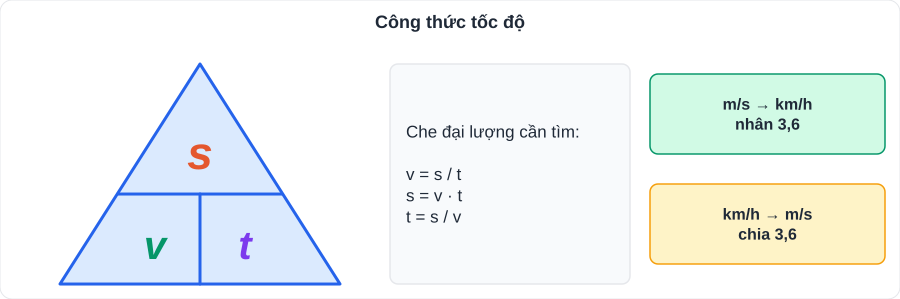
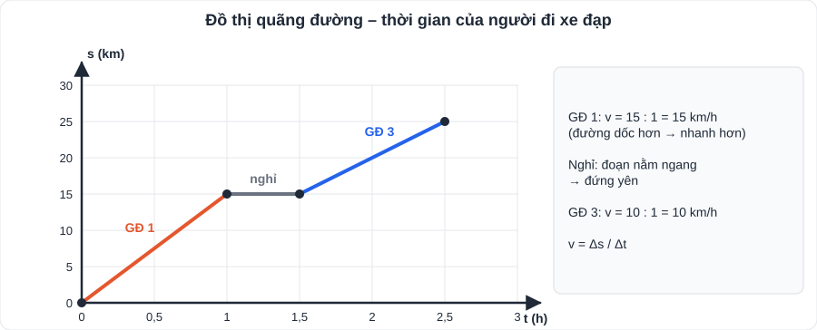
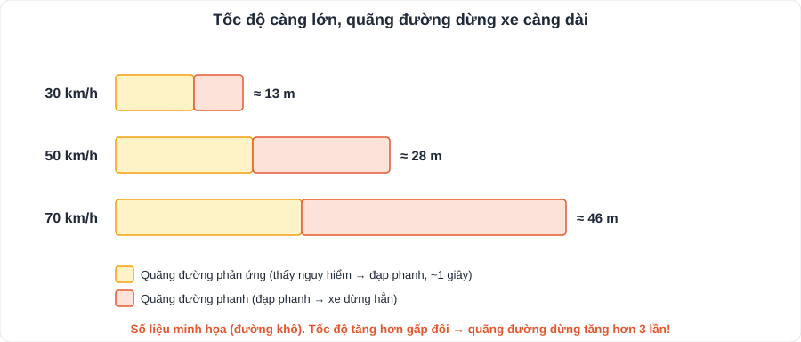

# KHTN 3: Tốc độ

> [Danh mục kiến thức](../README.md) · Học ở [tuần 5](../../LoTrinh/Tuan-05-Ke-Hoach-Hoc-Tap.md) – [tuần 6](../../LoTrinh/Tuan-06-Ke-Hoach-Hoc-Tap.md) · Ôn lại tuần 10 · **Bài tập tính toán: dễ lấy điểm nếu cẩn thận đơn vị**

## Mục tiêu

- Tính **tốc độ, quãng đường, thời gian**; đổi đơn vị **km/h ↔ m/s**.
- Vẽ và đọc **đồ thị quãng đường – thời gian**.
- Hiểu ý nghĩa của tốc độ với **an toàn giao thông**.

---

## 1. Kiến thức cần nhớ

### 1.1. Tốc độ

- Tốc độ cho biết **mức độ nhanh hay chậm** của chuyển động, bằng quãng đường đi được trong một đơn vị thời gian.

> **v = s / t** ⇒ **s = v · t**; **t = s / v**

| Đại lượng | Kí hiệu | Đơn vị thường dùng |
|---|---|---|
| Tốc độ | v | **m/s**, **km/h** |
| Quãng đường | s | m, km |
| Thời gian | t | s, h |

- **Đổi đơn vị:** 1 m/s = **3,6 km/h**; 1 km/h = 1/3,6 m/s ≈ 0,28 m/s.
  - 36 km/h = 10 m/s; 54 km/h = 15 m/s; 72 km/h = 20 m/s.
- **Mẹo:** km/h → m/s: **chia 3,6**; m/s → km/h: **nhân 3,6**.

### 1.2. Đo tốc độ

- Dụng cụ: **thước** đo quãng đường + **đồng hồ bấm giây** (hoặc **đồng hồ đo thời gian hiện số dùng cổng quang điện**).
- **Thiết bị "bắn tốc độ"** của cảnh sát giao thông: đo tốc độ phương tiện.

### 1.3. Đồ thị quãng đường – thời gian

- Trục ngang: **thời gian t**; trục đứng: **quãng đường s**.
- Chuyển động với tốc độ **không đổi**: đồ thị là **đoạn thẳng xiên**. Đường **càng dốc** → tốc độ **càng lớn**.
- Đoạn **nằm ngang** → vật **đứng yên** (s không đổi).
- Từ đồ thị: chọn 2 điểm → v = Δs / Δt.

### 1.4. Tốc độ và an toàn giao thông

- Tốc độ càng lớn → **quãng đường dừng xe càng dài** (cần thời gian phản ứng + phanh) → càng nguy hiểm.
- Phải tuân thủ **biển báo tốc độ tối đa** và **khoảng cách an toàn** giữa hai xe.

---

## 2. Dạng bài và cách làm

**Ví dụ 1.** Bạn An đi xe đạp từ nhà đến trường dài 3 km hết 15 phút. Tính tốc độ ra km/h và m/s.
> t = 15 phút = 0,25 h ⇒ v = 3 : 0,25 = **12 km/h** = 12 : 3,6 ≈ **3,33 m/s**.

**Ví dụ 2.** Một ô tô chạy với tốc độ 60 km/h trong 1 giờ 30 phút. Tính quãng đường.
> s = 60 · 1,5 = **90 km**.

**Ví dụ 3.** Âm thanh truyền trong không khí với tốc độ 340 m/s. Sau khi thấy tia chớp 3 giây mới nghe tiếng sấm. Tia sét cách người quan sát bao xa?
> s = 340 · 3 = **1020 m** (coi ánh sáng đến gần như tức thời).

**Ví dụ 4 (đọc đồ thị).** Một người đi xe đạp: 0 – 1 h đi được 15 km; 1 h – 1,5 h dừng nghỉ; 1,5 h – 2,5 h đi thêm 10 km.
a) Tốc độ giai đoạn 1? → **15 km/h**. b) Giai đoạn 2? → **đứng yên**. c) Giai đoạn 3? → **10 km/h**. d) Giai đoạn nào nhanh hơn? → **giai đoạn 1** (đồ thị dốc hơn).

---

## 3. Lỗi hay gặp

- **Trộn đơn vị**: s (km) với t (phút). Phải đổi phút → giờ (15 phút = 0,25 h; 20 phút = 1/3 h).
- Nhầm chiều đổi: 10 m/s = 36 km/h (nhân), không phải chia.
- Đọc nhầm trục đồ thị.

---

## 4. Bài tập tự luyện

1. Đổi: a) 90 km/h = ? m/s; b) 5 m/s = ? km/h.
2. Một học sinh chạy 100 m hết 20 s. Tính tốc độ.
3. Tàu hỏa đi với tốc độ 50 km/h trong 2 giờ 15 phút. Tính quãng đường.
4. Ô tô đi quãng đường 120 km với tốc độ 48 km/h. Hết bao lâu?
5. ★ Hai bạn cùng xuất phát từ nhà đến thư viện cách 6 km. An đi xe đạp 12 km/h; Bình đi bộ 4 km/h. An đến trước Bình bao nhiêu phút?

👉 Bấm để xem đáp án

1. a) 90 : 3,6 = **25 m/s**; b) 5 · 3,6 = **18 km/h**.
2. v = 100 : 20 = **5 m/s**.
3. 2 h 15 phút = 2,25 h ⇒ s = 50 · 2,25 = **112,5 km**.
4. t = 120 : 48 = **2,5 h** (2 giờ 30 phút).
5. An: 6 : 12 = 0,5 h = 30 phút; Bình: 6 : 4 = 1,5 h = 90 phút ⇒ An đến trước **60 phút**.

