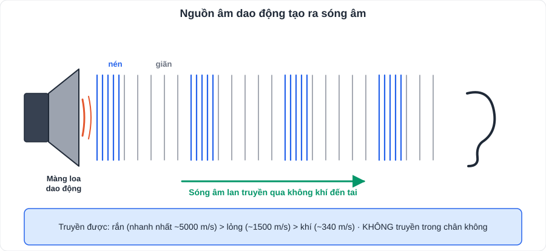
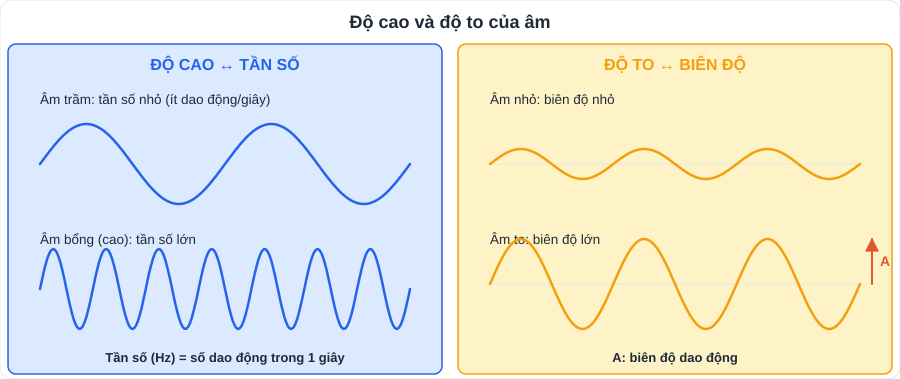
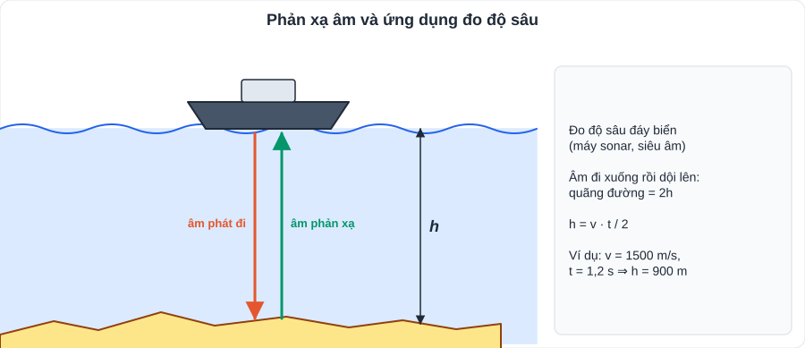

# KHTN 4: Âm thanh

> [Danh mục kiến thức](../README.md) · Học ở [tuần 7](../../LoTrinh/Tuan-07-Ke-Hoach-Hoc-Tap.md) – [tuần 8](../../LoTrinh/Tuan-08-Ke-Hoach-Hoc-Tap.md) · Ôn lại tuần 10

## Mục tiêu

- Giải thích sự tạo thành và truyền **sóng âm**.
- Liên hệ **độ cao ↔ tần số**, **độ to ↔ biên độ**.
- Giải thích **phản xạ âm, tiếng vang**, cách **chống ô nhiễm tiếng ồn**.

---

## 1. Sóng âm

- **Nguồn âm**: vật phát ra âm; mọi nguồn âm đều **dao động** (dây đàn rung, màng loa rung, dây thanh quản rung).
- **Sóng âm**: dao động lan truyền trong môi trường.
- Âm truyền được trong **rắn, lỏng, khí**; **không** truyền được trong **chân không**.
- Tốc độ truyền âm: **rắn > lỏng > khí**.

| Môi trường | Tốc độ truyền âm (xấp xỉ) |
|---|---|
| Không khí (20°C) | **343 m/s** (thường lấy **340 m/s**) |
| Nước | khoảng **1500 m/s** |
| Thép | khoảng **5000 – 6000 m/s** |

## 2. Độ cao và độ to của âm

| | **Độ cao** (âm bổng – trầm) | **Độ to** (âm to – nhỏ) |
|---|---|---|
| Phụ thuộc | **Tần số** dao động | **Biên độ** dao động |
| Định nghĩa | Tần số = số dao động trong 1 giây; đơn vị **Hz** (héc) | Biên độ = độ lệch lớn nhất so với vị trí cân bằng |
| Quy luật | Tần số **càng lớn** → âm **càng cao (bổng)** | Biên độ **càng lớn** → âm **càng to** |

- Tai người nghe được âm có tần số khoảng **20 Hz – 20 000 Hz**.
  - **Hạ âm**: dưới 20 Hz (voi, động đất). **Siêu âm**: trên 20 000 Hz (dơi, cá heo; siêu âm y học).
- Ví dụ tính: vật dao động 200 lần trong 10 s ⇒ tần số **20 Hz**.

## 3. Phản xạ âm, tiếng vang

- Âm gặp vật cản bị **phản xạ** (dội lại).
- **Tiếng vang**: nghe được âm phản xạ **tách biệt** với âm trực tiếp (cách nhau ít nhất khoảng **1/10 giây**).
- **Vật phản xạ âm tốt**: mặt **cứng, nhẵn** (tường gạch, kính, kim loại). **Phản xạ kém** (hấp thụ âm tốt): mềm, xốp, gồ ghề (rèm, thảm, mút xốp, cao su).
- Ứng dụng: **đo độ sâu đáy biển** bằng sóng siêu âm (máy sonar): **độ sâu = v · t / 2** (âm đi rồi về).

## 4. Ô nhiễm tiếng ồn

- Tiếng ồn **to, kéo dài**, ảnh hưởng sức khỏe và sinh hoạt.
- Biện pháp: (1) **giảm độ to** tại nguồn (quy định giờ, hạn chế còi); (2) **ngăn cản đường truyền** (trồng cây xanh, xây tường chắn); (3) **phản xạ/hấp thụ** âm theo hướng khác (rèm, vật liệu cách âm).

---

## 5. Lỗi hay gặp

- Nhầm **độ cao** (tần số) với **độ to** (biên độ).
- Nghĩ âm truyền được trong chân không (ngoài vũ trụ **không** nghe được tiếng nổ).
- Đo độ sâu quên **chia 2**.

---

## 6. Bài tập tự luyện

1. Trong 5 giây một lá thép thực hiện 2000 dao động. Tính tần số. Tai người có nghe được không?
2. Vì sao áp tai xuống đường ray có thể nghe tiếng tàu từ xa sớm hơn qua không khí?
3. Khi gảy mạnh dây đàn, âm phát ra to hơn hay cao hơn? Vì sao?
4. Tàu phát siêu âm xuống đáy biển, sau 1,2 s nhận được âm phản xạ. Tốc độ âm trong nước 1500 m/s. Tính độ sâu.
5. Nêu 3 biện pháp chống ô nhiễm tiếng ồn cho lớp học gần đường lớn.

👉 Bấm để xem đáp án

1. f = 2000 : 5 = **400 Hz** ⇒ **nghe được** (trong khoảng 20 – 20 000 Hz).
2. Âm truyền trong **chất rắn (thép)** nhanh hơn trong không khí.
3. **To hơn**: gảy mạnh ⇒ biên độ dao động lớn hơn (tần số không đổi nên độ cao không đổi).
4. h = 1500 · 1,2 : 2 = **900 m**.
5. Trồng cây xanh quanh trường; đóng cửa, lắp kính; treo rèm dày, dán vật liệu cách âm; đặt biển hạn chế bóp còi.

