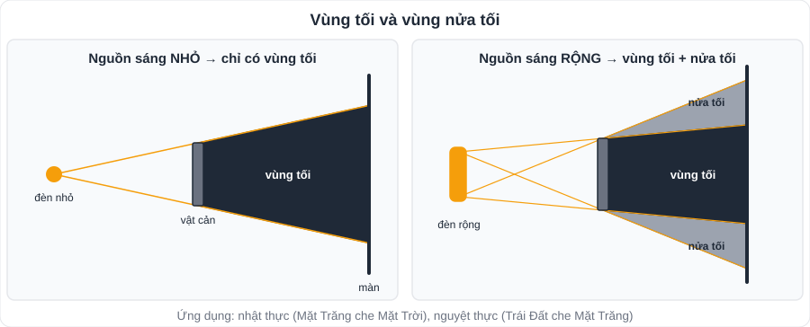
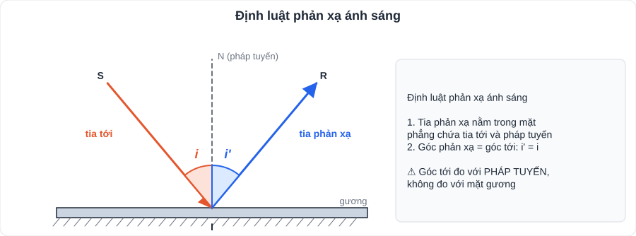
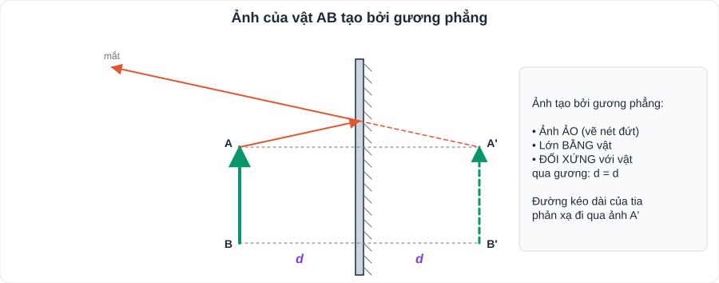

# KHTN 5: Ánh sáng

> [Danh mục kiến thức](../README.md) · Học ở [tuần 9](../../LoTrinh/Tuan-09-Ke-Hoach-Hoc-Tap.md) và [tuần 12](../../LoTrinh/Tuan-12-Ke-Hoach-Hoc-Tap.md) · Ôn lại tuần 23 · **Câu vẽ hình (vẽ tia phản xạ, vẽ ảnh) gần như chắc chắn có trong đề**

## Mục tiêu

- Giải thích vùng tối, vùng nửa tối; vẽ đúng **tia phản xạ**.
- Vẽ **ảnh của vật qua gương phẳng** bằng hai cách.

---

## 1. Ánh sáng, tia sáng, vùng tối

- Ánh sáng là một dạng **năng lượng** (ví dụ: pin mặt trời biến năng lượng ánh sáng thành điện năng; ánh sáng giúp cây quang hợp).
- Trong môi trường **trong suốt, đồng tính**, ánh sáng truyền theo **đường thẳng**.
- **Tia sáng**: đường truyền của ánh sáng, biểu diễn bằng **đường thẳng có mũi tên**. **Chùm sáng**: song song, hội tụ, phân kì.
- **Vùng tối**: sau vật cản, **không** nhận được ánh sáng từ nguồn.
- **Vùng nửa tối**: nhận được **một phần** ánh sáng từ nguồn (nguồn sáng **rộng**).
- Ứng dụng: **nhật thực** (Mặt Trăng nằm giữa Mặt Trời và Trái Đất), **nguyệt thực** (Trái Đất nằm giữa Mặt Trời và Mặt Trăng).

## 2. Sự phản xạ ánh sáng

- **Tia tới SI**, **tia phản xạ IR**, **pháp tuyến IN** (vuông góc với gương tại điểm tới I).
- **Góc tới i** = góc SIN; **góc phản xạ i'** = góc NIR.

> **Định luật phản xạ ánh sáng:**
> 1. Tia phản xạ nằm trong **cùng mặt phẳng** với tia tới và pháp tuyến tại điểm tới.
> 2. **Góc phản xạ bằng góc tới: i' = i.**

- **Phản xạ** (trên mặt nhẵn: gương) – chùm phản xạ song song, nhìn thấy ảnh; **phản xạ khuếch tán** (mặt gồ ghề: giấy, tường) – ánh sáng hắt theo mọi hướng, không thấy ảnh.

**Cách vẽ tia phản xạ:** (1) vẽ pháp tuyến IN ⊥ gương tại I; (2) đo góc tới i; (3) vẽ IR sao cho góc NIR = i, ở **phía bên kia** pháp tuyến.

## 3. Ảnh của vật tạo bởi gương phẳng

**Tính chất ảnh:**
- Ảnh **ảo** (không hứng được trên màn chắn).
- **Lớn bằng vật**.
- **Đối xứng với vật qua gương**: khoảng cách từ ảnh đến gương **bằng** khoảng cách từ vật đến gương.

**Cách vẽ ảnh:**
- **Cách 1 (đối xứng):** lấy A' đối xứng với A qua gương (AA' ⊥ gương, khoảng cách bằng nhau), tương tự B'. Nối A'B' bằng **nét đứt**.
- **Cách 2 (định luật phản xạ):** vẽ 2 tia tới từ A, vẽ 2 tia phản xạ; **đường kéo dài** của 2 tia phản xạ cắt nhau tại A'.

---

## 4. Dạng bài thường gặp

**Ví dụ 1.** Tia tới hợp với mặt gương góc 30°. Tính góc tới và góc phản xạ.
> Góc tới i = 90° − 30° = **60°** ⇒ góc phản xạ i' = **60°**. *(Bẫy: góc tới đo với **pháp tuyến**, không phải với mặt gương.)*

**Ví dụ 2.** Góc tạo bởi tia tới và tia phản xạ bằng 80°. Tính góc tới.
> i + i' = 80°, i = i' ⇒ **i = 40°**.

**Ví dụ 3.** Một người đứng cách gương phẳng 1,5 m. Ảnh cách người bao xa?
> Ảnh cách gương 1,5 m ⇒ cách người **3 m**.

**Ví dụ 4.** Người tiến lại gần gương thêm 0,5 m (từ ví dụ 3). Ảnh cách người bao xa?
> Còn cách gương 1 m ⇒ ảnh cách người **2 m**.

---

## 5. Lỗi hay gặp

- Đo **góc tới với mặt gương** thay vì với pháp tuyến.
- Vẽ ảnh bằng **nét liền** (ảnh ảo phải vẽ **nét đứt**).
- Quên mũi tên chỉ chiều truyền ánh sáng.
- Nghĩ ảnh qua gương phẳng "nhỏ hơn khi đứng xa" (ảnh **luôn bằng vật**; chỉ là ta **nhìn** thấy nhỏ hơn).

---

## 6. Bài tập tự luyện

1. Góc tới bằng 35°. Tính góc phản xạ và góc tạo bởi tia tới với tia phản xạ.
2. Tia phản xạ vuông góc với tia tới. Tính góc tới.
3. Một vật cao 1,6 m đứng cách gương phẳng 2 m. Ảnh cao bao nhiêu, cách vật bao xa?
4. Vì sao ban đêm đi xe, người ta dán miếng phản quang ở xe và trên áo?
5. ★ Muốn tia phản xạ có phương **thẳng đứng hướng xuống** khi tia tới **nằm ngang**, phải đặt gương nghiêng bao nhiêu độ so với phương nằm ngang?

👉 Bấm để xem đáp án

1. i' = **35°**; góc giữa tia tới và tia phản xạ = **70°**.
2. i + i' = 90° ⇒ **i = 45°**.
3. Ảnh cao **1,6 m**; cách vật **4 m**.
4. Miếng phản quang **phản xạ ánh sáng** đèn xe khác trở lại, giúp người lái nhìn thấy từ xa ⇒ an toàn.
5. Góc giữa tia tới và tia phản xạ = 90° ⇒ i = 45° ⇒ pháp tuyến nghiêng 45° ⇒ gương đặt nghiêng **45°** so với phương nằm ngang.

