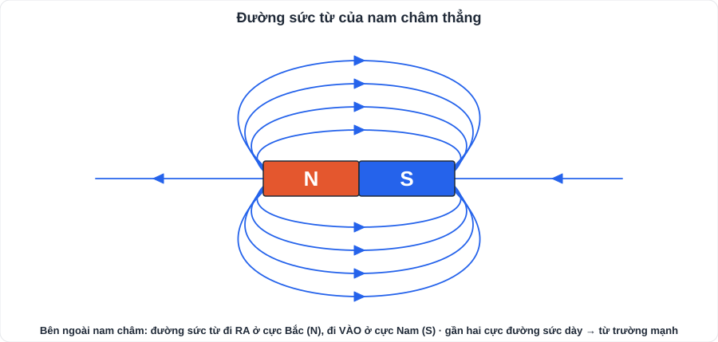
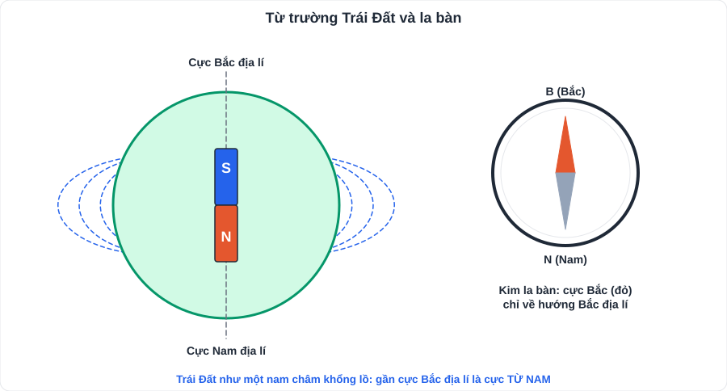
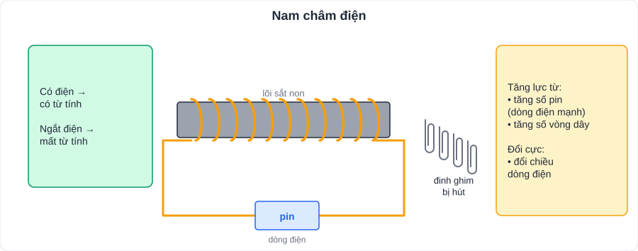

# KHTN 6: Từ

> [Danh mục kiến thức](../README.md) · Học ở [tuần 13](../../LoTrinh/Tuan-13-Ke-Hoach-Hoc-Tap.md) – [tuần 14](../../LoTrinh/Tuan-14-Ke-Hoach-Hoc-Tap.md) · Ôn lại tuần 23

## Mục tiêu

- Nêu tính chất của **nam châm**; mô tả **từ trường, đường sức từ**.
- Giải thích hoạt động của **la bàn**; chế tạo và nêu cách tăng lực của **nam châm điện**.

---

## 1. Nam châm

- Nam châm có hai **cực**: cực **Bắc (N)** và cực **Nam (S)**. Hai cực luôn đi cùng nhau, **không tách rời** (bẻ đôi → mỗi nửa vẫn có 2 cực).
- **Tương tác**: hai cực **cùng tên đẩy** nhau, **khác tên hút** nhau.
- Nam châm **hút** được vật liệu **từ**: **sắt, thép, niken, cobalt**. **Không** hút: nhôm, đồng, nhựa, gỗ, giấy.
- Nam châm tự do (treo, đặt trên trục) khi nằm cân bằng luôn chỉ hướng **Bắc – Nam địa lí**.

## 2. Từ trường và đường sức từ

- **Từ trường**: vùng không gian xung quanh nam châm, dòng điện, có khả năng tác dụng **lực từ** lên kim nam châm đặt trong nó.
- **Từ phổ**: hình ảnh các đường mạt sắt sắp xếp quanh nam châm.
- **Đường sức từ**:
  - Bên ngoài nam châm: đi **ra từ cực Bắc (N)**, đi **vào cực Nam (S)**.
  - Nơi đường sức **dày** → từ trường **mạnh** (gần hai cực).
  - Các đường sức **không cắt nhau**.

## 3. Từ trường Trái Đất – la bàn

- Trái Đất như **một nam châm khổng lồ**.
- **Cực Bắc địa lí ≠ cực Bắc địa từ**: gần cực Bắc địa lí là cực **từ Nam** của "nam châm Trái Đất" (vì nó hút cực Bắc của kim la bàn).
- **La bàn**: kim nam châm quay tự do, cực Bắc của kim chỉ về **hướng Bắc địa lí** (gần đúng). Dùng để xác định phương hướng khi đi biển, đi rừng.
- Một số loài (chim di cư, rùa biển) định hướng nhờ **từ trường Trái Đất**.

## 4. Nam châm điện

- Cấu tạo: **ống dây dẫn** quấn quanh **lõi sắt non**, cho **dòng điện** chạy qua.
- Đặc điểm: **có từ tính khi có dòng điện**, **mất từ tính khi ngắt điện** → điều khiển được.
- **Tăng lực từ** của nam châm điện: tăng **cường độ dòng điện** (thêm pin); tăng **số vòng dây**.
- **Đổi cực** nam châm điện: **đổi chiều dòng điện**.
- Ứng dụng: cần cẩu điện nhấc sắt thép, chuông điện, rơ-le, loa, khóa cửa từ.

---

## 5. Lỗi hay gặp

- Nói nam châm hút **mọi kim loại** (sai: **không** hút nhôm, đồng, vàng, bạc).
- Vẽ đường sức từ đi từ **S ra N** bên ngoài nam châm (đúng: **N → S**).
- Nghĩ cực Bắc địa lí là cực Bắc từ.

---

## 6. Bài tập tự luyện

1. Có một thanh kim loại bị mất màu sơn đánh dấu cực. Làm thế nào xác định cực của nó bằng một kim nam châm?
2. Trong các vật: kéo sắt, thìa nhôm, đinh thép, đồng xu (đồng), kẹp giấy bằng thép, vật nào bị nam châm hút?
3. Vẽ đường sức từ của nam châm thẳng; đánh dấu chiều.
4. Nêu 2 cách làm nam châm điện hút được nhiều đinh ghim hơn.
5. Vì sao cần cẩu ở bãi phế liệu dùng nam châm điện mà không dùng nam châm vĩnh cửu?

👉 Bấm để xem đáp án

1. Đưa một đầu thanh lại gần **cực Bắc** của kim nam châm: nếu **đẩy** ⇒ đầu đó là **cực Bắc**; nếu hút ⇒ có thể là cực Nam (kiểm tra thêm đầu kia, vì thanh sắt chưa nhiễm từ cũng bị hút).
2. **Kéo sắt, đinh thép, kẹp giấy bằng thép**.
3. Các đường cong đi ra từ N, vào S bên ngoài; dày ở hai đầu.
4. Tăng **số pin** (cường độ dòng điện); quấn **nhiều vòng dây** hơn.
5. Nam châm điện **ngắt điện là mất từ tính** ⇒ thả được vật tại vị trí mong muốn; nam châm vĩnh cửu không thả ra được.

