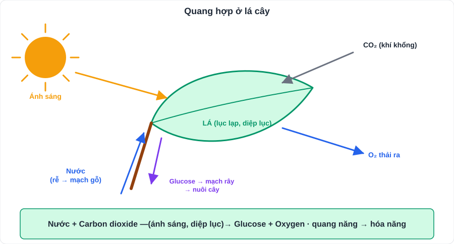
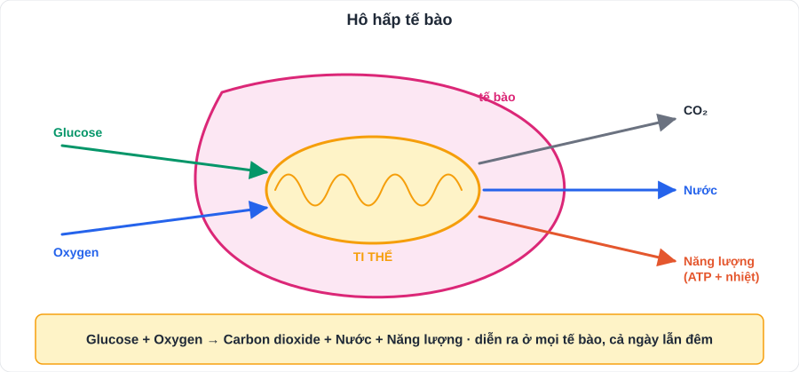
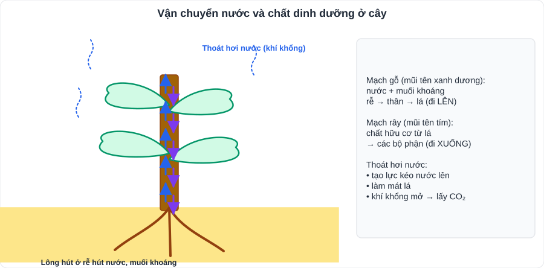

# KHTN 7: Trao đổi chất và chuyển hóa năng lượng ở sinh vật

> [Danh mục kiến thức](../README.md) · Học ở [tuần 15](../../LoTrinh/Tuan-15-Ke-Hoach-Hoc-Tap.md) – [tuần 17](../../LoTrinh/Tuan-17-Ke-Hoach-Hoc-Tap.md), [tuần 20](../../LoTrinh/Tuan-20-Ke-Hoach-Hoc-Tap.md) · Ôn lại tuần 23 và tuần 29 · **Chương dài nhất phần Sinh lớp 7**

## Mục tiêu

- Viết đúng **phương trình chữ** của quang hợp và hô hấp tế bào.
- Nêu các yếu tố ảnh hưởng và **vận dụng** vào trồng trọt, bảo quản, sức khỏe.
- Mô tả trao đổi khí, trao đổi nước và chất dinh dưỡng ở **thực vật** và **động vật**.

---

## 1. Trao đổi chất và chuyển hóa năng lượng

- **Trao đổi chất**: quá trình cơ thể **lấy** các chất từ môi trường, **biến đổi** thành chất cần thiết và **thải** chất thải ra môi trường.
- **Chuyển hóa năng lượng**: biến đổi năng lượng từ dạng này sang dạng khác (quang năng → hóa năng → nhiệt năng, cơ năng…).
- Vai trò: cung cấp **nguyên liệu** cấu tạo tế bào và **năng lượng** cho hoạt động sống. Ngừng trao đổi chất → sinh vật **chết**.

## 2. Quang hợp ở thực vật

> **Nước + Carbon dioxide —(ánh sáng, diệp lục)→ Glucose + Oxygen**

| Yếu tố | Vai trò |
|---|---|
| **Lá** | Cơ quan quang hợp chủ yếu; **lục lạp** chứa **diệp lục** hấp thụ ánh sáng |
| **Khí khổng** | Lấy CO₂ vào, thải O₂ ra |
| **Mạch gỗ** | Dẫn nước từ rễ lên lá |
| **Mạch rây** | Vận chuyển chất hữu cơ từ lá đến các cơ quan |

- **Chuyển hóa năng lượng**: **quang năng → hóa năng** (tích lũy trong chất hữu cơ).
- **Các yếu tố ảnh hưởng**: **ánh sáng, nước, CO₂, nhiệt độ** (thường tốt nhất khoảng 25 – 35°C).
- **Vai trò**: tạo chất hữu cơ, cung cấp **O₂** cho sinh vật hô hấp, giảm CO₂ (điều hòa khí hậu).
- **Vận dụng**: trồng cây đúng mật độ, đúng thời vụ; cây ưa sáng / ưa bóng; tưới đủ nước; trồng nhiều cây xanh.

**Thí nghiệm quen thuộc:** chứng minh quang hợp tạo **tinh bột** (dùng **dung dịch iodine** → lá phần được chiếu sáng chuyển **xanh tím**); chứng minh quang hợp thải **O₂** (cành rong trong ống nghiệm dưới ánh sáng → bọt khí làm **que đóm còn tàn đỏ bùng cháy**).

## 3. Hô hấp tế bào

> **Glucose + Oxygen → Carbon dioxide + Nước + Năng lượng (ATP + nhiệt)**

- Diễn ra ở **ti thể**, trong **mọi tế bào** sống, **cả ngày lẫn đêm**.
- Chuyển hóa năng lượng: **hóa năng** trong chất hữu cơ → năng lượng **ATP** dùng cho hoạt động sống + nhiệt.
- **Yếu tố ảnh hưởng**: nhiệt độ, độ ẩm và nước, nồng độ O₂, nồng độ CO₂.
- **Vận dụng – bảo quản lương thực, thực phẩm** (giảm hô hấp để hạn chế hao hụt): bảo quản **lạnh** (rau quả), **khô** (phơi hạt), **tăng CO₂ / giảm O₂** (hút chân không).
- **Vận dụng – sức khỏe**: tập thể dục, hít thở sâu, giữ không khí trong lành.

### So sánh quang hợp và hô hấp

| | **Quang hợp** | **Hô hấp tế bào** |
|---|---|---|
| Nơi diễn ra | **Lục lạp** (tế bào có diệp lục) | **Ti thể** (mọi tế bào) |
| Nguyên liệu | Nước, CO₂ | Glucose, O₂ |
| Sản phẩm | Glucose, O₂ | CO₂, nước, năng lượng |
| Năng lượng | **Tích lũy** (quang năng → hóa năng) | **Giải phóng** |
| Điều kiện | Cần ánh sáng | Không cần ánh sáng |

> Hai quá trình **ngược chiều nhau** nhưng **phụ thuộc** nhau: sản phẩm của quá trình này là nguyên liệu của quá trình kia.

## 4. Trao đổi khí

- **Thực vật**: trao đổi khí qua **khí khổng** (lá). Ban ngày quang hợp mạnh hơn hô hấp → **thải O₂**; ban đêm chỉ hô hấp → **thải CO₂** (không nên để nhiều cây trong phòng ngủ kín).
- **Động vật**: qua **bề mặt cơ thể** (giun đất), **ống khí** (côn trùng), **mang** (cá), **phổi** (chim, thú, người).
- Người: hít vào lấy O₂, thở ra thải CO₂; O₂ từ phổi vào máu → đến tế bào.

## 5. Trao đổi nước và chất dinh dưỡng

### Ở thực vật
- **Rễ** hút nước và muối khoáng (qua **lông hút**) → **mạch gỗ** vận chuyển lên lá.
- **Thoát hơi nước** qua khí khổng: tạo **lực kéo** nước lên, **làm mát** lá, giúp khí khổng mở để lấy CO₂.
- Chất hữu cơ tạo ở lá → **mạch rây** → nuôi các bộ phận.

### Ở động vật (người)
- Nước chiếm khoảng **2/3** khối lượng cơ thể; cần uống đủ nước (khoảng 1,5 – 2 lít/ngày với học sinh tùy hoạt động).
- Quá trình: **lấy thức ăn → tiêu hóa → hấp thụ** chất dinh dưỡng → **vận chuyển** (máu) → tế bào sử dụng → **thải** chất thải.
- Chế độ ăn **cân đối, đủ chất**, vệ sinh an toàn thực phẩm.

---

## 6. Lỗi hay gặp

- Viết "cây chỉ hô hấp vào ban đêm" (sai: **hô hấp cả ngày lẫn đêm**).
- Nhầm vị trí: quang hợp ở **lục lạp**, hô hấp ở **ti thể**.
- Nhầm vai trò **mạch gỗ** (nước, khoáng đi lên) và **mạch rây** (chất hữu cơ).

---

## 7. Bài tập tự luyện

1. Viết phương trình chữ của quang hợp và hô hấp tế bào.
2. Vì sao trồng cây xanh giúp không khí trong lành?
3. Vì sao không nên đóng kín cửa phòng ngủ có nhiều cây xanh vào ban đêm?
4. Vì sao hạt giống phải phơi khô trước khi cất trữ?
5. Vì sao cây trồng trong bóng râm thường có lá xanh đậm, thân mảnh, cao vống?
6. Giải thích: khi chạy nhanh, ta thở gấp hơn.

👉 Bấm để xem đáp án

1. Xem mục 2 và mục 3.
2. Cây **quang hợp** hấp thụ CO₂, thải O₂; lá cây giữ bụi, giảm nhiệt.
3. Ban đêm cây chỉ **hô hấp**: lấy O₂, thải CO₂ ⇒ phòng kín thiếu O₂.
4. Hạt khô ⇒ **giảm cường độ hô hấp** ⇒ ít hao hụt chất hữu cơ, hạn chế nấm mốc.
5. Thiếu ánh sáng: lá tăng diệp lục để hấp thụ ánh sáng; thân vươn cao tìm ánh sáng.
6. Cơ hoạt động mạnh cần nhiều năng lượng ⇒ **hô hấp tế bào tăng** ⇒ cần nhiều O₂ và thải nhiều CO₂ ⇒ thở nhanh, sâu.

