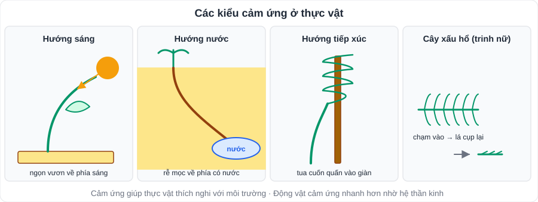
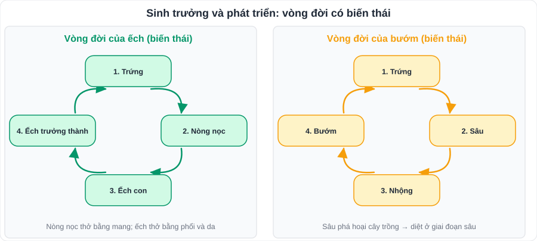
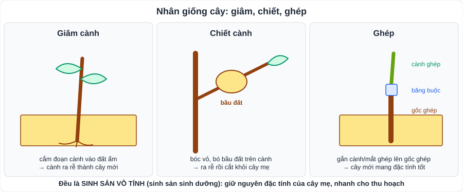

# KHTN 8: Cảm ứng – Sinh trưởng và phát triển – Sinh sản ở sinh vật

> [Danh mục kiến thức](../README.md) · Học ở [tuần 21](../../LoTrinh/Tuan-21-Ke-Hoach-Hoc-Tap.md) – [tuần 22](../../LoTrinh/Tuan-22-Ke-Hoach-Hoc-Tap.md), [tuần 25](../../LoTrinh/Tuan-25-Ke-Hoach-Hoc-Tap.md) – [tuần 26](../../LoTrinh/Tuan-26-Ke-Hoach-Hoc-Tap.md) · Ôn lại tuần 29 · **Nhiều câu hỏi vận dụng vào đời sống**

---

## 1. Cảm ứng ở sinh vật

- **Cảm ứng**: khả năng **tiếp nhận** và **phản ứng** với các kích thích từ môi trường, giúp sinh vật **thích nghi** và tồn tại.

| Ở thực vật | Ví dụ |
|---|---|
| **Hướng sáng** | Ngọn cây vươn về phía ánh sáng |
| **Hướng nước** | Rễ mọc về phía có nước |
| **Hướng tiếp xúc** | Tua cuốn của mướp, bầu bí quấn vào giàn |
| **Hướng hóa** | Rễ mọc về phía có phân bón (và tránh chất độc) |
| **Cảm ứng không định hướng** | Lá cây xấu hổ (trinh nữ) cụp lại khi chạm vào |

- Ở **động vật**: phản ứng nhanh, nhờ **hệ thần kinh** (ví dụ chạm tay vào vật nóng → rụt tay lại).
- **Vận dụng**: làm giàn cho cây leo, bón phân đúng chỗ, trồng cây đúng hướng ánh sáng.

### Tập tính ở động vật
- **Tập tính**: chuỗi phản ứng của động vật trả lời kích thích, giúp thích nghi.
- **Bẩm sinh** (sinh ra đã có, di truyền): nhện giăng tơ, chim làm tổ, gà con mổ thức ăn.
- **Học được** (qua học tập, kinh nghiệm): chó nghe tên chạy lại, khỉ làm xiếc, học sinh dừng đèn đỏ.
- Vận dụng: huấn luyện vật nuôi; dùng **đèn bẫy** côn trùng; dọa chim bằng bù nhìn.

## 2. Sinh trưởng và phát triển

| | **Sinh trưởng** | **Phát triển** |
|---|---|---|
| Nghĩa | **Tăng kích thước, khối lượng** cơ thể (tăng số lượng, kích thước tế bào) | Các **biến đổi** về cấu tạo, chức năng: sinh trưởng + **phân hóa tế bào + phát sinh hình thái** |
| Ví dụ | Cây cao thêm, em bé tăng cân | Hạt nảy mầm → cây ra hoa → kết quả |

- **Mô phân sinh** (thực vật): **đỉnh** (cây cao lên), **bên** (thân to ra – cây hai lá mầm).
- **Vòng đời**: con người (sơ sinh → trẻ em → dậy thì → trưởng thành → già); **ếch**: trứng → nòng nọc → ếch con → ếch trưởng thành (**biến thái**); **bướm**: trứng → sâu → nhộng → bướm.

- **Yếu tố ảnh hưởng**: **nhiệt độ, ánh sáng, nước, chất dinh dưỡng**; chất kích thích, ức chế.
- **Vận dụng**: bấm ngọn, tỉa cành; chiếu sáng cho gà đẻ trứng; chế độ ăn – ngủ – vận động cho tuổi dậy thì; diệt muỗi ở giai đoạn **bọ gậy** (ấu trùng).

## 3. Sinh sản ở sinh vật

| | **Sinh sản vô tính** | **Sinh sản hữu tính** |
|---|---|---|
| Đặc điểm | **Không** có sự kết hợp giao tử đực và cái; con **giống hệt** mẹ | **Có** sự kết hợp **giao tử đực + giao tử cái** → **hợp tử**; con mang đặc điểm của **cả bố và mẹ** |
| Ở thực vật | **Sinh sản sinh dưỡng**: thân (khoai tây, mía), rễ (khoai lang), lá (thuốc bỏng) | **Hoa** → thụ phấn → thụ tinh → quả và hạt |
| Ở động vật | Phân đôi (trùng roi), nảy chồi (thủy tức), phân mảnh (sao biển, giun dẹp), trinh sinh (ong đực) | Đẻ trứng, đẻ con |
| Ứng dụng | **Giâm, chiết, ghép** cành; **nuôi cấy mô** | Lai tạo giống mới |

- **Cấu tạo hoa**: đài, tràng (cánh hoa), **nhị** (tạo hạt phấn – giao tử đực), **nhụy** (chứa noãn – giao tử cái).
- **Thụ phấn**: hạt phấn rơi lên **đầu nhụy** (nhờ gió, côn trùng, con người). **Thụ tinh**: giao tử đực + giao tử cái → hợp tử → **phôi**; noãn → **hạt**; bầu nhụy → **quả**.
- **Yếu tố ảnh hưởng** sinh sản: nhiệt độ, ánh sáng, thức ăn, độ ẩm, hormone.
- **Điều khiển sinh sản**: thụ phấn nhân tạo; điều chỉnh ánh sáng cho cây ra hoa; ở người: **kế hoạch hóa gia đình**.

---

## 4. Lỗi hay gặp

- Nhầm **sinh trưởng** (chỉ tăng kích thước) với **phát triển** (có biến đổi chức năng).
- Gọi giâm, chiết, ghép là sinh sản hữu tính (sai: **vô tính**).
- Cho rằng tập tính "học được" là di truyền.

---

## 5. Bài tập tự luyện

1. Phân loại tập tính bẩm sinh / học được: a) ve sầu kêu mùa hè; b) chó nhận ra chủ; c) học sinh xếp hàng vào lớp; d) mèo con bú mẹ.
2. Vì sao nên diệt muỗi ở giai đoạn bọ gậy?
3. Kể 3 cây được nhân giống bằng giâm cành và 2 cây bằng chiết cành.
4. Ưu điểm của sinh sản vô tính trong trồng trọt?
5. Vì sao cây trồng trong nhà, đặt gần cửa sổ, thường mọc nghiêng ra phía cửa?

👉 Bấm để xem đáp án

1. Bẩm sinh: **a, d**; học được: **b, c**.
2. Bọ gậy sống tập trung ở nước, chưa bay được ⇒ dễ diệt (thả cá, đậy kín, thay nước), ngăn từ gốc.
3. Giâm: **sắn, mía, rau muống, hoa hồng**; chiết: **bưởi, cam, nhãn, vải**.
4. Giữ **nguyên đặc tính tốt** của cây mẹ; **nhanh** cho thu hoạch; tạo nhiều cây trong thời gian ngắn.
5. **Hướng sáng**: ngọn cây vươn về phía có ánh sáng.

