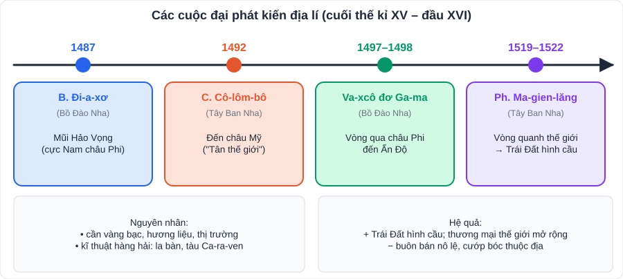

# Lịch sử 1: Thế giới (Tây Âu, Trung Quốc, Ấn Độ, Đông Nam Á – thời trung đại)

> [Danh mục kiến thức](../README.md) · Học ở tuần 1 – 5 · Ôn lại tuần 5 (giữa HK1) và tuần 10 · Kèm chủ đề chung **Các cuộc đại phát kiến địa lí**

## Mục tiêu

- Nhớ các **mốc thời gian** và **nhân vật** chính.
- Trình bày **nguyên nhân – diễn biến – hệ quả** của phát kiến địa lí.
- Nêu **thành tựu văn hóa** tiêu biểu của từng khu vực.

---

## 1. Tây Âu từ thế kỉ V đến nửa đầu thế kỉ XVI

### 1.1. Xã hội phong kiến Tây Âu

| Mốc / khái niệm | Nội dung |
|---|---|
| **Năm 476** | Đế quốc **Tây La Mã** sụp đổ → bắt đầu thời kì phong kiến ở Tây Âu |
| Người Giéc-man | Chiếm đất, chia ruộng, phong tước → hình thành **lãnh chúa** và **nông nô** |
| **Lãnh địa** | Đơn vị kinh tế, chính trị độc lập của lãnh chúa; kinh tế **tự cung tự cấp** |
| **Thành thị trung đại** (từ TK XI) | Thợ thủ công, thương nhân; hình thành **thị dân**; thúc đẩy **kinh tế hàng hóa** |
| Thiên Chúa giáo | Giáo hội có thế lực lớn về tư tưởng và kinh tế |

### 1.2. Các cuộc phát kiến địa lí (cuối TK XV – đầu TK XVI)

| Năm | Nhà hàng hải | Kết quả |
|---|---|---|
| **1487** | **B. Đi-a-xơ** (Bồ Đào Nha) | Đến **mũi Hảo Vọng** (cực Nam châu Phi) |
| **1492** | **C. Cô-lôm-bô** (phục vụ Tây Ban Nha) | Đến **châu Mỹ** (lúc đầu tưởng là Ấn Độ) |
| **1497 – 1498** | **Va-xcô đơ Ga-ma** (Bồ Đào Nha) | Vòng qua châu Phi, đến **Ấn Độ** |
| **1519 – 1522** | **Ph. Ma-gien-lăng** (phục vụ Tây Ban Nha) | **Chuyến đi vòng quanh thế giới** đầu tiên bằng đường biển |

- **Nguyên nhân**: nhu cầu **vàng bạc, hương liệu**, thị trường; con đường buôn bán qua Tây Á bị chặn; tiến bộ **kĩ thuật hàng hải** (la bàn, tàu Ca-ra-ven, bản đồ).
- **Hệ quả tích cực**: khẳng định **Trái Đất hình cầu**; tìm ra vùng đất, con đường mới; thúc đẩy **thương mại** thế giới.
- **Hệ quả tiêu cực**: nạn **buôn bán nô lệ**, **cướp bóc thuộc địa**.

### 1.3. Văn hóa Phục hưng và Cải cách tôn giáo

- **Phong trào Văn hóa Phục hưng** (TK XIV – XVI, bắt đầu ở **I-ta-li-a**): đề cao **giá trị con người**, khoa học, phê phán Giáo hội.
  - Tiêu biểu: **Lê-ô-na-đô đa Vin-xi** (*Nàng Mô-na Li-da*), **Sếch-xpia** (*Rô-mê-ô và Giu-li-ét*), **Cô-péc-ních** (thuyết **Mặt Trời là trung tâm**), **Xéc-van-tét** (*Đôn Ki-hô-tê*).
- **Cải cách tôn giáo**: **Mác-tin Lu-thơ** (Đức, **1517**) phản đối Giáo hội La Mã → hình thành **đạo Tin Lành**.

## 2. Trung Quốc từ thế kỉ VII đến giữa thế kỉ XIX

| Triều đại | Thời gian | Điểm nhấn |
|---|---|---|
| **Đường** | 618 – 907 | **Thịnh trị**; chế độ **khoa cử**; thơ Đường (Lý Bạch, Đỗ Phủ) |
| **Tống** | 960 – 1279 | Phát triển kinh tế, **bốn phát minh** hoàn thiện |
| **Nguyên** (Mông Cổ) | 1271 – 1368 | |
| **Minh** | 1368 – 1644 | Tiểu thuyết *Tam quốc diễn nghĩa*, *Tây du kí*, *Thủy hử* |
| **Thanh** (Mãn Thanh) | 1644 – 1911 | *Hồng lâu mộng* |

- **Bốn phát minh**: **giấy, kĩ thuật in, la bàn, thuốc súng**.
- Công trình: **Vạn Lý Trường Thành** (tu sửa thời Minh), **Tử Cấm Thành**.

## 3. Ấn Độ từ thế kỉ IV đến giữa thế kỉ XIX

| Vương triều | Điểm nhấn |
|---|---|
| **Gúp-ta** (TK IV – VI) | Thống nhất miền Bắc; phát triển văn hóa (chữ số, số 0) |
| **Hồi giáo Đê-li** (TK XIII – XVI) | Đạo Hồi truyền bá |
| **Mô-gôn** (TK XVI – giữa XIX) | Công trình **lăng Ta-giơ Ma-han** |

- Văn hóa: **Hin-đu giáo, Phật giáo**; chữ Phạn; sử thi *Ma-ha-bha-ra-ta*, *Ra-ma-ya-na*; kiến trúc đền tháp.

## 4. Đông Nam Á từ nửa sau thế kỉ X đến nửa đầu thế kỉ XVI

- Thời kì **phát triển thịnh đạt** của các vương quốc phong kiến.
- **Vương quốc Cam-pu-chia** (thời **Ăng-co**, TK IX – XV): công trình **Ăng-co Vát**, **Ăng-co Thom**.
- **Vương quốc Lào** (Lạn Xạng, thành lập **1353** dưới thời **Pha Ngừm**): **Thạt Luổng** (Viêng Chăn).
- Các vương quốc khác: Pa-gan (Mi-an-ma), Su-khô-thai (Thái Lan), Ma-gia-pa-hit (In-đô-nê-xi-a), Đại Việt, Chăm-pa.
- Văn hóa: chịu ảnh hưởng **Ấn Độ, Trung Quốc**, nhưng mang **bản sắc riêng**; Phật giáo, Hin-đu giáo, Hồi giáo.

---

## 5. Bảng mốc thời gian cần thuộc

| Năm | Sự kiện |
|---|---|
| 476 | Tây La Mã sụp đổ |
| 618 – 907 | Nhà Đường |
| 1353 | Pha Ngừm lập nước Lạn Xạng |
| 1492 | Cô-lôm-bô đến châu Mỹ |
| 1498 | Va-xcô đơ Ga-ma đến Ấn Độ |
| 1517 | Mác-tin Lu-thơ khởi xướng cải cách tôn giáo |
| 1519 – 1522 | Ma-gien-lăng đi vòng quanh thế giới |

---

## 6. Câu hỏi luyện tập

1. Lãnh địa phong kiến là gì? Đời sống của lãnh chúa và nông nô khác nhau thế nào?
2. Nêu 2 hệ quả tích cực và 1 hệ quả tiêu cực của các cuộc phát kiến địa lí.
3. Vì sao nói Văn hóa Phục hưng "đề cao giá trị con người"? Kể tên 2 nhân vật tiêu biểu.
4. Kể tên bốn phát minh lớn của Trung Quốc. Phát minh nào ảnh hưởng đến các cuộc phát kiến địa lí?
5. Kể tên 2 công trình kiến trúc tiêu biểu của Cam-pu-chia và Lào.

👉 Bấm để xem gợi ý đáp án

1. Vùng đất rộng do lãnh chúa làm chủ, có lâu đài, nhà thờ, ruộng đất. Lãnh chúa sống **sung sướng, xa hoa**; nông nô **phụ thuộc**, nộp tô thuế nặng, đời sống khổ cực.
2. Tích cực: chứng minh Trái Đất hình cầu; mở ra con đường thương mại mới. Tiêu cực: **buôn bán nô lệ**, cướp bóc thuộc địa.
3. Tác phẩm ca ngợi vẻ đẹp, trí tuệ, quyền tự do của con người, chống lại tư tưởng gò bó của Giáo hội. Tiêu biểu: Lê-ô-na-đô đa Vin-xi, Sếch-xpia.
4. Giấy, kĩ thuật in, **la bàn**, thuốc súng. **La bàn** giúp đi biển xác định phương hướng.
5. Cam-pu-chia: **Ăng-co Vát**, Ăng-co Thom; Lào: **Thạt Luổng**.

