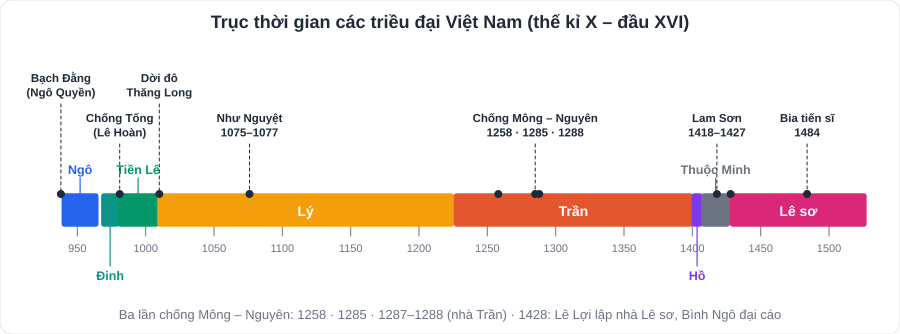
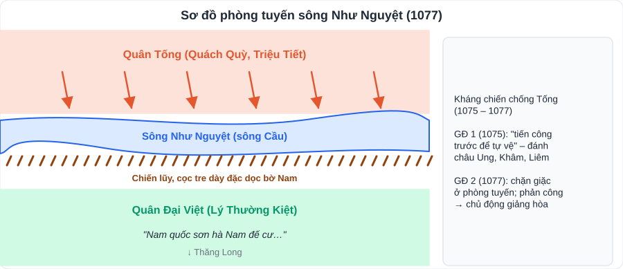
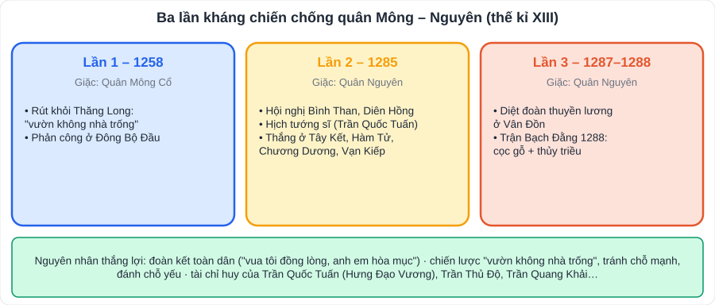
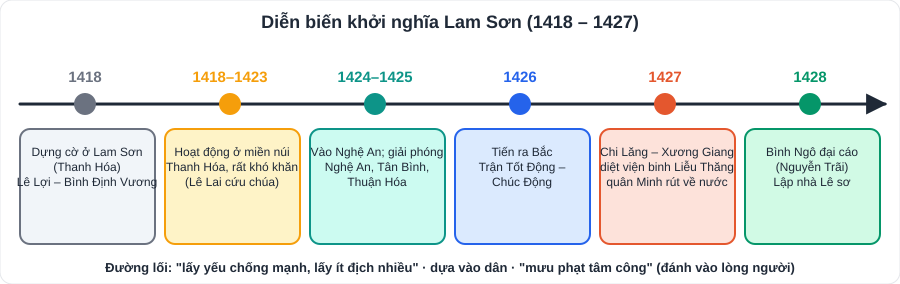

# Lịch sử 2: Việt Nam từ đầu thế kỉ X đến đầu thế kỉ XVI

> [Danh mục kiến thức](../README.md) · Học ở tuần 6 – 9 (HK1) và tuần 12 – 26 (HK2, theo tiến độ trường) · Ôn lại tuần 10, 23, 29 · **Phần chiếm nhiều điểm nhất trong đề Lịch sử lớp 7**

## Mục tiêu

- Thuộc **trục thời gian**: Ngô → Đinh → Tiền Lê → Lý → Trần → Hồ → (thuộc Minh) → Lê sơ.
- Trình bày các cuộc **kháng chiến, khởi nghĩa** lớn: người lãnh đạo, trận quyết chiến, ý nghĩa.
- Nêu **thành tựu** về chính trị, kinh tế, văn hóa của từng triều đại.

---

## 1. Thời Ngô – Đinh – Tiền Lê (939 – 1009)

| Triều đại | Sự kiện chính |
|---|---|
| **Ngô** (939 – 965) | **Ngô Quyền** đánh tan quân Nam Hán trên **sông Bạch Đằng năm 938** (cắm cọc gỗ đầu bịt sắt, lợi dụng thủy triều). Năm **939** xưng vương, đóng đô ở **Cổ Loa** → mở đầu thời kì **độc lập lâu dài** |
| Loạn 12 sứ quân | Sau khi Ngô Quyền mất, đất nước bị chia cắt |
| **Đinh** (968 – 980) | **Đinh Bộ Lĩnh** dẹp loạn 12 sứ quân, lên ngôi **năm 968**, đặt tên nước **Đại Cồ Việt**, đóng đô ở **Hoa Lư** (Ninh Bình) |
| **Tiền Lê** (980 – 1009) | **Lê Hoàn** lên ngôi, lãnh đạo **kháng chiến chống Tống năm 981** thắng lợi |

## 2. Thời Lý (1009 – 1225)

- **1009**: **Lý Công Uẩn** lên ngôi (Lý Thái Tổ). **1010**: ban *Chiếu dời đô*, dời đô từ Hoa Lư ra **Đại La**, đổi tên là **Thăng Long**.
- **1054**: đổi tên nước thành **Đại Việt**.
- **1042**: ban hành bộ luật **Hình thư** (bộ luật thành văn đầu tiên).
- **1070**: lập **Văn Miếu**; **1075**: khoa thi đầu tiên; **1076**: lập **Quốc Tử Giám**.
- **Kháng chiến chống Tống (1075 – 1077)** do **Lý Thường Kiệt** lãnh đạo:
  - Giai đoạn 1 (1075): **"tiến công trước để tự vệ"**, đánh vào châu Ung, châu Khâm, châu Liêm.
  - Giai đoạn 2 (1076 – 1077): xây **phòng tuyến sông Như Nguyệt** (sông Cầu); bài thơ *Nam quốc sơn hà* vang lên; chủ động **giảng hòa** kết thúc chiến tranh.
- Văn hóa: **Phật giáo** phát triển (chùa Một Cột, chùa Dâu…).

## 3. Thời Trần (1226 – 1400)

- **1226**: nhà Trần thành lập (Trần Cảnh – Trần Thái Tông). Có chế độ **Thái thượng hoàng**.
- Chính sách: **"ngụ binh ư nông"** (gửi binh ở nhà nông), **lệnh cho vương hầu lập điền trang**, đắp đê (**Hà đê sứ**), bộ luật **Quốc triều hình luật**.
- **Ba lần kháng chiến chống quân Mông – Nguyên**:

| Lần | Năm | Diễn biến chính – trận quyết định |
|---|---|---|
| 1 | **1258** | Chủ động rút khỏi Thăng Long ("vườn không nhà trống"); phản công ở **Đông Bộ Đầu** |
| 2 | **1285** | **Hội nghị Diên Hồng, Bình Than**; *Hịch tướng sĩ* của **Trần Quốc Tuấn**; thắng ở **Tây Kết, Hàm Tử, Chương Dương, Vạn Kiếp** |
| 3 | **1287 – 1288** | Tiêu diệt đoàn thuyền lương ở **Vân Đồn**; trận **Bạch Đằng 1288** (cọc gỗ, thủy triều) |

- **Nguyên nhân thắng lợi**: **đoàn kết toàn dân**; vua tôi đồng lòng; chiến lược "**vườn không nhà trống**", tránh thế mạnh của giặc; tài chỉ huy của **Trần Quốc Tuấn (Hưng Đạo Vương)**, Trần Thủ Độ, Trần Quang Khải…
- Văn hóa: **chữ Nôm** phát triển; *Đại Việt sử kí* (**Lê Văn Hưu**); Thiền phái **Trúc Lâm Yên Tử** (Trần Nhân Tông).

## 4. Thời Hồ (1400 – 1407)

- **1400**: **Hồ Quý Ly** lập nhà Hồ, đổi tên nước **Đại Ngu**.
- **Cải cách**: hạn điền, hạn nô, phát hành **tiền giấy**, cải tổ giáo dục, đề cao chữ Nôm; xây **thành Tây Đô** (Thanh Hóa).
- **1406 – 1407**: kháng chiến chống quân **Minh** thất bại (không đoàn kết được nhân dân).

## 5. Khởi nghĩa Lam Sơn (1418 – 1427)

| Giai đoạn | Sự kiện |
|---|---|
| **1418** | **Lê Lợi** dựng cờ khởi nghĩa ở **Lam Sơn** (Thanh Hóa), tự xưng **Bình Định Vương**; **Nguyễn Trãi** tham mưu |
| 1418 – 1423 | Hoạt động ở miền núi Thanh Hóa, rất khó khăn; **Lê Lai** cứu chúa |
| 1424 – 1425 | Chuyển vào **Nghệ An**, giải phóng Nghệ An, Tân Bình, Thuận Hóa |
| 1426 | Tiến ra Bắc; **trận Tốt Động – Chúc Động** |
| **1427** | **Trận Chi Lăng – Xương Giang**, tiêu diệt viện binh Liễu Thăng; quân Minh rút về nước |
| **1428** | Nguyễn Trãi viết **_Bình Ngô đại cáo_**; Lê Lợi lên ngôi, lập **nhà Lê sơ** |

- **Nguyên nhân thắng lợi**: lòng yêu nước, đoàn kết toàn dân; đường lối đúng (**"lấy yếu chống mạnh, lấy ít địch nhiều"**, "mưu phạt tâm công"); bộ chỉ huy tài giỏi.

## 6. Thời Lê sơ (1428 – 1527)

- Thời thịnh trị nhất dưới vua **Lê Thánh Tông** (1460 – 1497).
- **Luật Hồng Đức** (*Quốc triều hình luật*): bảo vệ quyền lợi vua, giai cấp thống trị, **phần nào bảo vệ quyền lợi phụ nữ**.
- **Giáo dục, khoa cử** rất phát triển: **dựng bia tiến sĩ** ở Văn Miếu (từ **1484**).
- Văn hóa: *Bình Ngô đại cáo*, *Dư địa chí* (Nguyễn Trãi); *Đại Việt sử kí toàn thư* (**Ngô Sĩ Liên**); *Hồng Đức quốc âm thi tập*.
- Kinh tế: **phép quân điền**, khuyến khích khai hoang.
- Nhân vật: **Lê Lợi, Nguyễn Trãi, Lê Thánh Tông, Lương Thế Vinh**.

## 7. Vùng đất phía Nam (đầu thế kỉ X – đầu thế kỉ XVI)

- **Chăm-pa**: kinh tế nông nghiệp lúa nước, buôn bán đường biển; văn hóa **tháp Chăm** (Mỹ Sơn, tháp Pô Na-ga), Hin-đu giáo.
- Vùng đất **Nam Bộ** (Phù Nam cũ): thuộc Chân Lạp, cư dân khai phá đồng bằng.

---

## 8. Bảng mốc thời gian cần thuộc (học thuộc lòng)

| Năm | Sự kiện | Nhân vật |
|---|---|---|
| **938** | Chiến thắng Bạch Đằng | Ngô Quyền |
| **968** | Lập nước Đại Cồ Việt | Đinh Bộ Lĩnh |
| **981** | Kháng chiến chống Tống lần 1 | Lê Hoàn |
| **1010** | Dời đô ra Thăng Long | Lý Công Uẩn |
| **1054** | Đổi tên nước Đại Việt | Lý Thánh Tông |
| **1075 – 1077** | Kháng chiến chống Tống | Lý Thường Kiệt |
| **1226** | Nhà Trần thành lập | Trần Cảnh |
| **1258, 1285, 1287 – 1288** | Ba lần chống Mông – Nguyên | Trần Quốc Tuấn |
| **1400** | Nhà Hồ thành lập | Hồ Quý Ly |
| **1418 – 1427** | Khởi nghĩa Lam Sơn | Lê Lợi, Nguyễn Trãi |
| **1428** | Lập nhà Lê sơ; *Bình Ngô đại cáo* | Lê Lợi, Nguyễn Trãi |
| **1460 – 1497** | Thời vua Lê Thánh Tông | Lê Thánh Tông |

> **Mẹo nhớ:** đọc bảng to 1 lần/ngày trong 1 tuần, rồi **che cột năm** và tự đọc. Dán bảng ở bàn học.

---

## 9. Câu hỏi luyện tập

1. Vì sao nói chiến thắng Bạch Đằng năm 938 mở ra thời kì độc lập lâu dài?
2. Vì sao Lý Công Uẩn dời đô về Thăng Long?
3. Nêu nét độc đáo trong cách đánh giặc của Lý Thường Kiệt.
4. Nguyên nhân thắng lợi của ba lần kháng chiến chống Mông – Nguyên?
5. Vì sao kháng chiến của nhà Hồ thất bại còn khởi nghĩa Lam Sơn thắng lợi?
6. Kể tên 3 thành tựu văn hóa – giáo dục thời Lê sơ.

👉 Bấm để xem gợi ý đáp án

1. Chấm dứt hơn **1000 năm Bắc thuộc**; Ngô Quyền xưng vương, xây dựng chính quyền độc lập.
2. Thăng Long ở **trung tâm** đất nước, đất rộng bằng phẳng, giao thông thuận lợi, "thế rồng cuộn hổ ngồi" → phát triển lâu dài (theo *Chiếu dời đô*).
3. **"Tiến công trước để tự vệ"** (đánh vào nơi tập trung lương thảo của giặc); xây phòng tuyến sông Như Nguyệt; dùng *Nam quốc sơn hà* khích lệ tinh thần; chủ động **giảng hòa** để kết thúc chiến tranh.
4. **Đoàn kết toàn dân**; chuẩn bị chu đáo; chiến lược "vườn không nhà trống", lấy ít địch nhiều; tài chỉ huy của Trần Quốc Tuấn và các tướng.
5. Nhà Hồ **không đoàn kết được nhân dân**; Lam Sơn **dựa vào dân**, được nhân dân ủng hộ, có đường lối đúng, bộ chỉ huy tài giỏi.
6. Dựng **bia tiến sĩ** ở Văn Miếu; *Bình Ngô đại cáo*; *Đại Việt sử kí toàn thư*; Luật Hồng Đức.

