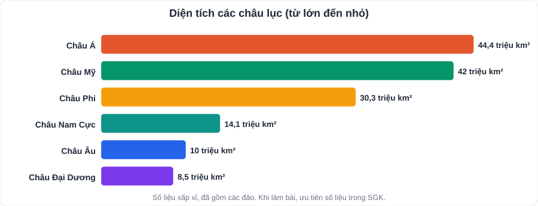
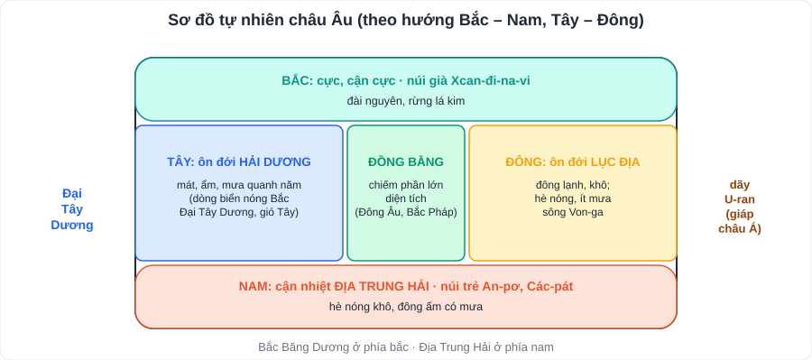
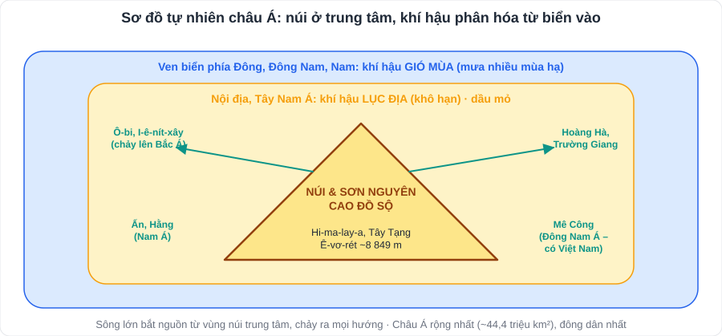

# Địa lí 1: Châu Âu và châu Á

> [Danh mục kiến thức](../README.md) · Học ở tuần 1 – 10 (HK1, theo tiến độ trường) · Ôn lại tuần 5 và tuần 10 · Luôn học kèm **bản đồ** (Atlat / SGK)

## Khung 5 câu hỏi cho mọi châu lục

> Học châu nào cũng trả lời đủ 5 câu: **(1) Vị trí, phạm vi? (2) Địa hình, khoáng sản? (3) Khí hậu, sông hồ, đới thiên nhiên? (4) Dân cư, xã hội? (5) Kinh tế, khai thác bảo vệ tự nhiên?**

---

## 1. Châu Âu

| Nội dung | Kiến thức chính |
|---|---|
| **Vị trí** | Phía tây lục địa Á – Âu; diện tích khoảng **10 triệu km²** (nhỏ thứ hai thế giới, chỉ hơn châu Đại Dương). Giáp **Bắc Băng Dương** (bắc), **Đại Tây Dương** (tây), **Địa Trung Hải** (nam); phía đông giáp châu Á (ranh giới là dãy **U-ran**) |
| **Địa hình** | **Đồng bằng** chiếm phần lớn diện tích (Đông Âu, Bắc Pháp…); **núi già** ở phía bắc và trung tâm (Xcan-đi-na-vi, U-ran); **núi trẻ** ở phía nam (**An-pơ**, Các-pát, Py-rê-nê) |
| **Khí hậu** | Phần lớn **ôn đới**: **ôn đới hải dương** phía tây (mát, ẩm, mưa quanh năm – ảnh hưởng **dòng biển nóng Bắc Đại Tây Dương** và gió Tây ôn đới); **ôn đới lục địa** phía đông (mùa đông lạnh, ít mưa); **cận nhiệt địa trung hải** phía nam (hè nóng khô, đông ấm có mưa); **cực, cận cực** phía bắc |
| **Sông** | Mạng lưới dày, nhiều nước: **Von-ga** (dài nhất châu Âu), **Đa-nuýp**, **Rai-nơ** |
| **Đới thiên nhiên** | Đới **lạnh** (đài nguyên) ở cực bắc; đới **ôn hòa** chiếm phần lớn (rừng lá kim, rừng lá rộng, thảo nguyên) |
| **Dân cư** | Khoảng **750 triệu** người; **cơ cấu dân số già** (tỉ lệ người trên 65 tuổi cao); **đô thị hóa cao** (khoảng 3/4 dân số sống ở đô thị); nhiều người nhập cư |
| **Kinh tế** | Phát triển cao; **Liên minh châu Âu (EU)**: 27 nước thành viên, đồng tiền chung **euro**, một trong những trung tâm kinh tế lớn nhất thế giới |
| **Bảo vệ môi trường** | Giảm ô nhiễm không khí, nước; phát triển **năng lượng tái tạo**; bảo vệ rừng |

## 2. Châu Á

| Nội dung | Kiến thức chính |
|---|---|
| **Vị trí** | Bộ phận của lục địa Á – Âu; trải dài từ **vùng cực Bắc** đến **gần Xích đạo**; diện tích khoảng **44,4 triệu km²** (kể cả đảo) – **rộng nhất thế giới**. Giáp Bắc Băng Dương, Thái Bình Dương, Ấn Độ Dương; châu Âu, châu Phi |
| **Địa hình** | Nhiều **núi và sơn nguyên cao, đồ sộ** ở trung tâm: **Hi-ma-lay-a** (đỉnh **Ê-vơ-rét** cao nhất thế giới, khoảng **8 849 m**), Côn Luân, Thiên Sơn; sơn nguyên **Tây Tạng**; đồng bằng rộng (Tây Xi-bia, Hoa Bắc, Ấn – Hằng). **Khoáng sản** phong phú: dầu mỏ, khí đốt (Tây Nam Á), than, sắt |
| **Khí hậu** | Phân hóa **đa dạng** (từ cực đến xích đạo, từ ven biển vào nội địa). **Khí hậu gió mùa** (Đông Á, Đông Nam Á, Nam Á: mùa hạ nóng ẩm mưa nhiều, mùa đông lạnh/khô) và **khí hậu lục địa** (Trung Á, Tây Nam Á: khô hạn) |
| **Sông** | Nhiều sông lớn: **Trường Giang, Hoàng Hà** (Đông Á), **Mê Công** (Đông Nam Á), **Ấn, Hằng** (Nam Á), **Ô-bi, I-ê-nít-xây, Lê-na** (Bắc Á – đóng băng mùa đông, lũ mùa xuân) |
| **Dân cư** | Khoảng **4,7 tỉ** người – **đông dân nhất thế giới** (khoảng 60% dân số thế giới); nhiều chủng tộc; nơi ra đời của **4 tôn giáo lớn**: **Ấn Độ giáo, Phật giáo, Ki-tô giáo, Hồi giáo** |
| **Khu vực** | Bắc Á, Trung Á, Tây Á (Tây Nam Á), Nam Á, Đông Á, **Đông Nam Á** |
| **Kinh tế** | Có các nền kinh tế lớn: **Trung Quốc, Nhật Bản, Hàn Quốc, Ấn Độ**; Tây Nam Á giàu **dầu mỏ** |

> **Việt Nam** nằm ở khu vực **Đông Nam Á** của châu Á, khí hậu **nhiệt đới gió mùa**.

---

## 3. So sánh nhanh

| | Châu Âu | Châu Á |
|---|---|---|
| Diện tích | ~10 triệu km² | ~44,4 triệu km² (lớn nhất) |
| Địa hình chủ yếu | **Đồng bằng** | **Núi và sơn nguyên** cao đồ sộ |
| Khí hậu chủ yếu | **Ôn đới** | Đa dạng; **gió mùa** và **lục địa** |
| Dân số | ~750 triệu, **già** | ~4,7 tỉ, **đông nhất** |

> Số liệu dân số là **xấp xỉ** (khoảng 2020 – 2025); khi làm bài, ưu tiên số liệu trong **SGK** của con.

---

## 4. Câu hỏi luyện tập

1. Vì sao phía tây châu Âu có khí hậu ấm áp, mưa nhiều hơn phía đông?
2. Nêu đặc điểm cơ cấu dân số châu Âu và một hệ quả của nó.
3. Vì sao sông ở Bắc Á thường có lũ vào mùa xuân?
4. Trình bày đặc điểm địa hình châu Á.
5. Kể tên 4 tôn giáo lớn ra đời ở châu Á.

👉 Bấm để xem gợi ý đáp án

1. Chịu ảnh hưởng của **dòng biển nóng Bắc Đại Tây Dương** và **gió Tây ôn đới** mang hơi ẩm từ biển vào; càng vào sâu phía đông, ảnh hưởng của biển càng yếu.
2. **Cơ cấu dân số già**. Hệ quả: thiếu lao động, chi phí chăm sóc người già, phúc lợi xã hội lớn → phải thu hút lao động nhập cư.
3. Mùa đông sông **đóng băng**; mùa xuân băng tan ở thượng nguồn (phía nam) trước, hạ lưu (phía bắc) còn đóng băng → nước dồn lại gây **lũ băng**.
4. Nhiều **núi và sơn nguyên cao, đồ sộ** nhất thế giới, tập trung ở **trung tâm**; nhiều **đồng bằng rộng**; địa hình **bị chia cắt mạnh**.
5. **Ấn Độ giáo, Phật giáo, Ki-tô giáo, Hồi giáo**.

