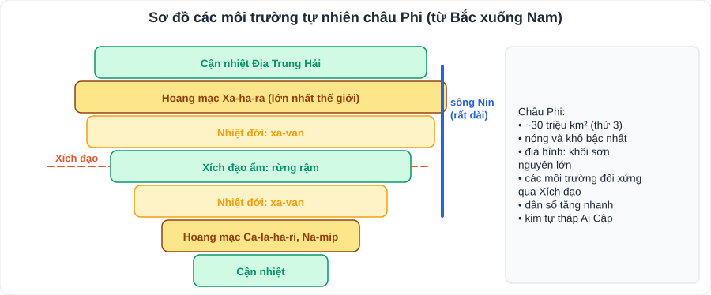
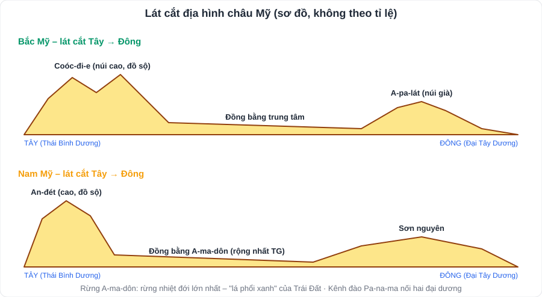
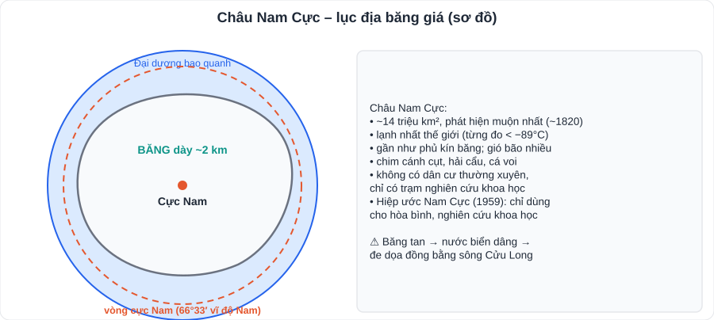

# Địa lí 2: Châu Phi, châu Mỹ, châu Đại Dương, châu Nam Cực

> [Danh mục kiến thức](../README.md) · Học ở tuần 12 – 26 (HK2, theo tiến độ trường) · Ôn lại tuần 23 và tuần 29 · Dùng **khung 5 câu hỏi** ở [L03](L03-Dia-Li-Chau-Au-Chau-A.md)

---

## 1. Châu Phi

| Nội dung | Kiến thức chính |
|---|---|
| **Vị trí** | Diện tích khoảng **30 triệu km²** (lớn thứ ba); **Xích đạo đi qua gần giữa** châu lục, phần lớn lãnh thổ nằm giữa hai chí tuyến. Giáp Địa Trung Hải, Đại Tây Dương, Ấn Độ Dương, biển Đỏ; **kênh đào Xuy-ê** nối Địa Trung Hải với biển Đỏ |
| **Địa hình** | Khá **đơn giản**, cả châu lục như một **khối sơn nguyên lớn**; ít núi cao |
| **Khí hậu** | **Nóng và khô** bậc nhất thế giới; hoang mạc **Xa-ha-ra** – hoang mạc nóng **lớn nhất thế giới** |
| **Sông** | **Sông Nin** – một trong hai sông **dài nhất thế giới** (khoảng 6 650 km); sông Công-gô, Ni-giê |
| **Môi trường** | Xích đạo ẩm (rừng rậm), **nhiệt đới** (xa-van), **hoang mạc**, cận nhiệt (cực Bắc, cực Nam) – đối xứng qua Xích đạo |
| **Dân cư – xã hội** | Khoảng **1,4 tỉ** người; **tăng dân số nhanh**; còn nhiều vấn đề: nạn đói, bệnh tật, xung đột |
| **Văn hóa – lịch sử** | Nền văn minh **sông Nin** (Ai Cập cổ đại): **kim tự tháp**, chữ tượng hình |
| **Kinh tế** | Chủ yếu xuất khẩu **khoáng sản** (vàng, kim cương, dầu mỏ) và **nông sản** (ca cao, cà phê) |

## 2. Châu Mỹ

| Nội dung | Kiến thức chính |
|---|---|
| **Vị trí** | Diện tích khoảng **42 triệu km²** (lớn thứ hai); nằm hoàn toàn ở **bán cầu Tây**; trải dài từ vùng cực Bắc đến cận cực Nam. Gồm **Bắc Mỹ, Trung Mỹ và vùng biển Ca-ri-bê, Nam Mỹ**. **Kênh đào Pa-na-ma** nối Thái Bình Dương với Đại Tây Dương |
| **Phát kiến** | **C. Cô-lôm-bô** đến châu Mỹ năm **1492** → "Tân thế giới"; hệ quả: di dân, **buôn bán nô lệ** da đen, người bản địa bị tàn sát |
| **Địa hình Bắc Mỹ** | 3 khu vực từ tây sang đông: hệ thống núi **Coóc-đi-e** (cao, đồ sộ) – **đồng bằng trung tâm** (rộng lớn) – dãy **A-pa-lát** (núi già) |
| **Địa hình Nam Mỹ** | Phía tây: dãy **An-đét** (cao, đồ sộ); giữa: các đồng bằng, lớn nhất là **đồng bằng A-ma-dôn** (rộng nhất thế giới); phía đông: các sơn nguyên |
| **Rừng A-ma-dôn** | Rừng nhiệt đới **lớn nhất thế giới**, "**lá phổi xanh**" của Trái Đất; đang bị **khai thác, thu hẹp** → cần bảo vệ |
| **Dân cư** | Thành phần đa dạng: người **Anh-điêng** (bản địa), người gốc **Âu**, gốc **Phi**, **người lai**; **đô thị hóa cao** (khoảng 80%) |
| **Kinh tế** | **Hoa Kỳ, Ca-na-đa** phát triển cao; Bra-xin, Ác-hen-ti-na… đang phát triển |

## 3. Châu Đại Dương

| Nội dung | Kiến thức chính |
|---|---|
| **Vị trí** | Diện tích khoảng **8,5 triệu km²** – **nhỏ nhất**; gồm **lục địa Ô-xtrây-li-a** và các **đảo, quần đảo** (Niu Di-lân, Mê-la-nê-di, Mi-crô-nê-di, Pô-li-nê-di) ở Thái Bình Dương |
| **Ô-xtrây-li-a – tự nhiên** | Phần lớn diện tích là **hoang mạc và bán hoang mạc** (khô hạn); động vật **độc đáo**: **chuột túi (kangaroo), gấu túi (koala), thú mỏ vịt** |
| **Các đảo** | Khí hậu nóng ẩm, rừng xích đạo, rừng nhiệt đới; nhiều đảo **san hô**, đảo núi lửa |
| **Dân cư** | Khoảng **45 triệu** người – **ít dân nhất** (trừ Nam Cực); phần lớn dân Ô-xtrây-li-a sống ở **ven biển phía đông, đông nam** |
| **Kinh tế** | **Ô-xtrây-li-a, Niu Di-lân** phát triển: xuất khẩu **lúa mì, len, thịt bò, sữa**, khoáng sản; du lịch |

## 4. Châu Nam Cực

| Nội dung | Kiến thức chính |
|---|---|
| **Vị trí** | Nằm trong **vòng cực Nam**, bao quanh **cực Nam**; diện tích khoảng **14 triệu km²** |
| **Phát hiện** | Được phát hiện muộn nhất (đầu thế kỉ **XIX**, khoảng **1820**) |
| **Tự nhiên** | **Lạnh nhất thế giới** (từng đo được dưới **−89°C**); gần như toàn bộ bị **băng** bao phủ (dày trung bình khoảng **2 km**); gió bão nhiều nhất; động vật: **chim cánh cụt**, hải cẩu, cá voi |
| **Dân cư** | **Không có dân cư thường xuyên**; chỉ có các nhà khoa học ở các **trạm nghiên cứu** |
| **Hiệp ước Nam Cực (1959)** | Chỉ dùng Nam Cực cho mục đích **hòa bình, nghiên cứu khoa học**; cấm hoạt động quân sự, khai thác khoáng sản |
| **Biến đổi khí hậu** | Băng tan → **mực nước biển dâng** → đe dọa các vùng ven biển thấp (trong đó có **đồng bằng sông Cửu Long**) |

---

## 5. Bảng tổng hợp 6 châu lục

| Châu lục | Diện tích (triệu km², xấp xỉ) | Điểm "nhất" cần nhớ |
|---|---|---|
| Châu Á | 44,4 | Rộng nhất, đông dân nhất; đỉnh Ê-vơ-rét |
| Châu Mỹ | 42 | Rừng A-ma-dôn lớn nhất; đồng bằng A-ma-dôn rộng nhất |
| Châu Phi | 30 | Nóng nhất; hoang mạc Xa-ha-ra; sông Nin |
| Châu Nam Cực | 14 | Lạnh nhất; không có dân cư thường xuyên |
| Châu Âu | 10 | Đồng bằng chiếm phần lớn; dân số già |
| Châu Đại Dương | 8,5 | Nhỏ nhất; động vật độc đáo |

---

## 6. Câu hỏi luyện tập

1. Vì sao châu Phi có khí hậu nóng và khô bậc nhất thế giới?
2. Trình bày sự phân hóa địa hình Bắc Mỹ theo chiều tây – đông.
3. Vì sao cần bảo vệ rừng A-ma-dôn?
4. Vì sao phần lớn lãnh thổ Ô-xtrây-li-a là hoang mạc?
5. Băng ở châu Nam Cực tan ảnh hưởng thế nào đến Việt Nam?

👉 Bấm để xem gợi ý đáp án

1. Phần lớn lãnh thổ nằm **giữa hai chí tuyến** (nhận nhiều nhiệt); lục địa hình khối, **bờ biển ít bị chia cắt**, ít chịu ảnh hưởng của biển; nhiều vùng có dòng biển lạnh chảy ven bờ.
2. **Tây**: núi Coóc-đi-e cao, đồ sộ; **giữa**: đồng bằng trung tâm rộng lớn; **đông**: núi già A-pa-lát.
3. "**Lá phổi xanh**": cung cấp O₂, hấp thụ CO₂, điều hòa khí hậu; kho **đa dạng sinh học**; nơi sinh sống của người bản địa.
4. **Chí tuyến Nam** đi qua giữa lục địa (áp cao, ít mưa); phía đông có **dãy núi** chắn gió ẩm từ biển.
5. **Nước biển dâng** → ngập lụt, **xâm nhập mặn**, đặc biệt ở **đồng bằng sông Cửu Long**.

