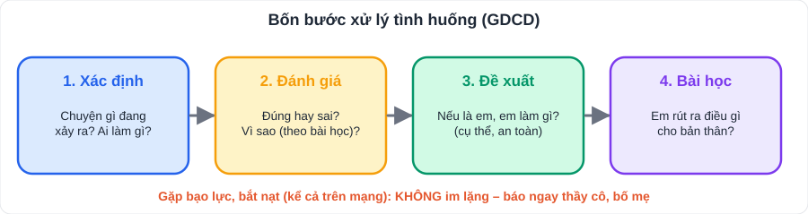

# Giáo dục công dân 7

> [Danh mục kiến thức](../README.md) · Học mỗi Chủ nhật 20 phút theo tiến độ trường · Ôn lại tuần 10 và tuần 29 · **Đề thường có phần xử lý tình huống, chiếm nhiều điểm**

## 1. Nội dung trọng tâm (10 chủ đề theo chương trình)

| # | Chủ đề | Ý chính cần nhớ | Ví dụ việc làm |
|---|---|---|---|
| 1 | **Tự hào về truyền thống quê hương** | Truyền thống: yêu nước, hiếu học, cần cù, nghề truyền thống, lễ hội | Tìm hiểu lịch sử địa phương; giới thiệu món ăn, nghề truyền thống |
| 2 | **Quan tâm, cảm thông và chia sẻ** | Biết đặt mình vào vị trí người khác; giúp đỡ bằng việc làm cụ thể | Hỏi han bạn ốm; quyên góp sách vở |
| 3 | **Học tập tự giác, tích cực** | Tự giác: chủ động, không cần nhắc nhở; tích cực: say mê, sáng tạo, vượt khó | Lập thời gian biểu và làm đúng; tự giác ôn bài |
| 4 | **Giữ chữ tín** | Coi trọng **lòng tin**, giữ **lời hứa**, đúng hẹn | Hứa trả sách đúng hạn và làm đúng |
| 5 | **Bảo tồn di sản văn hóa** | Di sản **vật thể** (Vịnh Hạ Long, Hoàng thành Thăng Long, Phố cổ Hội An) và **phi vật thể** (Nhã nhạc cung đình Huế, Ca trù, Đờn ca tài tử Nam Bộ); có **Luật Di sản văn hóa** | Không viết vẽ lên di tích; tuyên truyền giữ gìn |
| 6 | **Ứng phó với tâm lí căng thẳng** | Nguyên nhân (học tập, gia đình, bạn bè), biểu hiện (mất ngủ, cáu gắt, lo âu); cách ứng phó: **thư giãn, chia sẻ, suy nghĩ tích cực, sắp xếp thời gian** | Hít thở sâu, vận động, nói chuyện với bố mẹ/thầy cô |
| 7 | **Phòng, chống bạo lực học đường** | Biểu hiện: đánh, chửi, cô lập, **bắt nạt trên mạng**; tác hại; cách phòng chống | Không cổ vũ, quay clip; **báo ngay thầy cô, bố mẹ** |
| 8 | **Quản lí tiền** | Chi tiêu **hợp lí**, **tiết kiệm**; phân biệt **cần** và **muốn** | Ghi sổ chi tiêu; để dành tiền mua đồ dùng học tập |
| 9 | **Phòng, chống tệ nạn xã hội** | Tệ nạn: ma túy, cờ bạc, mại dâm…; pháp luật **nghiêm cấm**; nguyên nhân, tác hại | Nói **"không"**; không thử chất lạ, thuốc lá điện tử; báo người lớn khi bị dụ dỗ |
| 10 | **Quyền và nghĩa vụ của công dân trong gia đình** | Ông bà, cha mẹ: yêu thương, nuôi dạy; con cháu: **kính trọng, vâng lời, chăm sóc, phụng dưỡng**; anh chị em: thương yêu, đùm bọc | Giúp việc nhà, chăm sóc ông bà |

> Tên bài trong SGK của con có thể diễn đạt khác một chút; nội dung chính như bảng trên.

## 2. Xử lý tình huống – 4 bước

1. **Xác định vấn đề**: nhân vật đang gặp chuyện gì, làm gì?
2. **Nhận xét / đánh giá**: hành vi đó **đúng hay sai**? Vì sao (dựa vào bài học)?
3. **Đề xuất cách xử lý**: nếu là em, em sẽ làm gì? (cụ thể, khả thi, an toàn)
4. **Bài học** rút ra cho bản thân.

**Ví dụ.** *Bạn H bị một nhóm bạn trong lớp chụp ảnh chế giễu rồi đăng lên mạng xã hội. H buồn, không muốn đến trường.*
> 1. H bị **bắt nạt trên mạng** (một hình thức bạo lực học đường).
> 2. Hành vi của nhóm bạn là **sai**, xúc phạm danh dự, gây tổn thương tâm lí cho H; có thể vi phạm pháp luật.
> 3. Nếu là bạn của H: **an ủi** H; **không chia sẻ** bài đăng; khuyên H **báo cho thầy cô chủ nhiệm và bố mẹ**; lưu lại bằng chứng; báo cáo bài đăng với mạng xã hội.
> 4. Bài học: tôn trọng bạn bè; không im lặng trước bạo lực học đường.

## 3. Luyện tập

1. Kể 3 việc làm thể hiện học tập tự giác, tích cực.
2. Tình huống: *Em hứa với bạn sẽ đến giúp bạn ôn bài lúc 3 giờ chiều, nhưng có bạn khác rủ đi xem phim.* Em sẽ làm gì? Vì sao?
3. Phân biệt "nhu cầu cần" và "mong muốn" trong chi tiêu, cho ví dụ.
4. Kể tên 2 di sản văn hóa vật thể và 2 di sản phi vật thể của Việt Nam.

👉 Bấm để xem gợi ý đáp án

1. Tự lập và làm theo thời gian biểu; chuẩn bị bài trước khi đến lớp; chủ động hỏi thầy cô khi chưa hiểu; tự tìm thêm tài liệu.
2. Giữ lời hứa, đến giúp bạn ôn bài đúng hẹn (**giữ chữ tín**); có thể hẹn đi xem phim dịp khác. Nếu có việc bất khả kháng phải **báo trước** và xin lỗi.
3. **Cần**: thiết yếu cho cuộc sống, học tập (sách vở, ăn uống); **muốn**: thích nhưng không thiết yếu (đồ chơi mới, trà sữa). Ưu tiên chi tiêu cho nhu cầu cần.
4. Vật thể: Vịnh Hạ Long, Phố cổ Hội An, Hoàng thành Thăng Long, Cố đô Huế. Phi vật thể: Nhã nhạc cung đình Huế, Ca trù, Đờn ca tài tử Nam Bộ, Quan họ Bắc Ninh.

