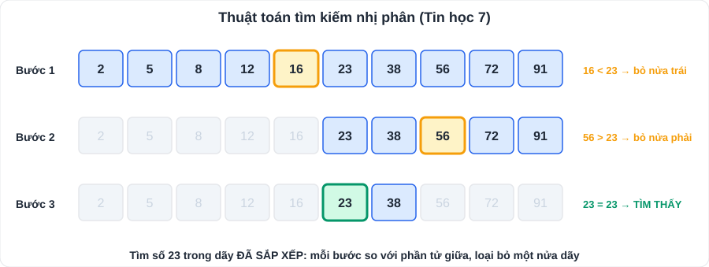

# Tin học 7 và Công nghệ 7: trọng tâm ôn thi

> [Danh mục kiến thức](../README.md) · Hai môn này **có điểm số** và tính vào điểm trung bình môn, nên cũng cần ôn chắc. Ôn **2 tuần trước mỗi kỳ kiểm tra** (tuần 4 – 5, 9 – 10, 22 – 23, 29 – 30)

---

## 1. Tin học 7

| Chủ đề | Trọng tâm | Ghi chú |
|---|---|---|
| **Máy tính và cộng đồng** | Thiết bị **vào** (bàn phím, chuột, micro, máy quét) – **ra** (màn hình, loa, máy in); **hệ điều hành** và **phần mềm ứng dụng**; quản lí **tệp và thư mục**, đuôi tệp (.docx, .xlsx, .pptx, .jpg, .mp3) | Thao tác an toàn, bảo vệ dữ liệu |
| **Tổ chức lưu trữ, tìm kiếm, trao đổi thông tin** | **Mạng xã hội**: lợi ích, tác hại; giao tiếp an toàn | |
| **Đạo đức, pháp luật, văn hóa trong môi trường số** | Văn hóa ứng xử qua mạng; **không** chia sẻ thông tin cá nhân, tin giả; tôn trọng bản quyền | Liên hệ GDCD (bắt nạt trên mạng) |
| **Ứng dụng tin học – Bảng tính** | Ô, hàng, cột, **địa chỉ ô** (A1, B3); nhập **công thức** bắt đầu bằng dấu **"="**; hàm **SUM, AVERAGE, MAX, MIN, COUNT**; định dạng, sắp xếp, lọc dữ liệu, **biểu đồ** | Ví dụ: `=SUM(B2:B10)`, `=AVERAGE(C2:C5)` |
| **Ứng dụng tin học – Trình chiếu** | Tạo bài trình chiếu: tiêu đề, bố cục, hình ảnh, hiệu ứng chuyển trang vừa phải | |
| **Giải quyết vấn đề với máy tính – Thuật toán** | **Tìm kiếm tuần tự** (xét lần lượt từng phần tử) và **tìm kiếm nhị phân** (dãy **đã sắp xếp**, chia đôi); **sắp xếp nổi bọt**, **sắp xếp chọn**; chia bài toán thành bài toán nhỏ | Hay có câu: "Mô phỏng từng bước thuật toán với dãy …" |

**Ví dụ – tìm kiếm nhị phân số 23 trong dãy 2, 5, 8, 12, 16, 23, 38, 56, 72, 91:**
> Bước 1: phần tử giữa (vị trí 5) = 16 < 23 → tìm nửa phải {23, 38, 56, 72, 91}.
> Bước 2: phần tử giữa = 56 > 23 → tìm nửa trái {23, 38}.
> Bước 3: phần tử giữa (lấy phần tử đầu khi số phần tử chẵn) = 23 → **tìm thấy**.

**Ví dụ – sắp xếp nổi bọt dãy 5, 3, 8, 1 (tăng dần), vòng 1:** so sánh 5 và 3 → đổi: 3, 5, 8, 1; 5 và 8 → giữ; 8 và 1 → đổi: 3, 5, 1, **8** (số lớn nhất "nổi" về cuối).

## 2. Công nghệ 7 (Nông nghiệp)

| Chủ đề | Trọng tâm |
|---|---|
| **Trồng trọt** | Vai trò, triển vọng; các **phương thức trồng trọt**; quy trình: **làm đất → gieo trồng → chăm sóc → thu hoạch**; **nhân giống bằng giâm cành** (chọn cành, cắt, cắm, chăm sóc) |
| **Lâm nghiệp** | Vai trò của **rừng**; trồng, chăm sóc và **bảo vệ rừng** |
| **Chăn nuôi** | Vai trò; vật nuôi phổ biến (gia súc, gia cầm); nuôi dưỡng, chăm sóc vật nuôi non, đực giống, cái sinh sản; **phòng và trị bệnh** (tiêm vắc xin, vệ sinh chuồng trại) |
| **Thủy sản** | Vai trò; quy trình **nuôi cá** (chuẩn bị ao, thả giống, chăm sóc, thu hoạch); bảo vệ môi trường nước |

> Liên hệ KHTN: giâm, chiết, ghép ([K08](../KHTN/K08-Cam-Ung-Sinh-Truong-Sinh-San.md), mục 3); quang hợp ([K07](../KHTN/K07-Trao-Doi-Chat-Chuyen-Hoa-Nang-Luong.md)).

## 3. Cách ôn hiệu quả cho hai môn này

1. Lấy **đề cương** của trường (thầy cô thường phát trước kỳ thi 2 tuần).
2. Mỗi bài viết **3 – 5 ý chính** vào thẻ, tự đố nhau với bố mẹ.
3. Tin học: **thực hành trên máy** các thao tác bảng tính (ít nhất 2 buổi × 30 phút trước kỳ thi).

## 4. Luyện tập

1. Trong bảng tính, công thức tính trung bình các ô từ C2 đến C8 là gì?
2. Vì sao tìm kiếm nhị phân chỉ dùng được với dãy đã sắp xếp?
3. Nêu các bước giâm cành.
4. Kể 3 biện pháp phòng bệnh cho vật nuôi.

👉 Bấm để xem gợi ý đáp án

1. `=AVERAGE(C2:C8)`
2. Vì mỗi bước cần so sánh với phần tử giữa để **biết loại bỏ nửa nào**; chỉ đúng khi dãy đã có thứ tự.
3. Chọn cành bánh tẻ → cắt cành (dài 10 – 15 cm, cắt vát) → xử lí (nhúng thuốc kích thích ra rễ, nếu có) → cắm cành vào đất ẩm → chăm sóc (tưới ẩm, che nắng).
4. **Tiêm vắc xin** đầy đủ; **vệ sinh chuồng trại**; cho ăn uống đủ chất, sạch; cách li con ốm.

