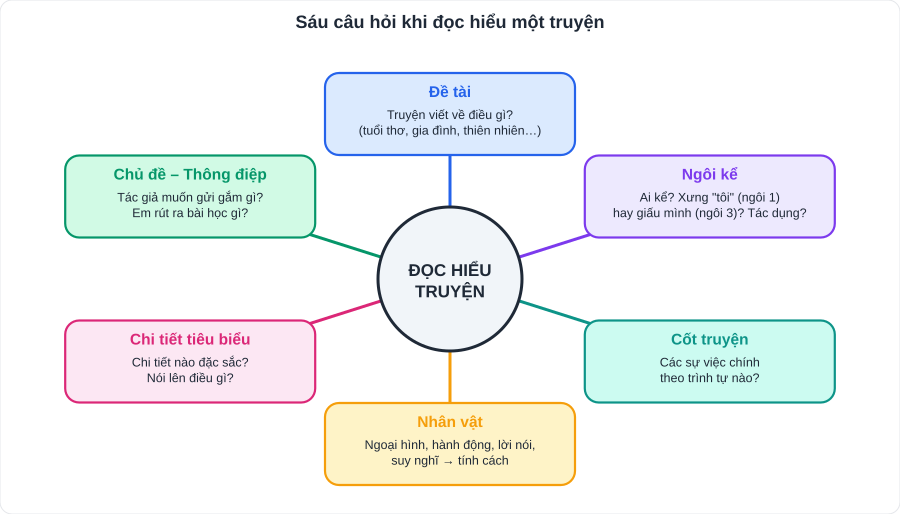

# Ngữ văn 1: Đọc hiểu truyện (truyện, truyện ngụ ngôn, truyện khoa học viễn tưởng)

> [Danh mục kiến thức](../README.md) · Dùng cho SGK **Bài 1, Bài 3** (truyện), **Bài 6** (ngụ ngôn), **Bài 7** (khoa học viễn tưởng) · Học ở tuần 1, 4, 12 – 13, 15 – 16 · Ôn trước mỗi kỳ kiểm tra

## Mục tiêu

- Trả lời đúng các câu hỏi nhận biết: **ngôi kể, nhân vật, chi tiết, đề tài**.
- Nêu được **chủ đề** và **thông điệp** của truyện.
- Viết đoạn **cảm nhận về nhân vật / chi tiết** 5 – 7 câu có dẫn chứng.

---

## 1. Kiến thức cần nhớ

### 1.1. Các yếu tố của truyện

| Yếu tố | Cần nắm | Câu hỏi thường gặp |
|---|---|---|
| **Đề tài** | Phạm vi đời sống được nói tới (tuổi thơ, gia đình, thiên nhiên…) | "Truyện viết về đề tài gì?" |
| **Chủ đề** | Vấn đề chính tác giả muốn gửi gắm | "Nêu chủ đề của truyện" |
| **Cốt truyện** | Chuỗi sự việc chính, sắp xếp theo trình tự | "Tóm tắt các sự việc chính" |
| **Nhân vật** | Ngoại hình, hành động, lời nói, suy nghĩ, quan hệ với nhân vật khác | "Nhân vật có đặc điểm gì? Dựa vào đâu?" |
| **Ngôi kể** | **Thứ nhất** (xưng "tôi", người kể tham gia câu chuyện) / **thứ ba** (người kể giấu mình, gọi tên nhân vật) | "Truyện kể theo ngôi thứ mấy? Tác dụng?" |
| **Tính cách nhân vật** | Thể hiện qua **hành động, lời nói, suy nghĩ** và **nhận xét của nhân vật khác** | |
| **Chi tiết tiêu biểu** | Chi tiết nhỏ nhưng nói lên nhiều điều về nhân vật/chủ đề | "Chi tiết … có ý nghĩa gì?" |

**Tác dụng của ngôi kể:**
- Ngôi thứ nhất: câu chuyện **chân thực, gần gũi**; bộc lộ trực tiếp **cảm xúc, suy nghĩ** của người kể.
- Ngôi thứ ba: kể **khách quan, linh hoạt**, có thể biết hết suy nghĩ của các nhân vật.

### 1.2. Truyện ngụ ngôn

- Truyện ngắn, thường **mượn chuyện loài vật, đồ vật hoặc con người** để nói bóng gió chuyện con người, nhằm **khuyên răn, rút ra bài học**.
- Đặc điểm: **ngắn gọn**, nhân vật ít, tình huống **bất ngờ, gây cười**, bài học **ngầm ẩn**.
- Ví dụ quen thuộc: *Ếch ngồi đáy giếng*, *Thầy bói xem voi*, *Đẽo cày giữa đường*.
  - *Ếch ngồi đáy giếng*: hiểu biết hạn hẹp mà kiêu ngạo sẽ thất bại → phải **mở rộng hiểu biết, khiêm tốn**.
  - *Thầy bói xem voi*: nhìn sự vật **phiến diện, một phía** → phải xem xét **toàn diện**.
  - *Đẽo cày giữa đường*: **không có chính kiến**, nghe theo mọi người → thất bại.

### 1.3. Truyện khoa học viễn tưởng

- Kể về những điều **chưa có thật**, dựa trên **giả thuyết khoa học**: du hành vũ trụ, người ngoài hành tinh, robot, máy thời gian, thế giới tương lai.
- Đặc điểm: đề tài khoa học; **tình huống giả định**; chi tiết **kì ảo nhưng có cơ sở khoa học**; không gian – thời gian thường **xa lạ** (vũ trụ, đáy biển, tương lai).
- Ý nghĩa thường gặp: khát vọng **khám phá**; cảnh báo về **mặt trái của khoa học công nghệ**; trách nhiệm của con người với tự nhiên.
- Tác giả quen thuộc: **Giuyn Véc-nơ** (*Hai vạn dặm dưới đáy biển*), **H.G. Oen-xơ** (*Cỗ máy thời gian*), **Ray Bradbury**.

> **Bổ sung theo thời đại AI:** nhiều đề đọc hiểu gần đây dùng truyện về **robot, trí tuệ nhân tạo**. Câu hỏi hay gặp: "Chi tiết robot biết buồn/không biết buồn gợi suy nghĩ gì?", "Theo em, máy móc có thay được tình cảm con người không?" → trả lời: công nghệ hỗ trợ, **tình cảm, sự thấu hiểu và trách nhiệm** vẫn là điều làm nên con người.

---

## 2. Cách trả lời các dạng câu hỏi

| Dạng câu hỏi | Mẫu câu trả lời |
|---|---|
| Xác định ngôi kể | "Truyện được kể theo **ngôi thứ nhất**, người kể xưng 'tôi' – là nhân vật … trong truyện." |
| Tác dụng ngôi kể | "Giúp câu chuyện **chân thực**, người đọc **hiểu rõ cảm xúc**, suy nghĩ của nhân vật 'tôi' khi …" |
| Đặc điểm nhân vật | "Nhân vật … là người **[tính từ 1], [tính từ 2]**. Điều đó thể hiện qua chi tiết: '…' (dẫn chứng)." |
| Ý nghĩa chi tiết | "Chi tiết … cho thấy **[đặc điểm nhân vật]**, đồng thời thể hiện **[chủ đề/thông điệp]**." |
| Chủ đề | "Truyện ca ngợi / thể hiện / phê phán … qua đó gửi gắm …" |
| Bài học rút ra | Nêu **1 – 2 bài học cụ thể**, gắn với **bản thân** ("Em sẽ …") |

**Đoạn cảm nhận nhân vật (5 – 7 câu):**
1. Câu mở: giới thiệu nhân vật, tác phẩm, nhận xét chung.
2. 2 – 3 câu: đặc điểm + **dẫn chứng** (trích chi tiết, từ ngữ).
3. 1 câu: nghệ thuật xây dựng nhân vật (ngôi kể, miêu tả tâm lí, lời thoại).
4. 1 câu kết: cảm xúc, bài học của em.

---

## 3. Lỗi hay gặp

- Nhầm **đề tài** (viết về cái gì) với **chủ đề** (gửi gắm điều gì).
- Nói "ngôi thứ nhất" chỉ vì truyện có từ "tôi" trong **lời thoại** của nhân vật (phải xét **người kể chuyện** xưng gì).
- Trả lời đặc điểm nhân vật nhưng **không có dẫn chứng**.
- Bài học chung chung ("phải sống tốt") → cần cụ thể ("biết lắng nghe ý kiến người khác trước khi kết luận").

---

## 4. Luyện tập

**Đọc truyện ngụ ngôn sau và trả lời câu hỏi:**

> *Một con quạ khát nước, tìm thấy một cái lọ có nước nhưng nước ở dưới đáy, cổ lọ lại cao, quạ không sao uống được. Quạ bèn nghĩ ra một cách: nó gắp từng viên sỏi bỏ vào lọ. Sỏi nhiều dần, nước dâng lên. Cuối cùng quạ đã uống được nước.*
> (Phỏng theo truyện ngụ ngôn *Con quạ thông minh*)

1. Văn bản thuộc thể loại gì? Kể theo ngôi thứ mấy?
2. Tìm chi tiết thể hiện sự thông minh, kiên trì của con quạ.
3. Câu chuyện gửi gắm bài học gì?
4. Viết đoạn văn 5 – 7 câu nêu suy nghĩ của em về ý nghĩa của sự **kiên trì** trong học tập.

👉 Bấm để xem gợi ý đáp án

1. Truyện ngụ ngôn; ngôi thứ ba.
2. "Gắp **từng** viên sỏi bỏ vào lọ"; "sỏi nhiều dần, nước dâng lên".
3. Gặp khó khăn cần **bình tĩnh suy nghĩ**, tìm cách giải quyết và **kiên trì** thực hiện.
4. Đoạn văn cần: nêu kiên trì là gì; vì sao cần (học tập là quá trình lâu dài); dẫn chứng bản thân (ví dụ: mỗi ngày học 15 từ vựng); bài học hành động.

---

## 5. Ghi văn bản trong SGK của con

> Tên các văn bản đọc chính trong từng bài SGK: con **tự điền** theo mục lục sách để làm "bản đồ ôn tập".

| Bài SGK | Văn bản 1 | Văn bản 2 | Văn bản 3 | Nhân vật chính – chủ đề (1 dòng) |
|---|---|---|---|---|
| Bài 1 | | | | |
| Bài 3 | | | | |
| Bài 6 | | | | |
| Bài 7 | | | | |
