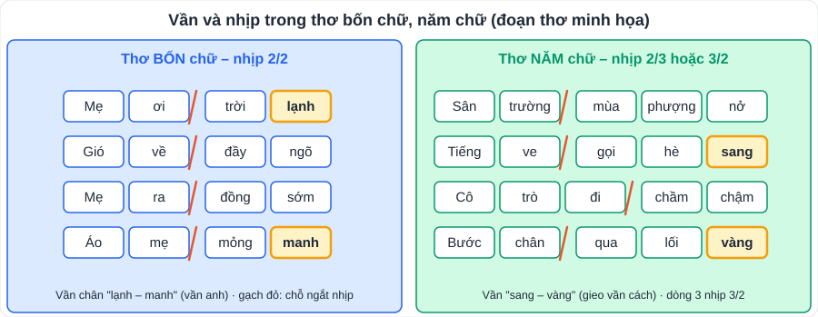
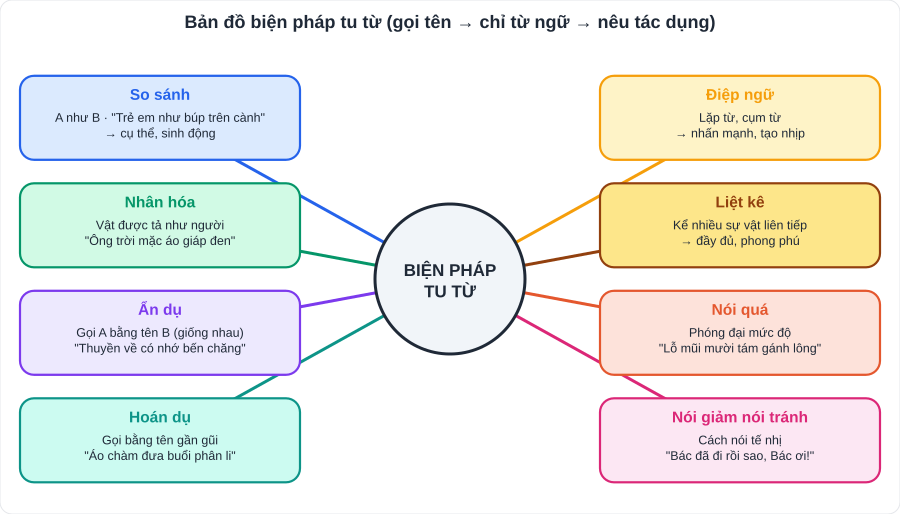

# Ngữ văn 2: Đọc hiểu thơ (thơ bốn chữ, năm chữ và các thể thơ khác)

> [Danh mục kiến thức](../README.md) · Dùng cho SGK **Bài 2** và **Bài 4** · Học ở tuần 2 – 3, 6 – 7 · Ôn trước mỗi kỳ kiểm tra

## Mục tiêu

- Nhận biết **thể thơ, vần, nhịp, hình ảnh, biện pháp tu từ** và nêu **tác dụng**.
- Hiểu **tình cảm, cảm xúc** của nhân vật trữ tình.
- Viết **đoạn văn ghi lại cảm xúc** sau khi đọc một bài thơ.

---

## 1. Kiến thức cần nhớ

### 1.1. Thơ bốn chữ, thơ năm chữ

| Đặc điểm | Thơ **bốn chữ** | Thơ **năm chữ** |
|---|---|---|
| Số chữ mỗi dòng | 4 | 5 |
| Nhịp thường gặp | **2/2** | **2/3** hoặc **3/2** |
| Vần | Vần chân (cuối dòng), vần lưng; thường vần **cách** hoặc **liền** | Vần chân, thường gieo **cách** |
| Gần gũi với | Đồng dao, vè, câu hát | Nhiều bài thơ hiện đại |

- **Vần chân**: gieo ở **cuối dòng** thơ. **Vần lưng**: gieo ở **giữa dòng**.
- **Vần liền**: các dòng liên tiếp vần với nhau. **Vần cách**: cách một dòng mới vần.
- **Nhịp thơ** cho biết cách ngắt; nhịp đều → êm ả, nhịp thay đổi → cảm xúc dồn dập.

### 1.2. Các yếu tố cần phân tích trong một bài thơ

| Yếu tố | Câu hỏi để tự đặt |
|---|---|
| **Nhân vật trữ tình** | Ai đang bày tỏ cảm xúc? (thường xưng "tôi", "em", "con"…) |
| **Hình ảnh thơ** | Hình ảnh nào nổi bật? Gợi lên điều gì? |
| **Từ ngữ** | Từ láy, từ gợi hình, gợi cảm nào đặc sắc? |
| **Biện pháp tu từ** | So sánh, nhân hóa, ẩn dụ, điệp ngữ, liệt kê…? Tác dụng? |
| **Mạch cảm xúc** | Cảm xúc thay đổi thế nào từ đầu đến cuối bài? |
| **Chủ đề, thông điệp** | Bài thơ nói về điều gì? Muốn gửi gắm gì? |

### 1.3. Biện pháp tu từ và cách nêu tác dụng

| Biện pháp | Nhận biết | Tác dụng thường viết |
|---|---|---|
| **So sánh** | "như", "là", "tựa", "bao nhiêu… bấy nhiêu" | Làm hình ảnh **cụ thể, sinh động**, nhấn mạnh … |
| **Nhân hóa** | Gọi/tả vật bằng từ dùng cho người | Làm sự vật **gần gũi, có hồn**, như con người |
| **Ẩn dụ** | Gọi sự vật này bằng tên sự vật khác **giống nhau** | Diễn đạt **hàm súc, tế nhị**, gợi liên tưởng |
| **Hoán dụ** | Gọi bằng tên sự vật **gần gũi, liên quan** | Diễn đạt ngắn gọn, nhấn mạnh đặc điểm |
| **Điệp ngữ** | Lặp lại từ, cụm từ | **Nhấn mạnh** cảm xúc, tạo **nhịp điệu** |
| **Liệt kê** | Kể ra nhiều sự vật, hành động liên tiếp | Diễn tả **đầy đủ, phong phú** |
| **Nói quá** | Phóng đại mức độ | Nhấn mạnh, gây ấn tượng |
| **Nói giảm nói tránh** | Cách nói tế nhị, uyển chuyển | Tránh gây cảm giác đau buồn, nặng nề; thể hiện sự lịch sự |

> **Công thức 3 bước khi nêu tác dụng:** (1) gọi tên biện pháp + chỉ ra từ ngữ; (2) tác dụng **về diễn đạt** (sinh động, gợi hình, nhịp điệu…); (3) tác dụng **về nội dung** (nhấn mạnh tình cảm/ý nghĩa gì của bài thơ).

---

## 2. Viết đoạn văn ghi lại cảm xúc về một bài thơ

**Yêu cầu:** đoạn văn khoảng **150 – 200 chữ**, viết ở **ngôi thứ nhất**.

| Phần | Nội dung |
|---|---|
| **Mở đoạn** (1 – 2 câu) | Giới thiệu bài thơ, tác giả; cảm xúc chung của em |
| **Thân đoạn** (4 – 6 câu) | Nêu cảm xúc về **nội dung** (hình ảnh, tình cảm) và **nghệ thuật** (từ ngữ, vần, nhịp, biện pháp tu từ); **trích dẫn** câu thơ |
| **Kết đoạn** (1 câu) | Khẳng định lại cảm xúc, ý nghĩa bài thơ với em |

**Từ ngữ bày tỏ cảm xúc:** em xúc động, em thấy thương, em yêu biết bao, em ấn tượng nhất với, em như được sống lại, khiến em nhớ đến, em càng thêm trân trọng…

**Đoạn văn mẫu (ngắn)** – cảm xúc về hai câu ca dao *"Công cha như núi Thái Sơn / Nghĩa mẹ như nước trong nguồn chảy ra"*:

> Mỗi lần đọc hai câu ca dao "Công cha như núi Thái Sơn / Nghĩa mẹ như nước trong nguồn chảy ra", em lại thấy lòng mình ấm áp và biết ơn. Tác giả dân gian đã dùng phép so sánh thật đẹp: công cha được ví với núi Thái Sơn cao lớn, vững chãi; nghĩa mẹ được ví với dòng nước trong nguồn chảy mãi không bao giờ cạn. Những hình ảnh thiên nhiên lớn lao, vĩnh hằng ấy giúp em hiểu công ơn cha mẹ là vô cùng to lớn, không gì đo đếm được. Em nhớ những buổi tối bố ngồi giảng bài cho em, những sáng mẹ dậy sớm nấu bữa sáng. Câu ca dao như lời nhắc nhở em phải chăm ngoan, học tốt để đền đáp công ơn sinh thành, dưỡng dục của cha mẹ.

---

## 3. Lỗi hay gặp

- Chỉ **gọi tên** biện pháp tu từ mà không nêu **tác dụng**.
- Kể lại nội dung bài thơ thay vì nói **cảm xúc của em**.
- Không **trích dẫn** câu thơ, hoặc trích sai chính tả.
- Đếm nhầm số chữ → nhầm thể thơ (đếm cả dòng, không đếm cả khổ).

---

## 4. Luyện tập

> *Mẹ ơi trời lạnh / Gió về đầy ngõ / Mẹ ra đồng sớm / Áo mẹ mỏng manh…*
> (Đoạn thơ minh họa, viết cho bài luyện tập)

1. Đoạn thơ viết theo thể thơ nào? Nhịp thơ thường gặp của thể thơ này?
2. Tìm hình ảnh thể hiện sự vất vả của người mẹ.
3. Tìm từ láy trong đoạn thơ và nêu tác dụng.
4. Viết đoạn văn 150 chữ ghi lại cảm xúc của em về người mẹ trong đoạn thơ.

👉 Bấm để xem gợi ý đáp án

1. Thơ **bốn chữ**; nhịp **2/2**.
2. "Mẹ ra đồng sớm" trong khi "trời lạnh", "gió về đầy ngõ"; "áo mẹ mỏng manh".
3. Từ láy **"mỏng manh"**: gợi tả chiếc áo mỏng, không đủ ấm, làm nổi bật sự **vất vả, hi sinh** của mẹ và lòng **thương xót** của người con.
4. Mở: cảm xúc thương mẹ khi đọc đoạn thơ. Thân: hình ảnh trời lạnh – mẹ ra đồng sớm (sự đối lập); từ láy "mỏng manh"; liên hệ mẹ của em. Kết: biết ơn, hứa làm điều cụ thể.

---

## 5. Ghi bài thơ trong SGK của con

| Bài SGK | Tên bài thơ – tác giả | Thể thơ | Hình ảnh / biện pháp nổi bật | Cảm xúc chủ đạo |
|---|---|---|---|---|
| Bài 2 | | | | |
| Bài 2 | | | | |
| Bài 4 | | | | |
| Bài 4 | | | | |
