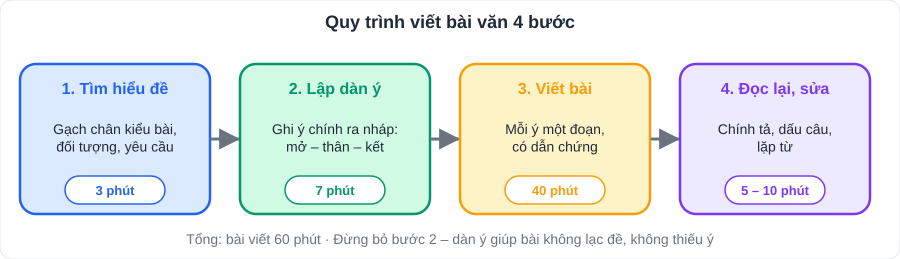
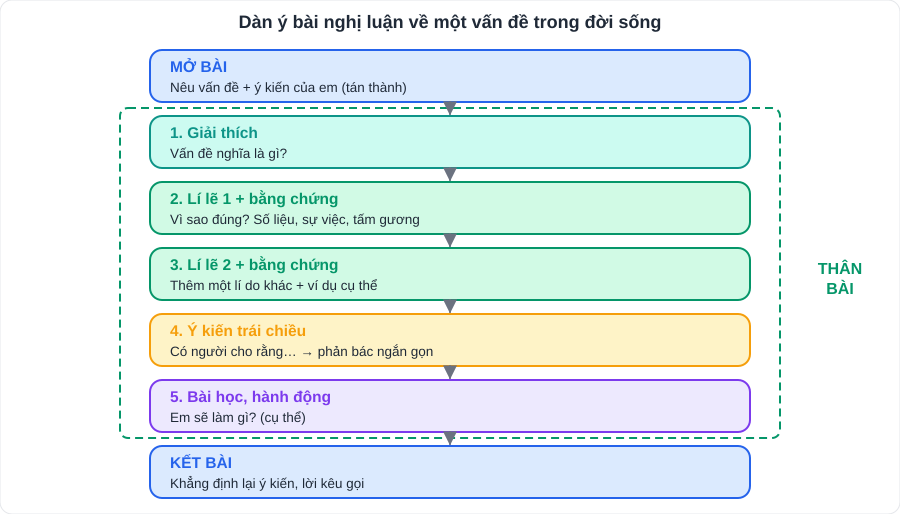

# Ngữ văn 4: Các kiểu bài viết lớp 7 (dàn ý mẫu)

> [Danh mục kiến thức](../README.md) · Phần **Viết** chiếm khoảng **4 điểm** trong đề kiểm tra · Mỗi tuần viết ít nhất **1 đoạn hoặc 1 bài** (xem lịch tuần)

## Mục tiêu

- Thuộc **dàn ý khung** của 6 kiểu bài lớp 7.
- Viết bài **đủ bố cục 3 phần**, đúng kiểu bài, có **dẫn chứng**, trong **45 – 60 phút**.

---

## Quy trình 4 bước (áp dụng cho mọi bài)

| Bước | Việc | Thời gian (bài 60') |
|---|---|---|
| 1. Tìm hiểu đề | Gạch chân **kiểu bài, đối tượng, yêu cầu** | 3' |
| 2. Lập dàn ý | Ghi ý chính ra nháp (mở – thân – kết) | 7' |
| 3. Viết | Viết theo dàn ý, mỗi ý một đoạn | 40' |
| 4. Đọc lại | Sửa chính tả, dấu câu, lặp từ | 5 – 10' |

---

## Kiểu 1: Kể lại sự việc có thật liên quan đến nhân vật / sự kiện lịch sử

- **Mở bài**: giới thiệu nhân vật / sự kiện lịch sử, lí do kể.
- **Thân bài**: bối cảnh (thời gian, không gian) → diễn biến **theo trình tự thời gian** → kết quả; dùng **chi tiết có căn cứ** (sử liệu); có thể kết hợp miêu tả.
- **Kết bài**: ý nghĩa của sự việc; cảm nghĩ của người viết.

> Gợi ý đề: Chiến thắng Bạch Đằng năm 938 (Ngô Quyền); Lý Thường Kiệt và phòng tuyến sông Như Nguyệt; Trần Hưng Đạo và chiến thắng Bạch Đằng 1288; Lê Lợi và khởi nghĩa Lam Sơn; Quang Trung đại phá quân Thanh (1789). Kiến thức sử: [Lịch sử Việt Nam](../LichSuDiaLi/L02-Lich-Su-Viet-Nam-X-XVI.md).

## Kiểu 2: Biểu cảm về con người hoặc sự việc

- **Mở bài**: giới thiệu người / sự việc, ấn tượng chung.
- **Thân bài**: những đặc điểm nổi bật (ngoại hình, tính cách, việc làm) **gắn với kỉ niệm**; cảm xúc của em ở từng chi tiết.
- **Kết bài**: khẳng định tình cảm, mong ước.

> Bí quyết: chọn **1 – 2 kỉ niệm cụ thể** (có thời gian, nơi chốn, lời nói) thay vì kể chung chung.

## Kiểu 3: Phân tích đặc điểm nhân vật trong tác phẩm văn học

- **Mở bài**: giới thiệu tác phẩm, tác giả, nhân vật; nhận xét khái quát.
- **Thân bài**: mỗi đặc điểm là **một đoạn**: nêu đặc điểm → **dẫn chứng** (chi tiết, lời nói, hành động) → **phân tích** → nhận xét. Cuối thân bài: nghệ thuật xây dựng nhân vật.
- **Kết bài**: khẳng định ý nghĩa nhân vật, bài học.

## Kiểu 4: Nghị luận về một vấn đề trong đời sống (trình bày ý kiến tán thành)

- **Mở bài**: nêu vấn đề, ý kiến của em (**tán thành**).
- **Thân bài**:
  1. Giải thích vấn đề.
  2. **Lí lẽ 1 + bằng chứng** (số liệu, sự việc, tấm gương).
  3. **Lí lẽ 2 + bằng chứng**.
  4. **Ý kiến trái chiều** và phản bác ngắn gọn.
  5. Bài học, hành động.
- **Kết bài**: khẳng định lại ý kiến.

> Gợi ý đề: Đọc sách có cần thiết với học sinh? · Học sinh có nên dùng điện thoại ở trường? · Tự học quan trọng như thế nào? · **Học sinh nên dùng trí tuệ nhân tạo (AI) để học như thế nào?** · Bảo vệ môi trường từ việc nhỏ.

## Kiểu 5: Nghị luận phân tích một tác phẩm văn học (bài thơ / truyện)

- Lớp 7 thường gặp: **đoạn văn / bài văn ghi lại cảm xúc về bài thơ** (xem [V02](V02-Doc-Hieu-Tho.md), mục 2) và **phân tích đặc điểm nhân vật** (kiểu 3).
- Khung chung: nêu **nội dung** (chủ đề, tình cảm) + **nghệ thuật** (thể thơ, biện pháp tu từ, chi tiết) + **dẫn chứng**, rồi nhận xét đánh giá.

## Kiểu 6: Thuyết minh về quy tắc, luật lệ của trò chơi / hoạt động

Xem dàn ý ở [V03](V03-Tuy-But-Tan-Van-Van-Ban-Thong-Tin.md), mục 3.

## Kiểu khác (tùy chương trình của trường)

- **Văn bản tường trình** (đã viết một sự việc): Quốc hiệu – tiêu ngữ, địa điểm thời gian, tên văn bản, người nhận, nội dung sự việc, chữ kí.
- **Tóm tắt văn bản** theo yêu cầu độ dài.

---

## Bảng tự chấm (dùng sau mỗi bài viết)

| Tiêu chí | Điểm tối đa | Tự chấm |
|---|---|---|
| Đúng **kiểu bài**, đúng **đối tượng** | 1,0 | |
| Bố cục đủ 3 phần, các ý sắp xếp hợp lí | 1,0 | |
| Có **dẫn chứng / chi tiết** cụ thể cho mỗi ý | 1,0 | |
| Diễn đạt trôi chảy, có cảm xúc / sức thuyết phục | 0,5 | |
| Chính tả, ngữ pháp, dấu câu | 0,5 | |
| **Tổng** (quy về thang 4 điểm phần Viết) | **4,0** | |

---

## Luyện tập: Lập dàn ý đề nghị luận

**Đề:** *Em hãy trình bày ý kiến tán thành với quan điểm: "Đọc sách là thói quen cần thiết đối với học sinh."*

👉 Bấm để xem dàn ý gợi ý

- **Mở bài:** Trong thời đại điện thoại và mạng xã hội, nhiều bạn ít đọc sách. Em tán thành: đọc sách là thói quen cần thiết.
- **Thân bài:**
  1. Giải thích: đọc sách là tiếp nhận tri thức, cảm xúc từ sách (sách giấy, sách điện tử); thói quen là việc làm đều đặn.
  2. Lí lẽ 1: sách mở rộng **hiểu biết**, hỗ trợ học tập. Bằng chứng: đọc sách khoa học giúp hiểu bài KHTN; đọc truyện giúp viết văn tốt hơn.
  3. Lí lẽ 2: sách nuôi dưỡng **tâm hồn**, rèn **tập trung**. Bằng chứng: đọc *Dế Mèn phiêu lưu kí* học được bài học về sự kiêu ngạo; đọc 20 phút mỗi tối giúp tập trung hơn so với lướt mạng.
  4. Ý kiến trái chiều: "Có Internet và AI rồi, không cần đọc sách." → Internet cho thông tin nhanh nhưng rời rạc; đọc sách giúp suy nghĩ **sâu** và **liền mạch**, điều AI không làm thay được.
  5. Hành động: đọc 20 phút mỗi ngày, chọn sách phù hợp, ghi sổ đọc sách.
- **Kết bài:** khẳng định lại; lời kêu gọi các bạn cùng đọc.

