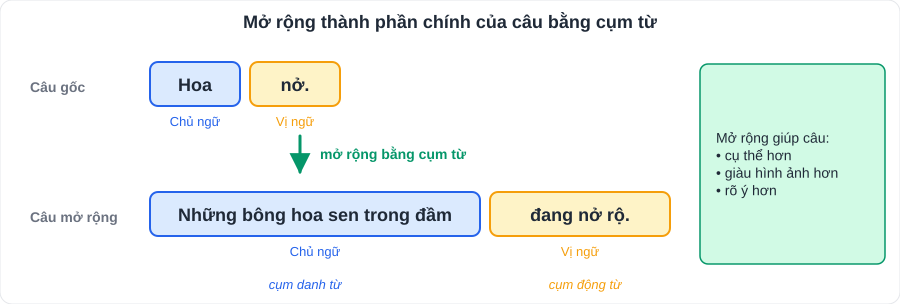

# Ngữ văn 5: Tiếng Việt (phần "Thực hành tiếng Việt")

> [Danh mục kiến thức](../README.md) · Mỗi bài SGK có một mục *Thực hành tiếng Việt*; đề kiểm tra thường có **1 – 2 câu** (khoảng 1 điểm) · Ôn rải rác mỗi tuần 10 phút

> Bảng dưới tổng hợp các nội dung tiếng Việt **thường gặp ở lớp 7**. Mỗi bài SGK học nội dung nào thì con đánh dấu ✅ ở cột cuối.

## 1. Từ và nghĩa của từ

| Nội dung | Kiến thức | Ví dụ | Đã học |
|---|---|---|---|
| **Số từ** | Chỉ số lượng, thứ tự | ba, mười, thứ nhất | |
| **Phó từ** | Đi kèm động từ, tính từ để bổ sung ý nghĩa (thời gian, mức độ, phủ định…) | **đã**, **đang**, **sẽ**, **rất**, **lắm**, **không**, **chưa** | |
| **Từ địa phương** | Dùng ở một vùng | má (mẹ), heo (lợn), trái (quả) | |
| **Từ Hán Việt** | Từ gốc Hán, đọc theo âm Việt; có sắc thái **trang trọng** | phụ nữ, thiên nhiên, hải quân | |
| **Thành ngữ** | Cụm từ cố định, nghĩa **bóng** | *Nước đổ đầu vịt*, *Đẽo cày giữa đường* | |
| **Tục ngữ** | Câu ngắn, có vần, đúc kết **kinh nghiệm** | *Tấc đất tấc vàng*; *Ăn quả nhớ kẻ trồng cây* | |
| **Thuật ngữ** | Từ chuyên môn khoa học | quang hợp, nguyên tử | |
| **Nghĩa của từ** | Đoán nghĩa dựa vào **ngữ cảnh** hoặc **yếu tố cấu tạo** (từ Hán Việt) | "thiên" = trời / nghìn | |

## 2. Câu và thành phần câu

| Nội dung | Kiến thức | Ví dụ |
|---|---|---|
| **Mở rộng thành phần chính bằng cụm từ** | Chủ ngữ / vị ngữ là **cụm danh từ, cụm động từ, cụm tính từ** thay cho một từ → câu cụ thể hơn | *Hoa nở.* → *Những bông hoa sen trong đầm **đang nở rộ**.* |
| **Mở rộng trạng ngữ bằng cụm từ** | Trạng ngữ chỉ thời gian, nơi chốn, mục đích, nguyên nhân… | ***Vào một buổi sáng mùa thu**, em đến trường.* |
| **Liên kết câu** | Phép **lặp**, **thế** (dùng đại từ), **nối** (từ nối: tuy nhiên, vì vậy…) | |
| **Mạch lạc** | Các câu cùng hướng vào một chủ đề, sắp xếp hợp lí | |

## 3. Biện pháp tu từ

Xem bảng đầy đủ và **công thức nêu tác dụng** ở [V02 – mục 1.3](V02-Doc-Hieu-Tho.md). Lớp 7 nhấn mạnh thêm: **nói quá**, **nói giảm nói tránh**.

## 4. Dấu câu

| Dấu | Công dụng | Ví dụ |
|---|---|---|
| **Dấu chấm lửng (…)** | Liệt kê chưa hết; lời nói ngập ngừng, đứt quãng; **tạo sự bất ngờ, hài hước** | *Anh ấy đã về… với hai bàn tay trắng.* |
| **Dấu gạch ngang (–)** | Đánh dấu lời nói trực tiếp; bộ phận chú thích; nối các từ trong liên danh | *Tàu Hà Nội – Huế* |
| **Dấu ngoặc kép** | Trích dẫn; từ ngữ hiểu theo nghĩa đặc biệt; tên tác phẩm | |
| **Dấu chấm phẩy** | Ngăn cách các vế câu, các bộ phận liệt kê phức tạp | |

## 5. Phép tu từ từ vựng hay nhầm

| Cặp hay nhầm | Phân biệt |
|---|---|
| Ẩn dụ – Hoán dụ | Ẩn dụ dựa trên **giống nhau**; hoán dụ dựa trên **gần gũi** (bộ phận – toàn thể, vật chứa – vật bị chứa…) |
| So sánh – Ẩn dụ | So sánh có **từ so sánh** (như, là); ẩn dụ **ẩn** vế được so sánh |
| Nói quá – Nói khoác | Nói quá để **nhấn mạnh** (biện pháp nghệ thuật); nói khoác để **khoe khoang, sai sự thật** |

---

## 6. Luyện tập

1. Tìm phó từ trong câu: *"Em đã làm xong bài tập nhưng chưa kiểm tra lại."*
2. Giải thích nghĩa của thành ngữ *"Nước đổ đầu vịt"* và đặt một câu có thành ngữ đó.
3. Mở rộng chủ ngữ và vị ngữ trong câu *"Gió thổi."* thành câu có cụm từ.
4. Chỉ ra biện pháp tu từ và tác dụng: *"Bác đã đi rồi sao, Bác ơi!"* (Tố Hữu).
5. Nêu công dụng dấu chấm lửng: *"Nó vẫn đứng đó… chờ đợi."*

👉 Bấm để xem gợi ý đáp án

1. **đã**, **chưa** (phó từ chỉ thời gian / phủ định); "xong" là phó từ chỉ kết quả cũng được chấp nhận.
2. Chỉ việc dạy bảo, khuyên nhủ mà người nghe **không tiếp thu gì**. Ví dụ: *Mẹ nhắc mãi mà nó vẫn quên, đúng là nước đổ đầu vịt.*
3. Ví dụ: ***Những cơn gió mùa đông bắc lạnh buốt** **thổi ào ào qua cánh đồng**.*
4. **Nói giảm nói tránh**: "đi rồi" thay cho "mất" → giảm nỗi đau, thể hiện sự kính trọng, tiếc thương với Bác.
5. Thể hiện sự **ngập ngừng**, kéo dài thời gian, gợi tâm trạng chờ đợi.

