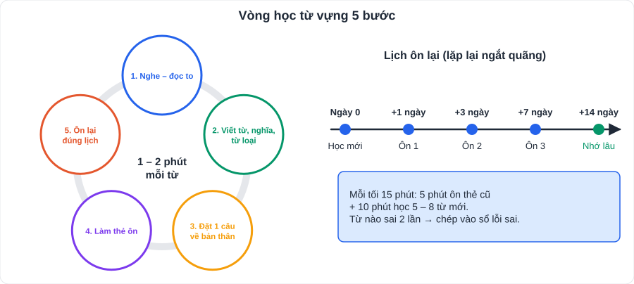

# Tiếng Anh 1: Từ vựng Unit 1 – 6 (Global Success 7 – Học kì 1)

> [Danh mục kiến thức](../README.md) · Học ở tuần 1 – 10 (mỗi tối 15 phút) · Dùng Anki / Quizlet hoặc thẻ giấy

## Cách học mỗi từ (5 bước, 1 – 2 phút/từ)

1. **Nghe – đọc to** (tra phát âm trên từ điển Cambridge hoặc Oxford).
2. **Viết** từ + nghĩa + **từ loại** (n, v, adj, adv).
3. **Đặt 1 câu** về bản thân.
4. Làm **thẻ ôn**: mặt trước tiếng Việt, mặt sau tiếng Anh.
5. **Ôn lại** sau 1 ngày, 3 ngày, 7 ngày.

> Danh sách dưới là **từ trọng tâm theo chủ đề**. Từ trong SGK của con có thể khác vài từ; con bổ sung các từ trong mục *Vocabulary* cuối sách vào thẻ.

---

## Unit 1: Hobbies (Sở thích)

| Từ | Loại | Nghĩa | Ví dụ / ghi chú |
|---|---|---|---|
| hobby | n | sở thích | My hobby is gardening. |
| collect | v | sưu tầm | collect stamps / dolls |
| build dollhouses | v phr | làm nhà búp bê | |
| gardening | n | làm vườn | |
| horse riding | n | cưỡi ngựa | |
| jogging | n | chạy bộ | |
| making models | n | làm mô hình | |
| arranging flowers | n | cắm hoa | |
| taking photos | n | chụp ảnh | |
| unusual | adj | khác thường | ↔ usual |
| patient | adj | kiên nhẫn | ↔ impatient |
| creative | adj | sáng tạo | |
| share | v | chia sẻ | share sth **with** sb |
| be fond of | phr | thích | = like, love, enjoy + **V-ing** |
| take up | phr v | bắt đầu (một sở thích) | take up painting |

## Unit 2: Healthy Living (Lối sống lành mạnh)

| Từ | Loại | Nghĩa | Ví dụ / ghi chú |
|---|---|---|---|
| healthy | adj | khỏe mạnh, lành mạnh | ↔ unhealthy; health (n) |
| fit | adj | cân đối, khỏe | keep fit |
| exercise | n, v | tập thể dục | do exercise |
| diet | n | chế độ ăn | a balanced diet |
| vegetable | n | rau | |
| junk food | n | đồ ăn vặt kém dinh dưỡng | |
| calorie | n | ca-lo | |
| sunburn | n | cháy nắng | |
| acne | n | mụn trứng cá | |
| chapped lips | n | môi nứt nẻ | |
| skin condition | n | tình trạng da | |
| suncream | n | kem chống nắng | |
| soft drink | n | nước ngọt | |
| stay up late | phr | thức khuya | |
| tofu | n | đậu phụ | |

## Unit 3: Community Service (Phục vụ cộng đồng)

| Từ | Loại | Nghĩa | Ví dụ / ghi chú |
|---|---|---|---|
| community service | n | phục vụ cộng đồng | |
| volunteer | n, v | tình nguyện viên; tình nguyện | voluntary (adj) |
| donate | v | quyên góp | donation (n), donate sth **to** sb |
| homeless | adj | vô gia cư | homeless people |
| elderly | adj | cao tuổi | the elderly |
| disabled | adj | khuyết tật | |
| tutor | v, n | dạy kèm; gia sư | |
| clean up | phr v | dọn sạch | |
| plant trees | v phr | trồng cây | |
| recycle | v | tái chế | recycling (n) |
| raise money | v phr | gây quỹ | |
| benefit | n, v | lợi ích; có lợi | |
| make a difference | phr | tạo nên sự khác biệt | |
| environment | n | môi trường | environmental (adj) |
| encourage | v | khuyến khích | encourage sb **to** V |

## Unit 4: Music and Arts (Âm nhạc và nghệ thuật)

| Từ | Loại | Nghĩa | Ví dụ / ghi chú |
|---|---|---|---|
| musical instrument | n | nhạc cụ | |
| perform | v | biểu diễn | performance (n), performer (n) |
| concert | n | buổi hòa nhạc | |
| painter | n | họa sĩ | painting (n) |
| art gallery | n | phòng trưng bày nghệ thuật | |
| photography | n | nhiếp ảnh | photographer, photograph |
| puppet | n | con rối | water puppetry: múa rối nước |
| compose | v | sáng tác (nhạc) | composer (n) |
| musician | n | nhạc sĩ | |
| exhibition | n | triển lãm | |
| talent | n | tài năng | talented (adj) |
| anthem | n | quốc ca | national anthem |
| opera | n | nhạc kịch | |
| prefer | v | thích hơn | prefer A **to** B |
| as … as | | bằng | (so sánh bằng) |

## Unit 5: Food and Drink (Đồ ăn và thức uống)

| Từ | Loại | Nghĩa | Ví dụ / ghi chú |
|---|---|---|---|
| beef noodle soup | n | phở bò / bún bò | |
| spring roll | n | chả giò / nem rán | |
| omelette | n | trứng tráng | |
| pancake | n | bánh kếp | |
| ingredient | n | nguyên liệu | |
| recipe | n | công thức nấu ăn | |
| pour | v | rót, đổ | |
| slice | n, v | lát; thái lát | |
| tablespoon / teaspoon | n | thìa canh / thìa cà phê | |
| flour | n | bột mì | (không đếm được) |
| fragrant | adj | thơm | |
| delicious | adj | ngon | |
| bitter / sour / salty / spicy | adj | đắng / chua / mặn / cay | |
| how much / how many | | bao nhiêu (không đếm được / đếm được) | |
| some / any | | một vài, một ít | some: câu khẳng định; any: phủ định, nghi vấn |

## Unit 6: A Visit to a School (Thăm một trường học)

| Từ | Loại | Nghĩa | Ví dụ / ghi chú |
|---|---|---|---|
| gifted | adj | có năng khiếu | gifted students |
| facility | n | cơ sở vật chất | modern facilities |
| outdoor activity | n | hoạt động ngoài trời | |
| entrance exam | n | kì thi đầu vào | pass the entrance exam |
| midterm | adj | giữa kì | midterm test |
| playground | n | sân chơi | |
| school garden | n | vườn trường | |
| lab | n | phòng thí nghiệm | = laboratory |
| library | n | thư viện | |
| well-known | adj | nổi tiếng | = famous |
| historic | adj | có giá trị lịch sử | |
| take part in | phr v | tham gia | = participate in |
| at / in / on | prep | giới từ chỉ thời gian | at 7 a.m. / in May / on Monday |
| found | v | thành lập | founded in 1908 |
| established | adj | được thành lập | |

---

## Kiểm tra nhanh (dịch sang tiếng Anh)

1. Sở thích của tôi là sưu tầm tem.
2. Bạn nên bôi kem chống nắng để tránh cháy nắng.
3. Chúng tôi quyên góp sách cho trẻ em vô gia cư.
4. Cô ấy thích âm nhạc hơn hội họa.
5. Cần bao nhiêu bột mì để làm bánh kếp?
6. Trường của tôi được thành lập năm 1990.

👉 Bấm để xem đáp án

1. My hobby is collecting stamps.
2. You should put on suncream to avoid sunburn.
3. We donate books to homeless children.
4. She prefers music to painting.
5. How much flour do we need to make pancakes?
6. My school was founded in 1990. *(câu bị động – có thể học như một mẫu cố định)*

