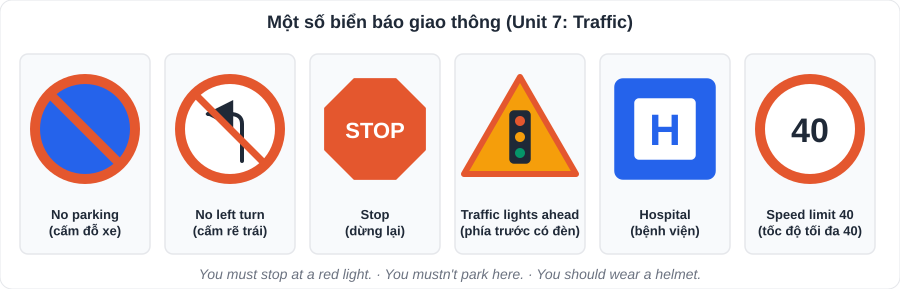

# Tiếng Anh 2: Từ vựng Unit 7 – 12 (Global Success 7 – Học kì 2)

> [Danh mục kiến thức](../README.md) · Học ở tuần 12 – 28 · Cách học: xem [A01](A01-Tu-Vung-Unit-1-6.md)

---

## Unit 7: Traffic (Giao thông)

| Từ | Loại | Nghĩa | Ví dụ / ghi chú |
|---|---|---|---|
| traffic jam | n | tắc đường | |
| traffic light | n | đèn giao thông | |
| road sign | n | biển báo | |
| pavement | n | vỉa hè | |
| zebra crossing | n | vạch qua đường | |
| cycle lane | n | làn đường xe đạp | |
| helmet | n | mũ bảo hiểm | wear a helmet |
| seat belt | n | dây an toàn | fasten your seat belt |
| passenger | n | hành khách | |
| obey | v | tuân thủ | obey traffic rules |
| fine | n, v | tiền phạt; phạt | |
| safety | n | sự an toàn | safe (adj), safely (adv) |
| It is + khoảng cách | | nói khoảng cách | **It is** about 2 km from my house **to** school. |
| used to | | đã từng (nay không còn) | I **used to** walk to school. |
| should / shouldn't | | nên / không nên | |

## Unit 8: Films (Phim ảnh)

| Từ | Loại | Nghĩa | Ví dụ / ghi chú |
|---|---|---|---|
| comedy | n | phim hài | |
| horror film | n | phim kinh dị | |
| science fiction (sci-fi) | n | phim khoa học viễn tưởng | |
| animation | n | phim hoạt hình | animated (adj) |
| documentary | n | phim tài liệu | |
| plot | n | cốt truyện | |
| review | n, v | bài đánh giá; đánh giá | |
| director | n | đạo diễn | direct (v) |
| star | v, n | đóng vai chính; ngôi sao | starring … |
| gripping | adj | hấp dẫn, lôi cuốn | |
| moving | adj | cảm động | |
| boring / bored | adj | gây chán / cảm thấy chán | **-ing**: tính chất sự vật; **-ed**: cảm xúc của người |
| frightening / frightened | adj | gây sợ / cảm thấy sợ | |
| although / however | conj / adv | mặc dù / tuy nhiên | **Although** it was long, the film was gripping. |
| recommend | v | giới thiệu, khuyên | |

## Unit 9: Festivals around the World (Lễ hội trên thế giới)

| Từ | Loại | Nghĩa | Ví dụ / ghi chú |
|---|---|---|---|
| festival | n | lễ hội | festive (adj) |
| celebrate | v | tổ chức lễ, kỉ niệm | celebration (n) |
| Thanksgiving | n | Lễ Tạ ơn | |
| Easter | n | Lễ Phục sinh | |
| Christmas | n | Giáng sinh | |
| Mid-Autumn Festival | n | Tết Trung thu | |
| lantern | n | đèn lồng | |
| parade | n | cuộc diễu hành | |
| firework | n | pháo hoa | firework display |
| costume | n | trang phục (hóa trang) | |
| feast | n | bữa tiệc lớn | |
| turkey | n | gà tây | |
| perform | v | biểu diễn | |
| take place | phr v | diễn ra | The festival takes place in October. |
| Yes/No question | | câu hỏi Có/Không | Did you go …? – Yes, I did. |

## Unit 10: Energy Sources (Các nguồn năng lượng)

| Từ | Loại | Nghĩa | Ví dụ / ghi chú |
|---|---|---|---|
| energy | n | năng lượng | |
| renewable | adj | tái tạo được | ↔ non-renewable |
| solar energy | n | năng lượng mặt trời | solar panel |
| wind energy | n | năng lượng gió | |
| hydro energy | n | thủy năng | |
| nuclear energy | n | năng lượng hạt nhân | |
| coal / oil / natural gas | n | than / dầu / khí tự nhiên | (năng lượng không tái tạo) |
| source | n | nguồn | |
| pollute | v | gây ô nhiễm | pollution (n), polluted (adj) |
| save | v | tiết kiệm | save energy |
| reduce | v | giảm | |
| run out | phr v | cạn kiệt | Oil will run out. |
| available | adj | có sẵn | |
| cheap / expensive | adj | rẻ / đắt | |
| present continuous | | hiện tại tiếp diễn | We **are using** more solar energy now. |

## Unit 11: Travelling in the Future (Du lịch trong tương lai)

| Từ | Loại | Nghĩa | Ví dụ / ghi chú |
|---|---|---|---|
| means of transport | n | phương tiện giao thông | |
| driverless car | n | ô tô không người lái | |
| flying car | n | ô tô bay | |
| skyTran | n | hệ thống tàu treo trên cao | |
| hyperloop | n | tàu siêu tốc trong ống | |
| bamboo-copter | n | chong chóng tre (Doraemon) | |
| teleporter | n | máy dịch chuyển tức thời | |
| eco-friendly | adj | thân thiện với môi trường | |
| fuel | n | nhiên liệu | |
| autopilot | n | chế độ lái tự động | |
| traffic jam | n | tắc đường | |
| fast / safe / comfortable | adj | nhanh / an toàn / thoải mái | |
| will + V | | thì tương lai đơn | People **will travel** by flying car. |
| possessive pronouns | | đại từ sở hữu | mine, yours, his, hers, ours, theirs |
| future | n | tương lai | in the future |

## Unit 12: English-Speaking Countries (Các nước nói tiếng Anh)

| Từ | Loại | Nghĩa | Ví dụ / ghi chú |
|---|---|---|---|
| English-speaking | adj | nói tiếng Anh | |
| the UK / the USA | n | Vương quốc Anh / Hoa Kỳ | |
| Australia / Canada / New Zealand | n | Úc / Ca-na-đa / Niu Di-lân | |
| native speaker | n | người bản ngữ | |
| capital | n | thủ đô | |
| landmark | n | địa danh nổi tiếng | |
| castle | n | lâu đài | |
| scenery | n | phong cảnh | |
| kangaroo / koala | n | chuột túi / gấu túi | |
| ancient | adj | cổ | |
| culture | n | văn hóa | cultural (adj) |
| tour | n | chuyến tham quan | |
| unique | adj | độc đáo | |
| symbol | n | biểu tượng | |
| articles a / an / the | | mạo từ | xem [A03](A03-Ngu-Phap-Trong-Tam.md) |

---

## Kiểm tra nhanh

Chọn đáp án đúng:
1. The film was so (bored / boring) that I fell asleep.
2. It is about 3 km (from / at) my house to school.
3. Solar energy is a (renewable / non-renewable) source.
4. This book is not yours. It's (my / mine).
5. In the future, people (travel / will travel) by flying cars.
6. (Although / However) it rained, we went to the festival.

👉 Bấm để xem đáp án

1. **boring** (bộ phim gây chán) 2. **from** 3. **renewable** 4. **mine** 5. **will travel** 6. **Although**

