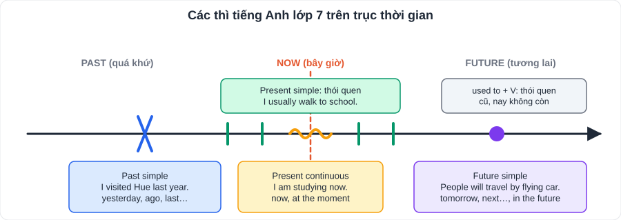
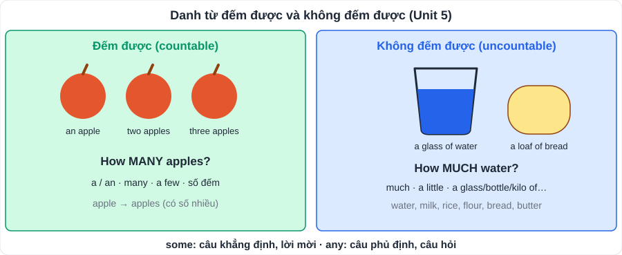
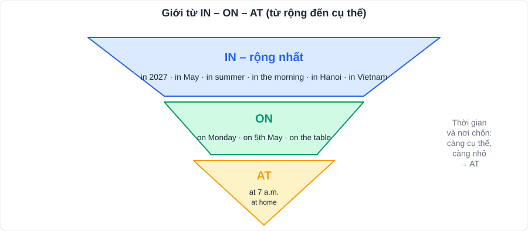

# Tiếng Anh 3: Ngữ pháp trọng tâm lớp 7

> [Danh mục kiến thức](../README.md) · Mỗi tuần học **1 mục** theo lịch tuần, ôn lại toàn bộ trước kỳ thi (tuần 10, 29 – 30)

| # | Chủ điểm | Unit liên quan (tham khảo) |
|---|---|---|
| 1 | Hiện tại đơn – hiện tại tiếp diễn | 1, 2, 10 |
| 2 | Quá khứ đơn | 3, 6, 9 |
| 3 | Tương lai đơn (will) | 11 |
| 4 | Động từ chỉ sở thích + V-ing | 1 |
| 5 | Câu đơn, câu ghép (and, but, so, or) | 2 |
| 6 | So sánh (as … as, different from, the same as) | 4 |
| 7 | Danh từ đếm được / không đếm được, some / any, how much / how many | 5 |
| 8 | Giới từ thời gian, nơi chốn | 6 |
| 9 | It (khoảng cách), should / shouldn't, used to | 7 |
| 10 | Although / However; tính từ -ed / -ing | 8 |
| 11 | Câu hỏi Wh- và Yes/No | 9 |
| 12 | Đại từ sở hữu | 11 |
| 13 | Mạo từ a / an / the | 12 |

> Cột "Unit liên quan" để định hướng; mục *Grammar* của SGK con là chuẩn.

---

## 1. Hiện tại đơn và hiện tại tiếp diễn

| | **Hiện tại đơn** | **Hiện tại tiếp diễn** |
|---|---|---|
| Dùng khi | Thói quen, sự thật, lịch trình | Việc **đang** xảy ra; kế hoạch gần |
| Khẳng định | I/You/We/They **play**; He/She/It **plays** | S + **am/is/are + V-ing** |
| Phủ định | **don't / doesn't** + V | am/is/are **not** + V-ing |
| Nghi vấn | **Do / Does** + S + V? | **Am/Is/Are** + S + V-ing? |
| Dấu hiệu | always, usually, often, sometimes, never, every day | now, right now, at the moment, Look!, Listen! |

**Thêm -s/-es:** -o, -s, -x, -ch, -sh → **-es** (goes, watches); phụ âm + y → **-ies** (studies); have → **has**.

> Động từ **không** dùng tiếp diễn: like, love, hate, want, know, understand, need, believe.

## 2. Quá khứ đơn

- Dùng cho việc **đã xảy ra và kết thúc** trong quá khứ. Dấu hiệu: **yesterday, last week/year, ago, in 2020**.
- Khẳng định: **V-ed / cột 2** (went, saw, did, had, made, took, bought, ate). Phủ định: **didn't + V**. Nghi vấn: **Did + S + V?**
- **was / were**: I/He/She/It **was**; You/We/They **were**.
- Phát âm -ed: **/t/** sau p, k, f, s, ʃ, tʃ (stopped, watched); **/ɪd/** sau t, d (wanted, needed); **/d/** còn lại (played, cleaned).

## 3. Tương lai đơn

- **S + will + V** (dự đoán, quyết định tức thì, lời hứa). Phủ định: **won't**. Dấu hiệu: tomorrow, next week, in the future, I think…
- *In the future, people **will travel** by flying cars.*

## 4. Động từ chỉ sở thích + V-ing

**like, love, enjoy, hate, don't mind, be fond of, be interested in** + **V-ing**.
> *She **enjoys making** models.*

## 5. Câu đơn, câu ghép

- **Câu đơn**: một mệnh đề (S + V). *I go to school.*
- **Câu ghép**: hai mệnh đề nối bằng **and** (thêm), **but** (đối lập), **so** (kết quả), **or** (lựa chọn); có dấu phẩy trước liên từ.
> *I was tired, **so** I went to bed early.*

## 6. So sánh

| Cấu trúc | Nghĩa | Ví dụ |
|---|---|---|
| **as + adj/adv + as** | bằng | My bag is **as heavy as** yours. |
| **not as … as** | không bằng | Music is **not as difficult as** maths. |
| **the same as** | giống | My idea is **the same as** yours. |
| **different from** | khác | Vietnamese food is **different from** Japanese food. |
| **similar to** | tương tự | |
| Hơn: short adj **-er than**; long adj **more … than** | hơn | taller than; more interesting than |

## 7. Danh từ đếm được / không đếm được

| | **Đếm được** | **Không đếm được** |
|---|---|---|
| Ví dụ | apple, egg, banana, student | water, milk, rice, flour, bread, butter, information |
| Hỏi số lượng | **How many** apples …? | **How much** milk …? |
| a / an | **a**n apple, **a** banana | **không** dùng a/an |
| some / any | **some**: khẳng định & lời mời; **any**: phủ định, nghi vấn | |
| Đơn vị | | a **bottle** of water, a **kilo** of rice, a **loaf** of bread, a **cup** of tea |

## 8. Giới từ

| Thời gian | Nơi chốn |
|---|---|
| **at** + giờ (at 7 o'clock), at night, at the weekend | **at** + địa điểm cụ thể (at school, at home) |
| **in** + tháng, năm, mùa, buổi (in May, in 2026, in the morning) | **in** + không gian kín, thành phố, quốc gia (in the room, in Hanoi) |
| **on** + thứ, ngày (on Monday, on 5th October) | **on** + bề mặt, đường phố (on the table, on Le Loi Street) |

## 9. It (khoảng cách), should, used to

- **It is + khoảng cách + from A to B.** *It is 5 km from my house to the zoo.* Hỏi: **How far is it from A to B?**
- **should / shouldn't + V**: lời khuyên. *You **should** wear a helmet.*
- **used to + V**: thói quen trong quá khứ, **nay không còn**. *I **used to** play marbles.* Phủ định: **didn't use to**.

## 10. Although / However; -ed / -ing

- **Although + mệnh đề, mệnh đề.** *Although the film was long, it was interesting.*
- **Mệnh đề. However, mệnh đề.** *The film was long. However, it was interesting.*
- **-ing**: tính chất của sự vật (gây ra cảm xúc); **-ed**: cảm xúc của người. *The film is **interesting**. I am **interested** in it.*

## 11. Câu hỏi

| Từ để hỏi | Hỏi về | Ví dụ |
|---|---|---|
| What | cái gì | What do you do in your free time? |
| Where | ở đâu | Where does the festival take place? |
| When | khi nào | When do people celebrate it? |
| Who | ai | Who directed the film? |
| Why | tại sao | Why do you like it? – Because … |
| How | thế nào | How do people celebrate it? |
| How often | bao lâu một lần | How often do you exercise? |
| How long | bao lâu | How long is the film? |

## 12. Đại từ sở hữu

| Tính từ sở hữu (+ danh từ) | my | your | his | her | our | their |
|---|---|---|---|---|---|---|
| **Đại từ sở hữu** (đứng một mình) | **mine** | **yours** | **his** | **hers** | **ours** | **theirs** |

> *This is **my** book. → This book is **mine**.*

## 13. Mạo từ

- **a** + phụ **âm** (a book, a **u**niversity /juː/); **an** + nguyên **âm** (an apple, an **h**our /aʊ/).
- **the**: vật đã được nhắc đến / xác định; vật duy nhất (**the** sun, **the** UK, **the** USA); nhạc cụ (play **the** piano).
- **Không** dùng mạo từ: môn thể thao (play football), bữa ăn (have breakfast), hầu hết tên nước (Vietnam, Australia).

---

## Bài tập tổng hợp

1. She usually (go) ______ to school by bike, but today she (walk) ______.
2. Last summer, we (visit) ______ Ha Long Bay.
3. How ______ sugar do you need? – Two spoons.
4. I'm interested ______ (learn) ______ English.
5. My hobby is different ______ my sister's.
6. ______ it was raining, they played football. (Although / However)
7. You ______ eat too much junk food. (should / shouldn't)
8. Is this pen ______? – Yes, it's mine.
9. I ______ (not watch) TV last night.
10. There is ______ orange and ______ banana on the table.

👉 Bấm để xem đáp án

1. **goes** / **is walking** 2. **visited** 3. **much** 4. **in learning** 5. **from** 6. **Although** 7. **shouldn't** 8. **yours** 9. **didn't watch** 10. **an** / **a**

