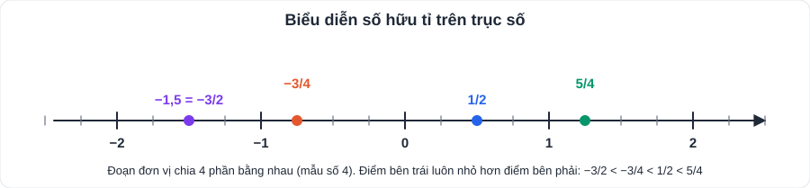
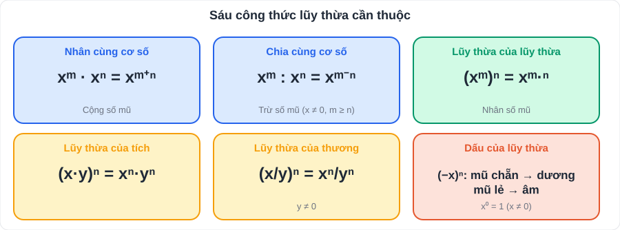

# Toán 1: Số hữu tỉ (Chương I – Tập 1)

> [Danh mục kiến thức](../README.md) · Học ở [tuần 1](../../LoTrinh/Tuan-01-Ke-Hoach-Hoc-Tap.md) – [tuần 2](../../LoTrinh/Tuan-02-Ke-Hoach-Hoc-Tap.md) · Ôn lại tuần 10 (thi HK1)

## Mục tiêu

- Cộng, trừ, nhân, chia số hữu tỉ **không sai dấu**.
- Dùng đúng 6 công thức lũy thừa.
- Bỏ ngoặc, chuyển vế để tìm x nhanh và chính xác.

---

## 1. Kiến thức cần nhớ

### 1.1. Số hữu tỉ

- Số hữu tỉ là số viết được dưới dạng **a/b** với a, b ∈ ℤ, **b ≠ 0**. Tập hợp số hữu tỉ: **ℚ**.
- ℕ ⊂ ℤ ⊂ ℚ. Ví dụ: 5 = 5/1; −0,25 = −1/4; 1⅓ = 4/3.
- **Số đối** của a là −a. **Số nghịch đảo** của a (a ≠ 0) là 1/a.
- **So sánh**: đưa về cùng mẫu dương rồi so sánh tử, hoặc đưa về số thập phân.
  - Số hữu tỉ dương > 0 > số hữu tỉ âm.
  - Với hai số âm: số nào có **giá trị tuyệt đối lớn hơn** thì **nhỏ hơn** (−3/4 < −1/2).
- **Biểu diễn trên trục số**: chia đoạn đơn vị thành b phần bằng nhau (với mẫu b).

### 1.2. Bốn phép tính

| Phép tính | Quy tắc | Ví dụ |
|---|---|---|
| Cộng, trừ | Quy đồng mẫu (mẫu dương) rồi cộng/trừ tử | −2/3 + 1/4 = −8/12 + 3/12 = **−5/12** |
| Nhân | a/b · c/d = (a·c)/(b·d) | −3/5 · 10/9 = **−2/3** |
| Chia | a/b : c/d = a/b · d/c (c ≠ 0) | 3/4 : (−1/2) = 3/4 · (−2) = **−3/2** |

**Tính chất** (dùng để tính nhanh): giao hoán, kết hợp, phân phối a·b + a·c = a·(b + c).

> Ví dụ tính nhanh: 7/9 · 13/5 − 7/9 · 3/5 = 7/9 · (13/5 − 3/5) = 7/9 · 2 = **14/9**.

### 1.3. Lũy thừa với số mũ tự nhiên

xⁿ = x · x · … · x (n thừa số), quy ước **x⁰ = 1** (x ≠ 0), x¹ = x.

| # | Công thức | Ví dụ |
|---|---|---|
| 1 | xᵐ · xⁿ = xᵐ⁺ⁿ | (1/2)² · (1/2)³ = (1/2)⁵ |
| 2 | xᵐ : xⁿ = xᵐ⁻ⁿ (x ≠ 0, m ≥ n) | (−3)⁵ : (−3)² = (−3)³ = −27 |
| 3 | (xᵐ)ⁿ = xᵐ·ⁿ | (2²)³ = 2⁶ = 64 |
| 4 | (x · y)ⁿ = xⁿ · yⁿ | (2 · 5)³ = 10³ |
| 5 | (x / y)ⁿ = xⁿ / yⁿ (y ≠ 0) | (2/3)³ = 8/27 |
| 6 | Dấu: (−x)ⁿ = xⁿ nếu n **chẵn**; = −xⁿ nếu n **lẻ** | (−1/2)⁴ = 1/16; (−1/2)³ = −1/8 |

### 1.4. Thứ tự thực hiện phép tính

1. Trong ngoặc trước: ( ) → [ ] → { }.
2. Lũy thừa → nhân, chia → cộng, trừ (từ trái sang phải).

### 1.5. Quy tắc dấu ngoặc và chuyển vế

- Bỏ ngoặc có dấu **"+"** đằng trước: **giữ nguyên** dấu các số hạng trong ngoặc.
- Bỏ ngoặc có dấu **"−"** đằng trước: **đổi dấu tất cả** các số hạng trong ngoặc.
  - a − (b − c + d) = a − b + c − d.
- **Chuyển vế**: chuyển một số hạng từ vế này sang vế kia thì **đổi dấu** số hạng đó.
  - x + a = b ⇒ x = b − a.

---

## 2. Dạng bài và cách làm

### Dạng 1: Thực hiện phép tính (tính hợp lí)

**Cách làm:** tìm số hạng/thừa số **giống nhau** để nhóm lại; đổi số thập phân, hỗn số về phân số.

**Ví dụ 1.** Tính A = (−5/7 + 3/4) + (5/7 + 1/4).
> A = (−5/7 + 5/7) + (3/4 + 1/4) = 0 + 1 = **1**.

**Ví dụ 2.** Tính B = 0,75 − 1½ · (−2/3)².
> (−2/3)² = 4/9; 1½ = 3/2; 3/2 · 4/9 = 2/3.
> B = 3/4 − 2/3 = 9/12 − 8/12 = **1/12**.

### Dạng 2: Tìm x

**Cách làm:** coi cả cụm chứa x là "ẩn lớn", gỡ từng lớp từ ngoài vào trong.

**Ví dụ 3.** 2/3 · x − 1/2 = 5/6.
> 2/3 · x = 5/6 + 1/2 = 4/3 → x = 4/3 : 2/3 = **2**.

**Ví dụ 4.** (x − 1/2)² = 9/16.
> x − 1/2 = 3/4 hoặc x − 1/2 = −3/4 → **x = 5/4** hoặc **x = −1/4**. (Đừng quên trường hợp âm!)

**Ví dụ 5.** 3ˣ⁺¹ = 81.
> 81 = 3⁴ → x + 1 = 4 → **x = 3**.

### Dạng 3: So sánh

**Ví dụ 6.** So sánh 2³⁰⁰ và 3²⁰⁰.
> 2³⁰⁰ = (2³)¹⁰⁰ = 8¹⁰⁰; 3²⁰⁰ = (3²)¹⁰⁰ = 9¹⁰⁰. Vì 8 < 9 nên **2³⁰⁰ < 3²⁰⁰**.

### Dạng 4: Toán thực tế

**Ví dụ 7.** Một cửa hàng giảm giá 1/5 giá niêm yết. Bạn An mua chiếc áo niêm yết 250 000 đồng. An phải trả bao nhiêu?
> Số tiền giảm: 250 000 · 1/5 = 50 000 đồng. An trả: 250 000 − 50 000 = **200 000 đồng**.

---

## 3. Lỗi hay gặp

| Lỗi | Sai | Đúng |
|---|---|---|
| Quên đổi dấu khi bỏ ngoặc có dấu "−" | 5 − (2 − x) = 5 − 2 − x | = 5 − 2 **+ x** |
| Nhân lũy thừa lại nhân số mũ | 2³ · 2⁴ = 2¹² | = 2⁷ |
| Lũy thừa số âm không có ngoặc | −2² = 4 | −2² = **−4**; (−2)² = 4 |
| Mất nghiệm âm | x² = 1/9 ⇒ x = 1/3 | x = 1/3 **hoặc** x = −1/3 |
| Chia nhầm thành nhân thẳng | a/b : c/d = ac/bd | = **ad/bc** |

---

## 4. Bài tập tự luyện

### Nhóm A: Cơ bản

1. Tính: a) −3/8 + 5/12; b) 4/5 − (−1,2); c) −9/14 · 7/6; d) −1,5 : 3/4.
2. Sắp xếp theo thứ tự tăng dần: −0,6; 1/3; −2/3; 0; 0,35.
3. Tính: a) (−1/3)³; b) (0,5)² · 4; c) 3⁵ : 3³; d) (2/5)⁰ + (−1)²⁰²⁶.
4. Tìm x: a) x + 2/5 = −1/10; b) 3/4 − x = 1/2; c) −2x = 3/7.
5. Bỏ ngoặc rồi tính: (7/9 − 1/4) − (7/9 + 3/4).

### Nhóm B: Vận dụng

6. Tính hợp lí: 5/11 · (−3/7) + 5/11 · (−4/7) + 5/11.
7. Tìm x: a) (2x − 1)² = 25/4; b) 2ˣ · 4 = 128; c) |x − 1/3| = 1/2.
8. So sánh: a) 5²⁰ và 25⁹; b) (−1/2)⁵ và (−1/3)⁵.
9. Một bể nước đang chứa 3/5 thể tích. Người ta dùng hết 1/4 thể tích bể, rồi bơm thêm 2/5 thể tích bể. Bể đang chứa bao nhiêu phần thể tích? Bể đã đầy chưa?
10. ★ Tính: S = 1/(1·2) + 1/(2·3) + 1/(3·4) + … + 1/(99·100). *(Gợi ý: 1/(n(n+1)) = 1/n − 1/(n+1).)*

---

## 5. Đáp án

👉 Bấm để xem đáp án (tự làm xong rồi mới mở)

1. a) −9/24 + 10/24 = **1/24**; b) 4/5 + 6/5 = **2**; c) **−3/4**; d) −3/2 · 4/3 = **−2**.
2. −2/3 < −0,6 < 0 < 0,35 < 1/3 (vì −2/3 ≈ −0,667; 1/3 ≈ 0,333).
3. a) **−1/27**; b) 0,25 · 4 = **1**; c) 3² = **9**; d) 1 + 1 = **2**.
4. a) x = −1/10 − 4/10 = **−1/2**; b) x = 3/4 − 1/2 = **1/4**; c) x = **−3/14**.
5. 7/9 − 1/4 − 7/9 − 3/4 = **−1**.
6. 5/11 · (−3/7 − 4/7 + 1) = 5/11 · 0 = **0**.
7. a) 2x − 1 = ±5/2 → **x = 7/4** hoặc **x = −3/4**; b) 2ˣ = 32 → **x = 5**; c) x − 1/3 = ±1/2 → **x = 5/6** hoặc **x = −1/6**.
8. a) 25⁹ = 5¹⁸ < 5²⁰ → **5²⁰ > 25⁹**; b) (−1/2)⁵ = −1/32; (−1/3)⁵ = −1/243; vì 1/32 > 1/243 nên **(−1/2)⁵ < (−1/3)⁵**.
9. 3/5 − 1/4 + 2/5 = 1 − 1/4 = **3/4** thể tích; bể **chưa đầy**.
10. S = 1 − 1/2 + 1/2 − 1/3 + … + 1/99 − 1/100 = 1 − 1/100 = **99/100**.

