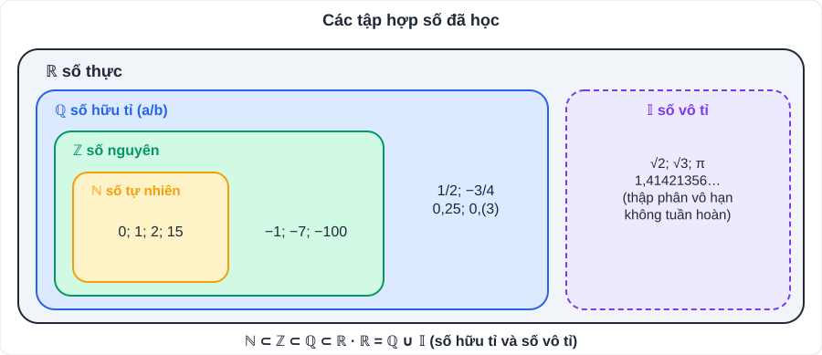
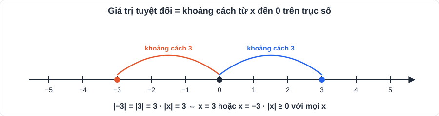

# Toán 2: Số thực (Chương II – Tập 1)

> [Danh mục kiến thức](../README.md) · Học ở [tuần 3](../../LoTrinh/Tuan-03-Ke-Hoach-Hoc-Tap.md) · Ôn lại tuần 5 (giữa HK1) và tuần 10 (cuối HK1)

## Mục tiêu

- Phân biệt được số thập phân hữu hạn, vô hạn tuần hoàn và vô hạn không tuần hoàn.
- Tính căn bậc hai số học và làm tròn số đúng yêu cầu.
- Tìm x có giá trị tuyệt đối hoặc căn bậc hai.

---

## 1. Kiến thức cần nhớ

### 1.1. Số thập phân

| Loại | Ví dụ | Là số |
|---|---|---|
| Hữu hạn | 3/8 = 0,375 | hữu tỉ |
| Vô hạn **tuần hoàn** | 1/3 = 0,333… = 0,(3); 5/6 = 0,8(3) | hữu tỉ |
| Vô hạn **không** tuần hoàn | √2 = 1,41421356…; π = 3,14159… | **vô tỉ** |

- Phân số tối giản có mẫu dương **chỉ có ước nguyên tố 2 và 5** → viết được dạng thập phân hữu hạn. Mẫu có ước nguyên tố khác 2 và 5 → vô hạn tuần hoàn.
  - 7/20 (20 = 2²·5) → 0,35; 4/15 (15 = 3·5) → 0,2(6).
- Chu kì: phần lặp lại, viết trong ngoặc. 0,272727… = 0,(27).

### 1.2. Căn bậc hai số học

- Căn bậc hai số học của số a **không âm** là số **x ≥ 0** sao cho x² = a. Kí hiệu √a.
- √0 = 0; √1 = 1; √4 = 2; √9 = 3; √16 = 4; √25 = 5; √36 = 6; √49 = 7; √64 = 8; √81 = 9; √100 = 10; √121 = 11; √144 = 12; √169 = 13; √196 = 14; √225 = 15.
- **Số âm không có căn bậc hai.** √(−4) không xác định.
- (√a)² = a (a ≥ 0); √(a²) = |a|.
- Dùng máy tính để tính gần đúng: √2 ≈ 1,414; √3 ≈ 1,732; √5 ≈ 2,236.

### 1.3. Số vô tỉ và số thực

- **Số vô tỉ**: số viết được dạng thập phân vô hạn **không tuần hoàn**. Tập hợp số vô tỉ: 𝕀.
- **Số thực**: gồm số hữu tỉ và số vô tỉ. Tập hợp số thực: **ℝ**. ℕ ⊂ ℤ ⊂ ℚ ⊂ ℝ.

- Mỗi số thực được biểu diễn bởi **một điểm** trên trục số và ngược lại (trục số được "lấp đầy").
- So sánh hai số thực: so sánh từng hàng của dạng thập phân; với căn: 0 ≤ a < b ⇔ √a < √b.

### 1.4. Giá trị tuyệt đối

- |x| = x nếu x ≥ 0; |x| = −x nếu x < 0. Luôn có **|x| ≥ 0**, |x| = |−x|.
- Ý nghĩa: |x| là **khoảng cách** từ điểm x đến điểm 0 trên trục số.

### 1.5. Làm tròn số và độ chính xác

- Quy tắc: xét chữ số **ngay sau** hàng làm tròn. **< 5**: giữ nguyên; **≥ 5**: cộng 1 vào chữ số hàng làm tròn. Bỏ các chữ số phía sau (phần thập phân) hoặc thay bằng 0 (phần nguyên).
  - 3,14159 làm tròn đến hàng phần trăm → **3,14**; 2 568 làm tròn đến hàng trăm → **2 600**.
- **Làm tròn với độ chính xác d**: d = 0,5 → làm tròn đến hàng đơn vị; d = 0,05 → hàng phần mười; d = 0,005 → hàng phần trăm; d = 50 → hàng trăm.

---

## 2. Dạng bài và cách làm

### Dạng 1: Viết phân số dưới dạng số thập phân và ngược lại

**Ví dụ 1.** Viết 5/12 dưới dạng số thập phân. → 5 : 12 = 0,41666… = **0,41(6)**.

**Ví dụ 2.** Viết 0,(4) dưới dạng phân số. → 0,(1) = 1/9 nên 0,(4) = 4 · 1/9 = **4/9**.
> Mẹo: 0,(ab) = ab/99. Ví dụ 0,(27) = 27/99 = **3/11**.

### Dạng 2: Tính giá trị biểu thức có căn

**Ví dụ 3.** Tính √49 − 2√(1/4) + (√3)².
> = 7 − 2 · 1/2 + 3 = **9**.

### Dạng 3: Tìm x

**Ví dụ 4.** |x| = 2,5 → **x = 2,5** hoặc **x = −2,5**. |x| = −1 → **không có x**.

**Ví dụ 5.** |x − 3| + 1 = 5 → |x − 3| = 4 → x − 3 = 4 hoặc x − 3 = −4 → **x = 7** hoặc **x = −1**.

**Ví dụ 6.** x² = 7 → **x = √7** hoặc **x = −√7**.

**Ví dụ 7.** √x = 3 → **x = 9** (điều kiện x ≥ 0).

### Dạng 4: Giá trị nhỏ nhất, lớn nhất có giá trị tuyệt đối ★

**Ví dụ 8.** Tìm giá trị nhỏ nhất của A = |x − 2| + 5.
> Vì |x − 2| ≥ 0 nên A ≥ 5. Dấu "=" khi x = 2. Vậy **A nhỏ nhất bằng 5 khi x = 2**.

### Dạng 5: Toán thực tế có căn và làm tròn

**Ví dụ 9.** Một mảnh vườn hình vuông có diện tích 200 m². Tính độ dài cạnh (làm tròn đến hàng phần mười).
> Cạnh = √200 ≈ 14,142… ≈ **14,1 m**.

---

## 3. Lỗi hay gặp

| Lỗi | Sai | Đúng |
|---|---|---|
| Căn của tổng | √(9 + 16) = 3 + 4 = 7 | √25 = **5** |
| Căn ra số âm | √25 = ±5 | √25 = **5** (căn bậc hai *số học*) |
| Quên trường hợp âm khi bỏ giá trị tuyệt đối | \|x\| = 3 ⇒ x = 3 | x = 3 **hoặc** x = −3 |
| Làm tròn hai lần | 2,449 → 2,45 → 2,5 | 2,449 làm tròn hàng phần mười → **2,4** |
| Nghĩ π = 3,14 | π = 3,14 | π **≈** 3,14 (π là số vô tỉ) |

---

## 4. Bài tập tự luyện

### Nhóm A: Cơ bản

1. Phân số nào viết được dạng thập phân hữu hạn: 3/40; 7/30; 11/125; 5/14? Viết chúng dưới dạng số thập phân.
2. Tính: a) √81; b) √0,36; c) √(16/25); d) −√144.
3. Trong các số sau, số nào hữu tỉ, số nào vô tỉ: −0,5; √9; √11; 0,(12); π; 22/7.
4. Tìm x: a) |x| = 4/5; b) |x| + 1 = 0,5; c) x² = 16.
5. Làm tròn 12,6847: a) đến hàng phần mười; b) đến hàng phần trăm; c) với độ chính xác 0,5.

### Nhóm B: Vận dụng

6. Sắp xếp tăng dần: √5; 2,2; −√3; 0; 2,(23).
7. Tìm x: a) |2x − 1| = 3; b) 3 − |x + 1| = 1; c) (x − 1)² = 5.
8. Tìm giá trị lớn nhất của B = 4 − |x + 2|.
9. Một màn hình tivi hình vuông (giả sử) có đường chéo dài d, cạnh a thì d = a√2. Với a = 60 cm, tính d (làm tròn đến hàng đơn vị).
10. ★ Chứng tỏ 0,(3) + 0,(6) = 1.

---

## 5. Đáp án

👉 Bấm để xem đáp án (tự làm xong rồi mới mở)

1. Hữu hạn: 3/40 = **0,075** (40 = 2³·5); 11/125 = **0,088** (125 = 5³). 7/30 = 0,2(3) và 5/14 = 0,3(571428) là vô hạn tuần hoàn.
2. a) **9**; b) **0,6**; c) **4/5**; d) **−12**.
3. Hữu tỉ: −0,5; √9 = 3; 0,(12); 22/7. Vô tỉ: **√11; π**.
4. a) **x = ±4/5**; b) |x| = −0,5 → **không có x**; c) **x = ±4**.
5. a) **12,7**; b) **12,68**; c) độ chính xác 0,5 → hàng đơn vị: **13**.
6. √5 = 2,236…; 2,(23) = 2,2323…; so sánh hàng phần nghìn: 6 > 2 nên √5 > 2,(23). Thứ tự: **−√3 < 0 < 2,2 < 2,(23) < √5**.
7. a) 2x − 1 = ±3 → **x = 2** hoặc **x = −1**; b) |x + 1| = 2 → **x = 1** hoặc **x = −3**; c) x − 1 = ±√5 → **x = 1 + √5** hoặc **x = 1 − √5**.
8. |x + 2| ≥ 0 ⇒ B ≤ 4; **B lớn nhất bằng 4 khi x = −2**.
9. d = 60√2 ≈ 84,85 → **85 cm**.
10. 0,(3) = 3/9 = 1/3; 0,(6) = 6/9 = 2/3; tổng = **1**.

