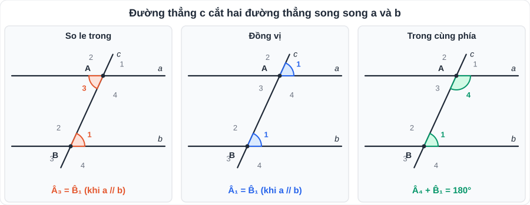
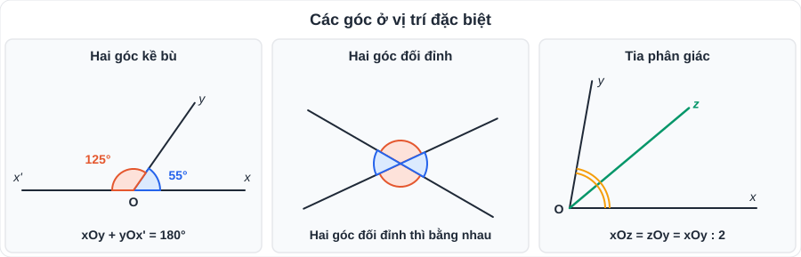
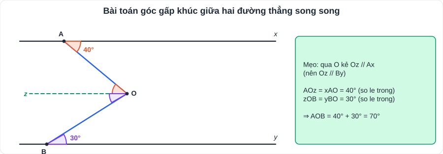

# Toán 3: Góc và đường thẳng song song (Chương III – Tập 1)

> [Danh mục kiến thức](../README.md) · Học ở [tuần 4](../../LoTrinh/Tuan-04-Ke-Hoach-Hoc-Tap.md) – [tuần 5](../../LoTrinh/Tuan-05-Ke-Hoach-Hoc-Tap.md) · Ôn lại tuần 10

## Mục tiêu

- Gọi đúng tên các cặp góc: kề bù, đối đỉnh, so le trong, đồng vị, trong cùng phía.
- Chứng minh hai đường thẳng song song; tính góc khi có song song.
- Viết **giả thiết – kết luận** và trình bày chứng minh có căn cứ cho từng bước.

---

## 1. Kiến thức cần nhớ

### 1.1. Góc ở vị trí đặc biệt

| Cặp góc | Định nghĩa | Tính chất |
|---|---|---|
| **Kề nhau** | Chung đỉnh, chung một cạnh, hai cạnh còn lại nằm về hai phía của cạnh chung | |
| **Kề bù** | Kề nhau và hai cạnh còn lại là hai tia đối nhau | Tổng **= 180°** |
| **Đối đỉnh** | Mỗi cạnh của góc này là tia đối của một cạnh góc kia | **Bằng nhau** |

- **Tia phân giác** Oz của góc xOy: nằm giữa Ox, Oy và **xOz = zOy = xOy/2**.
- Vẽ tia phân giác: dùng thước đo góc, hoặc gấp giấy, hoặc dùng compa.

### 1.2. Hai đường thẳng song song

Đường thẳng c cắt a và b tại A và B tạo thành 8 góc (xem hình). Các cặp góc:

- **So le trong**: nằm "giữa" a và b, ở **hai phía** của c (A₃ và B₁; A₄ và B₂).
- **Đồng vị**: cùng vị trí ở hai giao điểm (A₁ và B₁; A₂ và B₂; …).
- **Trong cùng phía**: nằm giữa a và b, **cùng phía** với c.

**Dấu hiệu nhận biết** (để chứng minh a // b): nếu c cắt a, b và có

1. một cặp góc **so le trong bằng nhau**, hoặc
2. một cặp góc **đồng vị bằng nhau**, hoặc
3. ★ một cặp góc **trong cùng phía bù nhau** (tổng 180°),

thì **a // b**.

**Hệ quả:**
- a ⊥ c và b ⊥ c ⇒ **a // b** (cùng vuông góc với đường thẳng thứ ba).

### 1.3. Tiên đề Euclid và tính chất

- **Tiên đề Euclid**: qua một điểm nằm ngoài một đường thẳng, **chỉ có một** đường thẳng song song với đường thẳng đó.
- **Tính chất hai đường thẳng song song**: nếu a // b và c cắt a, b thì
  - các góc **so le trong bằng nhau**;
  - các góc **đồng vị bằng nhau**;
  - ★ các góc trong cùng phía **bù nhau**.
- a // b và c ⊥ a ⇒ **c ⊥ b**.
- a // c và b // c ⇒ **a // b** (cùng song song với đường thẳng thứ ba).

> **Phân biệt:** *Dấu hiệu* đi từ **góc ⇒ song song**. *Tính chất* đi từ **song song ⇒ góc**. Khi viết chứng minh phải ghi đúng căn cứ.

### 1.4. Định lí và chứng minh định lí

- Định lí có dạng **"Nếu … (giả thiết – GT) thì … (kết luận – KL)"**.
- Chứng minh định lí: dùng lập luận suy ra KL từ GT, **mỗi bước có căn cứ** (định nghĩa, tính chất, định lí đã biết).

---

## 2. Dạng bài và cách làm

### Dạng 1: Tính số đo góc

**Ví dụ 1.** Hai đường thẳng cắt nhau tạo thành 4 góc, trong đó một góc bằng 50°. Tính các góc còn lại.
> Góc đối đỉnh với nó: **50°**. Hai góc kề bù với nó: 180° − 50° = **130°** (mỗi góc).

**Ví dụ 2.** Cho a // b, đường thẳng c cắt a tại A, cắt b tại B. Biết Â₁ = 65°. Tính các góc tại B.
> B̂₁ = Â₁ = **65°** (đồng vị); B̂₃ = B̂₁ = **65°** (đối đỉnh); B̂₂ = B̂₄ = 180° − 65° = **115°** (kề bù).

### Dạng 2: Chứng minh hai đường thẳng song song

**Mẫu trình bày:**
> Ta có Â = B̂ = 70° (GT). Mà Â và B̂ ở vị trí **so le trong**. Suy ra **a // b** (dấu hiệu nhận biết hai đường thẳng song song).

### Dạng 3: Bài toán "góc gấp khúc" (kẻ thêm đường song song) ★

**Ví dụ 3.** Cho Ax // By, điểm O nằm giữa hai đường. Biết xAO = 40°, yBO = 30° (hai góc ở "trong"). Tính AOB.
> Qua O kẻ Oz // Ax (do đó Oz // By).
> AOz = xAO = 40° (so le trong); zOB = yBO = 30° (so le trong).
> AOB = 40° + 30° = **70°**.

> **Mẹo:** gặp đường gấp khúc giữa hai đường song song → **kẻ qua đỉnh gấp một đường song song**.

### Dạng 4: Viết GT – KL và chứng minh định lí

**Ví dụ 4.** Chứng minh: hai tia phân giác của hai góc kề bù thì vuông góc với nhau.
> GT: xOy, yOx' kề bù; Om phân giác xOy; On phân giác yOx'. KL: Om ⊥ On.
> Chứng minh: mOy = xOy/2; yOn = yOx'/2 (tính chất tia phân giác).
> mOn = mOy + yOn = (xOy + yOx')/2 = 180°/2 = 90° (hai góc kề bù có tổng 180°).
> Vậy **Om ⊥ On**.

---

## 3. Lỗi hay gặp

- Nhầm **so le trong** với **đồng vị** → luôn vẽ hình, tô màu cặp góc trước khi kết luận.
- Dùng tính chất "so le trong bằng nhau" khi **chưa có** a // b.
- Thiếu căn cứ trong ngoặc ở mỗi bước chứng minh → mất điểm trình bày.
- Đo góc bằng thước rồi lấy số đo đó để "chứng minh".

---

## 4. Bài tập tự luyện

### Nhóm A: Cơ bản

1. Cho xOy = 120°, Oz là tia phân giác. Tính xOz.
2. Hai đường thẳng MN và PQ cắt nhau tại O, MOP = 35°. Tính NOQ, MOQ.
3. Cho a // b, c cắt a tại A, cắt b tại B. Góc so le trong tại A bằng 72°. Tính 4 góc tại B.
4. Vì sao hai đường thẳng cùng vuông góc với một đường thẳng thì song song? Vẽ hình minh họa.
5. Viết GT – KL của định lí: "Nếu hai góc đối đỉnh thì bằng nhau".

### Nhóm B: Vận dụng

6. Cho hình: Ax // By, điểm C nằm giữa hai đường. xAC = 50°, CBy = 40° (hai góc ở "trong"). Chứng minh AC ⊥ CB.
7. Cho tam giác ABC. Qua A kẻ đường thẳng d // BC. Chứng minh  + B̂ + Ĉ = 180°. *(Gợi ý: dùng các góc so le trong.)*
8. Cho a ⊥ c, b ⊥ c, đường thẳng d cắt a tại M, cắt b tại N, góc tạo bởi d và a tại M là 110°. Tính góc nhọn tạo bởi d và b tại N.
9. ★ Cho xOy = 60°, Oz là tia đối của Ox. Om, On lần lượt là tia phân giác của xOy và yOz. Tính mOn.

---

## 5. Đáp án

👉 Bấm để xem đáp án (tự làm xong rồi mới mở)

1. xOz = 120° : 2 = **60°**.
2. NOQ = MOP = **35°** (đối đỉnh); MOQ = 180° − 35° = **145°** (kề bù).
3. Hai góc **72°** (một so le trong, một đối đỉnh với nó) và hai góc **108°**.
4. Đường thẳng c cắt a, b tạo ra cặp góc đồng vị cùng bằng 90° ⇒ a // b (dấu hiệu đồng vị).
5. GT: Ô₁ và Ô₂ đối đỉnh. KL: **Ô₁ = Ô₂**.
6. Kẻ Cz // Ax ⇒ ACz = 50°, zCB = 40° ⇒ ACB = **90°** ⇒ AC ⊥ CB.
7. d // BC ⇒ góc tạo bởi d với AB bằng B̂, với AC bằng Ĉ (so le trong); ba góc tại A trên đường thẳng d có tổng 180° ⇒ Â + B̂ + Ĉ = **180°**.
8. a // b (cùng ⊥ c). Góc tại M bằng 110° ⇒ góc kề bù tại M bằng 70°; góc đồng vị tại N bằng 70° ⇒ **70°**.
9. yOz = 180° − 60° = 120°; mOy = 30°, yOn = 60° ⇒ mOn = **90°**.

