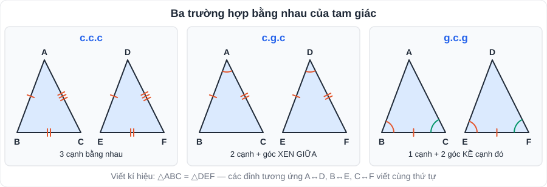
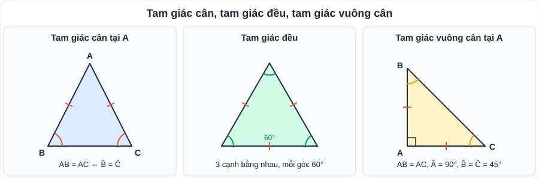
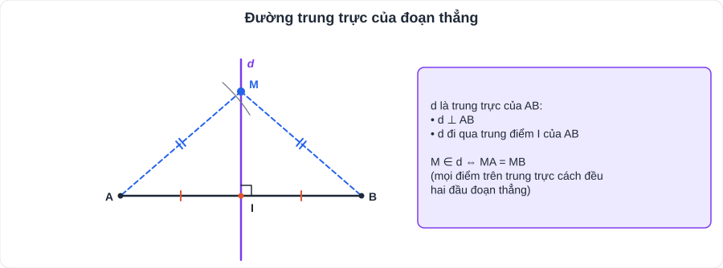
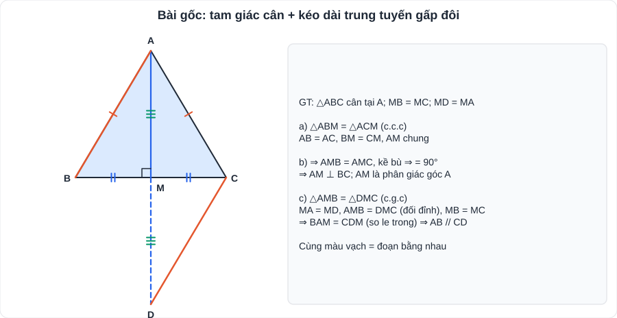

# Toán 4: Tam giác bằng nhau (Chương IV – Tập 1)

> [Danh mục kiến thức](../README.md) · Học ở [tuần 6](../../LoTrinh/Tuan-06-Ke-Hoach-Hoc-Tap.md) – [tuần 8](../../LoTrinh/Tuan-08-Ke-Hoach-Hoc-Tap.md) · Ôn lại tuần 10 và tuần 27 · **Chương quan trọng nhất của hình học lớp 7**

## Mục tiêu

- Viết đúng kí hiệu △ABC = △DEF (**các đỉnh tương ứng viết cùng thứ tự**).
- Chọn đúng trường hợp bằng nhau và trình bày đủ 3 yếu tố.
- Dùng tam giác bằng nhau để suy ra **cạnh bằng nhau, góc bằng nhau, trung điểm, vuông góc, tia phân giác**.

---

## 1. Kiến thức cần nhớ

### 1.1. Tổng các góc trong một tam giác

- **Â + B̂ + Ĉ = 180°.**
- Tam giác vuông: hai góc nhọn **phụ nhau** (tổng 90°).
- **Góc ngoài** của tam giác bằng **tổng hai góc trong không kề** với nó (và lớn hơn mỗi góc đó).
- Phân loại theo góc: tam giác nhọn (3 góc nhọn), vuông (1 góc 90°), tù (1 góc > 90°).

### 1.2. Hai tam giác bằng nhau

△ABC = △DEF ⇔ AB = DE, BC = EF, CA = FD và Â = D̂, B̂ = Ê, Ĉ = F̂.

| Trường hợp | Điều kiện | Ghi nhớ |
|---|---|---|
| **c.c.c** | 3 cạnh bằng nhau | |
| **c.g.c** | 2 cạnh và **góc xen giữa** | Góc phải **nằm giữa** hai cạnh |
| **g.c.g** | 1 cạnh và **2 góc kề** cạnh đó | |

**Tam giác vuông** (hệ quả):

| Trường hợp | Điều kiện |
|---|---|
| Hai cạnh góc vuông | (c.g.c) |
| Cạnh góc vuông – góc nhọn kề | (g.c.g) |
| Cạnh huyền – góc nhọn | |
| **Cạnh huyền – cạnh góc vuông** | |

### 1.3. Tam giác cân, tam giác đều

- **Tam giác cân** tại A: AB = AC. Tính chất: **B̂ = Ĉ** (hai góc ở đáy bằng nhau).
- Dấu hiệu: tam giác có **hai góc bằng nhau** là tam giác cân.
- Tam giác cân tại A: B̂ = Ĉ = (180° − Â) : 2; Â = 180° − 2B̂.
- **Tam giác đều**: 3 cạnh bằng nhau, mỗi góc **60°**. Dấu hiệu: tam giác cân có một góc 60°.
- **Tam giác vuông cân**: vuông và cân, hai góc nhọn bằng 45°.

### 1.4. Đường trung trực của đoạn thẳng

- Đường trung trực của AB: đường thẳng **vuông góc với AB tại trung điểm** của AB.
- Tính chất: điểm M nằm trên trung trực của AB ⇔ **MA = MB**.
- Vẽ bằng compa: vẽ hai cung tròn tâm A, tâm B cùng bán kính (lớn hơn AB/2), nối hai giao điểm.

---

## 2. Dạng bài và cách làm

### Quy trình chứng minh hai đoạn thẳng (hai góc) bằng nhau

1. Tìm hai tam giác **chứa** hai đoạn (hai góc) đó.
2. Liệt kê các yếu tố bằng nhau đã có (GT, cạnh chung, góc chung, đối đỉnh…).
3. Chọn trường hợp (c.c.c / c.g.c / g.c.g) → kết luận hai tam giác bằng nhau.
4. Suy ra **cạnh / góc tương ứng** bằng nhau.

### Ví dụ mẫu (bài "gốc" hay gặp trong đề)

Cho △ABC cân tại A. Gọi M là trung điểm BC.
a) Chứng minh △ABM = △ACM.
b) Chứng minh AM ⊥ BC và AM là tia phân giác của BAC.
c) Trên tia đối của tia MA lấy D sao cho MD = MA. Chứng minh AB // CD.

**Lời giải.**

a) Xét △ABM và △ACM có:
- AB = AC (△ABC cân tại A);
- BM = CM (M là trung điểm BC);
- AM là cạnh chung.

⇒ **△ABM = △ACM (c.c.c)**.

b) Từ câu a ⇒ AMB = AMC (hai góc tương ứng). Mà AMB + AMC = 180° (kề bù) ⇒ AMB = 90° ⇒ **AM ⊥ BC**.
Cũng từ câu a ⇒ BAM = CAM (hai góc tương ứng) ⇒ **AM là tia phân giác của BAC**.

c) Xét △AMB và △DMC có:
- MA = MD (GT);
- AMB = DMC (đối đỉnh);
- MB = MC (GT).

⇒ △AMB = △DMC (c.g.c) ⇒ BAM = CDM (hai góc tương ứng).
Mà hai góc này ở vị trí **so le trong** ⇒ **AB // CD**.

> **Bài gốc "tia đối – kéo dài trung tuyến gấp đôi"** (câu c) xuất hiện rất thường xuyên. Học thuộc cách trình bày.

### Dạng tính góc

**Ví dụ.** △ABC có Â = 75°, B̂ = 2Ĉ. Tính B̂, Ĉ.
> B̂ + Ĉ = 180° − 75° = 105° ⇒ 2Ĉ + Ĉ = 105° ⇒ **Ĉ = 35°**, **B̂ = 70°**.

---

## 3. Lỗi hay gặp

| Lỗi | Cách tránh |
|---|---|
| Viết △ABC = △DFE khi A ↔ D, B ↔ E, C ↔ F | Viết đỉnh tương ứng **cùng thứ tự** |
| Dùng **c.g.c** mà góc **không xen giữa** hai cạnh | Kiểm tra: góc phải nằm ở đỉnh chung của 2 cạnh |
| Dùng "g.g.g" | **Không có** trường hợp g.g.g |
| Thiếu "Xét △… và △… có:" và căn cứ trong ngoặc | Luôn trình bày theo khuôn mẫu ở trên |
| Dùng kết luận câu sau để chứng minh câu trước | Câu sau được dùng câu trước, **không ngược lại** |

---

## 4. Bài tập tự luyện

### Nhóm A: Cơ bản

1. △ABC có Â = 50°, B̂ = 70°. Tính Ĉ và góc ngoài tại đỉnh C.
2. △ABC vuông tại A có B̂ = 35°. Tính Ĉ.
3. Cho △ABC = △MNP, AB = 4 cm, BC = 6 cm, P̂ = 40°. Tính MN, NP và Ĉ.
4. △ABC cân tại A có Â = 40°. Tính B̂, Ĉ.
5. Cho đoạn AB = 6 cm, M nằm trên đường trung trực của AB và MA = 5 cm. Tính MB.

### Nhóm B: Vận dụng

6. Cho góc xOy, Oz là tia phân giác. Lấy A ∈ Ox, B ∈ Oy sao cho OA = OB. Lấy M ∈ Oz. Chứng minh MA = MB.
7. Cho △ABC có AB = AC. Kẻ BH ⊥ AC (H ∈ AC), CK ⊥ AB (K ∈ AB). Chứng minh BH = CK.
8. Cho △ABC, M là trung điểm AC. Trên tia đối của tia MB lấy D sao cho MD = MB. Chứng minh: a) △AMB = △CMD; b) AB // CD; c) AD = BC.
9. ★ Cho △ABC vuông tại A, B̂ = 60°. Trên cạnh BC lấy D sao cho BD = BA. a) Chứng minh △ABD đều. b) Tính DAC và chứng minh △ADC cân.

---

## 5. Đáp án

👉 Bấm để xem đáp án (tự làm xong rồi mới mở)

1. Ĉ = 180° − 50° − 70° = **60°**; góc ngoài tại C = 50° + 70° = **120°**.
2. Ĉ = 90° − 35° = **55°**.
3. MN = AB = **4 cm**; NP = BC = **6 cm**; Ĉ = P̂ = **40°**.
4. B̂ = Ĉ = (180° − 40°) : 2 = **70°**.
5. M thuộc trung trực của AB ⇒ MB = MA = **5 cm**.
6. △OAM = △OBM (c.g.c: OA = OB, AOM = BOM, OM chung) ⇒ **MA = MB**.
7. △ABH và △ACK vuông tại H, K có: AB = AC, Â chung ⇒ bằng nhau (cạnh huyền – góc nhọn) ⇒ **BH = CK**.
8. a) MA = MC, AMB = CMD (đối đỉnh), MB = MD ⇒ **c.g.c**. b) ⇒ BAM = DCM, so le trong ⇒ **AB // CD**. c) Tương tự △AMD = △CMB (c.g.c) ⇒ **AD = CB**.
9. a) BA = BD ⇒ △ABD cân tại B, có B̂ = 60° ⇒ **đều**. b) BAD = 60° ⇒ DAC = 90° − 60° = **30°**; Ĉ = 90° − 60° = 30° ⇒ DAC = Ĉ ⇒ **△ADC cân tại D**.

