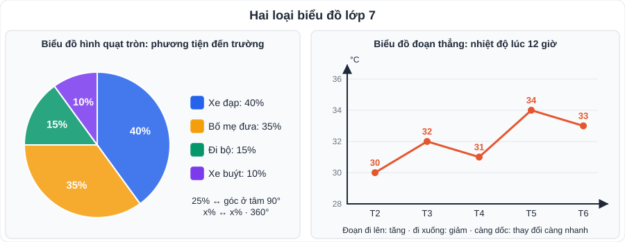

# Toán 5: Thu thập và biểu diễn dữ liệu (Chương V – Tập 1)

> [Danh mục kiến thức](../README.md) · Học ở [tuần 9](../../LoTrinh/Tuan-09-Ke-Hoach-Hoc-Tap.md) · Ôn lại tuần 10 và tuần 28 · **Phần dễ lấy điểm**: chỉ cần đọc kỹ biểu đồ

## Mục tiêu

- Phân loại dữ liệu; phát hiện dữ liệu **không hợp lí**.
- Đọc và vẽ (hoàn thiện) **biểu đồ hình quạt tròn** và **biểu đồ đoạn thẳng**.
- Trả lời câu hỏi "nhiều nhất, ít nhất, tăng/giảm, gấp bao nhiêu lần, chiếm bao nhiêu phần trăm".

---

## 1. Kiến thức cần nhớ

### 1.1. Thu thập và phân loại dữ liệu

| Loại | Ví dụ |
|---|---|
| Dữ liệu **định tính** (không phải số) | Màu yêu thích, môn học, loại phương tiện đến trường |
| Dữ liệu **định lượng** (là số) | Chiều cao, số giờ ngủ, điểm kiểm tra |

- **Cách thu thập**: quan sát, làm thí nghiệm, lập phiếu hỏi (khảo sát), phỏng vấn, thu thập từ nguồn có sẵn (sách báo, Internet).
- **Tính hợp lí của dữ liệu** – kiểm tra:
  - Dữ liệu có **đúng định dạng** không? (điểm 11 trên thang 10; chiều cao 15 m).
  - Dữ liệu có **nằm trong phạm vi** không? (số học sinh "rất thích" lớn hơn sĩ số lớp).
  - Mẫu khảo sát có **đại diện** không? (hỏi 5 bạn trong đội bóng để kết luận "cả trường thích bóng đá").
  - Tổng các tỉ lệ phần trăm phải bằng **100%**.

### 1.2. Biểu đồ hình quạt tròn

- Dùng để biểu diễn **tỉ lệ phần trăm** của các phần **so với tổng thể**.
- Cả hình tròn = 100%. Hình quạt chiếm x% có **góc ở tâm = x% · 360°**.
  - 25% ↔ 90° (một phần tư hình tròn); 50% ↔ 180°; 10% ↔ 36°.
- Từ tỉ lệ phần trăm và tổng số → **số lượng = tổng · x%**.

### 1.3. Biểu đồ đoạn thẳng

- Dùng để biểu diễn **sự thay đổi** của một đại lượng **theo thời gian**.
- Trục ngang: thời gian (ngày, tháng, năm). Trục đứng: giá trị đại lượng.
- Mỗi điểm = giá trị tại một thời điểm; nối các điểm liên tiếp bằng đoạn thẳng.
- Đoạn **đi lên**: tăng; **đi xuống**: giảm; **nằm ngang**: không đổi. Đoạn càng dốc → thay đổi càng nhanh.

---

## 2. Dạng bài và cách làm

### Dạng 1: Phát hiện dữ liệu không hợp lí

**Ví dụ 1.** Lớp 7A có 40 học sinh. Bảng khảo sát "môn thể thao yêu thích": Bóng đá 15; Cầu lông 12; Bơi 10; Cờ vua 8. Dữ liệu có hợp lí không?
> Tổng = 15 + 12 + 10 + 8 = 45 > 40 (nếu mỗi bạn chọn 1 môn) → **không hợp lí**.

### Dạng 2: Đọc biểu đồ hình quạt tròn

**Ví dụ 2.** Khảo sát 200 học sinh về phương tiện đến trường: Xe đạp 40%; Bố mẹ đưa 35%; Đi bộ 15%; Xe buýt 10%.
a) Phương tiện nào nhiều nhất? → **Xe đạp**.
b) Có bao nhiêu học sinh đi xe buýt? → 200 · 10% = **20 học sinh**.
c) Số học sinh đi xe đạp gấp mấy lần đi bộ? → 40% : 15% = **8/3 ≈ 2,67 lần**.
d) Góc ở tâm của hình quạt "Bố mẹ đưa"? → 35% · 360° = **126°**.

### Dạng 3: Đọc biểu đồ đoạn thẳng

**Ví dụ 3.** Nhiệt độ lúc 12 giờ trong 5 ngày: T2 30°C, T3 32°C, T4 31°C, T5 34°C, T6 33°C.
a) Ngày nóng nhất? → **T5** (34°C).
b) Nhiệt độ tăng nhiều nhất giữa hai ngày liên tiếp nào? → T4 → T5 (**tăng 3°C**).
c) Nhiệt độ trung bình 5 ngày? → (30 + 32 + 31 + 34 + 33) : 5 = **32°C**.

### Dạng 4: Chọn biểu đồ phù hợp

| Mục đích | Biểu đồ |
|---|---|
| So sánh các phần trong một tổng thể (%) | **Hình quạt tròn** |
| Theo dõi thay đổi theo thời gian | **Đoạn thẳng** |
| So sánh số lượng giữa các nhóm | Cột (đã học lớp 6) |

---

## 3. Lỗi hay gặp

- Quên nhân với **tổng số** khi đề hỏi "bao nhiêu người", chỉ trả lời phần trăm.
- Đọc nhầm đơn vị trên trục đứng (nghìn, triệu, %).
- Nói "gấp 2 lần" khi đề hỏi "nhiều hơn bao nhiêu" (hiệu ≠ tỉ số).
- Không kiểm tra tổng các phần trăm = 100%.

---

## 4. Bài tập tự luyện

1. Phân loại dữ liệu: a) tên các loài hoa trong vườn trường; b) số anh chị em ruột của mỗi bạn; c) cỡ giày (36, 37, 38…); d) xếp loại học lực.
2. Một bạn khảo sát "thời gian dùng điện thoại mỗi ngày" của học sinh lớp 7 và ghi được một giá trị là 26 giờ. Giá trị này có hợp lí không? Vì sao?
3. Biểu đồ quạt tròn về loại sách học sinh lớp 7B thích đọc (40 bạn): Truyện tranh 45%; Khoa học 20%; Văn học 25%; Khác 10%.
   a) Mỗi loại có bao nhiêu bạn? b) Góc ở tâm của "Khoa học"? c) Số bạn thích truyện tranh nhiều hơn số bạn thích văn học bao nhiêu bạn?
4. Số sách thư viện cho mượn theo tháng: T9: 120; T10: 150; T11: 180; T12: 140; T1: 100.
   a) Vẽ biểu đồ đoạn thẳng. b) Tháng nào nhiều nhất? c) Từ T11 đến T1 giảm bao nhiêu phần trăm?
5. ★ Kết quả khảo sát của một lớp: 30% thích Toán, 25% thích Văn, 20% thích Anh, còn lại thích KHTN. Biết số bạn thích KHTN là 10 bạn. Lớp có bao nhiêu học sinh?

---

## 5. Đáp án

👉 Bấm để xem đáp án (tự làm xong rồi mới mở)

1. a) định tính; b) định lượng; c) định lượng; d) định tính.
2. **Không hợp lí**: một ngày chỉ có 24 giờ.
3. a) Truyện tranh **18**; Khoa học **8**; Văn học **10**; Khác **4**. b) 20% · 360° = **72°**. c) 18 − 10 = **8 bạn**.
4. b) **T11** (180 cuốn). c) Giảm 180 − 100 = 80 cuốn; 80 : 180 ≈ **44,4%**.
5. KHTN chiếm 100% − 30% − 25% − 20% = 25% ⇒ cả lớp: 10 : 25% = **40 học sinh**.

