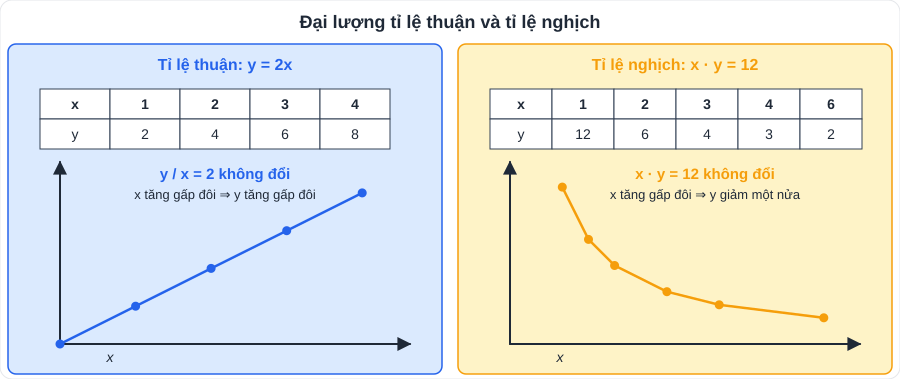

# Toán 6: Tỉ lệ thức và đại lượng tỉ lệ (Chương VI – Tập 2)

> [Danh mục kiến thức](../README.md) · Học ở [tuần 12](../../LoTrinh/Tuan-12-Ke-Hoach-Hoc-Tap.md) – [tuần 14](../../LoTrinh/Tuan-14-Ke-Hoach-Hoc-Tap.md) · Ôn lại tuần 23 (giữa HK2) và tuần 28 · **Toán thực tế cuối năm hay rơi vào chương này**

## Mục tiêu

- Dùng tính chất tỉ lệ thức và **dãy tỉ số bằng nhau** để tìm x, y, z.
- Nhận biết hai đại lượng **tỉ lệ thuận / tỉ lệ nghịch** trong đời sống.
- Giải bài toán chia phần, năng suất – thời gian, vận tốc – thời gian.

---

## 1. Kiến thức cần nhớ

### 1.1. Tỉ lệ thức

- Tỉ lệ thức là đẳng thức của hai tỉ số: **a/b = c/d** (a : b = c : d). a, d: ngoại tỉ; b, c: trung tỉ.
- **Tính chất 1**: a/b = c/d ⇒ **a·d = b·c** (tích ngoại tỉ = tích trung tỉ).
- **Tính chất 2**: từ a·d = b·c (a, b, c, d ≠ 0) lập được 4 tỉ lệ thức: a/b = c/d; a/c = b/d; d/b = c/a; d/c = b/a.

### 1.2. Dãy tỉ số bằng nhau

a/b = c/d = e/f = **(a + c + e)/(b + d + f)** = **(a − c + e)/(b − d + f)** (giả sử các mẫu khác 0).

- "x, y, z **tỉ lệ với** 2, 3, 5" ⇔ **x/2 = y/3 = z/5** (viết x : y : z = 2 : 3 : 5).

### 1.3. Đại lượng tỉ lệ thuận và tỉ lệ nghịch

| | **Tỉ lệ thuận** | **Tỉ lệ nghịch** |
|---|---|---|
| Công thức | **y = k·x** (k ≠ 0) | **y = a/x** hay **x·y = a** (a ≠ 0) |
| Gọi là | y tỉ lệ thuận với x theo hệ số k | y tỉ lệ nghịch với x theo hệ số a |
| Chiều ngược lại | x tỉ lệ thuận với y theo hệ số **1/k** | x tỉ lệ nghịch với y theo hệ số **a** (giữ nguyên) |
| Tính chất | **y/x = k không đổi**; x₁/x₂ = y₁/y₂ | **x·y = a không đổi**; x₁/x₂ = **y₂/y₁** |
| Cảm nhận | x tăng ⇒ y tăng theo cùng tỉ lệ | x tăng gấp đôi ⇒ y giảm còn một nửa |
| Ví dụ | Số vở – tiền mua; thời gian – quãng đường (vận tốc không đổi) | Số công nhân – thời gian xong việc; vận tốc – thời gian (quãng đường không đổi) |

---

## 2. Dạng bài và cách làm

### Dạng 1: Tìm x trong tỉ lệ thức

**Ví dụ 1.** x/12 = 3/4 ⇒ 4x = 36 ⇒ **x = 9**.

**Ví dụ 2.** (x + 2)/3 = (x − 1)/2 ⇒ 2(x + 2) = 3(x − 1) ⇒ 2x + 4 = 3x − 3 ⇒ **x = 7**.

### Dạng 2: Tìm x, y, z bằng dãy tỉ số bằng nhau

**Ví dụ 3.** Tìm x, y biết x/3 = y/5 và x + y = 32.
> x/3 = y/5 = (x + y)/(3 + 5) = 32/8 = 4 ⇒ **x = 12, y = 20**.

**Ví dụ 4 (có hệ số).** Tìm x, y, z biết x/2 = y/3 = z/4 và x + 2y − z = 12.
> x/2 = 2y/6 = z/4 = (x + 2y − z)/(2 + 6 − 4) = 12/4 = 3 ⇒ **x = 6, y = 9, z = 12**.

**Phương pháp "đặt k"** (dùng khi có tích, bình phương): x/2 = y/5 và x·y = 40 ⇒ x = 2k, y = 5k ⇒ 10k² = 40 ⇒ k = ±2 ⇒ **(x; y) = (4; 10) hoặc (−4; −10)**.

### Dạng 3: Chia theo tỉ lệ (tỉ lệ thuận)

**Ví dụ 5.** Ba lớp 7A, 7B, 7C trồng được 180 cây, số cây tỉ lệ với 4; 5; 6. Mỗi lớp trồng bao nhiêu cây?
> Gọi số cây là a, b, c. a/4 = b/5 = c/6 = (a + b + c)/15 = 180/15 = 12 ⇒ **a = 48, b = 60, c = 72** cây.

### Dạng 4: Tỉ lệ nghịch (năng suất – thời gian)

**Ví dụ 6.** 12 công nhân làm xong một công việc trong 10 ngày. Nếu có 15 công nhân (năng suất như nhau) thì làm xong trong bao lâu?
> Số công nhân và số ngày tỉ lệ nghịch: 12 · 10 = 15 · x ⇒ **x = 8 ngày**.

**Ví dụ 7 (chia tỉ lệ nghịch).** Ba đội máy cày cùng diện tích như nhau. Đội I xong trong 3 ngày, đội II 4 ngày, đội III 6 ngày. Ba đội có tổng 18 máy (năng suất mỗi máy như nhau). Mỗi đội có bao nhiêu máy?
> Số máy tỉ lệ nghịch với số ngày: 3x = 4y = 6z ⇒ x/(1/3) = y/(1/4) = z/(1/6) = (x + y + z)/(1/3 + 1/4 + 1/6) = 18/(3/4) = 24.
> ⇒ **x = 8, y = 6, z = 4** máy.

### Mẫu trình bày bài toán có lời văn

1. **Gọi** ẩn, ghi đơn vị và điều kiện (ví dụ: x > 0).
2. **Lập** quan hệ: tỉ lệ thuận/nghịch, tổng/hiệu.
3. **Giải** bằng dãy tỉ số bằng nhau.
4. **Kiểm tra** điều kiện, **trả lời** đủ câu hỏi.

---

## 3. Lỗi hay gặp

| Lỗi | Cách tránh |
|---|---|
| Nhầm tỉ lệ nghịch thành tỉ lệ thuận | Hỏi: "x tăng thì y tăng hay giảm?" |
| Chia tỉ lệ nghịch mà dùng x/3 = y/4 | Tỉ lệ nghịch với 3, 4 ⇒ **3x = 4y** ⇒ x/(1/3) = y/(1/4) |
| Nhân 2 ở tử mà quên nhân ở mẫu | 2y/6 (không phải 2y/3) |
| Phương pháp "đặt k" quên k âm | k² = 4 ⇒ k = 2 **hoặc** k = −2 |

---

## 4. Bài tập tự luyện

### Nhóm A: Cơ bản

1. Tìm x: a) x/5 = −4/10; b) 2,5 : x = 0,5 : 0,2; c) (x − 3)/4 = 5/2.
2. Lập các tỉ lệ thức từ đẳng thức 3 · 20 = 4 · 15.
3. Cho y tỉ lệ thuận với x, khi x = 4 thì y = 12. a) Tìm hệ số k. b) Tính y khi x = −2,5.
4. Cho y tỉ lệ nghịch với x, khi x = 3 thì y = 8. a) Tìm hệ số a. b) Tính y khi x = 6.
5. Mua 5 quyển vở hết 40 000 đồng. Mua 12 quyển vở cùng loại hết bao nhiêu tiền?

### Nhóm B: Vận dụng

6. Tìm x, y, z biết x/3 = y/4 = z/5 và x + y + z = 48.
7. Tìm x, y biết 2x = 5y và x − y = 15.
8. Một ô tô đi từ A đến B với vận tốc 60 km/h hết 3 giờ. Nếu đi với vận tốc 45 km/h thì hết bao lâu?
9. Số học sinh giỏi của ba lớp 7A, 7B, 7C tỉ lệ với 3; 4; 5. Lớp 7C nhiều hơn lớp 7A 8 bạn. Mỗi lớp có bao nhiêu học sinh giỏi?
10. ★ Ba đơn vị góp vốn theo tỉ lệ 2 : 3 : 5, tổng lãi 600 triệu đồng chia theo tỉ lệ góp vốn. Mỗi đơn vị được bao nhiêu?

---

## 5. Đáp án

👉 Bấm để xem đáp án (tự làm xong rồi mới mở)

1. a) x = 5 · (−4)/10 = **−2**; b) 0,5x = 2,5 · 0,2 = 0,5 ⇒ **x = 1**; c) 2(x − 3) = 20 ⇒ **x = 13**.
2. 3/4 = 15/20; 3/15 = 4/20; 20/4 = 15/3; 20/15 = 4/3.
3. a) **k = 3**; b) y = 3 · (−2,5) = **−7,5**.
4. a) **a = 24**; b) y = 24/6 = **4**.
5. Tiền và số vở tỉ lệ thuận: 40 000 : 5 · 12 = **96 000 đồng**.
6. Tỉ số chung = 48/12 = 4 ⇒ **x = 12, y = 16, z = 20**.
7. 2x = 5y ⇒ x/5 = y/2 = (x − y)/3 = 5 ⇒ **x = 25, y = 10**.
8. Vận tốc và thời gian tỉ lệ nghịch: 60 · 3 = 45 · t ⇒ **t = 4 giờ**.
9. a/3 = b/4 = c/5 = (c − a)/(5 − 3) = 8/2 = 4 ⇒ **12; 16; 20** học sinh.
10. Tỉ số chung = 600/10 = 60 ⇒ **120; 180; 300 triệu đồng**.

