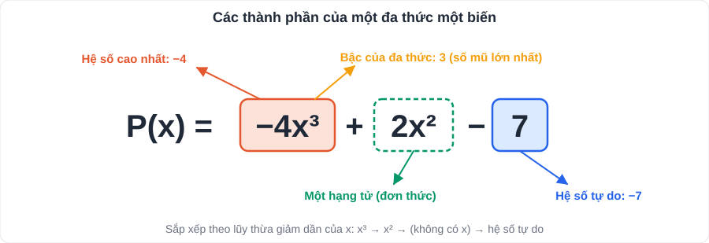

# Toán 7: Biểu thức đại số và đa thức một biến (Chương VII – Tập 2)

> [Danh mục kiến thức](../README.md) · Học ở [tuần 15](../../LoTrinh/Tuan-15-Ke-Hoach-Hoc-Tap.md) – [tuần 17](../../LoTrinh/Tuan-17-Ke-Hoach-Hoc-Tap.md) · Ôn lại tuần 23 và tuần 28 · **Chương nền cho đại số lớp 8**

## Mục tiêu

- Thu gọn, sắp xếp đa thức; tìm **bậc, hệ số cao nhất, hệ số tự do**.
- Cộng, trừ, nhân, chia đa thức một biến **không sai dấu**.
- Tìm **nghiệm** của đa thức.

---

## 1. Kiến thức cần nhớ

### 1.1. Biểu thức đại số

- Biểu thức có chứa **chữ** (biến) ngoài số và phép tính. Ví dụ: 2x + 3; πr²; (a + b)·h/2.
- **Giá trị của biểu thức**: thay biến bằng số rồi tính. Với x = −2: 3x² − x = 3·4 − (−2) = **14**.

### 1.2. Đơn thức và đa thức một biến



- **Đơn thức một biến**: dạng **a·xⁿ** (a là số, n ∈ ℕ). Ví dụ: 5x³; −x; 7 (= 7x⁰).
- **Đa thức một biến**: tổng của các đơn thức cùng một biến. Ví dụ: P(x) = 2x³ − x + 5.
- **Thu gọn**: cộng các hạng tử cùng lũy thừa của biến.
- **Sắp xếp**: theo lũy thừa **giảm dần** (thường dùng) hoặc tăng dần của biến.
- **Bậc** của đa thức (đã thu gọn, khác 0): số mũ **cao nhất** của biến.
- **Hệ số cao nhất**: hệ số của hạng tử có bậc cao nhất. **Hệ số tự do**: hạng tử không chứa biến.
  - P(x) = −4x³ + 2x² − 7: bậc **3**; hệ số cao nhất **−4**; hệ số tự do **−7**.
- Đa thức 0 không có bậc; số khác 0 là đa thức bậc 0.

### 1.3. Nghiệm của đa thức

- x = a là **nghiệm** của P(x) nếu **P(a) = 0**.
- Đa thức bậc n (n ≥ 1) có **không quá n** nghiệm.
- Mẹo: tổng các hệ số = 0 ⇒ **x = 1** là nghiệm.

### 1.4. Các phép tính

| Phép tính | Cách làm |
|---|---|
| **Cộng** | Bỏ ngoặc, nhóm các hạng tử cùng bậc (hoặc đặt tính dọc theo cột cùng bậc) |
| **Trừ** P − Q | Bỏ ngoặc trước Q phải **đổi dấu mọi hạng tử** của Q |
| **Nhân** đơn × đa | Nhân đơn thức với **từng** hạng tử: a(b + c) = ab + ac; xᵐ·xⁿ = xᵐ⁺ⁿ |
| **Nhân** đa × đa | Nhân **mỗi** hạng tử của đa thức này với **từng** hạng tử của đa thức kia, rồi thu gọn |
| **Chia** đơn : đơn | axᵐ : bxⁿ = (a/b)xᵐ⁻ⁿ (m ≥ n) |
| **Chia** đa : đa | Đặt tính chia như chia số; **dư có bậc nhỏ hơn bậc của đa thức chia** |

- P(x) = Q(x)·S(x) + R(x); nếu R(x) = 0 thì P **chia hết** cho Q.

---

## 2. Dạng bài và cách làm

### Dạng 1: Thu gọn, sắp xếp, tìm bậc

**Ví dụ 1.** P(x) = 3x² − 5x + x³ − x² + 4 − 2x³.
> P(x) = (x³ − 2x³) + (3x² − x²) − 5x + 4 = **−x³ + 2x² − 5x + 4**. Bậc 3; hệ số cao nhất −1; hệ số tự do 4.

### Dạng 2: Cộng, trừ đa thức

**Ví dụ 2.** P(x) = 2x³ − x + 3; Q(x) = −x³ + 4x² + x − 1.
> P + Q = (2x³ − x³) + 4x² + (−x + x) + (3 − 1) = **x³ + 4x² + 2**.
> P − Q = 2x³ − x + 3 + x³ − 4x² − x + 1 = **3x³ − 4x² − 2x + 4**.

### Dạng 3: Nhân đa thức

**Ví dụ 3.** (2x − 3)(x² + x − 1)
> = 2x·x² + 2x·x − 2x·1 − 3x² − 3x + 3 = 2x³ + 2x² − 2x − 3x² − 3x + 3 = **2x³ − x² − 5x + 3**.

### Dạng 4: Chia đa thức

**Ví dụ 4.** Đặt tính (2x³ − 3x² + 4x − 3) : (x − 1):

```
  2x³ − 3x² + 4x − 3 | x − 1
−(2x³ − 2x²)         |-------------
  -----------        | 2x² − x + 3
       −x² + 4x − 3
     −(−x² +  x)
       ----------
             3x − 3
           −(3x − 3)
           ---------
                  0
```

> Thương **2x² − x + 3**, dư **0**.

### Dạng 5: Tìm nghiệm

**Ví dụ 5.** Tìm nghiệm của P(x) = 3x − 6 → 3x − 6 = 0 → **x = 2**.

**Ví dụ 6.** Q(x) = x² − 4x = x(x − 4) = 0 → **x = 0** hoặc **x = 4**.

**Ví dụ 7.** Chứng tỏ R(x) = x² + 1 không có nghiệm.
> x² ≥ 0 với mọi x ⇒ x² + 1 ≥ 1 > 0 ⇒ R(x) ≠ 0 ⇒ **không có nghiệm**.

### Dạng 6: Biểu thức thực tế

**Ví dụ 8.** Một mảnh vườn hình chữ nhật có chiều dài x (m), chiều rộng ngắn hơn chiều dài 3 m. Viết đa thức biểu thị diện tích; tính khi x = 10.
> S(x) = x(x − 3) = **x² − 3x** (m²); S(10) = 100 − 30 = **70 m²**.

---

## 3. Lỗi hay gặp

| Lỗi | Sai | Đúng |
|---|---|---|
| Trừ đa thức chỉ đổi dấu hạng tử đầu | P − (x² − x) = P − x² − x | = P − x² **+ x** |
| Cộng số mũ khi cộng đơn thức | 2x² + 3x² = 5x⁴ | = **5x²** |
| Nhân số mũ khi nhân lũy thừa | x²·x³ = x⁶ | = **x⁵** |
| Tìm bậc khi chưa thu gọn | x³ + 2x − x³ có bậc 3 | Thu gọn = 2x, **bậc 1** |
| Bỏ sót hạng tử khi nhân đa × đa | (x + 1)(x + 2) = x² + 2 | = x² + **3x** + 2 |

---

## 4. Bài tập tự luyện

### Nhóm A: Cơ bản

1. Tính giá trị của A = 2x² − 3x + 1 tại x = −1; x = 1/2.
2. Thu gọn, sắp xếp giảm dần, tìm bậc, hệ số cao nhất, hệ số tự do: P(x) = 5 − 2x² + 3x⁴ − x + x² − 3x⁴.
3. Cho P(x) = x³ − 2x + 1; Q(x) = −x³ + x² + 5x. Tính P + Q và P − Q.
4. Tính: a) −3x(2x² − x + 4); b) (x + 2)(x − 3).
5. Kiểm tra x = 2 có phải nghiệm của x² − 3x + 2 không.

### Nhóm B: Vận dụng

6. Tìm nghiệm: a) 2x + 5; b) x² − 9; c) (x − 1)(2x + 4).
7. Thực hiện phép chia: (x³ − 1) : (x − 1).
8. Tìm đa thức M biết M + (2x² − x + 3) = 5x² + x − 1.
9. Tính (x − 1)(x² + x + 1) và so sánh với kết quả câu 7.
10. ★ Tìm a để đa thức P(x) = x² + ax − 6 có nghiệm x = 2. Khi đó tìm nghiệm còn lại.

---

## 5. Đáp án

<details>
<summary>👉 Bấm để xem đáp án (tự làm xong rồi mới mở)</summary>

1. A(−1) = 2 + 3 + 1 = **6**; A(1/2) = 1/2 − 3/2 + 1 = **0**.
2. P(x) = **−x² − x + 5**; bậc **2**; hệ số cao nhất **−1**; hệ số tự do **5**.
3. P + Q = **x² + 3x + 1**; P − Q = **2x³ − x² − 7x + 1**.
4. a) **−6x³ + 3x² − 12x**; b) **x² − x − 6**.
5. 4 − 6 + 2 = 0 ⇒ **có**.
6. a) **x = −5/2**; b) **x = 3 hoặc x = −3**; c) **x = 1 hoặc x = −2**.
7. Thương **x² + x + 1**, dư 0.
8. M = 5x² + x − 1 − 2x² + x − 3 = **3x² + 2x − 4**.
9. = x³ + x² + x − x² − x − 1 = **x³ − 1** (khớp: phép chia ngược với phép nhân).
10. P(2) = 4 + 2a − 6 = 0 ⇒ **a = 1**; P(x) = x² + x − 6 = (x − 2)(x + 3) ⇒ nghiệm còn lại **x = −3**.

</details>
