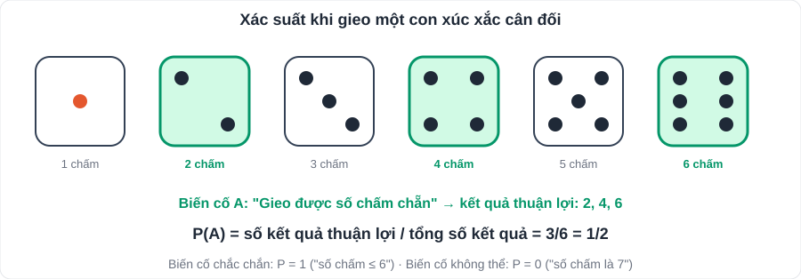

# Toán 8: Làm quen với biến cố và xác suất (Chương VIII – Tập 2)

> [Danh mục kiến thức](../README.md) · Học ở [tuần 20](../../LoTrinh/Tuan-20-Ke-Hoach-Hoc-Tap.md) · Ôn lại tuần 23 và tuần 28 · **Chương ngắn, câu hỏi dễ, nên lấy trọn điểm**

## Mục tiêu

- Phân biệt biến cố **chắc chắn, không thể, ngẫu nhiên**.
- Tính xác suất khi các kết quả **đồng khả năng**.

---

## 1. Kiến thức cần nhớ

### 1.1. Biến cố

| Loại | Nghĩa | Ví dụ (gieo 1 xúc xắc 6 mặt) |
|---|---|---|
| **Chắc chắn** | Luôn xảy ra | "Số chấm ≤ 6" |
| **Không thể** | Không bao giờ xảy ra | "Số chấm là 7" |
| **Ngẫu nhiên** | Có thể xảy ra, có thể không | "Số chấm là số chẵn" |

### 1.2. Xác suất của biến cố

- Xác suất là **số đo khả năng xảy ra** của biến cố, nằm trong đoạn **từ 0 đến 1**.
  - Biến cố chắc chắn: xác suất **1**. Biến cố không thể: xác suất **0**.
- Khi các kết quả có thể **đồng khả năng** (khả năng như nhau):

> **P(A) = (số kết quả thuận lợi cho A) / (tổng số kết quả có thể)**

- Hai biến cố "đối nhau" kiểu "mặt sấp" – "mặt ngửa" (đồng xu cân đối): mỗi biến cố có xác suất **1/2**.

---

## 2. Dạng bài và cách làm

**Ba bước:** (1) liệt kê **tất cả** kết quả có thể; (2) đếm kết quả **thuận lợi**; (3) chia.

**Ví dụ 1.** Gieo một xúc xắc cân đối. Tính xác suất:
a) "Số chấm là số nguyên tố" → {2; 3; 5}: **3/6 = 1/2**.
b) "Số chấm chia hết cho 3" → {3; 6}: **2/6 = 1/3**.
c) "Số chấm lớn hơn 6" → **0** (không thể).

**Ví dụ 2.** Một hộp có 5 quả bóng được đánh số 1, 2, 3, 4, 5. Lấy ngẫu nhiên 1 quả.
a) P("số lẻ") = 3/5. b) P("số nhỏ hơn 6") = **1** (chắc chắn).

**Ví dụ 3.** Lớp 7A có 18 nam, 22 nữ. Chọn ngẫu nhiên 1 bạn làm lớp trưởng (mỗi bạn khả năng như nhau). P("chọn được bạn nữ") = 22/40 = **11/20**.

**Ví dụ 4.** Chọn ngẫu nhiên một số trong các số 10, 11, …, 20. Tính P("số được chọn là số chính phương").
> Có 11 số; số chính phương: 16 ⇒ P = **1/11**.

---

## 3. Lỗi hay gặp

- Đếm thiếu kết quả (ví dụ từ 10 đến 20 có **11** số, không phải 10).
- Kết quả **không đồng khả năng** mà vẫn dùng công thức (ví dụ: hộp 3 bi đỏ 1 bi xanh, nói P(đỏ) = 1/2 vì "có 2 màu" là **sai**, đúng là 3/4).
- Ghi xác suất > 1 hoặc âm.

---

## 4. Bài tập tự luyện

1. Biến cố nào chắc chắn, không thể, ngẫu nhiên? a) "Ngày mai mặt trời mọc ở hướng Đông"; b) "Gieo đồng xu được mặt ngửa"; c) "Tháng 2 có 31 ngày".
2. Gieo xúc xắc cân đối. Tính xác suất: a) số chấm là số lẻ; b) số chấm lớn hơn 4; c) số chấm là ước của 6.
3. Một túi có 4 bi đỏ, 3 bi xanh, 5 bi vàng (cùng kích thước). Lấy ngẫu nhiên 1 viên. Tính xác suất lấy được: a) bi xanh; b) bi không phải màu đỏ.
4. Chọn ngẫu nhiên một chữ cái trong từ "HOCTAP". Tính xác suất chữ được chọn là nguyên âm (A, E, I, O, U, Y).
5. ★ Chọn ngẫu nhiên một số tự nhiên có hai chữ số. Tính xác suất số đó chia hết cho 5.

---

## 5. Đáp án

👉 Bấm để xem đáp án (tự làm xong rồi mới mở)

1. a) chắc chắn; b) ngẫu nhiên; c) không thể.
2. a) **1/2**; b) {5; 6} → **1/3**; c) {1; 2; 3; 6} → **2/3**.
3. Tổng 12 viên. a) **3/12 = 1/4**; b) 8/12 = **2/3**.
4. H, O, C, T, A, P: nguyên âm O, A ⇒ **2/6 = 1/3**.
5. Có 90 số (10 → 99); chia hết cho 5: 10, 15, …, 95 có 18 số ⇒ **18/90 = 1/5**.

