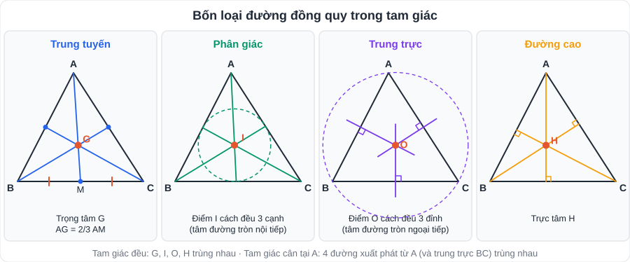
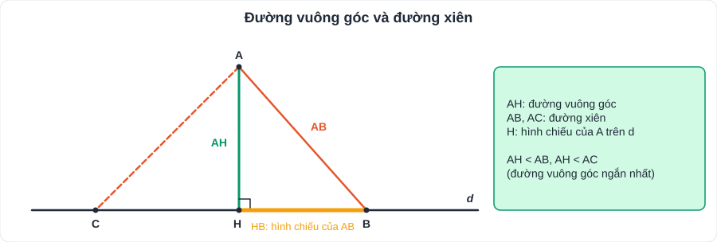
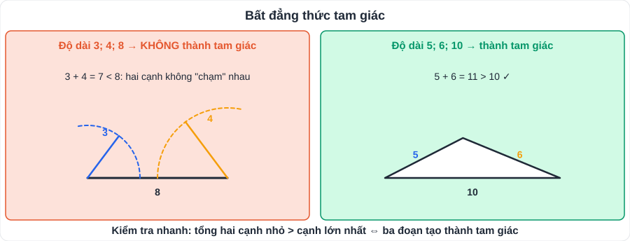

# Toán 9: Quan hệ giữa các yếu tố trong một tam giác (Chương IX – Tập 2)

> [Danh mục kiến thức](../README.md) · Học ở [tuần 21](../../LoTrinh/Tuan-21-Ke-Hoach-Hoc-Tap.md) – [tuần 22](../../LoTrinh/Tuan-22-Ke-Hoach-Hoc-Tap.md) · Ôn lại tuần 23 và tuần 27 · **Câu hình cuối HK2 thường kết hợp chương này với tam giác bằng nhau**

## Mục tiêu

- So sánh góc ↔ cạnh; đường vuông góc ↔ đường xiên.
- Dùng **bất đẳng thức tam giác** để kiểm tra bộ ba độ dài.
- Nhớ 4 loại đường đồng quy, tên giao điểm và tính chất (đặc biệt **trọng tâm 2/3**).

---

## 1. Kiến thức cần nhớ

### 1.1. Quan hệ giữa góc và cạnh đối diện

Trong một tam giác: **góc lớn hơn đối diện cạnh lớn hơn**, và ngược lại **cạnh lớn hơn đối diện góc lớn hơn**.

- Tam giác vuông: **cạnh huyền là cạnh lớn nhất**. Tam giác tù: cạnh đối diện góc tù lớn nhất.

### 1.2. Đường vuông góc và đường xiên

Từ điểm A nằm ngoài đường thẳng d, kẻ AH ⊥ d (H ∈ d) và AB là đường xiên (B ∈ d, B ≠ H):

- AH: **đường vuông góc**; H: **hình chiếu** của A trên d; AH: **khoảng cách** từ A đến d.
- **AH < AB**: đường vuông góc **ngắn hơn** mọi đường xiên.

### 1.3. Bất đẳng thức tam giác

Trong tam giác ABC: **|AB − AC| < BC < AB + AC** (mỗi cạnh nhỏ hơn tổng và lớn hơn hiệu hai cạnh còn lại).

> **Kiểm tra nhanh:** ba đoạn a ≤ b ≤ c là ba cạnh của một tam giác ⇔ **a + b > c** (tổng hai đoạn nhỏ > đoạn lớn nhất).

### 1.4. Bốn loại đường đồng quy

| Đường | Định nghĩa (xuất phát từ đỉnh A) | Giao điểm của 3 đường | Tính chất của giao điểm |
|---|---|---|---|
| **Trung tuyến** | Nối A với **trung điểm** cạnh BC | **Trọng tâm G** | **AG = 2/3 AM**; GM = 1/3 AM; AG = 2GM |
| **Phân giác** | Tia phân giác của góc A | Điểm **I** | **Cách đều 3 cạnh** (tâm đường tròn nội tiếp) |
| **Trung trực** | Vuông góc với cạnh **tại trung điểm** (không nhất thiết qua đỉnh) | Điểm **O** | **Cách đều 3 đỉnh**: OA = OB = OC (tâm đường tròn ngoại tiếp) |
| **Đường cao** | Từ A **vuông góc** với BC | **Trực tâm H** | |

- **Tam giác cân tại A**: trung tuyến, phân giác, đường cao xuất phát từ A và trung trực của BC **trùng nhau**.
- **Tam giác đều**: 4 điểm G, I, O, H **trùng nhau**.
- Tam giác vuông: trực tâm là **đỉnh góc vuông**; giao điểm 3 đường trung trực là **trung điểm cạnh huyền**.

---

## 2. Dạng bài và cách làm

### Dạng 1: So sánh góc, cạnh

**Ví dụ 1.** △ABC có AB = 5 cm, BC = 7 cm, AC = 6 cm. So sánh các góc.
> BC > AC > AB ⇒ **Â > B̂ > Ĉ** (đối diện BC là Â, đối diện AC là B̂, đối diện AB là Ĉ).

**Ví dụ 2.** △ABC có Â = 80°, B̂ = 45°. Cạnh nào lớn nhất?
> Ĉ = 55°. Â lớn nhất ⇒ **BC lớn nhất**.

### Dạng 2: Bất đẳng thức tam giác

**Ví dụ 3.** Bộ ba nào là độ dài ba cạnh của tam giác: a) 3; 4; 8; b) 5; 6; 10?
> a) 3 + 4 = 7 < 8 ⇒ **không**. b) 5 + 6 = 11 > 10 ⇒ **có**.

**Ví dụ 4.** Tam giác cân có hai cạnh 3 cm và 7 cm. Tính chu vi.
> Nếu cạnh bên 3: 3 + 3 = 6 < 7 ⇒ loại. Vậy cạnh bên 7, đáy 3 ⇒ chu vi = **17 cm**.

**Ví dụ 5.** △ABC có AB = 2 cm, AC = 7 cm, BC là số nguyên chẵn. Tìm BC.
> 7 − 2 < BC < 7 + 2 ⇒ 5 < BC < 9 ⇒ BC ∈ {6; 8} (số chẵn) ⇒ **BC = 6 cm hoặc 8 cm**.

### Dạng 3: Trọng tâm

**Ví dụ 6.** AM là trung tuyến, G là trọng tâm, AM = 9 cm. Tính AG, GM.
> AG = 2/3 · 9 = **6 cm**; GM = **3 cm**.

### Dạng 4: Bài hình tổng hợp (mẫu thi)

Cho △ABC cân tại A, đường trung tuyến AM. Gọi G là trọng tâm.
a) Chứng minh AM ⊥ BC.
b) Biết AM = 12 cm. Tính AG, GM.
c) Chứng minh G cách đều B và C.

> a) △ABM = △ACM (c.c.c) ⇒ AMB = AMC, mà hai góc kề bù ⇒ AMB = 90° ⇒ AM ⊥ BC.
> b) AG = 2/3 · 12 = **8 cm**; GM = 12 − 8 = **4 cm**.
> c) AM ⊥ BC tại trung điểm M ⇒ AM là đường trung trực của BC; G ∈ AM ⇒ **GB = GC** (tính chất đường trung trực).

> Lưu ý: **định lí Pythagore** thuộc chương trình **Toán 8**, nên đề lớp 7 luôn cho sẵn các độ dài cần thiết.

---

## 3. Lỗi hay gặp

- Nhầm **trung tuyến** (qua trung điểm) với **trung trực** (vuông góc tại trung điểm).
- Viết GM = 2/3 AM (sai): **AG** mới bằng 2/3 AM.
- Dùng bất đẳng thức tam giác chỉ kiểm tra **một** cặp không phải là cặp nhỏ nhất.
- Nhầm điểm cách đều 3 **cạnh** (phân giác) với cách đều 3 **đỉnh** (trung trực).

---

## 4. Bài tập tự luyện

1. △ABC có Â = 100°, B̂ = 30°. Sắp xếp các cạnh theo thứ tự tăng dần.
2. △ABC có AB = 4 cm, BC = 6 cm, AC = 5 cm. Góc nào lớn nhất, nhỏ nhất?
3. Bộ ba nào là ba cạnh của tam giác: a) 2; 3; 5; b) 4; 5; 7; c) 1,5; 2; 3?
4. Tam giác cân có hai cạnh 4 cm và 9 cm. Tính chu vi.
5. Trung tuyến BN = 12 cm, G là trọng tâm. Tính BG, GN.
6. Cho △ABC vuông tại A, kẻ AH ⊥ BC (H ∈ BC). Chứng minh AH < AB < BC.
7. ★ Cho △ABC, M là trung điểm BC. Trên tia đối của tia MA lấy D sao cho MD = MA. a) Chứng minh AC = BD. b) Chứng minh AB + AC > 2AM.

---

## 5. Đáp án

👉 Bấm để xem đáp án (tự làm xong rồi mới mở)

1. Ĉ = 50°. Góc tăng dần: B̂ (30°) < Ĉ (50°) < Â (100°) ⇒ cạnh đối diện tăng dần: **AC < AB < BC**.
2. BC lớn nhất ⇒ **Â lớn nhất**; AB nhỏ nhất ⇒ **Ĉ nhỏ nhất**.
3. a) 2 + 3 = 5, **không**; b) **có**; c) 1,5 + 2 = 3,5 > 3, **có**.
4. Cạnh bên 9, đáy 4 ⇒ chu vi **22 cm** (cạnh bên 4 bị loại vì 4 + 4 < 9).
5. BG = **8 cm**; GN = **4 cm**.
6. AH là đường vuông góc, AB là đường xiên kẻ từ A đến BC ⇒ **AH < AB**. Trong △ABC vuông tại A, BC là cạnh huyền (lớn nhất) ⇒ **AB < BC**.
7. a) △AMC = △DMB (c.g.c) ⇒ **AC = DB**. b) Trong △ABD: AB + BD > AD = 2AM, mà BD = AC ⇒ **AB + AC > 2AM**.

