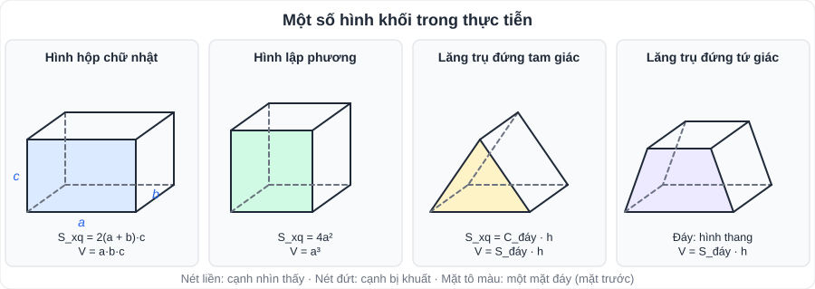
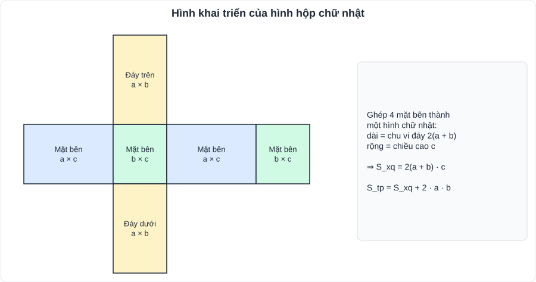

# Toán 10: Một số hình khối trong thực tiễn (Chương X – Tập 2)

> [Danh mục kiến thức](../README.md) · Học ở [tuần 25](../../LoTrinh/Tuan-25-Ke-Hoach-Hoc-Tap.md) – [tuần 26](../../LoTrinh/Tuan-26-Ke-Hoach-Hoc-Tap.md) · Ôn lại tuần 28 · **Chỉ cần thuộc 4 công thức, áp dụng cẩn thận đơn vị**

## Mục tiêu

- Nhận biết đỉnh, cạnh, mặt, đường chéo của hình hộp chữ nhật, hình lập phương, lăng trụ đứng.
- Tính **diện tích xung quanh** và **thể tích**; giải bài toán thực tế (bể nước, hộp quà, sơn tường).

---

## 1. Kiến thức cần nhớ

| Hình | Đặc điểm | Diện tích xung quanh | Thể tích |
|---|---|---|---|
| **Hình hộp chữ nhật** (dài a, rộng b, cao c) | 8 đỉnh, 12 cạnh, 6 mặt là hình chữ nhật, 4 đường chéo | **S_xq = 2(a + b)·c** | **V = a·b·c** |
| **Hình lập phương** (cạnh a) | 6 mặt là hình vuông bằng nhau | **S_xq = 4a²** | **V = a³** |
| **Lăng trụ đứng tam giác / tứ giác** (chiều cao h) | 2 đáy song song, bằng nhau; các mặt bên là hình chữ nhật | **S_xq = C_đáy · h** (chu vi đáy × chiều cao) | **V = S_đáy · h** (diện tích đáy × chiều cao) |

- **Diện tích toàn phần** = S_xq + 2·S_đáy. Hình lập phương: S_tp = **6a²**.
- Lăng trụ đứng tam giác: **6 đỉnh, 9 cạnh, 5 mặt**. Lăng trụ đứng tứ giác: 8 đỉnh, 12 cạnh, 6 mặt.
- Hình hộp chữ nhật và hình lập phương là **lăng trụ đứng tứ giác** đặc biệt.

**Nhắc lại diện tích đáy (lớp 6):** tam giác = đáy × cao : 2; hình thang = (đáy lớn + đáy nhỏ) × cao : 2; hình thoi = tích hai đường chéo : 2.

**Đổi đơn vị:** 1 m³ = 1000 dm³ = 1 000 000 cm³; **1 dm³ = 1 lít**; 1 m² = 10 000 cm².

---

## 2. Dạng bài và cách làm

**Ví dụ 1.** Bể cá hình hộp chữ nhật dài 80 cm, rộng 40 cm, cao 50 cm. a) Tính thể tích bể. b) Mực nước cao 35 cm thì bể chứa bao nhiêu lít nước?
> a) V = 80 · 40 · 50 = 160 000 cm³ = **160 dm³ = 160 lít**.
> b) V_nước = 80 · 40 · 35 = 112 000 cm³ = **112 lít**.

**Ví dụ 2.** Một hộp quà hình lập phương cạnh 15 cm. Tính diện tích giấy để bọc kín hộp (không tính mép dán).
> S_tp = 6 · 15² = **1350 cm²**.

**Ví dụ 3.** Một lăng trụ đứng có đáy là tam giác vuông với hai cạnh góc vuông 6 cm và 8 cm, cạnh huyền 10 cm, chiều cao lăng trụ 12 cm. Tính S_xq và V.
> C_đáy = 6 + 8 + 10 = 24 cm ⇒ S_xq = 24 · 12 = **288 cm²**.
> S_đáy = 6 · 8 : 2 = 24 cm² ⇒ V = 24 · 12 = **288 cm³**.

**Ví dụ 4 (sơn phòng).** Phòng dài 5 m, rộng 4 m, cao 3 m. Cần sơn 4 bức tường, trừ cửa có tổng diện tích 6 m². Mỗi lít sơn sơn được 10 m². Cần bao nhiêu lít sơn?
> S_xq = 2(5 + 4) · 3 = 54 m²; cần sơn 54 − 6 = 48 m² ⇒ **4,8 lít**.

**Ví dụ 5 (chiếc lều / máng nước).** Chiếc lều hình lăng trụ đứng tam giác: đáy là tam giác có cạnh đáy 3 m, chiều cao tam giác 2 m; chiều dài lều 4 m. Tính thể tích không khí trong lều.
> S_đáy = 3 · 2 : 2 = 3 m² ⇒ V = 3 · 4 = **12 m³**.

---

## 3. Lỗi hay gặp

- Nhầm "chiều cao lăng trụ" với "chiều cao tam giác đáy".
- Quên đổi đơn vị trước khi tính (cm và m trộn lẫn).
- Dùng S_xq khi đề hỏi diện tích **toàn phần** (bọc kín, sơn cả trần…), hoặc ngược lại (hộp **không nắp**: S_xq + 1 đáy).
- Đổi lít sai: **1 lít = 1 dm³**, không phải 1 cm³.

---

## 4. Bài tập tự luyện

1. Hình hộp chữ nhật dài 6 cm, rộng 4 cm, cao 5 cm. Tính S_xq, S_tp, V.
2. Hình lập phương có thể tích 125 cm³. Tính cạnh và diện tích toàn phần.
3. Lăng trụ đứng tứ giác có đáy là hình thang (đáy 4 cm và 6 cm, cao 3 cm), chiều cao lăng trụ 10 cm. Tính thể tích.
4. Một thùng hình hộp chữ nhật **không nắp** dài 1,2 m, rộng 0,8 m, cao 0,5 m. Tính diện tích tôn để làm thùng (không tính mép).
5. ★ Một bể nước hình hộp chữ nhật dài 2 m, rộng 1,5 m, cao 1 m đang chứa 1800 lít nước. Mực nước cao bao nhiêu? Cần thêm bao nhiêu lít nữa để đầy bể?

---

## 5. Đáp án

👉 Bấm để xem đáp án (tự làm xong rồi mới mở)

1. S_xq = 2(6 + 4) · 5 = **100 cm²**; S_tp = 100 + 2 · 24 = **148 cm²**; V = **120 cm³**.
2. a³ = 125 ⇒ **a = 5 cm**; S_tp = 6 · 25 = **150 cm²**.
3. S_đáy = (4 + 6) · 3 : 2 = 15 cm² ⇒ V = **150 cm³**.
4. S_xq = 2(1,2 + 0,8) · 0,5 = 2 m²; 1 đáy = 0,96 m² ⇒ **2,96 m²**.
5. V_bể = 3 m³ = 3000 lít. Mực nước = 1,8 m³ : (2 · 1,5) m² = **0,6 m**; cần thêm **1200 lít**.

