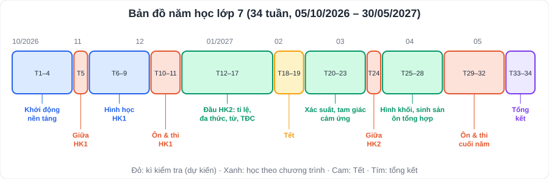

# Lộ trình tổng quan lớp 7: đạt kết quả cuối năm tốt nhất

> [README](../README.md) · [Danh mục 34 tuần](Danh-Muc-Ke-Hoach-Tuan.md) · [Kiến thức các môn](../KienThuc/README.md) · [Ôn thi](../OnThi/Ke-Hoach-On-Thi-4-Ky.md)
> Năm học 2026 – 2027 · Bộ sách **Kết nối tri thức với cuộc sống** · Kế hoạch chạy từ **05/10/2026** đến **30/05/2027**

---

## 1. Điểm cuối năm được tính thế nào? (để biết nên dồn sức vào đâu)

> Theo **Thông tư 22/2021/TT-BGDĐT** về đánh giá học sinh THCS, THPT. Bố mẹ nên **kiểm tra lại quy định hiện hành** và quy chế của trường vì Bộ có thể sửa đổi.

### 1.1. Các môn có điểm số và các môn đánh giá bằng nhận xét

| Đánh giá bằng **nhận xét + điểm số** (tính điểm trung bình) | Đánh giá bằng **nhận xét** (Đạt / Chưa đạt) |
|---|---|
| Toán · Ngữ văn · Tiếng Anh · KHTN · Lịch sử và Địa lí · GDCD · Tin học · Công nghệ | Giáo dục thể chất · Nghệ thuật (Âm nhạc, Mĩ thuật) · Hoạt động trải nghiệm, hướng nghiệp · Nội dung giáo dục địa phương |

### 1.2. Công thức điểm trung bình môn

> **ĐTB môn học kì = (Tổng điểm thường xuyên + 2 × Điểm giữa kì + 3 × Điểm cuối kì) : (Số bài thường xuyên + 5)**
>
> **ĐTB môn cả năm = (ĐTB học kì 1 + 2 × ĐTB học kì 2) : 3**

**Hệ quả quan trọng:**

| Nhận xét | Việc cần làm |
|---|---|
| Bài **cuối kì** có hệ số **3**, giữa kì hệ số **2** | Hai kì thi chiếm hơn một nửa điểm: ôn có kế hoạch (tuần 4 – 5, 10 – 11, 22 – 24, 28 – 32) |
| **HK2 có hệ số 2** trong điểm cả năm | Không "buông" sau Tết; HK2 quan trọng gấp đôi HK1 |
| Điểm **thường xuyên** nhiều bài, mỗi bài hệ số 1 | Kiểm tra miệng, 15 phút, bài tập: chuẩn bị bài đều đặn mỗi tuần |
| **Tin học, Công nghệ, GDCD** cũng tính điểm như Toán | Không bỏ qua: ôn theo đề cương 2 tuần trước mỗi kì thi |

**Ví dụ:** Toán HK1 có 4 bài thường xuyên 8; 9; 7; 9 (tổng 33), giữa kì 7,5, cuối kì 8,5 ⇒ ĐTB = (33 + 15 + 25,5) : 9 = **8,17**.

### 1.3. Mức kết quả học tập (theo Thông tư 22, cần đối chiếu quy định hiện hành)

| Mức | Điều kiện chính (cho cả năm) |
|---|---|
| **Tốt** | Các môn nhận xét đều **Đạt**; có ít nhất **6 môn** điểm số đạt **≥ 8,0**, trong đó có **Toán hoặc Ngữ văn**; **không môn nào dưới 6,5** |
| **Khá** | Các môn nhận xét đều Đạt; ít nhất 6 môn ≥ 6,5 (có Toán hoặc Văn); không môn nào dưới 5,0 |
| **Đạt** | Ít nhất 6 môn ≥ 5,0 (có Toán hoặc Văn); không môn nào dưới 3,5 |

| Danh hiệu cuối năm | Điều kiện |
|---|---|
| **Học sinh Giỏi** | Kết quả học tập **Tốt** và rèn luyện **Tốt** |
| **Học sinh Xuất sắc** | Học sinh Giỏi **và** có ít nhất **6 môn ĐTB cả năm ≥ 9,0** |

## 2. Mục tiêu năm học (gia đình tự điền ở tuần 1)

| Môn | ĐTB năm lớp 6 / HK1 hiện tại | Mục tiêu cả năm lớp 7 | Ghi chú (điểm mạnh / yếu) |
|---|---|---|---|
| Toán | | | |
| Ngữ văn | | | |
| Tiếng Anh | | | |
| KHTN | | | |
| Lịch sử và Địa lí | | | |
| GDCD | | | |
| Tin học | | | |
| Công nghệ | | | |
| **Danh hiệu mục tiêu** | | ☐ Giỏi ☐ Xuất sắc | |

> **Gợi ý đặt mục tiêu:** môn mạnh nhắm **≥ 9,0**; môn yếu nhắm tăng **0,5 – 1,0 điểm** so với năm trước. Mục tiêu tối thiểu: **không môn nào dưới 6,5** (điều kiện của mức Tốt).

---

## 3. Bản đồ năm học

| Giai đoạn | Tuần | Thời gian | Trọng tâm |
|---|---|---|---|
| 1. Khởi động, nền tảng | 1 – 4 | 05/10 – 01/11 | Kiểm tra đầu vào, tạo nếp học; số hữu tỉ, số thực, góc; nguyên tử, phân tử |
| 2. Giữa HK1 | 5 | 02 – 08/11 | Ôn và kiểm tra giữa kì (dự kiến) |
| 3. Hình học HK1 | 6 – 9 | 09/11 – 06/12 | Tam giác bằng nhau (chương quan trọng nhất), thống kê; âm thanh, ánh sáng |
| 4. Ôn và thi HK1 | 10 – 11 | 07 – 20/12 | Đề cương, đề bấm giờ, thi (dự kiến) |
| 5. Đầu HK2 | 12 – 17 | 21/12 – 31/01 | Chữa đề; tỉ lệ thức, đa thức; từ, trao đổi chất; truyện ngụ ngôn, viễn tưởng |
| 6. Tết | 18 – 19 | 01 – 14/02 | Học nhẹ 3 buổi/tuần, đọc sách |
| 7. Giữa HK2 | 20 – 24 | 15/02 – 21/03 | Xác suất, quan hệ trong tam giác; cảm ứng, sinh trưởng; ôn và kiểm tra giữa kì |
| 8. Cuối HK2 | 25 – 28 | 22/03 – 18/04 | Hình khối; sinh sản; văn bản thông tin; ôn tổng hợp |
| 9. Ôn và thi cuối năm | 29 – 32 | 19/04 – 16/05 | Đề cương, đề bấm giờ, thi (dự kiến) |
| 10. Tổng kết | 33 – 34 | 17 – 30/05 | Chữa đề, lấp lỗ hổng, kế hoạch hè |

---

## 4. Thời gian biểu một ngày đi học (gợi ý cho học sinh 12 – 13 tuổi)

| Giờ | Việc | Ghi chú |
|---|---|---|
| 06:00 – 06:45 | Dậy, vận động nhẹ, ăn sáng | Ăn sáng đủ chất giúp tập trung |
| Buổi học ở trường | Học trên lớp | Ghi vở đầy đủ, hỏi ngay khi chưa hiểu |
| 17:00 – 18:00 | Vận động ngoài trời / thể thao | **60 phút vận động mỗi ngày** |
| 18:00 – 18:30 | Ăn tối | Không dùng điện thoại trong bữa ăn |
| Trước 18:30 hoặc giờ tự học ở trường | Làm bài tập về nhà trên lớp | Không ghi trong kế hoạch tuần |
| **18:30 – 20:15** | **Tự học theo kế hoạch tuần** | 45' + nghỉ 10' + 35' + 15' từ vựng |
| 20:15 – 21:15 | Thời gian tự do, gia đình | Màn hình giải trí ≤ 1 giờ/ngày |
| 21:15 – 21:30 | Chuẩn bị cặp sách, vệ sinh cá nhân | |
| **21:30 – 06:00** | **Ngủ (8,5 – 9 giờ)** | Không mang điện thoại vào phòng ngủ |

> Nếu con học bán trú/2 buổi hoặc có lịch học thêm, **dời cả khối 18:30 – 20:15** sang khung giờ phù hợp; giữ nguyên thứ tự các môn.

### Phân bổ thời gian tự học mỗi tuần (tuần bình thường)

| Môn | Phút/tuần | Buổi |
|---|---|---|
| Toán | ~215 | T2, T4, T5, sáng T7 |
| Tiếng Anh | ~150 | T4, sáng T7, từ vựng 15 phút T2 – T5 |
| Ngữ văn | ~140 | T3, T6, chiều T7 |
| KHTN | ~80 | T2, T6 |
| Lịch sử, Địa lí | ~130 | T3, T5, Chủ nhật |
| GDCD, đọc sách, tổng kết | ~70 | Chủ nhật |
| **Tổng** | **~13 giờ/tuần** | Còn trọn buổi chiều T7 (sau 16:00) và phần lớn Chủ nhật để nghỉ |

---

## 5. Cách dùng kế hoạch tuần

1. **Chủ nhật 20:00:** con mở file tuần sau, đọc **mục tiêu**, xem tài liệu cần dùng.
2. **Mỗi buổi:** làm xong việc nào đánh dấu `[x]` ở cột "Xong" (in ra giấy hoặc sửa trực tiếp file).
3. **Bài tập trong file kiến thức:** tự làm → bấm **"👉 Bấm để xem đáp án"** → tự chấm → câu sai ghi vào **sổ lỗi sai**.
4. **Thứ 6:** 15 phút đọc lại sổ lỗi sai, làm lại 3 câu.
5. **Chủ nhật:** điền bảng **Tự đánh giá**; bố mẹ ghi nhận xét/khen.

### Mẫu sổ lỗi sai (1 quyển cho tất cả các môn, chia mục theo môn)

| Ngày | Môn – bài | Câu sai (chép lại đề ngắn gọn) | Vì sao sai? (không hiểu / nhầm / ẩu / quên) | Cách đúng | Làm lại lần 2 ✓ |
|---|---|---|---|---|---|
| 12/10 | Toán – lũy thừa | 2³ · 2⁴ = ? | Nhân số mũ (nhầm) | Cộng số mũ: 2⁷ | |

> Phiếu chi tiết hơn để phân tích **bài kiểm tra**: [phiếu phân tích lỗi sai](../OnThi/Phieu-Phan-Tich-Loi-Sai.md).

---

## 6. Khi tiến độ ở trường khác kế hoạch

Kế hoạch được xếp theo **tiến độ phổ biến** của bộ sách Kết nối tri thức. Mỗi trường có phân phối chương trình riêng.

| Tình huống | Cách xử lý |
|---|---|
| Trường dạy **nhanh hơn** kế hoạch | Đổi chỗ: học nội dung của tuần sau ngay; tuần dư dùng để ôn |
| Trường dạy **chậm hơn** | **Không học trước quá 1 tuần**; dùng buổi đó làm thêm bài tập của chương đang học trên lớp |
| Lịch kiểm tra khác tuần 5, 11, 24, 31 – 32 | Đổi chỗ tuần kiểm tra trong kế hoạch với tuần thực tế |
| Con ốm, gia đình có việc | Bỏ qua buổi đó, **không dồn bù**; xem [kế hoạch dự phòng](../Ke-Hoach-Du-Phong-Va-He.md) |
| Một môn quá tải bài tập trên lớp | Ưu tiên bài tập trên lớp; cắt bớt phần "bài tập B" của kế hoạch |

---

## 7. Bảy nguyên tắc học hiệu quả (dựa trên nghiên cứu về trí nhớ)

| # | Nguyên tắc | Áp dụng trong kế hoạch |
|---|---|---|
| 1 | **Tự kiểm tra** hiệu quả hơn đọc lại | Che lời giải, tự làm; Chủ nhật bố mẹ hỏi 10 câu Sử – Địa |
| 2 | **Ôn ngắt quãng** (1 – 3 – 7 ngày) | Thẻ từ vựng; sổ lỗi sai thứ 6; ôn lại chương cũ ở tuần 10, 23, 27 – 30 |
| 3 | **Xen kẽ** các dạng bài | Đề tổng hợp sáng thứ 7 |
| 4 | **Giải thích bằng lời của mình** | Sau mỗi buổi, nói lại 3 ý chính cho bố mẹ nghe trong 1 phút |
| 5 | **Ngủ đủ** giúp ghi nhớ | Ngủ 21:30; không học khuya trước ngày thi |
| 6 | **Vận động** giúp tập trung | 60 phút/ngày |
| 7 | **Hình ảnh + chữ** | 66 hình minh họa trong các file kiến thức; tự vẽ sơ đồ tư duy cuối mỗi chương |

---

## 8. Vai trò của bố mẹ

| Việc | Tần suất |
|---|---|
| Cùng con đọc mục tiêu tuần, ký bảng tự đánh giá | Chủ nhật, 15 phút |
| Hỏi bài nhanh (10 câu Sử – Địa, từ vựng) | Chủ nhật |
| Chấm bài Toán theo đáp án ẩn (khi con nhờ) | Thứ 7 |
| Liên lạc thầy cô chủ nhiệm, lấy lịch kiểm tra, đề cương | Đầu mỗi tháng và trước mỗi kì thi |
| **Khen nỗ lực, không chỉ điểm số**; không so sánh với bạn khác | Luôn luôn |
| Giữ giờ ngủ, giới hạn thời gian dùng màn hình | Hằng ngày |
