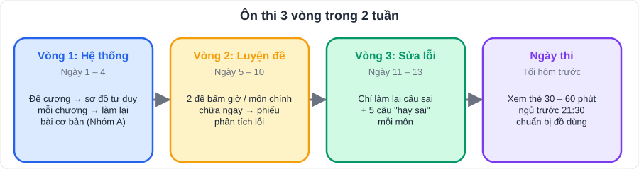

# Kế hoạch ôn thi 4 kì kiểm tra định kì

> [README](../README.md) · [Cấu trúc đề](Cau-Truc-De-Kiem-Tra.md) · [Phiếu phân tích lỗi](Phieu-Phan-Tich-Loi-Sai.md) · [Danh mục tuần](../LoTrinh/Danh-Muc-Ke-Hoach-Tuan.md)

## 1. Bốn kì kiểm tra trong năm (dự kiến)

| Kì | Tuần ôn | Tuần thi (dự kiến) | Hệ số | Phạm vi thường gặp |
|---|---|---|---|---|
| **Giữa HK1** | 4 – 5 | 5 (02 – 08/11) | ×2 | Toán chương I – III; KHTN nguyên tử, phân tử; Anh Unit 1 – 3; Văn Bài 1 – 3 |
| **Cuối HK1** | 9 – 10 | 11 (14 – 20/12) | ×3 | Toàn bộ HK1 |
| **Giữa HK2** | 22 – 23 | 24 (15 – 21/03) | ×2 | Toán chương VI – IX (một phần); KHTN Từ, Trao đổi chất; Anh Unit 7 – 10 |
| **Cuối năm** | 28 – 30 | 31 – 32 (03 – 16/05) | ×3 | Toàn bộ HK2 (có thể có một phần HK1) |

> Điểm cuối kì **HK2** có ảnh hưởng lớn nhất đến điểm cả năm (hệ số 3 trong học kì có hệ số 2).

## 2. Phương pháp ôn 3 vòng (2 tuần trước mỗi kì thi)

| Vòng | Thời gian | Việc | Mục đích |
|---|---|---|---|
| **1. Hệ thống** | Ngày 1 – 4 | Đọc đề cương; mỗi chương vẽ **1 sơ đồ tư duy** (dùng hình trong file kiến thức làm mẫu); làm lại **Nhóm A** | Biết mình đã nắm gì, còn thiếu gì |
| **2. Luyện đề** | Ngày 5 – 10 | Mỗi môn chính **2 đề bấm giờ**; môn phụ 1 đề; chữa ngay, điền phiếu phân tích lỗi | Quen áp lực thời gian, phát hiện lỗi |
| **3. Sửa lỗi** | Ngày 11 – 13 | Chỉ làm lại **câu sai** trong sổ lỗi sai + 5 câu "hay sai" mỗi môn | Không mắc lại lỗi cũ |
| Ngày trước thi | | 30 – 60 phút xem lại thẻ, ngủ sớm | Tỉnh táo |

## 3. Checklist ôn từng môn

### Toán
- [ ] Thuộc công thức: lũy thừa (T01), tỉ lệ (T06), diện tích – thể tích (T10)
- [ ] Làm được bài **tìm x** ở mọi dạng (giá trị tuyệt đối, lũy thừa, tỉ lệ thức, nghiệm đa thức)
- [ ] Trình bày được **bài gốc tam giác** (T04) không nhìn sách
- [ ] Đọc biểu đồ, tính xác suất (T05, T08)
- [ ] Đã làm ít nhất 2 đề 90 phút

### Ngữ văn
- [ ] Nắm đặc điểm các thể loại đã học (bảng trong V01 – V03)
- [ ] Công thức nêu tác dụng biện pháp tu từ (V02 mục 1.3)
- [ ] Thuộc dàn ý các kiểu bài viết trong phạm vi thi (V04)
- [ ] Đã viết ít nhất 2 bài hoàn chỉnh, có người chấm theo bảng tự chấm

### Tiếng Anh
- [ ] Từ vựng các Unit trong phạm vi (thẻ ôn: đúng ≥ 90%)
- [ ] 13 chủ điểm ngữ pháp (A03) – làm bài tổng hợp
- [ ] Phát âm -s/-es, -ed, trọng âm (A04)
- [ ] Viết lại câu (A04 mục 3.1), viết đoạn 80 từ

### KHTN
- [ ] Hóa: 20 nguyên tố, hóa trị, lập công thức, tính khối lượng phân tử, % khối lượng
- [ ] Lý: công thức tốc độ; vẽ tia phản xạ, ảnh qua gương, đường sức từ
- [ ] Sinh: phương trình quang hợp, hô hấp; giải thích hiện tượng thực tế

### Lịch sử, Địa lí, GDCD, Tin, Công nghệ
- [ ] Bảng mốc thời gian (L01, L02): che cột năm, đọc đúng ≥ 90%
- [ ] Khung 5 câu hỏi cho mỗi châu lục (L03, L04)
- [ ] GDCD: mỗi bài 3 ý chính + 1 tình huống
- [ ] Tin, Công nghệ: theo đề cương (M01)

## 4. Ngày thi

| Việc | Ghi chú |
|---|---|
| Ngủ trước 21:30 tối hôm trước | Không học khuya |
| Ăn sáng đủ, uống nước | Không ăn đồ lạ |
| Mang đủ: bút (2 cây), bút chì, thước, compa, êke, máy tính cầm tay, tẩy | Chuẩn bị từ tối hôm trước |
| Đến sớm 15 phút | |
| Làm bài theo [quy trình 90 phút](Cau-Truc-De-Kiem-Tra.md#4-quy-trình-làm-bài-90-phút-toán-văn) | |
| Sau mỗi môn: **không tra đáp án lo lắng**, chuẩn bị môn tiếp theo | Chữa bài khi có kết quả |
