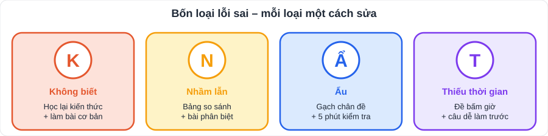

# Phiếu phân tích lỗi sai (sau mỗi bài kiểm tra / đề luyện)

> [Kế hoạch ôn 4 kì](Ke-Hoach-On-Thi-4-Ky.md) · [Cấu trúc đề](Cau-Truc-De-Kiem-Tra.md) · In ra hoặc chép vào sổ, **1 phiếu cho mỗi bài**

## Thông tin bài

| Môn | Bài / đề | Ngày | Điểm | Thời gian làm (phút) |
|---|---|---|---|---|
| | | | | |

## Bảng phân tích

| Câu | Điểm mất | Loại lỗi (K / N / Ẩ / T) | Vì sao sai? (viết cụ thể) | Kiến thức liên quan (file, mục) | Làm lại đúng ✓ |
|---|---|---|---|---|---|
| | | | | | |
| | | | | | |
| | | | | | |
| | | | | | |

**Loại lỗi:**

| Kí hiệu | Loại | Ví dụ | Cách sửa |
|---|---|---|---|
| **K** | **Không biết / không hiểu** kiến thức | Không biết công thức thể tích lăng trụ | Học lại mục kiến thức, làm Nhóm A |
| **N** | **Nhầm** (hiểu sai, lẫn lộn) | Nhầm so le trong với đồng vị | Lập bảng so sánh, làm 5 bài phân biệt |
| **Ẩ** | **Ẩu** (đọc sai đề, tính sai, quên dấu, quên đơn vị) | −2² = 4 | Thói quen kiểm tra 5 phút cuối; gạch chân đề |
| **T** | **Thiếu thời gian** | Bỏ trống câu cuối | Luyện đề bấm giờ; làm câu dễ trước |

## Tổng kết

| Câu hỏi | Trả lời |
|---|---|
| Tổng điểm mất do lỗi **Ẩ** (ẩu) | |
| Loại lỗi xuất hiện nhiều nhất | |
| 1 việc cụ thể sẽ làm khác ở bài sau | |
| Điểm nếu không mắc lỗi ẩu | |

> **Mẹo:** nếu điểm mất do **ẩu** chiếm hơn 1/3 tổng điểm mất, ưu tiên rèn **kiểm tra lại** hơn là học thêm kiến thức mới.
