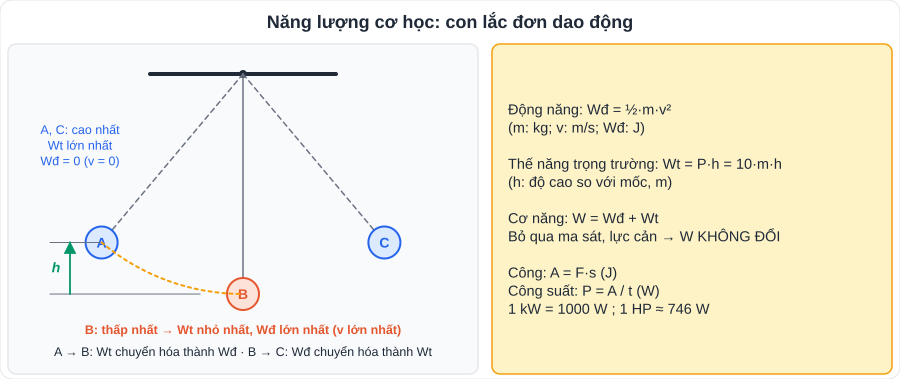

# KHTN 1: Năng lượng cơ học, công và công suất (Vật lí – Chương I)

> [Danh mục kiến thức](../README.md) · Học ở **tháng 9** · Ôn lại trước giữa HK1 · **Bài tính toán: nhớ đổi đơn vị (g → kg, km/h → m/s)**

## Mục tiêu

- Tính **động năng, thế năng, cơ năng**; giải thích sự **chuyển hóa** giữa động năng và thế năng.
- Tính **công cơ học** và **công suất**; đổi đơn vị J, kJ, W, kW, kWh.

---

## 1. Kiến thức cần nhớ

### 1.1. Động năng

- Năng lượng vật có được do **chuyển động**: **Wđ = ½·m·v²** (m: kg; v: m/s; Wđ: J).
- Vật đứng yên: Wđ = 0. Vận tốc **tăng gấp đôi** → động năng **tăng gấp 4**.

### 1.2. Thế năng trọng trường

- Năng lượng vật có được do ở **độ cao** so với mặt đất (hoặc mốc chọn): **Wt = P·h = 10·m·h** (P: N; h: m).
- Thế năng phụ thuộc **mốc chọn**; vật ở mốc có Wt = 0.

### 1.3. Cơ năng

- **W = Wđ + Wt**.
- Khi vật chuyển động chỉ chịu tác dụng của trọng lực (**bỏ qua ma sát, lực cản**): **cơ năng được bảo toàn**; động năng và thế năng **chuyển hóa** qua lại.
  - Vật rơi: Wt giảm, Wđ tăng. Vật ném lên: Wđ giảm, Wt tăng.
  - Con lắc: ở vị trí cao nhất Wt max, Wđ = 0; ở vị trí thấp nhất Wđ max.
- Có ma sát: một phần cơ năng chuyển hóa thành **nhiệt năng** → cơ năng giảm.

### 1.4. Công và công suất

| Đại lượng | Công thức | Đơn vị |
|---|---|---|
| Công cơ học | **A = F·s** (lực cùng hướng chuyển động) | J (1 J = 1 N·m); kJ |
| Công suất | **P = A / t** | W (1 W = 1 J/s); kW; HP (mã lực) ≈ 746 W |
| Đổi điện năng | 1 kWh = 3 600 000 J = 3,6·10⁶ J | |

- Công suất cho biết **tốc độ thực hiện công** (công thực hiện trong 1 giây).
- Lực vuông góc với phương chuyển động **không sinh công** (ví dụ trọng lực khi vật chuyển động ngang).

---

## 2. Dạng bài và ví dụ có lời giải

**Ví dụ 1 (động năng).** Xe máy khối lượng tổng 150 kg chạy với tốc độ 36 km/h. Tính động năng.

> v = 36 km/h = 10 m/s ⇒ Wđ = ½ · 150 · 10² = **7 500 J**.

**Ví dụ 2 (thế năng).** Quả táo 200 g trên cành cao 3 m. Tính thế năng (mốc mặt đất).

> m = 0,2 kg ⇒ Wt = 10 · 0,2 · 3 = **6 J**.

**Ví dụ 3 (bảo toàn cơ năng).** Thả rơi vật 0,5 kg từ độ cao 20 m, bỏ qua sức cản. Tính tốc độ vật khi chạm đất.

> W ban đầu = Wt = 10 · 0,5 · 20 = 100 J. Khi chạm đất: Wđ = 100 J ⇒ ½ · 0,5 · v² = 100 ⇒ v² = 400 ⇒ **v = 20 m/s**.

**Ví dụ 4 (công, công suất).** Một người kéo thùng hàng bằng lực 200 N đi được 15 m trong 30 s. Tính công và công suất.

> A = 200 · 15 = **3 000 J**; P = 3 000 : 30 = **100 W**.

**Ví dụ 5 (cần cẩu).** Cần cẩu nâng vật 500 kg lên cao 12 m trong 20 s. Tính công suất.

> A = P·h = 10 · 500 · 12 = 60 000 J ⇒ P = 60 000 : 20 = **3 000 W = 3 kW**.

---

## 3. Lỗi hay gặp

| Lỗi | Cách tránh |
|---|---|
| Để m tính bằng gam | Đổi **g → kg** (200 g = 0,2 kg) |
| Để v tính bằng km/h trong Wđ | Đổi **km/h → m/s** (chia 3,6) |
| Quên bình phương v | Wđ = ½ m **v²** |
| Nhầm P (trọng lượng, N) với P (công suất, W) | Đọc kĩ đơn vị đề cho |
| Nhầm phút với giây trong công suất | t phải tính bằng **giây** |

---

## 4. Bài tập tự luyện

1. Một quả bóng 400 g bay với tốc độ 15 m/s. Tính động năng.
2. Một vật 2 kg ở độ cao 5 m. Tính thế năng (mốc mặt đất).
3. Ô tô 1 tấn tăng tốc từ 36 km/h lên 72 km/h. Động năng tăng thêm bao nhiêu?
4. Ném một vật 0,2 kg thẳng đứng lên từ mặt đất với tốc độ 10 m/s (bỏ qua sức cản). Vật lên được độ cao tối đa bao nhiêu?
5. Một học sinh nặng 45 kg leo cầu thang cao 6 m hết 15 s. Tính công và công suất.
6. ★ Máy bơm có công suất 2 kW hoạt động 3 giờ. Tính điện năng tiêu thụ theo kWh và J.
7. ★ Tại sao khi đi xe đạp xuống dốc, dù không đạp xe vẫn chạy nhanh dần? Giải thích theo sự chuyển hóa năng lượng.

---

## 5. Đáp án

👉 Bấm để xem đáp án (tự làm xong rồi mới mở)

1. Wđ = ½ · 0,4 · 225 = **45 J**.
2. Wt = 10 · 2 · 5 = **100 J**.
3. v₁ = 10 m/s, v₂ = 20 m/s: Wđ₁ = ½·1000·100 = 50 000 J; Wđ₂ = ½·1000·400 = 200 000 J ⇒ tăng **150 000 J**.
4. Wđ ban đầu = ½·0,2·100 = 10 J = Wt max = 10·0,2·h ⇒ **h = 5 m**.
5. A = 10·45·6 = **2 700 J**; P = 2 700 : 15 = **180 W**.
6. W = 2 kW · 3 h = **6 kWh** = 6 · 3,6·10⁶ = **2,16·10⁷ J**.
7. Khi xuống dốc, độ cao giảm → **thế năng giảm**, chuyển hóa thành **động năng** → tốc độ tăng.

