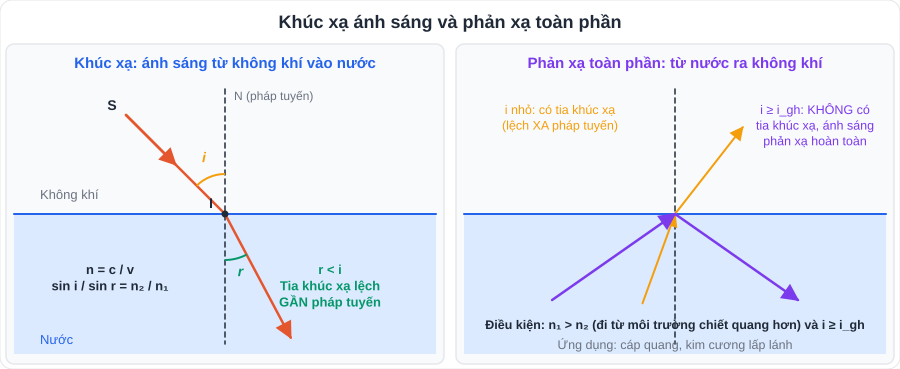
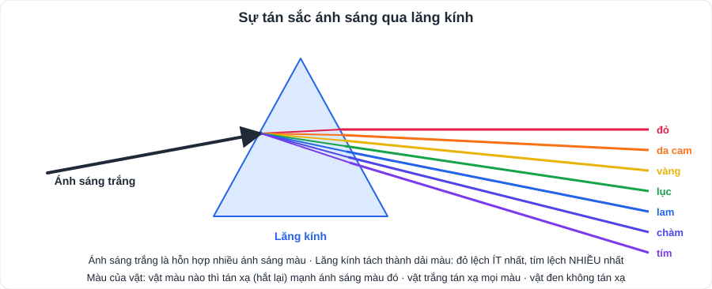
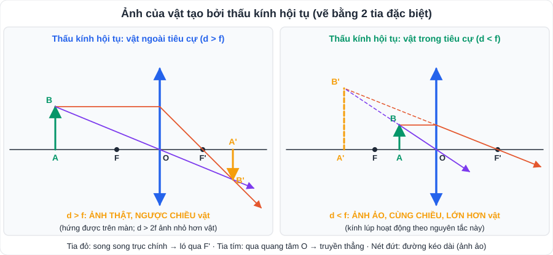
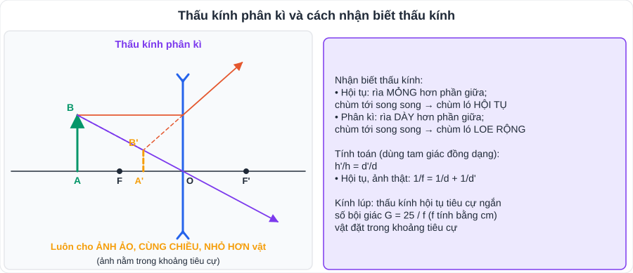

# KHTN 2: Ánh sáng – khúc xạ, lăng kính, thấu kính, kính lúp (Vật lí – Chương II)

> [Danh mục kiến thức](../README.md) · Học ở **tháng 10 – 11** · Ôn lại trước giữa HK1 và cuối HK1 · **Vẽ ảnh qua thấu kính là dạng bài chắc chắn có trong đề**

## Mục tiêu

- Mô tả **hiện tượng khúc xạ**, **chiết suất**, **phản xạ toàn phần**.
- Giải thích **sự tán sắc** qua lăng kính và **màu sắc của vật**.
- Vẽ ảnh qua **thấu kính hội tụ, phân kì** bằng tia đặc biệt; tính khoảng cách, chiều cao ảnh bằng **tam giác đồng dạng**.
- Hiểu cách dùng **kính lúp**.

---

## 1. Kiến thức cần nhớ

### 1.1. Khúc xạ ánh sáng

- **Hiện tượng khúc xạ**: tia sáng truyền **xiên góc** qua mặt phân cách giữa hai môi trường trong suốt bị **gãy khúc** tại mặt phân cách.
- Ánh sáng từ **không khí vào nước (thủy tinh)**: góc khúc xạ **r < i** (tia khúc xạ lệch gần pháp tuyến). Ngược lại từ nước ra không khí: r > i.
- Tia sáng **vuông góc** mặt phân cách (i = 0°) thì truyền **thẳng**.
- **Chiết suất**: n = c / v (c ≈ 3·10⁸ m/s là tốc độ ánh sáng trong chân không). Không khí n ≈ 1; nước n ≈ 1,33; thủy tinh n ≈ 1,5.
- **Định luật khúc xạ**: n₁·sin i = n₂·sin r.

### 1.2. Phản xạ toàn phần

- Xảy ra khi ánh sáng đi từ môi trường **chiết quang hơn** sang **chiết quang kém** (n₁ > n₂) và góc tới **i ≥ i_gh** (góc giới hạn, sin i_gh = n₂/n₁).
- Ứng dụng: **sợi quang (cáp quang)** truyền tín hiệu Internet, nội soi y học; kim cương lấp lánh.

### 1.3. Lăng kính, tán sắc, màu sắc

- **Ánh sáng trắng** (ánh sáng Mặt Trời) là hỗn hợp nhiều ánh sáng màu: **đỏ, da cam, vàng, lục, lam, chàm, tím**.
- Qua lăng kính, chùm sáng trắng bị **tán sắc** thành dải màu; tia **đỏ lệch ít nhất, tím lệch nhiều nhất**. Cầu vồng là hiện tượng tán sắc qua giọt nước.
- **Màu sắc của vật**: vật màu nào **tán xạ mạnh** ánh sáng màu đó, hấp thụ các màu khác. Vật trắng tán xạ tốt mọi màu; vật đen không tán xạ.
  - Ví dụ: chiếu ánh sáng đỏ vào lá cây xanh → lá trông **tối (gần đen)**.

### 1.4. Thấu kính

| | Thấu kính hội tụ | Thấu kính phân kì |
|---|---|---|
| Hình dạng | Rìa **mỏng** hơn giữa | Rìa **dày** hơn giữa |
| Chùm tới song song trục chính | Chùm ló **hội tụ** tại F' | Chùm ló **loe rộng** (đường kéo dài qua F) |
| Ảnh | d > f: ảnh **thật, ngược chiều**; d < f: ảnh **ảo, cùng chiều, lớn hơn vật** | Luôn **ảo, cùng chiều, nhỏ hơn vật**, nằm trong khoảng tiêu cự |

**Ba tia đặc biệt (thấu kính hội tụ):**
1. Tia qua **quang tâm O** → truyền **thẳng**.
2. Tia **song song trục chính** → tia ló đi **qua tiêu điểm F'**.
3. Tia **qua tiêu điểm F** → tia ló **song song trục chính**.

(Thấu kính phân kì: tia song song trục chính → tia ló có **đường kéo dài đi qua F**.)

**Tính toán** (đặt d = OA, d' = OA', h = AB, h' = A'B'): xét các cặp **tam giác đồng dạng** để tìm d' và h'. Với thấu kính hội tụ cho ảnh thật: **1/f = 1/d + 1/d'** và **h'/h = d'/d**.

### 1.5. Kính lúp

- Là **thấu kính hội tụ có tiêu cự ngắn**; vật đặt **trong khoảng tiêu cự** → ảnh ảo, cùng chiều, lớn hơn vật.
- Số bội giác: **G = 25 / f** (f tính bằng cm). Ví dụ kính lúp 5× có f = 5 cm.

---

## 2. Dạng bài và ví dụ có lời giải

**Ví dụ 1 (tính toán ảnh thật).** Vật AB cao 2 cm đặt vuông góc trục chính của thấu kính hội tụ tiêu cự 12 cm, cách thấu kính 36 cm. Tính khoảng cách từ ảnh đến thấu kính và chiều cao ảnh.

> 1/d' = 1/f − 1/d = 1/12 − 1/36 = 2/36 ⇒ **d' = 18 cm**.
> h' = h · d'/d = 2 · 18/36 = **1 cm**. Ảnh thật, ngược chiều, nhỏ hơn vật.

> 💡 Nếu đề yêu cầu "dùng kiến thức hình học", hãy chứng minh bằng hai cặp tam giác đồng dạng: △ABO ∽ △A'B'O và △OIF' ∽ △A'B'F' (với OI = AB).

**Ví dụ 2 (kính lúp).** Kính lúp có tiêu cự 2,5 cm. Tính số bội giác.

> G = 25 / 2,5 = **10×**.

**Ví dụ 3 (giải thích hiện tượng).** Vì sao nhìn chiếc thìa nhúng trong cốc nước thấy như bị gãy ở mặt nước?

> Ánh sáng từ phần thìa trong nước truyền ra không khí bị **khúc xạ** tại mặt nước, tia sáng bị gãy khúc nên mắt nhìn thấy **ảnh** của phần thìa trong nước nâng lên cao hơn vị trí thật → thìa như bị gãy.

---

## 3. Lỗi hay gặp

- Vẽ tia sáng **không có mũi tên** chỉ chiều truyền; vẽ ảnh ảo bằng **nét liền** (phải **nét đứt**).
- Nói "ánh sáng từ không khí vào nước bị lệch xa pháp tuyến" (ngược!).
- Nhầm điều kiện phản xạ toàn phần: phải đi từ môi trường **chiết suất lớn** sang **chiết suất nhỏ**.
- Áp dụng công thức ảnh thật cho trường hợp ảnh ảo.

---

## 4. Bài tập tự luyện

1. Chiếu tia sáng từ không khí vào thủy tinh với góc tới 0°. Tia khúc xạ đi thế nào?
2. Tốc độ ánh sáng trong một loại thủy tinh là 2·10⁸ m/s. Tính chiết suất của thủy tinh đó.
3. Nhìn một tấm bìa đỏ dưới ánh sáng xanh lục thì thấy màu gì? Vì sao?
4. Vật AB đặt trước thấu kính hội tụ tiêu cự 10 cm, cách thấu kính 30 cm, AB = 3 cm. Vẽ ảnh, tính d' và h'.
5. Vật đặt trước thấu kính hội tụ tiêu cự 20 cm, cách thấu kính 10 cm. Nêu đặc điểm của ảnh.
6. ★ Vật AB cao 4 cm đặt cách thấu kính phân kì 12 cm, tiêu cự 12 cm. Dùng tam giác đồng dạng tính khoảng cách từ ảnh đến thấu kính và chiều cao ảnh.
7. ★ Vì sao cáp quang truyền được tín hiệu đi rất xa mà ánh sáng hầu như không thoát ra ngoài?

---

## 5. Đáp án

👉 Bấm để xem đáp án (tự làm xong rồi mới mở)

1. Truyền **thẳng**, không bị gãy khúc.
2. n = c/v = 3·10⁸ / 2·10⁸ = **1,5**.
3. Thấy **gần như đen (tối)**, vì tấm bìa đỏ tán xạ kém ánh sáng xanh lục (hấp thụ).
4. 1/d' = 1/10 − 1/30 = 2/30 ⇒ **d' = 15 cm**; h' = 3 · 15/30 = **1,5 cm**; ảnh thật, ngược chiều, nhỏ hơn vật.
5. d < f ⇒ ảnh **ảo, cùng chiều, lớn hơn vật**, nằm cùng phía với vật.
6. d = f nên A trùng tiêu điểm F. Tia từ B song song trục chính tới I (ABIO là hình chữ nhật), tia ló có đường kéo dài qua F ≡ A, tức là đường chéo IA; tia qua O là đường chéo BO. Ảnh B' là giao điểm hai đường chéo ⇒ B' là **tâm hình chữ nhật** ⇒ **d' = 6 cm; h' = 2 cm** (ảnh ảo, cùng chiều, nhỏ hơn vật). Kiểm tra bằng công thức thấu kính phân kì: 1/d' = 1/d + 1/f = 1/12 + 1/12 ⇒ d' = 6 cm.
7. Ánh sáng truyền trong lõi sợi quang (chiết suất lớn) gặp lớp vỏ (chiết suất nhỏ) với góc tới lớn hơn góc giới hạn → **phản xạ toàn phần** liên tiếp, không bị khúc xạ ra ngoài.

