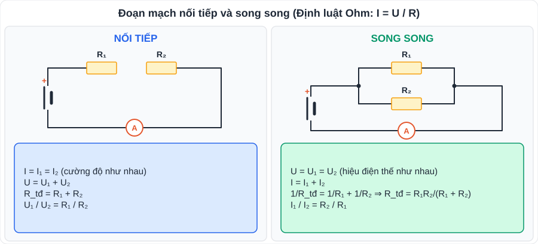

# KHTN 3: Điện – định luật Ohm, đoạn mạch, năng lượng điện (Vật lí – Chương III)

> [Danh mục kiến thức](../README.md) · Học ở **tháng 11 – 12** · Ôn lại trước cuối HK1 · **Bài tính mạch điện chiếm nhiều điểm; luyện đến khi làm đúng 100%**

## Mục tiêu

- Vận dụng **định luật Ohm** và công thức **điện trở dây dẫn**.
- Tính **điện trở tương đương**, cường độ dòng điện, hiệu điện thế trong mạch **nối tiếp, song song** (và mạch hỗn hợp đơn giản).
- Tính **năng lượng điện, công suất điện**, tiền điện; sử dụng điện **an toàn, tiết kiệm**.

---

## 1. Kiến thức cần nhớ

### 1.1. Định luật Ohm, điện trở

- **I = U / R** (I: A; U: V; R: Ω). Đồ thị I theo U là **đường thẳng qua gốc tọa độ**.
- **Điện trở dây dẫn**: **R = ρ · l / S** (ρ: điện trở suất, Ω·m; l: chiều dài, m; S: tiết diện, m²).
  - R tỉ lệ **thuận** với chiều dài, tỉ lệ **nghịch** với tiết diện; phụ thuộc vật liệu (đồng, nhôm dẫn điện tốt → ρ nhỏ).
  - Dây tròn: S = πd²/4. Đổi 1 mm² = 10⁻⁶ m².

### 1.2. Đoạn mạch nối tiếp và song song

| | Nối tiếp | Song song |
|---|---|---|
| Cường độ | I = I₁ = I₂ | I = I₁ + I₂ |
| Hiệu điện thế | U = U₁ + U₂ | U = U₁ = U₂ |
| Điện trở tương đương | R = R₁ + R₂ | 1/R = 1/R₁ + 1/R₂ ⇒ R = R₁R₂/(R₁ + R₂) |
| Tỉ lệ | U₁/U₂ = R₁/R₂ | I₁/I₂ = R₂/R₁ |
| Ghi nhớ | R_tđ **lớn hơn** mỗi điện trở thành phần | R_tđ **nhỏ hơn** mỗi điện trở thành phần |

- Các thiết bị trong gia đình mắc **song song** (cùng U = 220 V, hỏng một cái không ảnh hưởng cái khác).
- n điện trở giống nhau R₀ mắc song song: R = R₀/n.

### 1.3. Năng lượng điện, công suất điện

| Đại lượng | Công thức | Đơn vị |
|---|---|---|
| Công suất điện | **P = U·I = I²R = U²/R** | W |
| Năng lượng điện tiêu thụ | **W = P·t = U·I·t** | J (t: s) hoặc **kWh** (P: kW, t: h) |
| Nhiệt lượng tỏa ra (Joule) | Q = I²·R·t | J |

- Số ghi trên thiết bị, ví dụ **220 V – 1 000 W**: thiết bị hoạt động bình thường khi dùng đúng 220 V và khi đó công suất là 1 000 W.
- **Công tơ điện** đo điện năng tiêu thụ; 1 "số điện" = **1 kWh**.

### 1.4. An toàn, tiết kiệm điện

- Dùng **cầu chì, aptomat (CB)**, dây nối đất; không chạm tay ướt vào thiết bị điện; ngắt điện khi sửa chữa.
- Tiết kiệm: tắt thiết bị khi không dùng; dùng **đèn LED**, thiết bị có nhãn tiết kiệm năng lượng; không để thiết bị ở chế độ chờ.

---

## 2. Dạng bài và ví dụ có lời giải

**Ví dụ 1 (nối tiếp).** R₁ = 10 Ω, R₂ = 20 Ω mắc nối tiếp vào U = 12 V. Tính R_tđ, I, U₁, U₂.

> R_tđ = 30 Ω; I = 12/30 = **0,4 A**; U₁ = 0,4·10 = **4 V**; U₂ = 0,4·20 = **8 V** (kiểm tra 4 + 8 = 12 ✓).

**Ví dụ 2 (song song).** R₁ = 6 Ω, R₂ = 3 Ω mắc song song vào U = 6 V. Tính R_tđ, I₁, I₂, I.

> R_tđ = 6·3/(6 + 3) = **2 Ω**; I₁ = 6/6 = **1 A**; I₂ = 6/3 = **2 A**; I = **3 A** (= 6/2 ✓).

**Ví dụ 3 (mạch hỗn hợp).** R₁ = 4 Ω nối tiếp với cụm (R₂ = 6 Ω // R₃ = 12 Ω), U = 16 V. Tính I qua mạch chính và I₂.

> R₂₃ = 6·12/18 = 4 Ω ⇒ R = 4 + 4 = 8 Ω ⇒ I = 16/8 = **2 A**. U₂₃ = 2·4 = 8 V ⇒ I₂ = 8/6 ≈ **1,33 A**.

**Ví dụ 4 (điện trở dây).** Dây đồng dài 100 m, tiết diện 1 mm², ρ = 1,7·10⁻⁸ Ω·m. Tính R.

> R = 1,7·10⁻⁸ · 100 / 10⁻⁶ = **1,7 Ω**.

**Ví dụ 5 (tiền điện).** Ấm điện 220 V – 1 500 W dùng mỗi ngày 30 phút; bóng đèn LED 15 W dùng 6 giờ/ngày. Tính điện năng tiêu thụ trong 30 ngày và tiền điện (giá giả định 3 000 đ/kWh).

> Ấm: 1,5 kW · 0,5 h · 30 = 22,5 kWh. Đèn: 0,015 · 6 · 30 = 2,7 kWh. Tổng **25,2 kWh** ⇒ tiền **75 600 đồng**.

---

## 3. Lỗi hay gặp

| Lỗi | Cách tránh |
|---|---|
| Song song mà cộng thẳng R₁ + R₂ | Song song: **tích chia tổng** (2 điện trở) |
| Quên đổi mm² → m² trong R = ρl/S | 1 mm² = **10⁻⁶ m²** |
| Tính kWh mà để P theo W, t theo phút | **kW × giờ** |
| Dùng U nguồn cho từng điện trở mắc nối tiếp | Nối tiếp thì U **chia** cho các điện trở |

---

## 4. Bài tập tự luyện

1. Một điện trở 15 Ω mắc vào hiệu điện thế 6 V. Tính cường độ dòng điện.
2. Hai điện trở 12 Ω và 18 Ω mắc nối tiếp vào U = 15 V. Tính I và hiệu điện thế mỗi điện trở.
3. Hai điện trở 20 Ω và 30 Ω mắc song song vào U = 12 V. Tính R_tđ và cường độ qua mạch chính.
4. Ba điện trở 30 Ω giống nhau mắc song song. Tính R_tđ.
5. Dây nhôm dài 200 m, tiết diện 2 mm², ρ = 2,8·10⁻⁸ Ω·m. Tính điện trở.
6. ★ Bóng đèn ghi 220 V – 100 W. Tính cường độ định mức và điện trở của đèn. Nếu dùng 5 giờ/ngày thì 30 ngày tiêu thụ bao nhiêu kWh?
7. ★ Mạch: R₁ = 6 Ω nối tiếp (R₂ = 10 Ω // R₃ = 15 Ω), U = 24 V. Tính R_tđ, I, U₁, I₂, I₃.

---

## 5. Đáp án

👉 Bấm để xem đáp án (tự làm xong rồi mới mở)

1. I = 6/15 = **0,4 A**.
2. R = 30 Ω; I = **0,5 A**; U₁ = **6 V**; U₂ = **9 V**.
3. R_tđ = 600/50 = **12 Ω**; I = 12/12 = **1 A**.
4. **10 Ω**.
5. R = 2,8·10⁻⁸ · 200 / (2·10⁻⁶) = **2,8 Ω**.
6. I = 100/220 ≈ **0,45 A**; R = 220²/100 = **484 Ω**; W = 0,1 · 5 · 30 = **15 kWh**.
7. R₂₃ = 150/25 = 6 Ω ⇒ R = **12 Ω**; I = **2 A**; U₁ = **12 V**; U₂₃ = 12 V ⇒ I₂ = **1,2 A**, I₃ = **0,8 A**.

