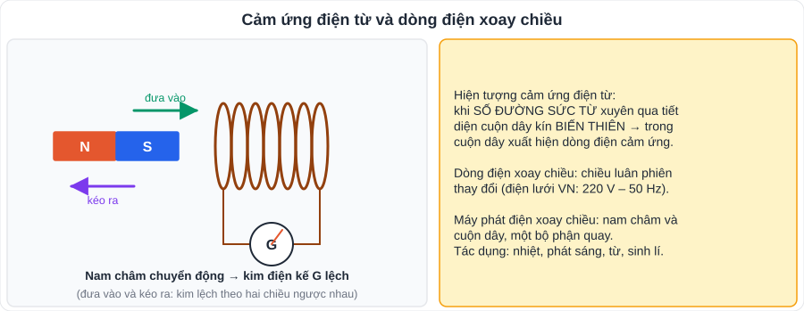
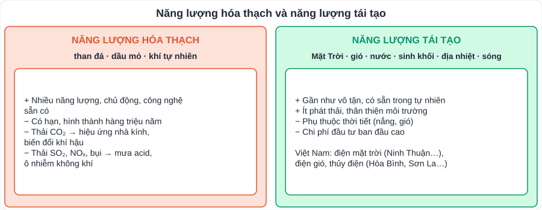

# KHTN 4: Điện từ và năng lượng với cuộc sống (Vật lí – Chương IV, V)

> [Danh mục kiến thức](../README.md) · Học ở **tháng 12 – 1** · Ôn lại trước cuối HK1 · **Phần lí thuyết, giải thích hiện tượng: học kĩ "điều kiện xuất hiện dòng điện cảm ứng"**

## Mục tiêu

- Nêu được **điều kiện xuất hiện dòng điện cảm ứng**; mô tả cấu tạo, nguyên tắc **máy phát điện xoay chiều**.
- Nêu các **tác dụng của dòng điện xoay chiều**.
- So sánh **năng lượng hóa thạch** và **năng lượng tái tạo**; nêu biện pháp sử dụng năng lượng **bền vững**.

---

## 1. Điện từ

### 1.1. Hiện tượng cảm ứng điện từ

- Dòng điện xuất hiện trong cuộn dây dẫn kín khi **số đường sức từ xuyên qua tiết diện cuộn dây biến thiên** (tăng hoặc giảm) gọi là **dòng điện cảm ứng**.
- Các cách tạo dòng điện cảm ứng: **đưa nam châm lại gần / ra xa** cuộn dây; **quay nam châm** trước cuộn dây (hoặc quay cuộn dây trong từ trường); **đóng / ngắt mạch** nam châm điện đặt gần cuộn dây.
- Nam châm **đứng yên** so với cuộn dây → **không** có dòng điện cảm ứng.

### 1.2. Dòng điện xoay chiều

- Dòng điện có **chiều luân phiên thay đổi**. Khi số đường sức từ **tăng** → dòng cảm ứng chạy một chiều; khi **giảm** → chạy chiều ngược lại.
- Điện lưới Việt Nam: **220 V – 50 Hz** (đổi chiều 100 lần mỗi giây).
- **Máy phát điện xoay chiều**: gồm **nam châm** và **cuộn dây**; một bộ phận đứng yên (stato), một bộ phận quay (roto). Có thể quay nam châm hoặc quay cuộn dây.
  - Nhà máy điện: dùng năng lượng của **nước (thủy điện), hơi nước (nhiệt điện), gió (điện gió)** làm quay tua-bin → quay máy phát. Riêng **pin mặt trời** biến đổi trực tiếp quang năng thành điện năng (không dùng máy phát).
- **Tác dụng** của dòng điện xoay chiều: **nhiệt** (bàn là, nồi cơm), **phát sáng** (đèn), **từ** (nam châm điện, quạt điện, động cơ), **sinh lí** (nguy hiểm cho cơ thể – phải an toàn điện).

---

## 2. Năng lượng với cuộc sống

| | Năng lượng hóa thạch | Năng lượng tái tạo |
|---|---|---|
| Nguồn | Than đá, dầu mỏ, khí tự nhiên | Mặt Trời, gió, nước, sinh khối, địa nhiệt, sóng – thủy triều |
| Trữ lượng | **Có hạn**, cần hàng triệu năm để hình thành | **Gần như vô tận**, được bổ sung liên tục |
| Môi trường | Thải **CO₂** (hiệu ứng nhà kính), SO₂, NOₓ, bụi mịn | Ít phát thải |
| Hạn chế | Ô nhiễm, cạn kiệt | Phụ thuộc thời tiết, chi phí đầu tư lớn, cần diện tích |

- **Hiệu ứng nhà kính** gia tăng → **Trái Đất nóng lên** → biến đổi khí hậu (băng tan, nước biển dâng, thời tiết cực đoan).
- **Sử dụng năng lượng bền vững**: tiết kiệm điện, nước; dùng phương tiện công cộng, xe đạp; dùng thiết bị hiệu suất cao; phát triển năng lượng tái tạo; trồng cây xanh.

---

## 3. Lỗi hay gặp

- Cho rằng "cứ có nam châm và cuộn dây là có dòng điện" → phải có **sự biến thiên** số đường sức từ.
- Nhầm "pin mặt trời dùng máy phát điện".
- Nói "năng lượng tái tạo không có nhược điểm".

---

## 4. Bài tập tự luyện

1. Trong các trường hợp sau, trường hợp nào xuất hiện dòng điện cảm ứng trong cuộn dây kín? a) Nam châm đứng yên trong lòng cuộn dây. b) Đưa nam châm vào lòng cuộn dây. c) Quay nam châm trước cuộn dây. d) Cuộn dây và nam châm cùng chuyển động thẳng đều cùng tốc độ.
2. Vì sao dòng điện tạo ra trong máy phát điện có trục quay lại là dòng điện xoay chiều?
3. Nêu 4 tác dụng của dòng điện xoay chiều, mỗi tác dụng một ví dụ.
4. Kể tên 3 nhà máy (hoặc loại nhà máy) điện ở Việt Nam dùng năng lượng tái tạo.
5. ★ Đề xuất 5 việc làm cụ thể ở gia đình em để tiết kiệm năng lượng.
6. ★ Vì sao các nước đều khuyến khích chuyển từ nhiệt điện than sang điện mặt trời, điện gió?

👉 Bấm để xem đáp án

1. **b) và c)**. (a, d: số đường sức từ qua cuộn dây không đổi.)
2. Khi roto quay, số đường sức từ qua cuộn dây **luân phiên tăng, giảm** → dòng cảm ứng **luân phiên đổi chiều**.
3. Nhiệt (nồi cơm điện), phát sáng (đèn LED), từ (quạt điện, chuông điện), sinh lí (điện giật – nguy hiểm; ứng dụng trong một số thiết bị y tế).
4. Ví dụ: thủy điện Hòa Bình, Sơn La; điện mặt trời ở Ninh Thuận; điện gió ở Bạc Liêu…
5. Gợi ý: tắt đèn, quạt khi ra khỏi phòng; rút sạc khi đầy; dùng đèn LED; đặt điều hòa 26 – 28 °C; phơi quần áo tự nhiên thay máy sấy; đi xe đạp khi đi gần.
6. Than là nguồn **có hạn**, đốt than thải nhiều **CO₂** và bụi gây ô nhiễm, biến đổi khí hậu; mặt trời, gió là nguồn **sạch, vô tận**, giảm phụ thuộc nhiên liệu nhập khẩu.

