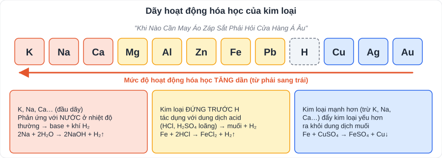

# KHTN 5: Kim loại – sự khác nhau cơ bản giữa phi kim và kim loại (Hóa học – Chương VI)

> [Danh mục kiến thức](../README.md) · Học ở **tháng 9 – 10** (phân môn Hóa) · Ôn lại trước giữa HK1, cuối HK1 · **Dãy hoạt động hóa học là chìa khóa của cả chương**

## Mục tiêu

- Nêu **tính chất vật lí, hóa học** chung của kim loại; viết đúng phương trình hóa học.
- Dùng **dãy hoạt động hóa học** để dự đoán phản ứng.
- Nêu phương pháp **tách kim loại**, khái niệm và ứng dụng của **hợp kim**.
- So sánh **kim loại và phi kim**.

---

## 1. Kiến thức cần nhớ

### 1.1. Tính chất vật lí của kim loại

- **Tính dẻo** (dát mỏng, kéo sợi), **dẫn điện** (Ag > Cu > Au > Al > Fe), **dẫn nhiệt**, **ánh kim**.
- Thủy ngân (Hg) là kim loại **lỏng** ở nhiệt độ thường. Kim loại có khối lượng riêng, nhiệt độ nóng chảy khác nhau (Al nhẹ; W – tungsten – nóng chảy rất cao, làm dây tóc bóng đèn).

### 1.2. Tính chất hóa học của kim loại

| Phản ứng với | Sản phẩm | Ví dụ |
|---|---|---|
| **Oxygen** | Oxide (base) | 3Fe + 2O₂ →(t°) Fe₃O₄; 4Al + 3O₂ →(t°) 2Al₂O₃ |
| **Phi kim khác** (Cl₂, S) | Muối | 2Fe + 3Cl₂ →(t°) 2FeCl₃; Fe + S →(t°) FeS |
| **Dung dịch acid** (HCl, H₂SO₄ loãng) – kim loại đứng trước H | Muối + H₂ | Zn + 2HCl → ZnCl₂ + H₂↑ |
| **Nước** – K, Na, Ca, Ba… | Base + H₂ | 2Na + 2H₂O → 2NaOH + H₂↑ |
| **Dung dịch muối** – kim loại mạnh hơn (trừ K, Na, Ca, Ba) | Muối mới + kim loại mới | Fe + CuSO₄ → FeSO₄ + Cu↓ (đinh sắt phủ lớp đỏ) |

### 1.3. Dãy hoạt động hóa học

**K, Na, Ca, Mg, Al, Zn, Fe, Pb, (H), Cu, Ag, Au** – mức độ hoạt động **giảm dần từ trái sang phải**.

- Kim loại **đứng trước H** đẩy được hydrogen khỏi dung dịch acid.
- Kim loại đứng trước (trừ K, Na, Ca…) đẩy kim loại đứng sau ra khỏi dung dịch muối.
- K, Na, Ca phản ứng mạnh với nước ở nhiệt độ thường.

### 1.4. Tách kim loại, hợp kim

| Kim loại | Phương pháp tách |
|---|---|
| Hoạt động mạnh (K, Na, Ca, Mg, Al) | **Điện phân nóng chảy** (ví dụ điện phân Al₂O₃ nóng chảy → Al) |
| Trung bình (Zn, Fe, Pb, Cu) | **Nhiệt luyện**: dùng C, CO, H₂ khử oxide. Fe₂O₃ + 3CO →(t°) 2Fe + 3CO₂ |
| Kém hoạt động (Ag, Au) | Có thể ở dạng tự do, tách bằng phương pháp vật lí, hóa học |

- **Hợp kim**: vật liệu kim loại có thêm một hoặc nhiều nguyên tố khác; thường **cứng, bền, chống ăn mòn** tốt hơn kim loại nguyên chất.
  - **Gang** (Fe + 2 – 5% C): cứng, giòn. **Thép** (Fe + < 2% C): cứng, bền, dẻo hơn gang. **Inox** (thép không gỉ: Fe, Cr, Ni). **Duralumin** (Al, Cu, Mg, Mn): nhẹ, bền – làm vỏ máy bay.
- **Ăn mòn kim loại** (gỉ sắt): do tác dụng của O₂, hơi nước, chất trong môi trường. Chống ăn mòn: sơn, mạ, bôi dầu mỡ, dùng hợp kim không gỉ.

### 1.5. Kim loại và phi kim

| | Kim loại | Phi kim |
|---|---|---|
| Trạng thái | Rắn (trừ Hg) | Rắn (C, S, P), lỏng (Br₂), khí (O₂, N₂, Cl₂) |
| Tính chất vật lí | Dẫn điện, dẫn nhiệt tốt, dẻo, ánh kim | Thường dẫn điện, dẫn nhiệt kém (trừ graphite) |
| Oxide | Thường là **oxide base** (Na₂O, CaO, CuO) | Thường là **oxide acid** (CO₂, SO₂, P₂O₅) |
| Khi phản ứng | Có xu hướng **nhường electron** → ion dương | Có xu hướng **nhận electron** → ion âm |

---

## 2. Dạng bài và ví dụ có lời giải

**Ví dụ 1 (dự đoán phản ứng).** Cho các kim loại Cu, Fe, Ag lần lượt vào dung dịch HCl. Kim loại nào phản ứng?

> Chỉ **Fe** (đứng trước H): Fe + 2HCl → FeCl₂ + H₂↑. Cu, Ag đứng sau H → không phản ứng.

**Ví dụ 2 (tính theo phương trình).** Cho 5,6 g Fe tác dụng hết với dung dịch HCl. Tính thể tích khí H₂ thu được ở điều kiện chuẩn (25 °C, 1 bar).

> n(Fe) = 5,6 / 56 = 0,1 mol. Fe + 2HCl → FeCl₂ + H₂ ⇒ n(H₂) = 0,1 mol.
> V = 0,1 · 24,79 = **2,479 L**.

> 💡 Chương trình mới dùng **điều kiện chuẩn (25 °C, 1 bar): 1 mol khí chiếm 24,79 L**. Nếu đề cho 22,4 L thì dùng theo đề.

**Ví dụ 3 (kim loại đẩy kim loại).** Ngâm đinh sắt trong dung dịch CuSO₄. Nêu hiện tượng và viết phương trình.

> Có lớp **kim loại màu đỏ** bám trên đinh sắt, **màu xanh** của dung dịch nhạt dần. Fe + CuSO₄ → FeSO₄ + Cu.

---

## 3. Lỗi hay gặp

- Viết Cu + HCl → … (Cu đứng sau H, **không** phản ứng).
- Viết Na + CuSO₄ → Cu (Na phản ứng với **nước** trước, tạo NaOH, rồi NaOH tác dụng CuSO₄ tạo kết tủa Cu(OH)₂).
- Fe + HCl → **FeCl₃** (sai; đúng là **FeCl₂**). Fe + Cl₂ mới tạo FeCl₃.
- Quên cân bằng phương trình, quên điều kiện (t°).

---

## 4. Bài tập tự luyện

1. Viết phương trình: a) Mg + O₂; b) Al + HCl; c) Zn + CuSO₄; d) K + H₂O.
2. Có các kim loại Al, Cu, Ag, Mg. Kim loại nào tác dụng được với dung dịch HCl? Với dung dịch AgNO₃?
3. Sắp xếp theo chiều mức độ hoạt động hóa học giảm dần: Fe, Na, Cu, Al, Ag.
4. Cho 2,7 g Al tác dụng hết với dung dịch HCl. Tính thể tích H₂ (điều kiện chuẩn).
5. Vì sao không dùng xô nhôm đựng nước vôi (dung dịch base)? Vì sao inox ít bị gỉ?
6. ★ Cho 10 g hỗn hợp Cu và Fe vào dung dịch HCl dư, thu được 2,479 L H₂ (điều kiện chuẩn). Tính phần trăm khối lượng mỗi kim loại.

---

## 5. Đáp án

👉 Bấm để xem đáp án (tự làm xong rồi mới mở)

1. a) 2Mg + O₂ →(t°) 2MgO; b) 2Al + 6HCl → 2AlCl₃ + 3H₂↑; c) Zn + CuSO₄ → ZnSO₄ + Cu; d) 2K + 2H₂O → 2KOH + H₂↑.
2. Với HCl: **Al, Mg**. Với AgNO₃: **Al, Cu, Mg** (đều mạnh hơn Ag).
3. **Na > Al > Fe > Cu > Ag**.
4. n(Al) = 0,1 mol ⇒ n(H₂) = 0,15 mol ⇒ V = 0,15 · 24,79 ≈ **3,72 L**.
5. Nhôm (và lớp oxide bảo vệ Al₂O₃) bị dung dịch base phá hủy → xô nhanh hỏng. Inox là hợp kim chứa **Cr, Ni** tạo lớp bảo vệ, chống ăn mòn.
6. Chỉ Fe phản ứng: n(H₂) = 0,1 mol ⇒ n(Fe) = 0,1 mol ⇒ m(Fe) = 5,6 g ⇒ **%Fe = 56%; %Cu = 44%**.

