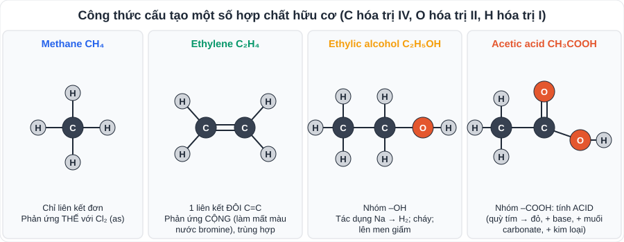

# KHTN 6: Hợp chất hữu cơ, hydrocarbon, nhiên liệu và tài nguyên vỏ Trái Đất (Hóa học – Chương VII, X)

> [Danh mục kiến thức](../README.md) · Học ở **tháng 11 – 12** và phần tài nguyên vỏ Trái Đất ở **HK2** · Ôn lại trước cuối HK1 · **Phân biệt phản ứng THẾ (methane) và phản ứng CỘNG (ethylene)**

## Mục tiêu

- Nhận biết **hợp chất hữu cơ**, viết **công thức cấu tạo** đơn giản.
- Nêu cấu tạo, tính chất của **alkane (methane)** và **alkene (ethylene)**; viết phương trình.
- Hiểu về **nhiên liệu**, dầu mỏ, khí thiên nhiên; sử dụng nhiên liệu an toàn, hiệu quả.
- Nêu các tài nguyên khai thác từ **vỏ Trái Đất** (đá vôi, silicate, nhiên liệu hóa thạch) và **chu trình carbon**.

---

## 1. Hợp chất hữu cơ

- Là hợp chất của **carbon** (trừ CO, CO₂, H₂CO₃, muối carbonate, carbide…).
- Phân loại: **hydrocarbon** (chỉ có C và H: CH₄, C₂H₄) và **dẫn xuất của hydrocarbon** (có thêm O, N, Cl…: C₂H₅OH, CH₃COOH).
- **Công thức cấu tạo** cho biết thứ tự liên kết giữa các nguyên tử. Trong hợp chất hữu cơ: **C hóa trị IV, H hóa trị I, O hóa trị II**.
- Đặc điểm chung: thường **dễ cháy**, kém bền với nhiệt, phản ứng chậm.

## 2. Hydrocarbon

| | Alkane (methane CH₄) | Alkene (ethylene C₂H₄) |
|---|---|---|
| Liên kết | Chỉ có **liên kết đơn** | Có **1 liên kết đôi C=C** |
| Công thức chung | CₙH₂ₙ₊₂ (n ≥ 1) | CₙH₂ₙ (n ≥ 2) |
| Phản ứng cháy | CH₄ + 2O₂ →(t°) CO₂ + 2H₂O | C₂H₄ + 3O₂ →(t°) 2CO₂ + 2H₂O |
| Phản ứng đặc trưng | **Thế** với Cl₂ (ánh sáng): CH₄ + Cl₂ →(as) CH₃Cl + HCl | **Cộng**: C₂H₄ + Br₂ → C₂H₄Br₂ (làm **mất màu dung dịch bromine**) |
| | | **Trùng hợp**: nCH₂=CH₂ →(t°, p, xt) (–CH₂–CH₂–)ₙ (polyethylene, PE) |
| Ứng dụng | Nhiên liệu (khí thiên nhiên, biogas) | Sản xuất nhựa PE, kích thích quả chín |

- **Nhận biết** CH₄ và C₂H₄: dẫn qua **dung dịch bromine** → khí nào làm **mất màu** là C₂H₄.

## 3. Nhiên liệu

- **Dầu mỏ**: hỗn hợp nhiều hydrocarbon; **chưng cất phân đoạn** → khí, xăng, dầu hỏa, dầu diesel, dầu mazut, nhựa đường.
- **Khí thiên nhiên** và **khí mỏ dầu**: thành phần chính là **methane**.
- **Sử dụng nhiên liệu hiệu quả, an toàn**: cung cấp **đủ oxygen** (cháy thiếu O₂ sinh khí **CO rất độc**); tăng diện tích tiếp xúc; điều chỉnh lượng nhiên liệu; không để bình gas gần nguồn nhiệt; thông gió khi đun bếp than.

## 4. Khai thác tài nguyên từ vỏ Trái Đất

| Tài nguyên | Ứng dụng chính |
|---|---|
| **Đá vôi** (CaCO₃) | Sản xuất vôi sống: CaCO₃ →(t°) CaO + CO₂; xi măng, vật liệu xây dựng |
| **Đất sét, cát (SiO₂)** – công nghiệp **silicate** | Đồ gốm, sứ, gạch ngói, **thủy tinh**, **xi măng** |
| **Quặng kim loại** | Luyện gang, thép, nhôm… |
| **Nhiên liệu hóa thạch** | Than, dầu mỏ, khí thiên nhiên |

- **Chu trình carbon**: CO₂ trong khí quyển → cây xanh **quang hợp** → chất hữu cơ → động vật → hô hấp, phân hủy, **đốt nhiên liệu** → trả CO₂ về khí quyển.
- Đốt quá nhiều nhiên liệu hóa thạch + chặt phá rừng → **CO₂ tăng** → hiệu ứng nhà kính, **biến đổi khí hậu**. Giải pháp: tiết kiệm năng lượng, năng lượng tái tạo, trồng rừng, giảm rác thải nhựa.

---

## 5. Dạng bài và ví dụ có lời giải

**Ví dụ 1 (đốt cháy).** Đốt cháy hoàn toàn 2,479 L khí methane (điều kiện chuẩn). Tính thể tích O₂ cần dùng và khối lượng CO₂ tạo thành.

> n(CH₄) = 2,479 / 24,79 = 0,1 mol. CH₄ + 2O₂ → CO₂ + 2H₂O.
> n(O₂) = 0,2 mol ⇒ V = 0,2 · 24,79 = **4,958 L**; n(CO₂) = 0,1 mol ⇒ m = 0,1 · 44 = **4,4 g**.

**Ví dụ 2 (bromine).** Dẫn 0,1 mol hỗn hợp CH₄ và C₂H₄ qua dung dịch bromine dư, thấy có 8 g Br₂ phản ứng. Tính số mol mỗi khí.

> n(Br₂) = 8 / 160 = 0,05 mol = n(C₂H₄). ⇒ n(CH₄) = 0,1 − 0,05 = **0,05 mol**; n(C₂H₄) = **0,05 mol**.

---

## 6. Lỗi hay gặp

- Viết CH₄ + Br₂ (dung dịch) → … (methane **không** làm mất màu dung dịch bromine).
- Cân bằng sai phương trình cháy (đếm O cuối cùng).
- Cho CO₂, CaCO₃ là hợp chất hữu cơ (đây là ngoại lệ, thuộc vô cơ).

---

## 7. Bài tập tự luyện

1. Trong các chất: CH₄, CO₂, C₂H₅OH, NaHCO₃, C₂H₄, CaCO₃, chất nào là hợp chất hữu cơ? Chất nào là hydrocarbon?
2. Viết công thức cấu tạo của C₂H₆ (ethane) và C₃H₆ (propene, mạch hở).
3. Viết phương trình: a) đốt cháy C₂H₄; b) C₂H₄ + Br₂; c) trùng hợp ethylene.
4. Trình bày cách phân biệt hai bình khí mất nhãn CH₄ và C₂H₄.
5. Vì sao đun bếp than trong phòng kín dễ gây ngộ độc?
6. ★ Đốt cháy hoàn toàn 0,2 mol C₂H₄. Dẫn sản phẩm qua nước vôi trong dư. Tính khối lượng kết tủa CaCO₃ thu được.

👉 Bấm để xem đáp án

1. Hữu cơ: **CH₄, C₂H₅OH, C₂H₄**; hydrocarbon: **CH₄, C₂H₄**.
2. CH₃–CH₃; CH₂=CH–CH₃.
3. a) C₂H₄ + 3O₂ → 2CO₂ + 2H₂O; b) C₂H₄ + Br₂ → C₂H₄Br₂; c) nCH₂=CH₂ → (–CH₂–CH₂–)ₙ.
4. Dẫn lần lượt qua dung dịch bromine: khí làm **mất màu** là C₂H₄, còn lại là CH₄.
5. Thiếu oxygen, than cháy không hoàn toàn sinh khí **CO** rất độc (gây ngạt).
6. n(CO₂) = 2 · 0,2 = 0,4 mol; CO₂ + Ca(OH)₂ → CaCO₃↓ + H₂O ⇒ m = 0,4 · 100 = **40 g**.

