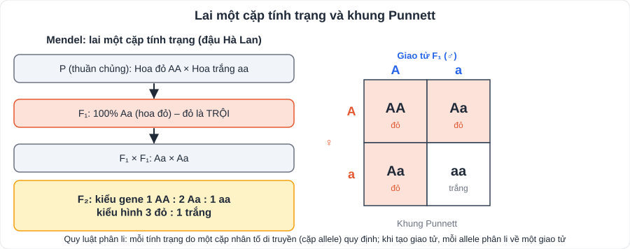
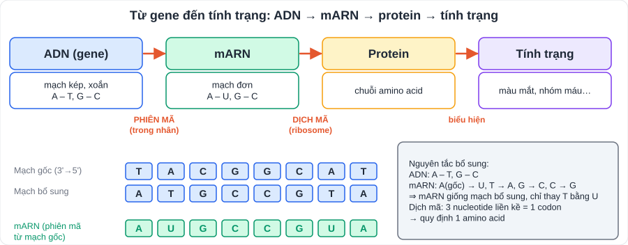

# KHTN 8: Di truyền học Mendel, ADN, gene và quá trình truyền đạt thông tin di truyền (Sinh học – Chương XI)

> [Danh mục kiến thức](../README.md) · Học ở **tháng 10 – 12** (phân môn Sinh) · Ôn lại trước cuối HK1 · **Bài tập lai và nguyên tắc bổ sung: luyện đến khi làm nhanh, chính xác**

## Mục tiêu

- Dùng đúng thuật ngữ: **tính trạng, allele, kiểu gene, kiểu hình, đồng hợp, dị hợp, trội, lặn**.
- Giải bài tập **lai một cặp, hai cặp tính trạng**; dùng **lai phân tích**.
- Nêu cấu trúc **ADN, ARN**; vận dụng **nguyên tắc bổ sung**; mô tả **phiên mã, dịch mã**; hiểu **đột biến gene**.

---

## 1. Thí nghiệm và quy luật của Mendel

### 1.1. Thuật ngữ

| Thuật ngữ | Nghĩa | Ví dụ |
|---|---|---|
| Tính trạng | Đặc điểm của sinh vật | Màu hoa, chiều cao thân |
| Cặp tính trạng tương phản | Hai trạng thái biểu hiện trái ngược | Hoa đỏ – hoa trắng |
| Allele | Các trạng thái khác nhau của cùng một gene | A (đỏ), a (trắng) |
| Kiểu gene | Tổ hợp các allele | AA, Aa, aa |
| Kiểu hình | Tổ hợp các tính trạng biểu hiện | Hoa đỏ |
| Đồng hợp / dị hợp | Hai allele giống nhau / khác nhau | AA, aa / Aa |
| Dòng thuần | Có kiểu gene đồng hợp, đời con giống bố mẹ | |

### 1.2. Lai một cặp tính trạng – quy luật phân li

- P thuần chủng tương phản → **F₁ đồng tính** (mang tính trạng **trội**) → F₂ phân li **3 trội : 1 lặn** (kiểu gene 1 AA : 2 Aa : 1 aa).
- **Quy luật phân li**: mỗi tính trạng do một cặp allele quy định; khi giảm phân, **mỗi allele phân li về một giao tử**.

### 1.3. Lai phân tích

- Lai cá thể **mang tính trạng trội** cần xác định kiểu gene với cá thể **mang tính trạng lặn** (aa).
  - Con **100% trội** → cá thể đem lai **đồng hợp (AA)**.
  - Con **1 trội : 1 lặn** → cá thể đem lai **dị hợp (Aa)**.

### 1.4. Lai hai cặp tính trạng – quy luật phân li độc lập

- P: AABB (vàng, trơn) × aabb (xanh, nhăn) → F₁: AaBb → F₂: **9 : 3 : 3 : 1** (9 A-B- : 3 A-bb : 3 aaB- : 1 aabb).
- **Quy luật phân li độc lập**: các cặp allele quy định các tính trạng khác nhau **phân li độc lập** trong quá trình tạo giao tử. AaBb cho **4 loại giao tử**: AB, Ab, aB, ab.
- Ý nghĩa: tạo **biến dị tổ hợp** phong phú → nguyên liệu cho tiến hóa, chọn giống.

---

## 2. ADN, ARN, gene

| | ADN (DNA) | ARN (RNA) |
|---|---|---|
| Cấu trúc | **Hai mạch** xoắn kép | **Một mạch** |
| Đơn phân | Nucleotide: **A, T, G, C** | Nucleotide: **A, U, G, C** |
| Đường | Deoxyribose | Ribose |
| Chức năng | **Lưu trữ, truyền đạt** thông tin di truyền | mARN: truyền thông tin; tARN: vận chuyển amino acid; rARN: cấu tạo ribosome |

- **Nguyên tắc bổ sung** trong ADN: **A liên kết với T, G liên kết với C** ⇒ A = T, G = C; A + G = T + C = N/2.
- **Gene**: một đoạn ADN mang thông tin quy định một sản phẩm (ARN hoặc protein).
- **Tái bản ADN** (nhân đôi): theo nguyên tắc **bổ sung** và **bán bảo toàn** → 2 ADN con giống ADN mẹ.

### 2.1. Phiên mã và dịch mã

- **Phiên mã**: tổng hợp **mARN** từ **mạch gốc** của gene (A → U, T → A, G → C, C → G).
- **Dịch mã**: tại **ribosome**, mARN được "đọc" theo từng **bộ ba (codon)**, mỗi codon quy định **một amino acid** → chuỗi polypeptide (protein).
- **Mã di truyền**: mã bộ ba; có **codon mở đầu** (AUG) và **codon kết thúc** (UAA, UAG, UGA).
- Sơ đồ: **Gene (ADN) → mARN → protein → tính trạng**.

### 2.2. Đột biến gene

- Là những biến đổi trong **cấu trúc của gene** (mất, thêm, thay thế một hoặc một số cặp nucleotide).
- Nguyên nhân: tác nhân **vật lí** (tia UV, phóng xạ), **hóa học** (chất độc), **sinh học** (virus), sai sót khi tái bản ADN.
- Phần lớn có hại; một số có lợi hoặc trung tính → nguyên liệu cho tiến hóa, chọn giống.
- Ví dụ: bệnh **hồng cầu hình liềm** (thay thế một cặp nucleotide).

---

## 3. Dạng bài và ví dụ có lời giải

**Ví dụ 1 (lai một cặp).** Ở đậu Hà Lan, thân cao (A) trội hoàn toàn so với thân thấp (a). Cho cây thân cao dị hợp tự thụ phấn. Xác định tỉ lệ kiểu gene, kiểu hình ở F₁.

> P: Aa × Aa → G: (A, a) × (A, a) → F₁: **1 AA : 2 Aa : 1 aa**; kiểu hình **3 cao : 1 thấp**.

**Ví dụ 2 (lai phân tích).** Làm thế nào xác định một cây hoa đỏ (trội) là thuần chủng hay không?

> Lai với cây hoa trắng (aa). Nếu đời con 100% đỏ → cây đem lai **AA** (thuần chủng); nếu 1 đỏ : 1 trắng → **Aa**.

**Ví dụ 3 (nguyên tắc bổ sung).** Mạch 1 của một đoạn gene: 3'– TAC GGA TCA –5'. Viết mạch bổ sung và mARN được phiên mã từ mạch 1.

> Mạch bổ sung: 5'– **ATG CCT AGT** –3'. mARN (bổ sung với mạch gốc 1): 5'– **AUG CCU AGU** –3'.

**Ví dụ 4 (tính số nucleotide).** Một gene có 3 000 nucleotide, trong đó A = 600. Tính số nucleotide mỗi loại.

> A = T = 600; G = C = (3 000 − 2·600) / 2 = **900**.

---

## 4. Lỗi hay gặp

- Viết giao tử có hai allele (giao tử chỉ mang **một** allele của mỗi cặp).
- Quên trong ARN dùng **U thay T**.
- Nhầm "tính trạng trội" với "tính trạng tốt".
- Nhầm số loại giao tử: Aa → 2 loại; AaBb → 4 loại; AABb → 2 loại.

---

## 5. Bài tập tự luyện

1. Ở cà chua, quả đỏ (A) trội hoàn toàn so với quả vàng (a). Xác định kết quả F₁ của các phép lai: a) AA × aa; b) Aa × aa; c) Aa × Aa.
2. Cho cây quả đỏ lai với cây quả vàng, F₁ có 50% quả đỏ : 50% quả vàng. Xác định kiểu gene của P.
3. Cơ thể có kiểu gene AaBb, AABb, aabb tạo ra những loại giao tử nào?
4. Một đoạn mạch gốc của gene: 3'– TAC AAG GCT –5'. Viết trình tự mARN tương ứng.
5. Một gene có 2 400 nucleotide, G = 30% tổng số. Tính số nucleotide mỗi loại.
6. ★ Ở đậu Hà Lan: hạt vàng (A) trội so với xanh (a); vỏ trơn (B) trội so với nhăn (b). Hai cặp gene phân li độc lập. Cho P: AaBb × aabb. Xác định tỉ lệ kiểu hình ở đời con.

👉 Bấm để xem đáp án

1. a) 100% **Aa** (đỏ); b) **1 Aa : 1 aa** (1 đỏ : 1 vàng); c) 1 AA : 2 Aa : 1 aa (**3 đỏ : 1 vàng**).
2. Tỉ lệ 1 : 1 là kết quả lai phân tích cơ thể dị hợp ⇒ P: **Aa (đỏ) × aa (vàng)**.
3. AaBb: **AB, Ab, aB, ab**; AABb: **AB, Ab**; aabb: **ab**.
4. mARN: 5'– **AUG UUC CGA** –3'.
5. G = C = 720; A = T = 2 400 · 20% = **480** (A = 50% − 30% = 20%).
6. Giao tử AaBb: AB, Ab, aB, ab; aabb: ab ⇒ con: AaBb : Aabb : aaBb : aabb ⇒ **1 vàng trơn : 1 vàng nhăn : 1 xanh trơn : 1 xanh nhăn**.

