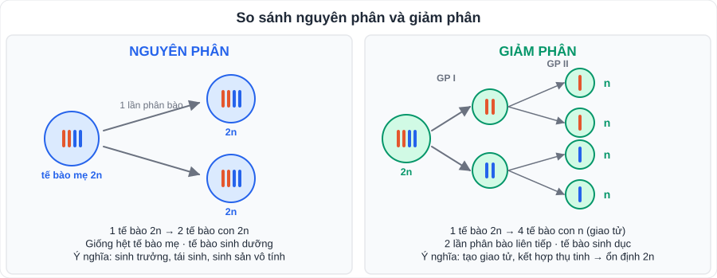
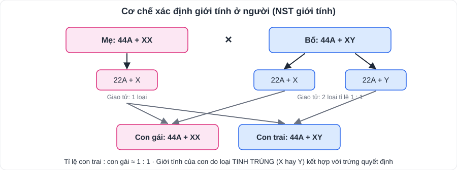

# KHTN 9: Nhiễm sắc thể, nguyên phân – giảm phân, di truyền học người, công nghệ di truyền (Sinh học – Chương XI)

> [Danh mục kiến thức](../README.md) · Học ở **tháng 1 – 3** · Ôn lại trước giữa HK2 và thi cuối năm · **So sánh nguyên phân – giảm phân là câu hỏi kinh điển**

## Mục tiêu

- Nêu cấu trúc, tính đặc trưng của **bộ nhiễm sắc thể (NST)**; phân biệt bộ **lưỡng bội (2n)** và **đơn bội (n)**.
- So sánh **nguyên phân và giảm phân**; ý nghĩa của **thụ tinh**.
- Giải thích **cơ chế xác định giới tính**, hiểu **di truyền liên kết**, **đột biến NST**.
- Nêu một số **bệnh, tật di truyền ở người**, ứng dụng **công nghệ di truyền** và vấn đề **đạo đức sinh học**.

---

## 1. Nhiễm sắc thể

- **NST** nằm trong nhân tế bào, là cấu trúc mang **gene**; gồm ADN quấn quanh protein.
- Mỗi loài có **bộ NST đặc trưng** về số lượng, hình dạng. Người: **2n = 46** (23 cặp: 22 cặp NST thường + 1 cặp NST giới tính). Ruồi giấm 2n = 8; lúa 2n = 24.
- **Tế bào sinh dưỡng**: bộ **lưỡng bội 2n** (NST tồn tại thành cặp tương đồng). **Giao tử**: bộ **đơn bội n**.

## 2. Nguyên phân, giảm phân, thụ tinh

| | Nguyên phân | Giảm phân |
|---|---|---|
| Xảy ra ở | Tế bào **sinh dưỡng**, tế bào sinh dục sơ khai | Tế bào **sinh dục** chín |
| Số lần phân bào | 1 | 2 (giảm phân I, II) |
| Kết quả | 1 tế bào 2n → **2 tế bào 2n** | 1 tế bào 2n → **4 tế bào n** |
| Ý nghĩa | Sinh trưởng, tái sinh, sinh sản vô tính; duy trì bộ NST qua các thế hệ tế bào | Tạo **giao tử**; tạo nhiều biến dị tổ hợp |

- **Thụ tinh**: giao tử đực (n) + giao tử cái (n) → **hợp tử 2n**.
- **Giảm phân + thụ tinh + nguyên phân** → duy trì **bộ NST đặc trưng ổn định** qua các thế hệ của loài sinh sản hữu tính.

## 3. Cơ chế xác định giới tính, di truyền liên kết

- Người: nữ **XX**, nam **XY**. Mẹ cho 1 loại trứng (X); bố cho 2 loại tinh trùng (X, Y) tỉ lệ 1 : 1 → con trai : con gái ≈ **1 : 1**. Giới tính do **tinh trùng** quyết định.
- **Di truyền liên kết** (Morgan, ruồi giấm): các gene **cùng nằm trên một NST** thường di truyền cùng nhau → hạn chế biến dị tổ hợp, giữ các tính trạng tốt đi kèm nhau (ứng dụng trong chọn giống).

## 4. Đột biến NST

- **Đột biến cấu trúc NST**: mất đoạn, lặp đoạn, đảo đoạn, chuyển đoạn.
- **Đột biến số lượng NST**: **thể dị bội** (thêm/bớt một hoặc vài NST, ví dụ 2n + 1) và **thể đa bội** (3n, 4n… thường gặp ở thực vật: dưa hấu, chuối không hạt, cây to khỏe).

## 5. Di truyền học người

| Bệnh / tật | Nguyên nhân | Biểu hiện |
|---|---|---|
| **Hội chứng Down** | 3 NST số 21 (2n + 1 = 47) | Cổ ngắn, mắt một mí, chậm phát triển trí tuệ |
| **Hội chứng Turner** | Nữ chỉ có 1 NST X (XO, 2n − 1 = 45) | Lùn, cổ ngắn, thường không có con |
| **Bệnh mù màu, máu khó đông** | Gene lặn trên NST **X** | Thường gặp ở **nam** nhiều hơn nữ |
| **Bệnh bạch tạng** | Gene lặn trên NST thường | Da, tóc trắng; mắt hồng |

- Phòng tránh: **không kết hôn cận huyết** (trong phạm vi 3 đời – Luật Hôn nhân và Gia đình), sinh con ở độ tuổi phù hợp, **tư vấn di truyền**, sàng lọc trước sinh, hạn chế tiếp xúc chất độc hại.

## 6. Công nghệ di truyền và đạo đức sinh học

- **Công nghệ di truyền (kĩ thuật ADN tái tổ hợp)**: chuyển gene từ loài này sang loài khác. Ví dụ: vi khuẩn mang gene người sản xuất **insulin** chữa tiểu đường; cây trồng **biến đổi gene** kháng sâu bệnh; lúa "vàng" giàu vitamin A.
- Ứng dụng khác: **xác định huyết thống, pháp y** bằng ADN; liệu pháp gene; chẩn đoán bệnh.
- **Đạo đức sinh học**: an toàn sinh học của sinh vật biến đổi gene; không được dùng công nghệ để lựa chọn giới tính thai nhi; bảo mật thông tin di truyền cá nhân; vấn đề nhân bản vô tính người.

---

## 7. Dạng bài và ví dụ có lời giải

**Ví dụ 1 (số tế bào, số NST).** Một tế bào của người (2n = 46) nguyên phân 3 lần liên tiếp. Tính số tế bào con và tổng số NST trong các tế bào con.

> Số tế bào con: 2³ = **8**; tổng số NST: 8 · 46 = **368**.

**Ví dụ 2 (giảm phân).** 5 tế bào sinh tinh của ruồi giấm (2n = 8) giảm phân. Tính số tinh trùng tạo thành và số NST trong mỗi tinh trùng.

> Số tinh trùng: 5 · 4 = **20**; mỗi tinh trùng có **n = 4** NST.

---

## 8. Lỗi hay gặp

- Viết "nguyên phân tạo 4 tế bào" hoặc "giảm phân tạo 2 tế bào".
- Cho rằng **mẹ** quyết định giới tính của con.
- Nhầm Down (thừa NST 21) với Turner (thiếu 1 NST X).

---

## 9. Bài tập tự luyện

1. Ở lúa 2n = 24. Hãy cho biết số NST trong: a) tế bào lá; b) hạt phấn (giao tử); c) tế bào nội nhũ 3n.
2. Một tế bào nguyên phân 4 lần liên tiếp tạo ra bao nhiêu tế bào con?
3. Lập bảng so sánh nguyên phân và giảm phân (ít nhất 4 tiêu chí).
4. Giải thích vì sao tỉ lệ nam : nữ xấp xỉ 1 : 1.
5. Vì sao pháp luật cấm kết hôn giữa những người có quan hệ huyết thống gần?
6. ★ Một bé gái được chẩn đoán có 45 NST, chỉ có một NST giới tính X. Đó là hội chứng gì? Nêu một số biểu hiện.

👉 Bấm để xem đáp án

1. a) **24**; b) **12**; c) **36**.
2. 2⁴ = **16** tế bào.
3. Xem bảng ở mục 2 (nơi xảy ra, số lần phân bào, số tế bào con, bộ NST tế bào con, ý nghĩa).
4. Nam cho 2 loại tinh trùng X và Y với tỉ lệ ngang nhau; khả năng mỗi loại thụ tinh với trứng (X) là như nhau → XX : XY ≈ 1 : 1.
5. Người có quan hệ huyết thống gần dễ cùng mang **gene lặn có hại**; con của họ có nguy cơ cao nhận **hai allele lặn** → biểu hiện bệnh, tật di truyền.
6. **Hội chứng Turner** (XO): lùn, cổ ngắn, tuyến vú không phát triển, thường không có con.

